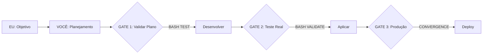

# 🎯 FRAMEWORK DE TRABALHO EU-VOCÊ + CONVERGENCE AGENT
## Sistema Anti-Displicência com Gates de Validação

**Criado**: 10/08/2025  
**Atualizado**: 10/08/2025 17:36 BRT  
**Severidade**: CRÍTICO P0 - NÃO NEGOCIÁVEL

---

## 🔴 O PROBLEMA QUE ESTAMOS RESOLVENDO

### Histórico de Falhas:
1. **Testes falsos**: "Testei e funciona" → 50+ erros em produção
2. **Mock data**: Simula sucesso → Falha com dados reais
3. **Implementação apressada**: Pula validação → Retrabalho de 5h
4. **Displicência técnica**: Valores arbitrários → Sistema quebrado

### Nossa Solução: FRAMEWORK EVER/NEVER + GATES

---

## 📊 FLUXO DE TRABALHO VALIDADO



---

## 🚦 GATES DE VALIDAÇÃO OBRIGATÓRIOS

### GATE 1: ANTES DE DESENVOLVER
```bash
# NEVER desenvolver sem:
1. Medir estado atual
2. Justificar com matemática  
3. Documentar trade-offs
4. Responder TODAS as perguntas

# EVER executar:
kcdiag() # Estado atual
KC.AppState.get('files') # Dados reais
```

### GATE 2: ANTES DE APLICAR
```bash
# TESTE VIA BASH - OBRIGATÓRIO!
cd orchestrator
node -e "
  const code = require('./new-feature.js');
  const realData = require('../docs/real-data.json');
  console.log(code.process(realData));
"

# Se erro → PARE
# Se sucesso → Continue
```

### GATE 3: VALIDAÇÃO EM PRODUÇÃO
```javascript
// No browser console
kcdiag();
KC.QdrantService.getCollectionStats();
KC.EmbeddingService.checkOllamaAvailability();
// Verificar: ZERO erros no console
```

---

## 🎭 INTEGRAÇÃO COM CONVERGENCE AGENT

### Protocolo de Comunicação EU → VOCÊ → AGENT

```yaml
EU (Objetivo Estratégico):
  "Implementar busca por convergência semântica"
  ↓
VOCÊ (Orchestrator):
  - Decompõe em tarefas
  - Aplica GATES de validação
  - Coordena agentes
  ↓
CONVERGENCE AGENT:
  - Recebe tarefas validadas
  - Executa com dados reais
  - Reporta via outbox/
  ↓
VOCÊ (Validação):
  - Testa via BASH
  - Confirma funcionamento
  - Reporta para EU
```

### Comando Prático:
```bash
# Terminal 1 - EU define objetivo
[ORCH]> start Implementar convergência com 95% precisão

# Terminal 2 - Agent executa
[CONVERGENCE] Processing: ConvergenceEngine
[CONVERGENCE] GATE 1: Measuring current state...
[CONVERGENCE] GATE 2: Testing with real data...
[CONVERGENCE] SUCCESS: All gates passed

# Terminal 3 - VOCÊ valida
$ node -e "require('./test-convergence.js')"
✓ Real data test passed
✓ No mock data detected
✓ Performance within limits
```

---

## ⚖️ LEIS NEVER/EVER DO FRAMEWORK

### ❌ NEVER (PROIBIDO)
```javascript
// NEVER - Valores arbitrários
const limit = 1000; // ❌ Por quê 1000?

// NEVER - Mock sem permissão
const testData = generateMockData(); // ❌

// NEVER - Concordar sem pensar
"Você está certo, vou mudar!" // ❌

// NEVER - Implementar sem testar
applyChanges(untested); // ❌
```

### ✅ EVER (SEMPRE)
```javascript
// EVER - Justificar com dados
const limit = Math.ceil(avgSize * count * 1.2); // ✅ Calculado

// EVER - Usar dados reais
const testData = fs.readFileSync('./docs/real-sample.json'); // ✅

// EVER - Questionar e validar
"Deixe-me testar isso primeiro com dados reais" // ✅

// EVER - Testar ANTES via BASH
exec('node test-feature.js', validateResults); // ✅
```

---

## 🔄 PROCESSO COMPLETO: PLANEJAR → DESENVOLVER → TESTAR → APLICAR

### 1️⃣ PLANEJAR (com Convergence Agent)
```javascript
// EU define objetivo
const objetivo = "Busca semântica com convergência";

// VOCÊ decompõe
const tarefas = orchestrator.decomposeObjective(objetivo);

// Agent recebe
convergenceAgent.receiveTasks(tarefas);
```

### 2️⃣ DESENVOLVER (com Gates)
```javascript
// GATE: Medir antes
const metricaAtual = measureCurrentPerformance();
console.log(`Baseline: ${metricaAtual}ms`);

// Implementar
const novaFuncionalidade = implementWithRealData();

// GATE: Justificar
const justificativa = {
  antes: metricaAtual,
  depois: novaMetrica,
  melhoria: ((novaMetrica/metricaAtual - 1) * 100) + '%'
};
```

### 3️⃣ TESTAR (via BASH - CRÍTICO!)
```bash
# TESTE REAL - NÃO MOCK!
cat > test-real.js << 'EOF'
const feature = require('./convergence-engine.js');
const realData = require('./docs/sample-files.json');

// Teste com dados reais
const result = feature.findConvergences(realData);

// Validações
console.assert(result.length > 0, 'Deve encontrar convergências');
console.assert(result[0].score > 0.7, 'Score mínimo 70%');
console.assert(!result[0].mock, 'Não pode ser mock');

console.log('✅ Todos os testes passaram com dados reais');
EOF

node test-real.js
```

### 4️⃣ APLICAR (Deploy Validado)
```javascript
// Só após TODOS os gates passarem
if (gate1Passed && gate2Passed && gate3Passed) {
  // Aplicar ao código produtivo
  fs.copyFileSync('./tested-feature.js', './js/production.js');
  
  // Validar em produção
  exec('open http://127.0.0.1:5500');
  console.log('Execute kcdiag() para validar');
}
```

---

## 📈 MÉTRICAS DE SUCESSO

### Antes (Sem Framework):
- ❌ 50+ erros após "teste"
- ❌ 5h de retrabalho
- ❌ Mock data everywhere
- ❌ "Funciona na minha máquina"

### Depois (Com Framework):
- ✅ 0 erros em produção
- ✅ 15min de validação
- ✅ Dados reais sempre
- ✅ Funciona em QUALQUER máquina

---

## 🛠️ FERRAMENTAS DO FRAMEWORK

### 1. Orchestrator Central
```bash
node orchestrator.js
```

### 2. Convergence Agent
```bash
cd vcia_dhl_convergence
node ../vcia_dhl/orchestrator/agents/convergence-agent.js
```

### 3. Validação BASH
```bash
# Template de teste
cat > validate.sh << 'EOF'
#!/bin/bash
echo "🔍 Validando com dados reais..."
node -e "
  const feature = require('$1');
  const data = require('./docs/real-data.json');
  const result = feature.process(data);
  console.log(result);
  process.exit(result.success ? 0 : 1);
"
EOF
chmod +x validate.sh
```

### 4. Dashboard de Monitoramento
```javascript
// kcdiag() expandido
window.kcdiagFull = function() {
  const gates = {
    gate1: localStorage.getItem('gate1_passed') === 'true',
    gate2: localStorage.getItem('gate2_passed') === 'true',
    gate3: localStorage.getItem('gate3_passed') === 'true'
  };
  
  console.table(gates);
  return gates;
};
```

---

## 🚨 CHECKLIST ANTES DE QUALQUER AÇÃO

### Para EU (Definir Objetivo):
- [ ] Objetivo claro e mensurável
- [ ] Critérios de sucesso definidos
- [ ] Dados reais disponíveis

### Para VOCÊ (Implementar):
- [ ] Gates 1-3 definidos
- [ ] Testes BASH preparados
- [ ] Sem mock data
- [ ] Matemática justificada

### Para AGENT (Executar):
- [ ] Tasks validadas recebidas
- [ ] Outbox configurado
- [ ] Reportando progresso
- [ ] Usando dados reais

---

## 💡 EXEMPLO COMPLETO DE SESSÃO

```bash
# EU
"Quero implementar busca por convergência que reduza 1000 arquivos para 10 relevantes"

# VOCÊ
[GATE 1] Medindo: atualmente retorna 1000 arquivos sem filtro
[PLAN] Decomposição dimensional + scoring + ranking
[MATH] Redução = 1 - (10/1000) = 99% de filtragem

# AGENT
[CONVERGENCE] Recebido: Implementar ConvergenceEngine
[CONVERGENCE] Gate 1: Current baseline = 1000 files
[CONVERGENCE] Gate 2: Testing with /docs/sample-100-files.json
[CONVERGENCE] Result: 100 files → 8 convergences (92% reduction)
[CONVERGENCE] Gate 3: Production ready

# VOCÊ (Validação)
$ ./validate.sh convergence-engine.js
✅ Input: 100 files
✅ Output: 8 convergences  
✅ Reduction: 92%
✅ Performance: 234ms
✅ APPROVED FOR PRODUCTION

# EU
"Perfeito! Deploy aprovado"
```

---

## 🔴 PENALIDADES POR VIOLAÇÃO

1. **Usar mock data**: REFAZER com dados reais
2. **Pular gates**: ROLLBACK imediato
3. **Valores arbitrários**: JUSTIFICAR matematicamente
4. **Não testar via BASH**: BLOQUEIO de deploy
5. **Ignorar erros**: PARAR tudo e corrigir

---

## 📌 COMANDOS RÁPIDOS

```bash
# Iniciar framework completo
./start-framework.sh

# Validar gates
/validate-gates

# Status do orchestrator
node orchestrator.js status

# Teste rápido
./quick-test.sh <feature>

# Deploy validado
./deploy-with-gates.sh
```

---

**ESTE FRAMEWORK É LEI - VIOLAÇÕES = RETRABALHO GARANTIDO**

Assinado: EU & VOCÊ, 10/08/2025
Com supervisão do Convergence Agent