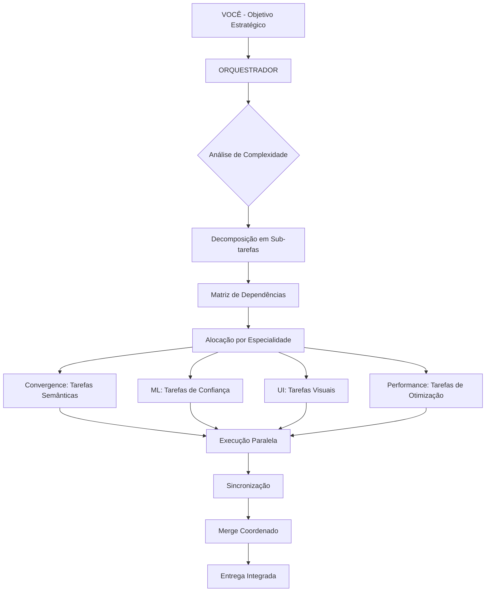

# ORCHESTRATOR - DESIGN & ARQUITETURA
## Agente Resposavel pela Orquestração do Sistema Multi-Agente para Knowledge Consolidator

## 🧠 CONCEITO CENTRAL

### Visão
O Agente orchstrator deve atuar como Um **Maestro Digital** que coordena 4 "músicos" (agentes de desenvolvimento especialistas disponiveis neste sistema), trabalhando em harmonia, cada um em seu próprio "palco / area de especialidade" (utilzando o conceito worktree), mas seguindo uma "partitura" unificada (plano estratégico).

### Analogia
```
Orquestrador = Maestro 🎼
├── Convergence Agent = Violino 1º 🎻 (melodia principal)
├── ML Confidence Agent = Piano 🎹 (harmonia e ritmo)
├── UI/UX Agent = Violino 2º 🎻 (acompanhamento visual)
└── Performance Agent = Percussão 🥁 (mantém o tempo/velocidade)
```

---

## 📊 ARQUITETURA PROPOSTA

### 1. ESTRUTURA DE COMANDO

```yaml
ORCHESTRATOR:
  tipo: "multi-agent-orchestrator"
  
  INPUTS:
    - Objetivo estratégico (você define)
    - Prazo/Sprint
    - Prioridades
    - Dependências
  
  OUTPUTS:
    - Plano de execução distribuído
    - Tasks por agente
    - Timeline coordenada
    - Checkpoints de sincronização
  
  COORDENAÇÃO:
    - Sistema de mensagens inter-worktree
    - Estado compartilhado (shared state)
    - Merge points definidos
    - Resolução de conflitos
```

### 2. CADEIA DE ANÁLISE



---

## 🔧 MECANISMOS DE COORDENAÇÃO

### A. SISTEMA DE MENSAGENS

```javascript
// shared-state.json (arquivo compartilhado)
{
  "sprint_id": "2025-01-10-convergence",
  "status": {
    "convergence": { "progress": 45, "blocked": false },
    "ml_confidence": { "progress": 30, "blocked": true, "waiting_for": "convergence" },
    "ui": { "progress": 60, "blocked": false },
    "performance": { "progress": 20, "blocked": false }
  },
  "messages": [
    {
      "from": "convergence",
      "to": "ml_confidence",
      "type": "UNBLOCK",
      "data": "Convergence engine ready at js/core/ConvergenceEngine.js"
    }
  ],
  "next_sync": "2025-01-10T16:00:00Z"
}
```

### B. PROTOCOLO DE SINCRONIZAÇÃO

```bash
# sync-protocol.sh
#!/bin/bash

# 1. Cada worktree reporta status
cd /convergence && git add . && git commit -m "checkpoint: $(date)"
cd /ml-confidence && git add . && git commit -m "checkpoint: $(date)"
cd /ui-improvements && git add . && git commit -m "checkpoint: $(date)"
cd /performance && git add . && git commit -m "checkpoint: $(date)"

# 2. Orquestrador analisa conflitos
python orchestrator.py analyze-conflicts

# 3. Merge coordenado
python orchestrator.py coordinate-merge

# 4. Broadcast novo estado
python orchestrator.py broadcast-state
```

### C. DASHBOARD CENTRAL

```
┌─────────────────────────────────────────────────────────────┐
│                   ORCHESTRATOR DASHBOARD                    │
├─────────────────────────────────────────────────────────────┤
│                                                             │
│  SPRINT: Convergence Implementation         [▓▓▓▓░░░] 42%  │
│                                                             │
│  ┌─────────────┬──────────┬─────────┬──────────┐          │
│  │ CONVERGENCE │    ML    │   UI    │   PERF   │          │
│  ├─────────────┼──────────┼─────────┼──────────┤          │
│  │    45%      │   30%    │   60%   │   20%    │          │
│  │    🟢       │   🔴     │   🟢    │   🟡     │          │
│  └─────────────┴──────────┴─────────┴──────────┘          │
│                                                             │
│  DEPENDENCIES:                                              │
│  ML → waiting for Convergence                              │
│  UI → independent                                          │
│  Perf → monitoring all                                     │
│                                                             │
│  NEXT SYNC: 16:00 (in 23 minutes)                         │
│                                                             │
└─────────────────────────────────────────────────────────────┘
```

---

## 💬 INTERFACE DE COMANDO

### Terminal Interativo com Você

```bash
# Você digita comandos estratégicos
$ orchestrate "Implementar convergência semântica completa"

[ORCHESTRATOR]: Analisando objetivo...
[ORCHESTRATOR]: Decomposição:
  → Convergence: Engine core (3h)
  → ML: Confidence metrics (2h)
  → UI: Visualization (4h)
  → Performance: Optimization (1h)

[ORCHESTRATOR]: Dependências identificadas:
  → ML depende de Convergence
  → UI pode começar mockup
  → Performance monitora todos

[ORCHESTRATOR]: Iniciando execução paralela...
  → Launching convergence agent...
  → Launching ui agent...
  → Launching performance agent...
  → ML agent em standby até Convergence 50%

$ orchestrate status

[ORCHESTRATOR]: Status atual:
  Convergence: 45% [Em progresso: ConvergenceEngine.js]
  ML: 0% [Aguardando dependência]
  UI: 60% [Mockup completo, aguardando dados]
  Performance: 20% [Monitorando métricas base]

$ orchestrate sync

[ORCHESTRATOR]: Sincronizando worktrees...
  → Convergence: 3 arquivos novos
  → ML: Nenhuma mudança
  → UI: 5 arquivos modificados
  → Performance: 2 arquivos novos
  
[ORCHESTRATOR]: Conflitos: 0
[ORCHESTRATOR]: Pronto para merge coordenado? (y/n)
```

---

## 🚀 COMANDOS DO ORQUESTRADOR

### Comandos Básicos
```bash
orchestrate start <objetivo>      # Inicia nova orquestração
orchestrate status               # Status de todos os agentes
orchestrate sync                 # Sincroniza worktrees
orchestrate merge <branch>       # Merge coordenado
orchestrate report              # Relatório consolidado
orchestrate pause               # Pausa todos os agentes
orchestrate resume              # Retoma execução
```

### Comandos Avançados
```bash
orchestrate allocate <task> <agent>    # Aloca tarefa específica
orchestrate dependency <A> <B>         # Define A depende de B
orchestrate priority <agent> <level>   # Define prioridade
orchestrate conflict resolve           # Resolve conflitos
orchestrate rollback <checkpoint>      # Volta a checkpoint
```

---

## 🎯 FLUXO DE TRABALHO TÍPICO

### Você (Terminal Principal)
```bash
# 1. Define objetivo estratégico
$ orchestrate start "Implementar sistema completo de convergência com ML"

# 2. Orquestrador decompõe e distribui
[ORCHESTRATOR]: Plano criado, distribuindo...

# 3. Monitora progresso
$ watch orchestrate status

# 4. Intervém quando necessário
$ orchestrate priority ml-confidence HIGH

# 5. Sincroniza em checkpoints
$ orchestrate sync --checkpoint alpha

# 6. Finaliza com merge coordenado
$ orchestrate merge --all --to main
```

### Agentes (Worktrees)
Cada agente recebe suas tarefas via arquivo `tasks.json` em seu worktree:

```json
// convergence/tasks.json
{
  "assigned_by": "orchestrator",
  "priority": "HIGH",
  "tasks": [
    {
      "id": "CONV-001",
      "description": "Implementar ConvergenceEngine core",
      "estimated_hours": 3,
      "dependencies": [],
      "deliverables": ["js/core/ConvergenceEngine.js"]
    }
  ],
  "report_to": "shared-state.json",
  "sync_at": "16:00"
}
```

---

## 📡 COMUNICAÇÃO VOCÊ ↔ ORQUESTRADOR

### Modo 1: Comando Direto
```bash
$ orchestrate <comando>
```

### Modo 2: Sessão Interativa
```bash
$ orchestrate interactive

[ORCH]> start planning
[ORCH]> analyze dependencies
[ORCH]> simulate execution
[ORCH]> confirm and run
[ORCH]> monitor realtime
```

### Modo 3: Via Claude (Este Chat)
```
Você: "Quero implementar X com prioridade em Y"
Claude: [Traduz para comandos do orquestrador]
Claude: [Executa via Task tool]
Claude: [Reporta resultado]
```

---

## 🔄 PROTOCOLO DE EXECUÇÃO

### FASE 1: PLANEJAMENTO
1. Você define objetivo macro
2. Orquestrador decompõe em tarefas
3. Análise de dependências
4. Alocação por especialidade
5. Você aprova plano

### FASE 2: EXECUÇÃO
1. Distribuição de tarefas
2. Monitoramento contínuo
3. Resolução de bloqueios
4. Sincronização periódica
5. Ajustes em tempo real

### FASE 3: INTEGRAÇÃO
1. Coleta de entregáveis
2. Testes de integração
3. Resolução de conflitos
4. Merge coordenado
5. Validação final

---

## 🎪 EXEMPLO PRÁTICO

### Objetivo: "Implementar busca por convergência com 95% de precisão"

```yaml
DECOMPOSIÇÃO:
  convergence-agent:
    - Criar algoritmo de convergência
    - Implementar decomposição dimensional
    - Calcular interseções
    tempo: 4h
    
  ml-confidence-agent:
    - Implementar métricas de confiança
    - Criar sistema de validação
    - Otimizar para 95% precisão
    tempo: 3h
    dependência: convergence@50%
    
  ui-agent:
    - Criar interface de busca
    - Visualizar caminhos de convergência
    - Feedback visual de confiança
    tempo: 5h
    
  performance-agent:
    - Otimizar algoritmos
    - Implementar cache
    - Reduzir latência <100ms
    tempo: 2h
    dependência: convergence@100%

TIMELINE:
  0h: Start convergence + ui
  2h: Start ml-confidence
  4h: Start performance
  5h: Integration tests
  6h: Merge coordenado
```

---

## 🤝 INTEGRAÇÃO COM CLAUDE

### Como Você Usa Via Este Chat:

```markdown
Você: "Orquestre a implementação de convergência semântica"

Claude: 
1. Analiso o objetivo
2. Crio plano de decomposição
3. Uso Task tool para lançar agentes
4. Monitoro progresso
5. Reporto status periodicamente
6. Coordeno merges
```

---

## IMPLEMENTAÇÃO TÉCNICA

### Opção 1: Via Claude (Recomendado)
- Você comanda via chat
- Claude usa Task tool
- Resultados consolidados aqui

---

## 🎯 BENEFICIOS ESPERADOS - OBJETIVOS QUE DEVEM SER ALCANÇADOS:

1. **Paralelização Real**: 4x mais rápido
2. **Zero Conflitos**: Isolamento total
3. **Visibilidade Total**: Dashboard central
4. **Controle Fino**: Comandos precisos
5. **Flexibilidade**: Ajustes em tempo real

---

## 🚦 PRÓXIMOS PASSOS

1. Agente deve adotar através do modelo de implementação (## IMPLEMENTAÇÃO TÉCNICA)