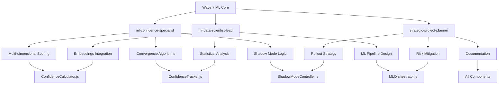

# 🎯 Wave 7: Agent Delegation Matrix
## ML Core Implementation - Detailed Task Distribution

### 📊 Agent Capability Mapping



## 🤖 Agent Task Assignments

### 1. ml-confidence-specialist
**Primary Focus**: Multi-dimensional confidence algorithms and convergence logic

#### ConfidenceCalculator.js Tasks:
```yaml
confidence_calculator_tasks:
  algorithm_design:
    - Design weighted ensemble scoring system
    - Create dimension-specific scorers:
      - SemanticScorer (embedding-based)
      - CategoricalScorer (category matching)
      - StructuralScorer (document structure)
      - TemporalScorer (time-based relevance)
    - Implement dynamic weight optimization
    - Design confidence validation logic
  
  implementation_details:
    - Cache strategy for confidence scores
    - Error handling for scorer failures
    - Fallback mechanisms (neutral scores)
    - Performance optimization techniques
  
  integration_points:
    - EventBus emission patterns
    - EmbeddingService integration
    - CategoryManager coordination
    - AppState synchronization
```

#### ConfidenceTracker.js Tasks:
```yaml
convergence_detection:
  algorithm_implementation:
    - Convergence threshold logic (85%)
    - Stability window detection (3 iterations)
    - Maximum delta calculation (0.02)
    - Confidence level assessment
  
  tracking_logic:
    - History management patterns
    - Delta calculation methods
    - Iteration counting
    - Performance metrics
```

### 2. ml-data-scientist-lead
**Primary Focus**: Data pipeline, embeddings, and statistical analysis

#### Implementation Tasks:
```yaml
data_science_tasks:
  embedding_integration:
    component: ConfidenceCalculator.js
    tasks:
      - Integrate with KC.EmbeddingService
      - Implement centroid calculations
      - Design similarity metrics
      - Optimize embedding comparisons
  
  statistical_analysis:
    component: ConfidenceTracker.js
    tasks:
      - Implement variance calculations
      - Design correlation metrics
      - Create statistical summaries
      - Build trend analysis
  
  ml_pipeline:
    component: MLOrchestrator.js
    tasks:
      - Design queue processing logic
      - Implement batch optimization
      - Create worker pool management
      - Build pipeline monitoring
```

#### Data Architecture:
```yaml
data_structures:
  indexeddb_schema:
    confidence_history:
      - fileId: string (primary key)
      - iterations: array<ConfidenceEntry>
      - lastUpdated: timestamp
      - convergenceStatus: object
    
    cache_entries:
      - cacheKey: string (primary key)
      - value: object
      - expiry: timestamp
      - hitCount: number
  
  performance_optimization:
    - Batch processing strategies
    - Parallel calculation methods
    - Memory management techniques
    - Cache eviction policies
```

### 3. strategic-project-planner
**Primary Focus**: Rollout strategy, risk management, and documentation

#### Strategic Planning Tasks:
```yaml
rollout_strategy:
  shadow_mode_implementation:
    component: ShadowModeController.js
    phases:
      phase_1:
        scope: "Algorithm validation"
        duration: "3 days"
        success_metric: "Divergence baseline established"
      
      phase_2:
        scope: "10% user rollout"
        duration: "1 week"
        success_metric: "< 5% divergence maintained"
      
      phase_3:
        scope: "Performance optimization"
        duration: "3 days"
        success_metric: "< 100ms calculation time"
  
  risk_mitigation:
    identified_risks:
      - risk: "High divergence from traditional analysis"
        mitigation: "Incremental rollout with monitoring"
        owner: "ml-confidence-specialist"
      
      - risk: "Performance degradation"
        mitigation: "Aggressive caching and Web Workers"
        owner: "performance-optimization-coordinator"
      
      - risk: "Convergence failures"
        mitigation: "Manual review queue and adaptive thresholds"
        owner: "ml-data-scientist-lead"
  
  documentation_requirements:
    - API documentation for each component
    - Integration guide for existing system
    - Monitoring and troubleshooting guide
    - Rollback procedures
```

## 🔄 Component-Agent Matrix

### ConfidenceCalculator.js
| Task | Primary Agent | Support Agent | Deliverable |
|------|--------------|---------------|-------------|
| Algorithm Architecture | ml-confidence-specialist | - | Scoring algorithm design |
| Embedding Integration | ml-data-scientist-lead | ml-confidence-specialist | SemanticScorer implementation |
| Cache Implementation | ml-confidence-specialist | performance-optimization-coordinator | ConfidenceCache class |
| Weight Optimization | ml-confidence-specialist | ml-data-scientist-lead | GradientDescentOptimizer |
| Error Handling | dev-coordinator-quad | - | Fallback mechanisms |

### ConfidenceTracker.js
| Task | Primary Agent | Support Agent | Deliverable |
|------|--------------|---------------|-------------|
| IndexedDB Design | ml-data-scientist-lead | - | Database schema |
| Convergence Logic | ml-confidence-specialist | - | ConvergenceDetector class |
| History Management | ml-data-scientist-lead | - | History tracking system |
| Statistics Engine | ml-data-scientist-lead | ml-confidence-specialist | Stats calculation methods |
| Event Integration | dev-coordinator-quad | - | EventBus connections |

### ShadowModeController.js
| Task | Primary Agent | Support Agent | Deliverable |
|------|--------------|---------------|-------------|
| Rollout Strategy | strategic-project-planner | - | Phased rollout plan |
| Comparison Logic | ml-confidence-specialist | ml-data-scientist-lead | AnalysisComparator class |
| Metrics Collection | ml-data-scientist-lead | performance-optimization-coordinator | ShadowModeMetrics |
| Sampling Strategy | strategic-project-planner | ml-confidence-specialist | 10% sampling logic |
| Monitoring Setup | performance-optimization-coordinator | - | Prometheus metrics |

### MLOrchestrator.js
| Task | Primary Agent | Support Agent | Deliverable |
|------|--------------|---------------|-------------|
| Architecture Design | dev-coordinator-quad | strategic-project-planner | Component coordination |
| Queue Implementation | ml-data-scientist-lead | performance-optimization-coordinator | PriorityQueue system |
| Worker Pool | performance-optimization-coordinator | dev-coordinator-quad | MLWorkerPool |
| State Management | dev-coordinator-quad | - | Orchestrator state machine |
| Integration Points | dev-coordinator-quad | All agents | Full system integration |

## 📝 Detailed Implementation Sequences

### Sequence 1: Confidence Calculation Flow
```yaml
sequence_1:
  name: "Multi-dimensional Confidence Scoring"
  lead: ml-confidence-specialist
  steps:
    1:
      agent: ml-confidence-specialist
      task: "Design scoring algorithm architecture"
      output: "Algorithm specification document"
      duration: "4 hours"
    
    2:
      agent: ml-data-scientist-lead
      task: "Implement embedding integration"
      output: "SemanticScorer.js"
      duration: "6 hours"
    
    3:
      agent: ml-confidence-specialist
      task: "Implement dimension scorers"
      output: "All scorer classes"
      duration: "8 hours"
    
    4:
      agent: dev-coordinator-quad
      task: "Integration and testing"
      output: "Working ConfidenceCalculator"
      duration: "4 hours"
```

### Sequence 2: Convergence Tracking Implementation
```yaml
sequence_2:
  name: "Convergence Detection System"
  lead: ml-data-scientist-lead
  steps:
    1:
      agent: ml-data-scientist-lead
      task: "Design IndexedDB schema"
      output: "Database architecture"
      duration: "3 hours"
    
    2:
      agent: ml-confidence-specialist
      task: "Implement convergence algorithm"
      output: "ConvergenceDetector.js"
      duration: "6 hours"
    
    3:
      agent: ml-data-scientist-lead
      task: "Build history tracking"
      output: "History management system"
      duration: "5 hours"
    
    4:
      agent: test-strategy-coordinator
      task: "Create test suite"
      output: "Convergence tests"
      duration: "4 hours"
```

### Sequence 3: Shadow Mode Rollout
```yaml
sequence_3:
  name: "Shadow Mode Implementation"
  lead: strategic-project-planner
  steps:
    1:
      agent: strategic-project-planner
      task: "Define rollout strategy"
      output: "Rollout plan document"
      duration: "2 hours"
    
    2:
      agent: ml-confidence-specialist
      task: "Implement comparison logic"
      output: "AnalysisComparator.js"
      duration: "5 hours"
    
    3:
      agent: ml-data-scientist-lead
      task: "Build metrics collection"
      output: "Metrics system"
      duration: "4 hours"
    
    4:
      agent: deployment-readiness-coordinator
      task: "Validate deployment readiness"
      output: "Deployment checklist"
      duration: "3 hours"
```

## 🎯 Agent Coordination Protocol

### Daily Sync Points
```yaml
daily_coordination:
  morning_sync:
    time: "09:00"
    participants: [ml-confidence-specialist, ml-data-scientist-lead, strategic-project-planner]
    agenda:
      - Progress review
      - Blocker identification
      - Task prioritization
  
  afternoon_check:
    time: "14:00"
    participants: [All active agents]
    agenda:
      - Integration status
      - Testing results
      - Next steps
  
  eod_report:
    time: "17:00"
    lead: strategic-project-planner
    deliverable: "Daily progress report"
```

### Integration Checkpoints
```yaml
integration_milestones:
  checkpoint_1:
    name: "Component Integration"
    day: 3
    validation:
      - All components compile
      - Basic integration tests pass
      - No circular dependencies
  
  checkpoint_2:
    name: "Algorithm Validation"
    day: 5
    validation:
      - Confidence calculations accurate
      - Convergence detection working
      - Shadow mode isolated
  
  checkpoint_3:
    name: "Performance Baseline"
    day: 7
    validation:
      - 100 files < 2 seconds
      - Memory < 100MB
      - Cache hit rate > 80%
```

## 📈 Success Metrics by Agent

### ml-confidence-specialist
- Algorithm accuracy: > 95%
- Convergence rate: 85% within 3 iterations
- Code quality score: > 90%

### ml-data-scientist-lead
- Data pipeline efficiency: < 50ms per file
- Cache hit rate: > 80%
- Statistical accuracy: > 99%

### strategic-project-planner
- On-time delivery: 100%
- Risk mitigation effectiveness: > 90%
- Documentation completeness: 100%

---

**Execution Ready**: This delegation matrix provides clear task assignments and coordination protocols for Wave 7 ML Core implementation.