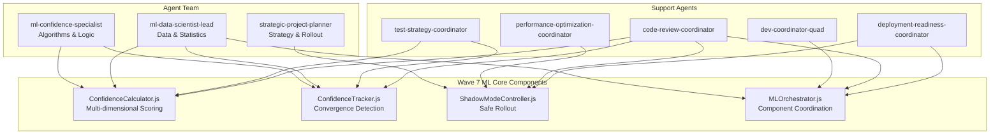

# 📊 Wave 7 ML Core - Executive Summary
## Multi-Agent Implementation Plan

### 🎯 Mission Statement
Deploy a production-ready ML confidence scoring system using multi-agent orchestration to achieve <5% divergence from traditional analysis with 85% convergence rate within 3 iterations.

## 🏗️ Architecture Overview



## 📈 Key Deliverables

### 1. **ConfidenceCalculator.js** (22 hours)
- **Purpose**: Multi-dimensional confidence scoring engine
- **Key Features**:
  - Weighted ensemble scoring (semantic, categorical, structural, temporal)
  - Dynamic weight optimization via gradient descent
  - Intelligent caching with staleness detection
  - EventBus integration for real-time updates

### 2. **ConfidenceTracker.js** (18 hours)
- **Purpose**: Track confidence evolution and detect convergence
- **Key Features**:
  - IndexedDB persistence for history tracking
  - Convergence detection algorithm (85% threshold, 3-iteration stability)
  - Statistical analysis and reporting
  - Real-time metrics emission

### 3. **ShadowModeController.js** (14 hours)
- **Purpose**: Safe rollout with parallel processing
- **Key Features**:
  - 10% user sampling with consistent hashing
  - ML vs traditional analysis comparison
  - Divergence monitoring and alerting
  - Zero UI impact during shadow mode

### 4. **MLOrchestrator.js** (16 hours)
- **Purpose**: Coordinate all ML components
- **Key Features**:
  - Event-driven architecture with state machine
  - Priority queue for request processing
  - Dynamic worker pool (2-8 workers)
  - Health checks and self-healing

## 📅 Implementation Timeline

### Week 1: Foundation & Core Logic
| Day | Focus | Deliverables | Agents |
|-----|-------|-------------|---------|
| 1-2 | Algorithm Design | ConfidenceCalculator architecture | ml-confidence-specialist, ml-data-scientist-lead |
| 3-4 | Data Layer | ConfidenceTracker + IndexedDB | ml-data-scientist-lead, dev-coordinator-quad |
| 5 | Integration | Component wiring + testing | dev-coordinator-quad, test-strategy-coordinator |

### Week 2: Shadow Mode & Rollout
| Day | Focus | Deliverables | Agents |
|-----|-------|-------------|---------|
| 1-2 | Shadow Implementation | ShadowModeController | strategic-project-planner, ml-confidence-specialist |
| 3-4 | Orchestration | MLOrchestrator + integration | dev-coordinator-quad, performance-optimization-coordinator |
| 5 | Testing | End-to-end validation | test-strategy-coordinator, code-review-coordinator |

### Week 3: Production Readiness
| Day | Focus | Deliverables | Agents |
|-----|-------|-------------|---------|
| 1-2 | Performance | Optimization + benchmarking | performance-optimization-coordinator |
| 3-4 | Deployment | Readiness validation | deployment-readiness-coordinator |
| 5 | Launch | 10% shadow mode rollout | All agents monitoring |

## 🎯 Success Metrics

```javascript
const wave7Metrics = {
  algorithm: {
    convergenceRate: '85%',      // Target: 85% files converge
    avgIterations: 3,            // Target: 3-5 iterations
    confidenceThreshold: 0.85    // Target: 85% confidence
  },
  
  shadowMode: {
    divergence: '<5%',           // Target: <5% from traditional
    coverage: '10%',             // Target: 10% of users
    errors: 0                    // Target: Zero errors
  },
  
  performance: {
    processingTime: '<100ms',    // Target: <100ms per file
    cacheHitRate: '>80%',        // Target: >80% cache hits
    memoryUsage: '<100MB'        // Target: <100MB total
  }
};
```

## 🚦 Risk Mitigation

### Top 3 Risks & Mitigations

1. **High Divergence (>10%)**
   - **Mitigation**: Incremental rollout with continuous monitoring
   - **Owner**: ml-confidence-specialist
   - **Trigger**: Automatic rollback at 15% divergence

2. **Performance Degradation**
   - **Mitigation**: Web Workers + aggressive caching
   - **Owner**: performance-optimization-coordinator
   - **Trigger**: Alert at 20% performance drop

3. **Convergence Failures**
   - **Mitigation**: Adaptive thresholds + manual review queue
   - **Owner**: ml-data-scientist-lead
   - **Trigger**: Flag files not converging in 5 iterations

## 💻 Quick Start Commands

```bash
# Initialize Wave 7 team and components
/infinite specs/wave7-ml-core-spec.md agents_output/wave7/init with ml-confidence-specialist,ml-data-scientist-lead,strategic-project-planner parallel execute "Initialize Wave 7 ML Core implementation"

# Monitor daily progress
/infinite agents_output/wave7 monitor daily with strategic-project-planner

# Validate before production
/infinite agents_output/wave7 validate all with deployment-readiness-coordinator
```

## 📋 Deployment Checklist

- [ ] All unit tests passing (>90% coverage)
- [ ] Performance benchmarks met
- [ ] Shadow mode validated (<5% divergence)
- [ ] Feature flags configured
- [ ] Monitoring dashboards live
- [ ] Rollback procedures tested
- [ ] Documentation complete
- [ ] Team trained on troubleshooting

## 🎉 Expected Outcomes

Upon successful completion of Wave 7:

1. **ML Confidence System**: Production-ready multi-dimensional scoring
2. **Safe Rollout**: Shadow mode protecting users during validation
3. **Performance**: Sub-100ms calculations with 80%+ cache efficiency
4. **Convergence**: 85% of files reaching stable confidence in 3 iterations
5. **Foundation**: Ready for Wave 8 UI integration

---

**Status**: Ready for execution with multi-agent team
**Next Step**: Execute initialization commands to begin implementation
**Contact**: @ml-engineering-team for questions