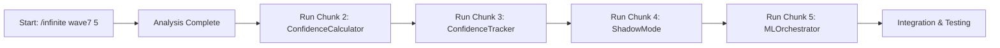

# 🚀 Wave 7 ML Core - Quick Start Guide
## Start Here! Simple Commands to Begin

### 🎯 The Simplest Way to Start

```bash
# JUST RUN THIS FIRST COMMAND TO BEGIN:
/infinite specs/wave7-ml-core-spec.md agents_output/wave7 5
```

This initial command will:
- Analyze the Wave 7 specification
- Set up the foundation structure
- Prepare the workspace for ML Core implementation

### 📝 What Happens Next?

After running the first command, you'll receive:
1. Initial analysis of the ML Core requirements
2. Suggested next steps
3. Directory structure created in `agents_output/wave7`

### 🔄 Sequential Execution Flow



### 📊 Complete Chunk Sequence

After the initial command, execute these in order:

```bash
# 1. START HERE (You already know this one!)
/infinite specs/wave7-ml-core-spec.md agents_output/wave7 5

# 2. Build the confidence scoring engine
/infinite specs/wave7-ml-core-spec.md agents_output/wave7/confidence-calculator 5 with ml-confidence-specialist focus "Implement ConfidenceCalculator with multi-dimensional scoring"

# 3. Add convergence tracking
/infinite specs/wave7-ml-core-spec.md agents_output/wave7/confidence-tracker 5 with ml-data-scientist-lead focus "Build ConfidenceTracker with IndexedDB persistence and convergence detection"

# 4. Enable safe rollout
/infinite specs/wave7-ml-core-spec.md agents_output/wave7/shadow-mode 5 with strategic-project-planner focus "Create ShadowModeController for safe 10% rollout"

# 5. Orchestrate everything
/infinite specs/wave7-ml-core-spec.md agents_output/wave7/ml-orchestrator 5 with dev-coordinator-quad focus "Implement MLOrchestrator to coordinate all components"
```

### 🎯 Expected Output Structure

```
agents_output/wave7/
├── confidence-calculator/
│   ├── ConfidenceCalculator.js
│   ├── SemanticScorer.js
│   ├── tests/
│   └── docs/
├── confidence-tracker/
│   ├── ConfidenceTracker.js
│   ├── ConvergenceDetector.js
│   ├── IndexedDB/
│   └── tests/
├── shadow-mode/
│   ├── ShadowModeController.js
│   ├── AnalysisComparator.js
│   └── metrics/
└── ml-orchestrator/
    ├── MLOrchestrator.js
    ├── PriorityQueue.js
    └── MLWorkerPool.js
```

### ⏱️ Time Estimates

| Chunk | Component | Agent | Time |
|-------|-----------|-------|------|
| 1 | Initial Analysis | Auto | 5 min |
| 2 | ConfidenceCalculator | ml-confidence-specialist | 5 hours |
| 3 | ConfidenceTracker | ml-data-scientist-lead | 5 hours |
| 4 | ShadowMode | strategic-project-planner | 5 hours |
| 5 | MLOrchestrator | dev-coordinator-quad | 5 hours |

### 💡 Pro Tips

1. **Start Simple**: Just run the first command and see what happens
2. **Wait for Completion**: Let each chunk finish before starting the next
3. **Check Output**: Review the generated files in `agents_output/wave7/`
4. **Ask Questions**: Each agent will provide documentation and next steps

### 🆘 If You Get Stuck

```bash
# Get status of current work
/infinite agents_output/wave7 status

# Get help from strategic planner
/infinite agents_output/wave7 help with strategic-project-planner

# Review progress
/infinite agents_output/wave7 review with code-review-coordinator
```

### ✅ Success Checklist

- [ ] Ran initial command `/infinite specs/wave7-ml-core-spec.md agents_output/wave7 5`
- [ ] Received analysis output
- [ ] Started Chunk 2 (ConfidenceCalculator)
- [ ] Completed all 5 chunks
- [ ] Reviewed generated code
- [ ] Tests passing

---

**Remember**: The beauty of `/infinite` is that it handles the complexity for you. Just start with that first command!