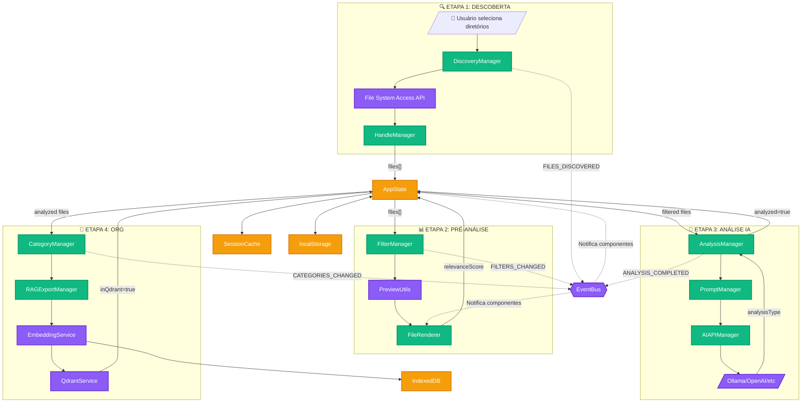

# 🔄 FLUXO DE DADOS ENTRE ETAPAS - Knowledge Consolidator

> **DATA**: 24/07/2025  
> **VERSÃO**: 1.0  
> **OBJETIVO**: Visualizar como os dados fluem entre as 4 etapas do sistema

---

## 1. 📊 DIAGRAMA DE FLUXO PRINCIPAL



---

## 2. 🔄 TRANSFORMAÇÕES DE DADOS POR ETAPA

### 📥 ENTRADA → ETAPA 1 → SAÍDA 📤

```javascript
// ENTRADA: Seleção de diretórios
{
    directories: ["/path/to/docs"],
    filePatterns: ["*.md", "*.txt"],
    recursive: true
}

// PROCESSAMENTO
DiscoveryManager.discoverFiles()
    → File System Access API
    → HandleManager.registerHandle()
    → Extração de metadados

// SAÍDA: Array de arquivos descobertos
{
    files: [{
        id: "file-123",
        name: "documento.md",
        path: "/path/to/docs/documento.md",
        handle: FileSystemFileHandle,
        size: 2048,
        lastModified: 1721834400000,
        discoveredAt: Date.now(),
        fingerprint: "abc123"
    }]
}
```

### 📥 ETAPA 1 → ETAPA 2 → SAÍDA 📤

```javascript
// ENTRADA: Arquivos descobertos
{
    files: [/* array da etapa 1 */],
    keywords: ["decisão", "insight", "transformação"]
}

// PROCESSAMENTO
FilterManager.applyFilters()
    → PreviewUtils.extractSmartPreview()
    → PreviewUtils.calculateRelevance()
    → FileRenderer.updateDisplay()

// SAÍDA: Arquivos com relevância e preview
{
    files: [{
        ...previousData,
        preview: "Primeiro segmento do texto...",
        relevanceScore: 85,
        tokenSavings: 70,
        smartPreview: {
            segments: [...],
            structureAnalysis: {...}
        }
    }]
}
```

### 📥 ETAPA 2 → ETAPA 3 → SAÍDA 📤

```javascript
// ENTRADA: Arquivos filtrados (relevanceScore > threshold)
{
    candidateFiles: [/* arquivos com alta relevância */],
    aiConfig: {
        model: "ollama",
        template: "decisiveMoments"
    }
}

// PROCESSAMENTO
AnalysisManager.processQueue()
    → PromptManager.getTemplate()
    → AIAPIManager.analyze()
    → Ollama/OpenAI API
    → AnalysisAdapter.normalizeResponse()

// SAÍDA: Arquivos analisados
{
    files: [{
        ...previousData,
        analyzed: true,
        analysisType: "Breakthrough Técnico",
        analysisDate: Date.now(),
        moments: ["Momento 1", "Momento 2"],
        insights: ["Insight principal"],
        confidence: 0.85
    }]
}
```

### 📥 ETAPA 3 → ETAPA 4 → SAÍDA 📤

```javascript
// ENTRADA: Arquivos analisados
{
    analyzedFiles: [/* arquivos com analysisType */],
    categories: ["tecnico", "estrategico"]
}

// PROCESSAMENTO
CategoryManager.assignCategories()
    → RAGExportManager.consolidateData()
    → ChunkingUtils.createChunks()
    → EmbeddingService.generateEmbeddings()
    → QdrantService.savePoints()

// SAÍDA: Dados organizados e vetorizados
{
    files: [{
        ...previousData,
        categories: ["tecnico", "insight"],
        categorizedDate: Date.now(),
        chunks: [{
            text: "chunk de texto",
            embedding: [0.1, -0.2, ...], // 768 dimensões
            metadata: {...}
        }],
        inQdrant: true
    }],
    exportReady: true
}
```

---

## 3. 🔍 CORRELAÇÕES CRÍTICAS

### 1. **Relevância → Tipo de Análise**
```
Alta Relevância (>70%) → Maior probabilidade de "Breakthrough Técnico"
Média Relevância (50-70%) → Tendência para "Evolução Conceitual"
Keywords específicas → Direcionam tipo de análise
```

### 2. **Tipo de Análise → Categorias**
```
"Breakthrough Técnico" → Categoria "Técnico"
"Momento Decisivo" → Categoria "Estratégico"
"Insight Estratégico" → Categoria "Insight"
```

### 3. **Categorias → Embeddings**
```
Mesma categoria → Embeddings similares
Cross-categoria → Detecta relações ocultas
Multi-categoria → Enriquece representação vetorial
```

### 4. **Preview → Entidades → Grafo**
```
Preview extraído → Entidades identificadas → Nós no grafo
Entidades compartilhadas → Conexões entre arquivos
Densidade de conexões → Importância da entidade
```
### @ANALISE-CORRELACOES.md deve ser consultado

---

## 4. 📊 ESTATÍSTICAS ACUMULADAS

### Por Etapa:
```javascript
{
    etapa1: {
        arquivosDescobertos: 500,
        tempoProcessamento: "2.3s",
        tamanhoPastas: "45MB"
    },
    etapa2: {
        arquivosFiltrados: 150,
        relevanciaMédia: 65,
        economiaTokens: "70%"
    },
    etapa3: {
        arquivosAnalisados: 100,
        tiposIdentificados: {
            "Breakthrough Técnico": 25,
            "Evolução Conceitual": 30,
            "Momento Decisivo": 20,
            "Insight Estratégico": 15,
            "Aprendizado Geral": 10
        }
    },
    etapa4: {
        arquivosCategorizados: 100,
        chunksCriados: 450,
        embeddingsGerados: 450,
        pontosQdrant: 450
    }
}
```
#### VALIDAR SE NAO EXISTE IMPOSIçÃO DE LIMITAÇÃO

---

## 5. 🚨 PONTOS DE VALIDAÇÃO

### Entre Etapas:

1. **E1 → E2**: Todos os arquivos devem ter `fingerprint`
2. **E2 → E3**: Apenas arquivos com `relevanceScore > threshold`
3. **E3 → E4**: Apenas arquivos com `analyzed = true`
4. **E4 → Export**: Apenas arquivos com `categories.length > 0`

### Validações de Integridade:

```javascript
// Verificar consistência entre etapas
function validateDataFlow() {
    const files = AppState.get('files');
    
    // Validação 1: Descoberta completa
    const allHaveHandle = files.every(f => f.handle);
    
    // Validação 2: Preview calculado
    const allHavePreview = files.every(f => f.preview && f.relevanceScore);
    
    // Validação 3: Análise consistente
    const analyzedHaveType = files
        .filter(f => f.analyzed)
        .every(f => f.analysisType);
    
    // Validação 4: Categorização válida
    const categorizedAreValid = files
        .filter(f => f.categories?.length > 0)
        .every(f => f.analyzed);
    
    return {
        discovery: allHaveHandle,
        preAnalysis: allHavePreview,
        aiAnalysis: analyzedHaveType,
        organization: categorizedAreValid
    };
}
```

---

## 6. 🔮 VISUALIZAÇÃO DO GRAFO FINAL

O GraphVisualizationV2 correlaciona TODOS os dados:

```
         [Tipo de Análise]
               /|\
              / | \
             /  |  \
    [Categoria] | [Categoria]
         |      |      |
    [Entidade]  | [Entidade]
         |      |      |
    [Arquivo] [Arquivo] [Arquivo]
```

### Níveis de Agregação:
1. **Por Tipo de Análise** (vertical)
2. **Por Categoria** (horizontal)
3. **Por Entidade** (conexões)
4. **Por Arquivo** (folhas)

---

## 7. 💡 INSIGHTS ARQUITETURAIS

1. **AppState é o backbone** - Todos os dados passam por ele
2. **EventBus é o sistema nervoso** - Propaga mudanças instantaneamente
3. **Managers são os órgãos** - Cada um com função específica
4. **Services são os sentidos** - Conectam com mundo externo
5. **Cache é a memória de curto prazo** - SessionCache para performance

---

**FIM DO DOCUMENTO**  
*Para implementação detalhada, consulte MAPEAMENTO-COMPLETO-FONTES-VERDADE.md*