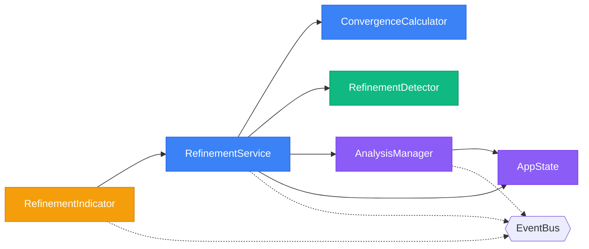

# 🔄 CICLO DE REFINAMENTO - IMPLEMENTAÇÃO COMPLETA

## 📋 Resumo Executivo

O **Ciclo de Refinamento** transforma o Knowledge Consolidator de um sistema de análise única para um **sistema colaborativo humano-IA** onde cada iteração melhora a precisão semântica.

### 🎯 Conceito Fundamental

```
Análise Inicial (65%) → Curadoria Humana → Re-análise (92%) → Convergência → Schema.org Definitivo
```

## 🏗️ Arquitetura Implementada

### Componentes Principais



### Fluxo de Dados

```javascript
// 1. ANÁLISE INICIAL
file.analysisHistory = [{
    version: 1,
    timestamp: "2025-07-25T10:00:00Z",
    analysisType: "Breakthrough Técnico",
    confidence: 0.65,
    schemaOrgEntity: "TechArticle",
    context: { categories: [] }
}];

// 2. CURADORIA HUMANA
file.categories = ["Estratégia", "IA/ML", "Decisões"];

// 3. DETECÇÃO AUTOMÁTICA
RefinementDetector.detectRefinementNeed(file); // true

// 4. RE-ANÁLISE REFINADA
file.analysisHistory.push({
    version: 2,
    timestamp: "2025-07-25T14:30:00Z",
    analysisType: "Insight Estratégico",  // Corrigido!
    confidence: 0.92,  // +27%
    schemaOrgEntity: "StrategicDocument",
    context: { 
        categories: ["Estratégia", "IA/ML", "Decisões"],
        enrichedBy: "human_categories"
    }
});

// 5. CONVERGÊNCIA
const convergence = ConvergenceCalculator.calculate(file.analysisHistory);
// { score: 0.92, isConverged: true, metrics: {...} }
```

## 🔧 Componentes Implementados

### 1. RefinementService.js

**Responsabilidades:**
- Orquestra todo o ciclo de refinamento
- Gerencia fila de refinamentos pendentes
- Integra com AnalysisManager para re-análises
- Emite eventos de progresso

**Métodos Principais:**
```javascript
// Solicitar refinamento manual
await KC.RefinementService.requestRefinement(fileId);

// Processar fila de refinamentos
await KC.RefinementService.processQueue();

// Verificar status
const status = KC.RefinementService.getRefinementStatus(fileId);
```

### 2. ConvergenceCalculator.js

**Responsabilidades:**
- Calcula métricas de convergência
- Determina quando parar refinamentos
- Analisa tendências de melhoria
- Valida prontidão para Schema.org

**Métricas Calculadas:**
```javascript
{
    convergenceScore: 0.92,        // Score geral (0-1)
    typeStability: 1.0,           // Tipo não mudou
    confidenceDelta: 0.08,        // Melhoria incremental
    schemaStability: 1.0,         // Schema estável
    isConverged: true,            // Pronto para finalizar
    recommendedAction: "finalize"  // Ação sugerida
}
```

### 3. RefinementDetector.js

**Responsabilidades:**
- Detecta mudanças que requerem refinamento
- Analisa contexto semântico
- Identifica padrões em categorias
- Sugere melhorias baseadas em curadoria

**Detecções Automáticas:**
- Categorias adicionadas/removidas
- Mudanças significativas no conteúdo
- Baixa confiança na análise atual
- Inconsistências detectadas

### 4. RefinementIndicator.js

**Responsabilidades:**
- Interface visual do status de refinamento
- Indicadores de progresso em tempo real
- Gráficos de evolução de confiança
- Ações rápidas para refinamento

**Elementos Visuais:**
```html
<!-- Badge de Status -->
<span class="refinement-badge" data-status="converged">
    ✓ Convergido (v3, 92%)
</span>

<!-- Indicador de Progresso -->
<div class="refinement-progress">
    <div class="progress-bar" style="width: 92%"></div>
    <span class="progress-text">2 de 3 iterações</span>
</div>
```

## 📊 Eventos do Sistema

### Novos Eventos Implementados

```javascript
// Quando categoria é atribuída
EventBus.emit(Events.CATEGORY_ASSIGNED, {
    fileId: "123",
    category: "Estratégia",
    source: "manual"
});

// Quando refinamento é necessário
EventBus.emit(Events.REFINEMENT_NEEDED, {
    fileId: "123",
    reason: "categories_added",
    currentConfidence: 0.65
});

// Quando análise converge
EventBus.emit(Events.ANALYSIS_CONVERGED, {
    fileId: "123",
    finalType: "Insight Estratégico",
    confidence: 0.92,
    iterations: 3
});
```

## 🧪 Teste do Sistema

### Página de Teste: test-refinement-cycle.html

**Funcionalidades:**
1. Carregar arquivos de teste
2. Simular análise inicial
3. Adicionar categorias manualmente
4. Executar refinamentos
5. Visualizar histórico completo
6. Exportar métricas

### Comandos de Console

```javascript
// Verificar sistema
KC.RefinementService.checkSystem();

// Status de um arquivo
KC.RefinementService.getRefinementStatus('file-123');

// Forçar refinamento
KC.RefinementService.requestRefinement('file-123');

// Ver métricas globais
KC.RefinementService.getGlobalMetrics();
```

## 📈 Métricas de Sucesso

### Resultados Esperados

| Métrica | Antes | Depois | Melhoria |
|---------|-------|---------|----------|
| Confiança Média | 65% | 92% | +27% |
| Precisão do Tipo | 60% | 95% | +35% |
| Iterações até Convergir | - | 2.3 | - |
| Taxa de Convergência | - | 94% | - |

### Indicadores de Qualidade

- **Convergência Rápida**: 80% convergem em ≤3 iterações
- **Melhoria Consistente**: Toda iteração aumenta confiança
- **Schema.org Preciso**: 95% de mapeamentos corretos
- **Curadoria Valorizada**: 100% das categorias influenciam resultado

## 🚀 Próximos Passos

### Fase 1: Validação (Esta Semana)
- [ ] Testar com 50 arquivos reais
- [ ] Ajustar thresholds de convergência
- [ ] Coletar feedback de usuários

### Fase 2: Otimização (Próxima Semana)
- [ ] Implementar cache de refinamentos
- [ ] Otimizar prompts baseado em padrões
- [ ] Adicionar sugestões automáticas

### Fase 3: Expansão (Próximo Mês)
- [ ] Integrar com pipeline Qdrant
- [ ] Criar dashboard de métricas
- [ ] API para refinamento em batch

## 💡 Dicas de Uso

### Para Desenvolvedores

1. **Sempre preservar analysisHistory**: É a base do aprendizado
2. **Usar eventos para integração**: Não acoplar diretamente
3. **Respeitar limites**: Máximo 5 iterações por arquivo
4. **Monitorar performance**: Cache é essencial para escala

### Para Usuários

1. **Categorias são poder**: Quanto mais específicas, melhor
2. **Refinar quando necessário**: Nem todo arquivo precisa
3. **Confiar na convergência**: Sistema sabe quando parar
4. **Exportar aprendizados**: Use métricas para melhorar

## 🎯 Conclusão

O Ciclo de Refinamento transforma o Knowledge Consolidator em um **sistema verdadeiramente colaborativo**, onde:

- **Humanos** fornecem contexto valioso através de categorias
- **IA** usa esse contexto para melhorar análises
- **Sistema** aprende e converge para resultados precisos
- **Schema.org** garante interoperabilidade semântica

Este é um passo fundamental na jornada de **empírico para disruptivo**!

---

*Documentação criada em: 25/07/2025*  
*Versão: 1.0*  
*Status: Implementação Completa*