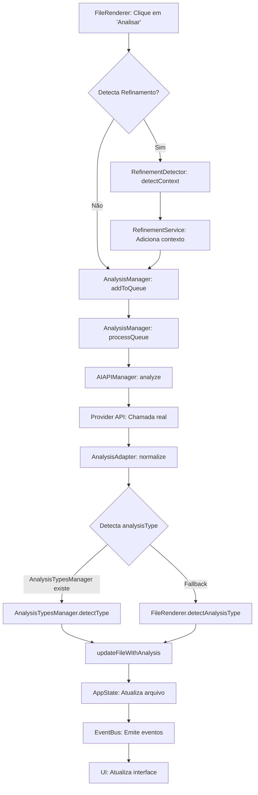
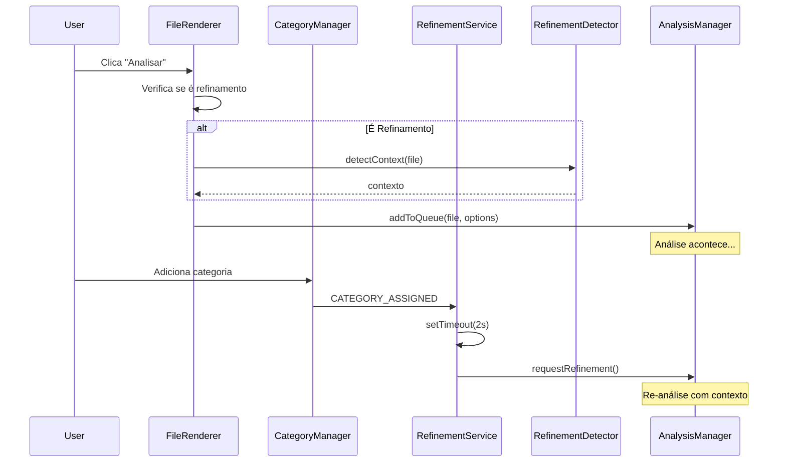

# Análise do Fluxo de Dados - Sistema de Análise de Arquivos VCIA_DHL

## 1. Visão Geral do Fluxo

### 1.1 Diagrama de Fluxo Geral



## 2. Fluxo Detalhado por Componente

### 2.1 FileRenderer.js - Início do Processo

**Método**: `analyzeFile(file, buttonElement)`

```javascript
// Linha 2096: Início da análise
async analyzeFile(file, buttonElement) {
    // 1. Detecta se é refinamento
    let isRefinement = false;
    let refinementContext = null;
    
    if (KC.RefinementDetector) {
        isRefinement = file.analyzed && file.categories && file.categories.length > 0;
        if (isRefinement) {
            refinementContext = await KC.RefinementDetector.detectContext(file);
        }
    }
    
    // 2. Adiciona à fila do AnalysisManager
    KC.AnalysisManager.addToQueue([file], {
        template: 'decisiveMoments',
        isRefinement: isRefinement,
        refinementContext: refinementContext
    });
}
```

**Decisões**:
- Determina se é refinamento baseado em: `file.analyzed && file.categories.length > 0`
- Se for refinamento, busca contexto adicional

### 2.2 RefinementDetector.js - Detecção de Contexto

**Método**: `detectContext(file)`

```javascript
// Linha 79: Detecta contexto para refinamento
async detectContext(file) {
    // 1. Prepara conteúdo (prioridade: content > preview > re-leitura)
    const content = await this.prepareContent(file);
    
    // 2. Detecta padrões semânticos
    this.detectSemanticPatterns(content, context);
    
    // 3. Detecta relações
    this.detectRelations(content, context);
    
    // 4. Correlaciona com categorias
    await this.correlateWithCategories(file, context);
    
    // 5. Calcula confiança
    context.confidence = this.calculateContextConfidence(context);
}
```

**Padrões Detectados**:
- Technical: arquitetura, framework, algoritmo
- Decision: decisão, escolha, opção
- Insight: descoberta, realização, compreensão
- Evolution: evolução, mudança, transformação
- Learning: aprendizado, lição, conhecimento

### 2.3 AnalysisManager.js - Orquestração

**Método**: `processBatch(batch)`

```javascript
// Linha 162: Processa batch de arquivos
async processBatch(batch) {
    for (const item of batch) {
        // 1. Detecta se é refinamento
        const isRefinement = item.config.isRefinement || false;
        const refinementContext = item.config.refinementContext || null;
        
        // 2. Prepara prompt com contexto
        if (isRefinement && refinementContext) {
            promptContext = this.buildRefinementPromptContext(
                promptContext,
                refinementContext,
                item.config
            );
        }
        
        // 3. Chama API real
        const rawResponse = await KC.AIAPIManager.analyze(file, options);
        
        // 4. Normaliza resposta
        const normalizedAnalysis = KC.AnalysisAdapter.normalize(rawResponse);
    }
}
```

**Método**: `updateFileWithAnalysis(file, result)` (Linha 379)

```javascript
// DECISÃO CRÍTICA: Determina analysisType
if (KC.AnalysisTypesManager && KC.AnalysisTypesManager.detectType) {
    // Fonte primária: AnalysisTypesManager
    analysisType = KC.AnalysisTypesManager.detectType(files[fileIndex]);
} else {
    // Fallback: FileRenderer.detectAnalysisType
    analysisType = KC.FileRenderer.detectAnalysisType(files[fileIndex]);
}
```

### 2.4 RefinementService.js - Ciclo de Refinamento

**Método**: `handleCategoryChange(data)`

```javascript
// Linha 165: Detecta mudança em categorias
async handleCategoryChange(data) {
    if (!this.config.autoRefinementEnabled) return;
    
    // Agenda refinamento após delay
    setTimeout(() => {
        this.requestRefinement(fileId, {
            reason: 'manual_context_added',
            contextType: 'categories',
            immediateProcessing: true
        });
    }, this.config.refinementDelay); // 2000ms
}
```

## 3. Fontes de Verdade Identificadas

### 3.1 Para Tipos de Análise (analysisType)

1. **Fonte Primária**: `AnalysisTypes.js`
   - Define 5 tipos: Breakthrough Técnico, Evolução Conceitual, Momento Decisivo, Insight Estratégico, Aprendizado Geral
   - Classe: `AnalysisTypesManager`
   - Método: `detectType(file)`

2. **Fonte Secundária (Fallback)**: `FileRenderer.js`
   - Método: `detectAnalysisType(file)` (Linha 4341)
   - Implementação duplicada da lógica de detecção

3. **Fonte Problemática**: `AnalysisAdapter.js`
   - Chama `this._detectAnalysisType(text)` mas o método NÃO EXISTE
   - Linhas 454 e 473

### 3.2 Para Categorias

1. **Fonte Única**: `CategoryManager.js`
   - Gerencia todas as categorias do sistema
   - Emite evento `CATEGORIES_CHANGED`

### 3.3 Para Estado dos Arquivos

1. **Fonte Única**: `AppState.js`
   - Chave: `files`
   - Persistido em localStorage

## 4. Conflitos e Inconsistências Encontradas

### 4.1 Método Inexistente

**Problema**: `AnalysisAdapter._detectAnalysisType()` não está implementado
- Arquivo: `AnalysisAdapter.js`
- Linhas: 454, 473
- Impacto: Se a resposta da IA não incluir `analysisType`, o sistema tentará chamar um método inexistente

### 4.2 Duplicação de Lógica

**Problema**: Detecção de tipo implementada em dois lugares
- `AnalysisTypesManager.detectType()` - Fonte oficial (Lei 11)
- `FileRenderer.detectAnalysisType()` - Implementação duplicada
- Impacto: Possível divergência nos resultados

### 4.3 Decisão Condicional de Fonte

**Problema**: `AnalysisManager` decide qual fonte usar dinamicamente
```javascript
if (KC.AnalysisTypesManager && KC.AnalysisTypesManager.detectType) {
    // Usa fonte primária
} else {
    // Usa fallback
}
```
- Impacto: Comportamento inconsistente dependendo da ordem de carregamento

### 4.4 Refinamento Automático por Categorias

**Problema**: Delay fixo de 2 segundos pode causar condições de corrida
- Se usuário adicionar múltiplas categorias rapidamente
- Múltiplos timeouts podem ser agendados

## 5. Efeito Cascata de Decisões

### 5.1 Decisão: É Refinamento?

```
FileRenderer.analyzeFile()
  ↓
isRefinement = file.analyzed && file.categories.length > 0
  ↓
SE SIM:
  - RefinementDetector.detectContext()
  - Adiciona refinementContext ao prompt
  - Marca isRefinement: true nos metadados
  - Aumenta confidence score
  ↓
SE NÃO:
  - Análise padrão sem contexto adicional
  - confidence inicial ~65%
```

### 5.2 Decisão: Qual Fonte para analysisType?

```
AnalysisManager.updateFileWithAnalysis()
  ↓
SE AnalysisTypesManager existe:
  - Usa AnalysisTypesManager.detectType()
  - Consistente com AnalysisTypes.js
  - Aplica relevanceBoost correto
  ↓
SE NÃO:
  - Usa FileRenderer.detectAnalysisType()
  - Pode divergir da fonte oficial
  - relevanceBoost pode ser diferente
```

### 5.3 Decisão: Categoria Adicionada

```
Usuário adiciona categoria
  ↓
CategoryManager emite CATEGORY_ASSIGNED
  ↓
RefinementService.handleCategoryChange()
  ↓
Agenda refinamento após 2 segundos
  ↓
RefinementService.requestRefinement()
  ↓
Volta para AnalysisManager com isRefinement: true
```

## 6. Recomendações

### 6.1 Corrigir Método Inexistente

Implementar `_detectAnalysisType` em `AnalysisAdapter.js`:
```javascript
_detectAnalysisType(text) {
    // Delegar para fonte única
    return KC.AnalysisTypesManager.detectType({ content: text });
}
```

### 6.2 Remover Duplicação

Remover `detectAnalysisType` de `FileRenderer.js` e usar apenas `AnalysisTypesManager`.

### 6.3 Garantir Ordem de Carregamento

Garantir que `AnalysisTypes.js` seja carregado antes de `AnalysisManager.js`.

### 6.4 Implementar Debounce para Refinamento

Evitar múltiplos refinamentos simultâneos com debounce:
```javascript
this.debouncedRefinement = debounce(
    this.requestRefinement.bind(this), 
    this.config.refinementDelay
);
```

## 7. Diagrama de Fluxo de Refinamento

