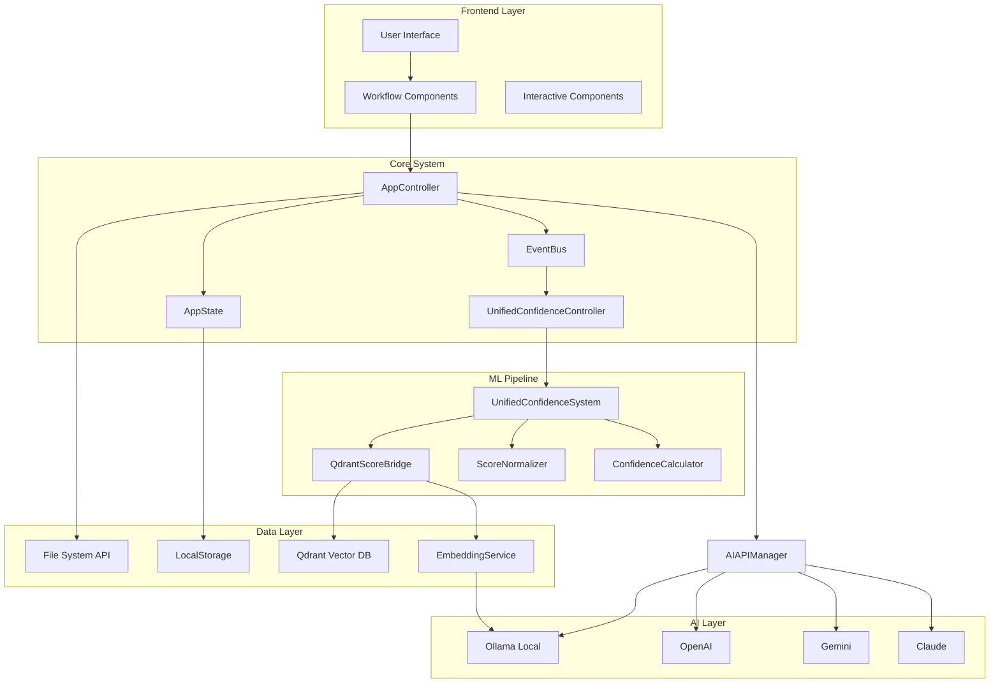
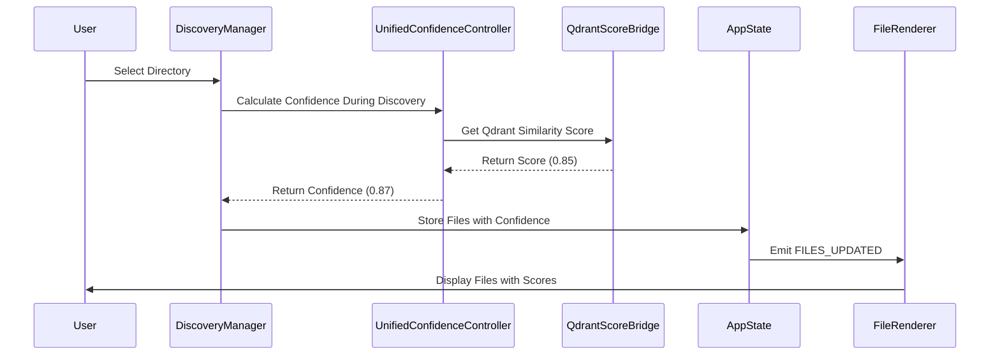
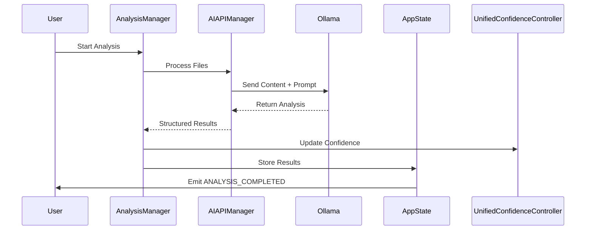

# 🏗️ Architecture Overview

## System Architecture

O Knowledge Consolidator utiliza uma arquitetura modular e orientada a eventos, com integração profunda de Machine Learning para análise de confiança em tempo real.



## Core Principles

### 1. Event-Driven Architecture
```javascript
// Todos os componentes comunicam via EventBus
KC.EventBus.emit(KC.Events.FILES_UPDATED, { action: 'discovered', files })
KC.EventBus.on(KC.Events.FILES_UPDATED, (data) => {
  // Componentes reagem automaticamente
})
```

### 2. Single Source of Truth (SSO)
```javascript
// AppState é a fonte única para dados críticos
KC.AppState.set('files', files)  // Única forma de modificar
const files = KC.AppState.get('files')  // Única forma de acessar
```

### 3. Confidence-First Design
```javascript
// Confidence scores calculados DURANTE descoberta (não após)
const confidenceScore = await KC.UnifiedConfidenceController
  ._calculateConfidenceDuringDiscovery(file)
```

## Component Hierarchy

### Tier 1: Core Infrastructure
```
KC.EventBus           // Event management
KC.AppState          // State management
KC.AppController     // Navigation & control
KC.Logger           // Logging system
```

### Tier 2: Managers
```
KC.DiscoveryManager     // File discovery
KC.FilterManager        // Advanced filtering
KC.CategoryManager      // Category system
KC.AnalysisManager      // AI analysis
KC.RAGExportManager     // Export pipeline
```

### Tier 3: Services
```
KC.EmbeddingService         // Embeddings generation
KC.QdrantService           // Vector database
KC.SimilaritySearchService // Semantic search
KC.TripleStoreService      // Knowledge graphs
KC.AIAPIManager            // Multi-provider AI
```

### Tier 4: ML & Confidence
```
KC.UnifiedConfidenceController  // Main coordinator
KC.QdrantScoreBridge           // Qdrant integration
KC.ScoreNormalizer             // Score normalization
KC.ConfidenceCalculator        // ML algorithms
KC.ConfidenceValidator         // Quality validation
```

### Tier 5: UI Components
```
KC.WorkflowPanel        // Main workflow
KC.FileRenderer         // File listing
KC.OrganizationPanel    // Step 4 organization
KC.GraphVisualization   // Knowledge graphs
KC.FilterPanel          // Advanced filters
```

## Data Flow Architecture

### Discovery Flow


### Analysis Flow


## UnifiedConfidenceSystem Deep Dive

### Architecture Components
```javascript
class UnifiedConfidenceController {
  constructor() {
    this.components = {
      scoreBridge: QdrantScoreBridge,      // Qdrant integration
      normalizer: ScoreNormalizer,         // Score normalization
      calculator: ConfidenceCalculator,    // ML algorithms
      validator: ConfidenceValidator,      // Quality assurance
      boostCalculator: BoostCalculator,    // Category boosts
      prefixEnhancer: PrefixEnhancer,      // Performance optimization
      aggregator: ConfidenceAggregator,    // Multi-source aggregation
      zeroResolver: ZeroRelevanceResolver  // Edge case handling
    }
  }
}
```

### Confidence Calculation Pipeline
```javascript
// Fluxo completo de cálculo de confiança
async _calculateConfidenceDuringDiscovery(file) {
  // 1. Ensure system is ready (lazy initialization)
  await this._ensureUnifiedConfidenceSystemReady()
  
  // 2. Calculate base scores
  const scores = {
    qdrantSimilarity: await this._getQdrantSimilarity(file),
    localRelevance: await this._getLocalRelevance(file),
    categoryBoost: this._getCategoryBoost(file),
    structuralFeatures: this._getStructuralFeatures(file)
  }
  
  // 3. Apply ML algorithms
  const confidence = await this.components.calculator.calculate(scores)
  
  // 4. Normalize and validate
  const normalizedConfidence = this.components.normalizer.normalize(confidence)
  const validatedConfidence = this.components.validator.validate(normalizedConfidence)
  
  // 5. Apply fallbacks if needed
  return validatedConfidence || this._calculateFallbackConfidence(file)
}
```

### Fallback Strategy
```javascript
_calculateFallbackConfidence(file) {
  // Múltiplas camadas de fallback
  const strategies = [
    () => this._categoryBasedFallback(file),      // Fallback baseado em categorias
    () => this._keywordBasedFallback(file),       // Fallback baseado em keywords
    () => this._structuralFallback(file),         // Fallback estrutural
    () => this._defaultFallback(file)             // Fallback padrão
  ]
  
  for (const strategy of strategies) {
    try {
      const score = strategy()
      if (score !== null && score >= 0) return score
    } catch (error) {
      continue  // Tenta próxima estratégia
    }
  }
  
  return 0.5  // Último recurso
}
```

## State Management

### AppState Structure
```javascript
const AppStateSchema = {
  // Core data
  files: [],                    // Compressed file data
  categories: [],               // Category definitions
  configuration: {},            // User settings
  
  // UI state
  currentStep: 1,               // Workflow step (1-4)
  activeFilters: {},            // Filter state
  selectedFiles: [],            // Selection state
  
  // ML state
  confidenceMetrics: {},        // Performance metrics
  processingQueue: [],          // Analysis queue
  
  // Cache
  embeddings: new Map(),        // Embedding cache
  similarityCache: new Map()    // Similarity cache
}
```

### Compression Strategy
```javascript
// Dados comprimidos para localStorage
_compressFilesData(files) {
  return files.map(file => ({
    // Campos essenciais preservados
    id: file.id,
    name: file.name,
    path: file.path,
    handle: file.handle,             // Para re-leitura
    preview: file.preview,           // Preview inteligente
    analysisType: file.analysisType, // Tipo detectado
    relevanceScore: file.relevanceScore,
    confidence: file.confidence,     // NOVO: Score de confiança
    categories: file.categories,
    analyzed: file.analyzed,
    // content é REMOVIDO para economizar espaço
  }))
}
```

## Event System

### Event Types
```javascript
const Events = {
  // State events
  STATE_CHANGED: 'state:changed',
  FILES_UPDATED: 'files:updated',
  CATEGORIES_CHANGED: 'categories:changed',
  
  // UI events
  STEP_CHANGED: 'step:changed',
  FILTER_CHANGED: 'filter:changed',
  SELECTION_CHANGED: 'selection:changed',
  
  // ML events
  CONFIDENCE_UPDATED: 'confidence:updated',
  ANALYSIS_STARTED: 'analysis:started',
  ANALYSIS_COMPLETED: 'analysis:completed',
  
  // Pipeline events
  PIPELINE_STARTED: 'pipeline:started',
  PIPELINE_PROGRESS: 'pipeline:progress',
  PIPELINE_COMPLETED: 'pipeline:completed'
}
```

### Event Handling Pattern
```javascript
// Padrão recomendado para componentes
class Component {
  constructor() {
    // Registrar listeners no constructor
    this.setupEventListeners()
  }
  
  setupEventListeners() {
    KC.EventBus.on(KC.Events.FILES_UPDATED, this.handleFilesUpdated.bind(this))
    KC.EventBus.on(KC.Events.CATEGORIES_CHANGED, this.handleCategoriesChanged.bind(this))
  }
  
  handleFilesUpdated(data) {
    // Reagir a mudanças de arquivos
    this.updateUI()
  }
  
  // SEMPRE emitir ambos eventos após modificações
  updateFiles(files) {
    KC.AppState.set('files', files)
    
    KC.EventBus.emit(KC.Events.STATE_CHANGED, {
      key: 'files',
      newValue: files
    })
    
    KC.EventBus.emit(KC.Events.FILES_UPDATED, {
      action: 'updated',
      count: files.length
    })
  }
}
```

## File System Integration

### File System Access API
```javascript
class HandleManager {
  async selectDirectory() {
    // Usar File System Access API quando disponível
    if ('showDirectoryPicker' in window) {
      return await window.showDirectoryPicker()
    } else {
      // Fallback para input file
      return this.fallbackDirectorySelector()
    }
  }
  
  async readFileContent(handle) {
    const file = await handle.getFile()
    return await file.text()
  }
  
  // Verificar permissões antes de acessar
  async verifyPermission(handle, withWrite = false) {
    const opts = { mode: withWrite ? 'readwrite' : 'read' }
    return await handle.queryPermission(opts) === 'granted' ||
           await handle.requestPermission(opts) === 'granted'
  }
}
```

### Obsidian Detection
```javascript
// Detecção automática de Obsidian Vault
async detectObsidianVault(directoryHandle) {
  try {
    // Procurar por .obsidian directory
    const obsidianDir = await directoryHandle.getDirectoryHandle('.obsidian')
    
    // Verificar arquivos de configuração
    const configFiles = ['app.json', 'core-plugins.json']
    const hasConfig = await Promise.all(
      configFiles.map(async (file) => {
        try {
          await obsidianDir.getFileHandle(file)
          return true
        } catch {
          return false
        }
      })
    )
    
    return hasConfig.some(Boolean)
  } catch {
    return false
  }
}
```

## AI Integration Architecture

### Multi-Provider System
```javascript
class AIAPIManager {
  constructor() {
    this.providers = new Map([
      ['ollama', new OllamaProvider()],
      ['openai', new OpenAIProvider()],
      ['gemini', new GeminiProvider()],
      ['anthropic', new AnthropicProvider()]
    ])
    
    this.priorityOrder = ['ollama', 'openai', 'gemini', 'anthropic']
    this.circuitBreakers = new Map()
  }
  
  async processWithFallback(content, template) {
    for (const providerId of this.priorityOrder) {
      const provider = this.providers.get(providerId)
      
      if (!provider.isAvailable() || this.isCircuitOpen(providerId)) {
        continue
      }
      
      try {
        const result = await provider.analyze(content, template)
        this.recordSuccess(providerId)
        return { result, provider: providerId }
      } catch (error) {
        this.recordFailure(providerId, error)
        continue
      }
    }
    
    throw new Error('All AI providers failed')
  }
}
```

### Template System
```javascript
// Sistema de templates flexível
class PromptManager {
  constructor() {
    this.templates = new Map()
    this.loadDefaultTemplates()
  }
  
  createTemplate(id, config) {
    const template = {
      id,
      name: config.name,
      prompt: config.prompt,
      outputFormat: config.outputFormat || 'structured',
      expectedFields: config.expectedFields || [],
      preprocessing: config.preprocessing || [],
      postprocessing: config.postprocessing || []
    }
    
    this.templates.set(id, template)
    return template
  }
  
  renderPrompt(templateId, variables) {
    const template = this.templates.get(templateId)
    if (!template) throw new Error(`Template ${templateId} not found`)
    
    return template.prompt.replace(/\{(\w+)\}/g, (match, key) => {
      return variables[key] || match
    })
  }
}
```

## Vector Database Integration

### Qdrant Schema
```javascript
// Schema otimizado para Knowledge Consolidator
const QdrantSchema = {
  collection: 'knowledge_base',
  vectors: {
    size: 768,              // nomic-embed-text dimensions
    distance: 'Cosine'      // Optimal for semantic similarity
  },
  payload_schema: {
    // Core metadata
    file_id: 'keyword',
    file_name: 'text',
    file_path: 'text',
    
    // Content analysis
    content_preview: 'text',
    analysis_type: 'keyword',
    categories: 'keyword[]',
    
    // Confidence & relevance
    confidence: 'float',
    relevance_score: 'float',
    
    // Temporal data
    created_at: 'datetime',
    analyzed_at: 'datetime',
    
    // ML features
    structural_features: 'float[]',
    keyword_density: 'float',
    semantic_concepts: 'keyword[]'
  }
}
```

### Embedding Pipeline
```javascript
class EmbeddingService {
  async generateEmbedding(text, options = {}) {
    // Preprocessing
    const cleanText = this.preprocessText(text)
    
    // Generate embedding via Ollama
    const response = await fetch('http://localhost:11434/api/embeddings', {
      method: 'POST',
      headers: { 'Content-Type': 'application/json' },
      body: JSON.stringify({
        model: 'nomic-embed-text',
        prompt: cleanText
      })
    })
    
    const data = await response.json()
    const embedding = data.embedding
    
    // Cache for future use
    this.cache.set(text, embedding)
    
    return embedding
  }
  
  preprocessText(text) {
    return text
      .replace(/\n+/g, ' ')           // Normalize newlines
      .replace(/\s+/g, ' ')           // Normalize whitespace
      .trim()                         // Remove leading/trailing space
      .substring(0, 8000)             // Limit to model context
  }
}
```

## Performance Optimizations

### Memory Management
```javascript
class MemoryOptimizer {
  constructor() {
    this.monitoringInterval = null
    this.thresholds = {
      heap: 0.85,      // 85% heap usage trigger
      cache: 0.75      // 75% cache usage trigger
    }
  }
  
  startMonitoring() {
    this.monitoringInterval = setInterval(() => {
      const memInfo = performance.memory
      const heapUsageRatio = memInfo.usedJSHeapSize / memInfo.jsHeapSizeLimit
      
      if (heapUsageRatio > this.thresholds.heap) {
        this.performCleanup()
      }
    }, 30000) // Check every 30 seconds
  }
  
  performCleanup() {
    // Clear various caches
    KC.EmbeddingService.clearCache()
    KC.SimilaritySearchService.clearCache()
    KC.QdrantService.clearCache()
    
    // Compress AppState if needed
    KC.AppState.compress()
    
    // Force garbage collection if available
    if (window.gc) window.gc()
  }
}
```

### Lazy Loading
```javascript
// Lazy initialization pattern usado em todo o sistema
class LazyComponent {
  constructor() {
    this._initialized = false
    this._initPromise = null
  }
  
  async ensureInitialized() {
    if (this._initialized) return
    
    if (!this._initPromise) {
      this._initPromise = this._initialize()
    }
    
    await this._initPromise
  }
  
  async _initialize() {
    // Expensive initialization
    await this.loadDependencies()
    await this.setupConnections()
    this._initialized = true
  }
  
  async operation() {
    await this.ensureInitialized()
    // Perform operation
  }
}
```

## Security Considerations

### Input Sanitization
```javascript
class InputSanitizer {
  static sanitizeFilePath(path) {
    // Prevent path traversal
    return path.replace(/\.\./g, '').replace(/[<>:"|?*]/g, '')
  }
  
  static sanitizeUserInput(input) {
    // XSS prevention
    return input
      .replace(/</g, '&lt;')
      .replace(/>/g, '&gt;')
      .replace(/"/g, '&quot;')
      .replace(/'/g, '&#39;')
  }
  
  static validateApiKey(key) {
    // Basic API key validation
    const patterns = {
      openai: /^sk-[A-Za-z0-9]{48}$/,
      anthropic: /^sk-ant-[A-Za-z0-9-]{95}$/,
      gemini: /^AIza[A-Za-z0-9-_]{35}$/
    }
    
    for (const [provider, pattern] of Object.entries(patterns)) {
      if (pattern.test(key)) return provider
    }
    
    return null
  }
}
```

### Encryption
```javascript
// Criptografia AES-256 para dados sensíveis
class CryptoService {
  static async encrypt(data, key) {
    const encoder = new TextEncoder()
    const dataBuffer = encoder.encode(data)
    
    const keyBuffer = await crypto.subtle.importKey(
      'raw',
      encoder.encode(key),
      { name: 'AES-GCM' },
      false,
      ['encrypt']
    )
    
    const iv = crypto.getRandomValues(new Uint8Array(12))
    const encrypted = await crypto.subtle.encrypt(
      { name: 'AES-GCM', iv },
      keyBuffer,
      dataBuffer
    )
    
    return { encrypted: Array.from(new Uint8Array(encrypted)), iv: Array.from(iv) }
  }
}
```

## Testing Strategy

### Component Testing
```javascript
// Exemplo de teste de componente
describe('UnifiedConfidenceController', () => {
  let controller
  
  beforeEach(() => {
    controller = new KC.UnifiedConfidenceController()
  })
  
  test('should calculate confidence during discovery', async () => {
    const mockFile = {
      id: 'test_file',
      content: 'Machine learning implementation strategy',
      categories: ['IA/ML']
    }
    
    const confidence = await controller._calculateConfidenceDuringDiscovery(mockFile)
    
    expect(confidence).toBeGreaterThan(0)
    expect(confidence).toBeLessThanOrEqual(1)
  })
  
  test('should use fallback when ML components fail', async () => {
    // Mock component failure
    controller.components.calculator.calculate = jest.fn().mockRejectedValue(new Error('ML failure'))
    
    const mockFile = { id: 'test', content: 'test', categories: ['test'] }
    const confidence = await controller._calculateConfidenceDuringDiscovery(mockFile)
    
    expect(confidence).toBe(0.5) // Default fallback
  })
})
```

---

**Próximo**: [Component Reference →](component-reference.md)