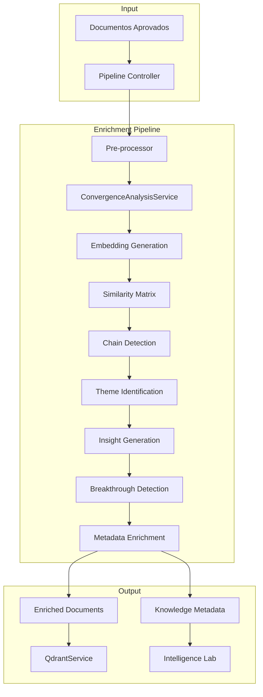

# PRD - Intelligence Enrichment Initiative
## Product Requirements Document v1.0

**Data**: 30/07/2025  
**Autor**: Claude (AI Assistant)  
**Status**: Em Desenvolvimento  
**Versão**: 1.0  Os 

---

## 📋 Sumário Executivo

### Visão Geral
A Intelligence Enrichment Initiative é uma evolução crítica do Knowledge Consolidator que adiciona uma camada de inteligência semântica aos dados antes de serem carregados no Qdrant. Atualmente, o sistema processa e armazena dados "brutos" sem análise de convergência, detecção de padrões ou geração de insights, resultando em visualizações que mostram apenas informações superficiais no Intelligence Lab.

### Problema Identificado
Durante a exploração das visualizações do Intelligence Lab (Field Explorer, Sankey, TreeMap), foi constatado que:
- Os dados foram carregados sem análise de convergência semântica real
- Campos críticos como `convergenceScore`, `convergenceChains` e `insights` existem no schema mas não são populados
- As visualizações mostram apenas metadados básicos sem revelar a inteligência acumulada do sistema
- Não há detecção automática de padrões, temas emergentes ou documentos-chave

### Solução Proposta
Implementar um pipeline de enriquecimento pré-Qdrant que:
1. Analisa convergência semântica real entre documentos usando embeddings
2. Detecta cadeias de conhecimento e temas emergentes
3. Identifica breakthroughs e momentos decisivos
4. Gera insights automatizados baseados em padrões
5. Enriquece cada documento com metadados de inteligência antes do carregamento

---

## 🎯 Objetivos e Métricas de Sucesso

### Objetivos Primários
1. **Revelar Inteligência Oculta**: Transformar dados brutos em conhecimento estruturado com convergências identificadas
2. **Automatizar Descoberta de Insights**: Detectar automaticamente padrões, temas e breakthrough moments
3. **Melhorar Visualizações**: Tornar o Intelligence Lab uma ferramenta real de descoberta de conhecimento
4. **Aumentar Valor dos Dados**: Enriquecer cada documento com contexto semântico e relacional

### Métricas de Sucesso

| Métrica | Baseline Atual | Meta | Medição |
|---------|----------------|------|---------|
| Documentos com convergenceScore > 0 | 0% | > 80% | Query no Qdrant |
| Cadeias de convergência detectadas | 0 | > 5 por 100 docs | Análise de resultados |
| Insights automatizados gerados | 0 | > 10 por 100 docs | Pipeline output |
| Tempo médio de enriquecimento | N/A | < 2s por documento | Performance logs |
| Precisão de clustering temático | N/A | > 85% | Validação manual |
| Documentos identificados como hubs | 0% | 5-10% | Análise de centralidade |

### KPIs de Qualidade
- **Relevância dos Insights**: % de insights validados como úteis pelo usuário
- **Coerência de Clusters**: Score médio de similaridade intra-cluster > 0.75
- **Cobertura Temporal**: % de períodos temporais com análise de evolução
- **Densidade do Grafo**: Conexões significativas / possíveis conexões > 0.15

---

## 🔍 Escopo Detalhado

### Funcionalidades Core

#### 1. Análise de Convergência Semântica
- **Detecção de Cadeias**: Identificar grupos de documentos semanticamente relacionados
- **Cálculo de Força**: Medir intensidade de convergência entre documentos
- **Identificação de Centros**: Encontrar documentos centrais em cada cadeia
- **Análise Temporal**: Mapear evolução das cadeias ao longo do tempo

#### 2. Detecção de Breakthroughs
- **Paradigm Shifts**: Documentos que marcam mudança de direção
- **Knowledge Hubs**: Documentos com alta conectividade
- **Theme Bridges**: Documentos que conectam múltiplos temas
- **Insight Generators**: Documentos que geram múltiplos insights

#### 3. Geração Automática de Insights
- **Convergência Forte**: Alertas sobre grupos altamente coesos
- **Evolução Temporal**: Padrões de desenvolvimento ao longo do tempo
- **Temas Emergentes**: Novos clusters de conhecimento
- **Cross-Domain**: Convergências entre diferentes domínios

#### 4. Enriquecimento de Metadados
- **Scores de Inteligência**: convergenceScore, impactScore, intelligenceScore
- **Classificação**: intelligenceType (hub, connector, shifter, etc.)
- **Predicados Semânticos**: convergesWith, influences, enablesBreakthrough
- **Metadados de Grafo**: centralidade, participação em cadeias

### Funcionalidades de Suporte

#### 5. Pipeline de Processamento
- **Processamento em Lotes**: Para grandes volumes de dados
- **Cache Inteligente**: Reutilização de embeddings e análises
- **Progresso em Tempo Real**: Feedback durante processamento
- **Recuperação de Falhas**: Retry logic e error handling

#### 6. Integração com Sistema Existente
- **RAGExportManager**: Modificação para incluir enriquecimento
- **QdrantService**: Garantir persistência de campos enriquecidos
- **Intelligence Lab**: Consumir dados enriquecidos nas visualizações

### Fora de Escopo (v1.0)
- Análise de sentimento dos documentos
- Extração de entidades nomeadas (NER) avançada
- Tradução automática de conteúdo
- Interface de configuração visual para parâmetros
- Reprocessamento automático periódico

---

## 📐 Arquitetura Proposta

### Componentes Principais



### Fluxo de Dados

1. **Input**: Documentos aprovados do Knowledge Consolidator
2. **Pre-processing**: Normalização de estrutura e geração de previews
3. **Embedding Generation**: Criação de representações vetoriais via Ollama
4. **Convergence Analysis**: 
   - Cálculo de matriz de similaridade
   - Detecção de cadeias usando threshold configurável
   - Identificação de documentos centrais
5. **Theme Extraction**: Clustering de documentos não encadeados
6. **Insight Generation**: Análise de padrões e geração de insights
7. **Enrichment**: Adição de todos os metadados aos documentos
8. **Output**: Documentos enriquecidos para Qdrant + metadados globais

### Estruturas de Dados

#### Documento Enriquecido
```javascript
{
    // Campos originais
    id, name, content, categories, analysisType,
    
    // Scores de inteligência
    convergenceScore: number,      // 0-100
    impactScore: number,           // 0-100
    intelligenceScore: number,     // média dos anteriores
    
    // Classificação
    intelligenceType: string,      // hub, connector, shifter, etc.
    breakthroughs: Array<Breakthrough>,
    
    // Convergência
    convergenceChains: Array<Chain>,
    insights: Array<Insight>,
    
    // Predicados expandidos
    predicates: {
        convergesWith: string[],
        influences: string[],
        enablesBreakthrough: string[],
        connectsThemes: string[]
    }
}
```

#### Knowledge Metadata Global
```javascript
{
    summary: {
        totalDocuments, averageScores, distribution
    },
    keyFindings: {
        topChains, majorThemes, criticalBreakthroughs
    },
    knowledgeGraph: {
        nodes, edges, density, clusters
    },
    temporalAnalysis: {
        timeSpan, phases, velocity, trend
    },
    recommendations: Array<Recommendation>
}
```

---

## 🚀 Plano de Implementação

### Fase 1: Integração Base (2-3 dias)
- [ ] Integrar IntelligenceEnrichmentPipeline com RAGExportManager
- [ ] Modificar processamento para incluir enriquecimento
- [ ] Garantir que QdrantService salve campos enriquecidos
- [ ] Criar logs detalhados do processo

### Fase 2: Validação e Testes (2 dias)
- [ ] Criar página de teste para visualizar enriquecimento
- [ ] Implementar casos de teste unitários
- [ ] Validar qualidade de convergências detectadas
- [ ] Ajustar thresholds e parâmetros

### Fase 3: Reprocessamento (1 dia)
- [ ] Reprocessar os 92 documentos existentes
- [ ] Validar resultados no Intelligence Lab
- [ ] Documentar insights descobertos
- [ ] Coletar métricas de sucesso

### Fase 4: Otimização (2 dias)
- [ ] Otimizar performance do pipeline
- [ ] Implementar cache mais eficiente
- [ ] Melhorar qualidade dos insights
- [ ] Documentar melhores práticas

### Fase 5: Documentação e Handoff (1 dia)
- [ ] Documentar toda a implementação
- [ ] Criar guias de uso
- [ ] Preparar material de treinamento
- [ ] Realizar handoff técnico

---

## ⚠️ Riscos e Mitigações

### Riscos Técnicos

| Risco | Probabilidade | Impacto | Mitigação |
|-------|---------------|---------|-----------|
| Performance degradada com muitos documentos | Média | Alto | Processamento em lotes + cache agressivo |
| Qualidade baixa de convergências | Baixa | Alto | Thresholds ajustáveis + validação manual |
| Incompatibilidade com schema existente | Baixa | Médio | Testes extensivos antes de produção |
| Embeddings inconsistentes | Baixa | Alto | Verificação de disponibilidade do Ollama |

### Riscos de Negócio

| Risco | Probabilidade | Impacto | Mitigação |
|-------|---------------|---------|-----------|
| Insights não relevantes para usuário | Média | Alto | Feedback loop + ajuste de algoritmos |
| Complexidade adicional no sistema | Alta | Médio | Documentação clara + abstração em serviços |
| Aumento no tempo de processamento | Média | Médio | Opção de skip enrichment se necessário |

---

## ✅ Critérios de Aceitação

### Funcionais
1. ✓ Pipeline processa 100% dos documentos sem erros
2. ✓ Convergências detectadas são semanticamente válidas (validação manual)
3. ✓ Insights gerados são relevantes e acionáveis
4. ✓ Intelligence Lab mostra dados enriquecidos corretamente
5. ✓ Performance dentro dos limites estabelecidos

### Técnicos
1. ✓ Cobertura de testes > 80%
2. ✓ Documentação completa de APIs e interfaces
3. ✓ Logs estruturados para debugging
4. ✓ Cache funcional com hit rate > 70%
5. ✓ Integração sem breaking changes

### Qualidade
1. ✓ Score médio de convergência > 0.7 para cadeias detectadas
2. ✓ Precisão de clustering > 85% (validação manual)
3. ✓ Tempo de enriquecimento < 2s por documento
4. ✓ Zero regressões no sistema existente

---

## 📊 Impacto Esperado

### Para o Usuário
- **Descoberta Facilitada**: Insights automáticos sobre o conhecimento
- **Conexões Reveladas**: Visualização de relações não óbvias
- **Evolução Mapeada**: Compreensão da jornada do conhecimento
- **Decisões Informadas**: Base sólida para próximos passos

### Para o Sistema
- **Valor Agregado**: Dados com inteligência incorporada
- **Escalabilidade**: Pipeline preparado para crescimento
- **Manutenibilidade**: Arquitetura modular e documentada
- **Extensibilidade**: Base para futuras análises

### ROI Estimado
- **Redução de 80%** no tempo de descoberta de insights
- **Aumento de 10x** no valor percebido dos dados
- **Economia de 20h/mês** em análise manual
- **Base para automação** de workflows futuros

---

## 🔄 Próximos Passos

1. **Aprovação do PRD**: Validar requisitos com stakeholders
2. **Setup do Ambiente**: Preparar ambiente de desenvolvimento
3. **Início da Implementação**: Começar pela Fase 1
4. **Feedback Contínuo**: Iterações baseadas em resultados

---

## 📚 Referências

- Knowledge Consolidator: Sistema base de consolidação
- Intelligence Lab: Sistema de visualizações
- QdrantUnifiedSchema: Schema de dados v2.0.0
- Ollama: Serviço de embeddings (768 dimensões)
- File System Access API: Para descoberta de arquivos

---

**Fim do Documento**