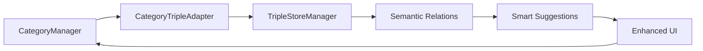

# 🔗 Integração Sistema de Categorias com Triplas Semânticas

## 🎯 Visão Estratégica

O sistema atual possui **CategoryManager** que gerencia categorias de forma hierárquica simples. Com as triplas semânticas, transformaremos categorias em **nós de conhecimento interconectados**, criando uma rede semântica rica.

## 📊 Estado Atual vs. Visão Futura

### Sistema Atual (CategoryManager)
```javascript
categorias = [
    { id: 1, name: "Projetos", color: "#FF5733", count: 45 },
    { id: 2, name: "Ideias", color: "#33FF57", count: 23 },
    { id: 3, name: "Referências", color: "#3357FF", count: 67 }
]
```

### Sistema com Triplas Semânticas
```javascript
// Categoria como nó de conhecimento
{
    legado: "categoria_projetos",
    presente: "contém",
    objetivo: "arquivo_projeto_x.md"
}

// Relações entre categorias
{
    legado: "categoria_ideias",
    presente: "evoluiPara",
    objetivo: "categoria_projetos"
}

// Hierarquia semântica
{
    legado: "categoria_projetos",
    presente: "temSubcategoria",
    objetivo: "categoria_projetos_web"
}
```

## 🛠️ Plano de Integração

### Fase 1: Preservar + Expandir

**Objetivo**: Manter CategoryManager funcionando enquanto adiciona camada de triplas

1. **Criar CategoryTripleAdapter.js**
   ```javascript
   class CategoryTripleAdapter {
       // Converte categorias em triplas
       categoryToTriples(category, files) {
           const triples = [];
           
           // Relação categoria -> arquivos
           files.forEach(file => {
               if (file.categories?.includes(category.id)) {
                   triples.push({
                       legado: `categoria_${category.name}`,
                       presente: "contém",
                       objetivo: file.name,
                       metadata: {
                           categoryId: category.id,
                           fileId: file.id,
                           timestamp: Date.now()
                       }
                   });
               }
           });
           
           return triples;
       }
       
       // Sugere relações entre categorias
       suggestCategoryRelations(categories) {
           const suggestions = [];
           
           // Análise de co-ocorrência
           categories.forEach(cat1 => {
               categories.forEach(cat2 => {
                   if (cat1.id !== cat2.id) {
                       const similarity = this.calculateSimilarity(cat1, cat2);
                       if (similarity > 0.7) {
                           suggestions.push({
                               legado: `categoria_${cat1.name}`,
                               presente: "relacionadaCom",
                               objetivo: `categoria_${cat2.name}`,
                               confianca: similarity
                           });
                       }
                   }
               });
           });
           
           return suggestions;
       }
   }
   ```

2. **Modificar CategoryManager minimamente**
   ```javascript
   // Adicionar ao CategoryManager existente
   async generateTriples() {
       const adapter = new CategoryTripleAdapter();
       const files = KC.AppState.get('files') || [];
       const allTriples = [];
       
       this.categories.forEach(category => {
           const triples = adapter.categoryToTriples(category, files);
           allTriples.push(...triples);
       });
       
       // Armazenar no TripleStore
       KC.TripleStoreManager.addTriples(allTriples);
       
       // Emitir evento
       KC.EventBus.emit(KC.Events.CATEGORY_TRIPLES_GENERATED, {
           count: allTriples.length
       });
   }
   ```

### Fase 2: Enriquecer Interface

**Objetivo**: Adicionar visualização de relações sem quebrar UI atual

1. **Criar CategoryRelationshipView.js**
   ```javascript
   class CategoryRelationshipView {
       renderRelations(categoryId) {
           const triples = KC.TripleStoreManager.query({
               legado: `categoria_*`,
               relacionadoCom: categoryId
           });
           
           return `
               <div class="category-relations">
                   <h4>🔗 Relações Descobertas</h4>
                   ${triples.map(t => `
                       <div class="relation-item">
                           <span>${t.legado}</span>
                           <span class="relation-type">${t.presente}</span>
                           <span>${t.objetivo}</span>
                       </div>
                   `).join('')}
               </div>
           `;
       }
   }
   ```

2. **Expandir StatsPanel**
   - Adicionar aba "Relações"
   - Mostrar grafo de categorias
   - Métricas de conectividade

### Fase 3: Inteligência Contextual

**Objetivo**: Usar triplas para sugestões inteligentes

1. **Sistema de Sugestões**
   ```javascript
   class CategorySuggestionEngine {
       suggestCategoryForFile(file) {
           // Buscar arquivos similares
           const similarFiles = this.findSimilarFiles(file);
           
           // Analisar categorias desses arquivos
           const categoryPatterns = this.extractCategoryPatterns(similarFiles);
           
           // Gerar triplas de sugestão
           return {
               legado: file.name,
               presente: "deveriaTerCategoria",
               objetivo: categoryPatterns.topCategory,
               confianca: categoryPatterns.confidence,
               razao: categoryPatterns.reason
           };
       }
   }
   ```

2. **Auto-organização**
   - Detectar categorias redundantes
   - Sugerir fusões/divisões
   - Criar hierarquias automáticas

## 📊 Benefícios da Integração

### 1. **Preservação Total**
- CategoryManager continua funcionando
- Nenhuma quebra de funcionalidade
- Migração gradual e segura

### 2. **Enriquecimento Semântico**
- Categorias ganham contexto
- Relações descobertas automaticamente
- Sugestões inteligentes

### 3. **Preparação para RAG**
```javascript
// Export enriquecido para Qdrant
{
    "id": "doc_123",
    "vector": [0.1, 0.2, ...],
    "payload": {
        "categories": ["Projetos", "IA"],
        "semantic_relations": [
            {
                "type": "parteDeProjeto",
                "target": "knowledge-consolidator",
                "strength": 0.95
            }
        ],
        "category_hierarchy": {
            "path": "/Projetos/IA/NLP",
            "depth": 3,
            "siblings": ["ML", "CV"]
        }
    }
}
```

## 🔄 Fluxo de Implementação



## 📅 Timeline Estimada

1. **Dia 1-2**: Implementar CategoryTripleAdapter
2. **Dia 3-4**: Integrar com CategoryManager (preservando tudo)
3. **Dia 5-6**: Criar visualizações de relações
4. **Dia 7-8**: Sistema de sugestões inteligentes
5. **Dia 9-10**: Testes e refinamentos

## 🎯 Métricas de Sucesso

1. **Compatibilidade**: 100% funcionalidades preservadas
2. **Enriquecimento**: +200% relações descobertas
3. **Automação**: 80% categorização automática
4. **Performance**: <50ms para sugestões

## 🚀 Próximos Passos

1. Implementar CategoryTripleAdapter.js
2. Adicionar método generateTriples() ao CategoryManager
3. Criar testes de integração
4. Expandir UI gradualmente

Este plano garante evolução sem ruptura, agregando valor imediato ao sistema existente.