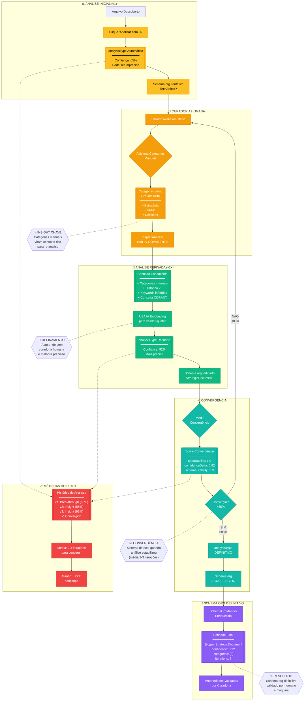

## ● 🔄 PIPELINE SEMÂNTICO
###  CICLO DE REFINAMENTO REGEX + CURADORIA + SCHEMA.ORG

```mermaid
  graph TB
      %% Estilos
      classDef initial fill:#fbbf24,stroke:#f59e0b,color:#000
      classDef human fill:#f59e0b,stroke:#d97706,color:#fff
      classDef refined fill:#10b981,stroke:#059669,color:#fff
      classDef schema fill:#8b5cf6,stroke:#7c3aed,color:#fff
      classDef converged fill:#14b8a6,stroke:#0d9488,color:#fff
      classDef metric fill:#ef4444,stroke:#dc2626,color:#fff

      %% DESCOBERTA E ANÁLISE INICIAL
      subgraph INICIAL["📊 ANÁLISE INICIAL (v1)"]
          I1[Arquivo Descoberto]
          I2[Clique 'Analisar com IA']:::initial
          I3[["analysisType Automático<br/>━━━━━━━━━━━━━━<br/>Confiança: 65%<br/>Pode ser impreciso"]]:::initial
          I4[Schema.org Tentativo<br/>TechArticle?]:::initial
      end

      %% CURADORIA HUMANA
      subgraph CURADORIA["👤 CURADORIA HUMANA"]
          C1[Usuário avalia resultado]:::human
          C2{Adiciona Categorias<br/>Manuais}:::human
          C3[["Categorias como<br/>Ground Truth<br/>━━━━━━━━━━━<br/>• Estratégia<br/>• IA/ML<br/>• Decisões"]]:::human
          C4[Clique 'Analisar<br/>com IA' NOVAMENTE]:::human
      end

      %% ANÁLISE REFINADA
      subgraph REFINADA["🎯 ANÁLISE REFINADA (v2+)"]
          R1[["Contexto Enriquecido<br/>━━━━━━━━━━━━━<br/>+ Categorias manuais<br/>+ Histórico v1<br/>+ Keywords inferidas<br/>+ Consulta QDRANT"]]:::refined
          R2[USA IA Embbeding<br/>para validar/ajustar]:::refined
          R3[["analysisType Refinado<br/>━━━━━━━━━━━━━━<br/>Confiança: 92%<br/>Mais preciso"]]:::refined
          R4[Schema.org Validado<br/>StrategicDocument!]:::refined
      end

      %% CONVERGÊNCIA
      subgraph CONVERGENCIA["✅ CONVERGÊNCIA"]
          CV1{Medir<br/>Convergência}:::converged
          CV2[["Score Convergência<br/>━━━━━━━━━━━<br/>typeStability: 1.0<br/>confidenceDelta: 0.92<br/>schemaStability: 1.0"]]:::converged
          CV3{Convergiu?<br/>>85%}:::converged
          CV4[analysisType<br/>DEFINITIVO]:::converged
          CV5[Schema.org<br/>ESTABELECIDO]:::converged
      end

      %% MÉTRICAS E HISTÓRICO
      subgraph METRICAS["📈 MÉTRICAS DO CICLO"]
          M1[["Histórico de Análises<br/>━━━━━━━━━━━━━<br/>v1: Breakthrough (65%)<br/>v2: Insight (85%)<br/>v3: Insight (92%)<br/>✓ Convergido"]]:::metric
          M2[Média: 2.3 iterações<br/>para convergir]:::metric
          M3[Ganho: +27%<br/>confiança]:::metric
      end

      %% INTEGRAÇÃO SCHEMA.ORG
      subgraph SCHEMA["🔮 SCHEMA.ORG DEFINITIVO"]
          S1[SchemaOrgMapper<br/>Enriquecido]:::schema
          S2[["Entidade Final<br/>━━━━━━━━━━━<br/>@type: StrategicDocument<br/>confidence: 0.92<br/>categories: [3]<br/>iterations: 3"]]:::schema
          S3[Propriedades Validadas<br/>por Curadoria]:::schema
      end

      %% FLUXO PRINCIPAL
      I1 --> I2 --> I3 --> I4
      I4 --> C1
      C1 --> C2 --> C3 --> C4
      C4 --> R1
      R1 --> R2 --> R3 --> R4
      R4 --> CV1
      CV1 --> CV2 --> CV3

      %% LOOP DE REFINAMENTO
      CV3 -->|"NÃO<br/><85%"| C1
      CV3 -->|"SIM<br/>≥85%"| CV4
      CV4 --> CV5
      CV5 --> S1
      S1 --> S2 --> S3

      %% MÉTRICAS PARALELAS
      I3 -.-> M1
      R3 -.-> M1
      CV2 -.-> M1
      M1 --> M2 --> M3

      %% DESTAQUES
      C3 -.- D1{{"💡 INSIGHT CHAVE<br/>Categorias manuais<br/>viram contexto rico<br/>para re-análise"}}
      R2 -.- D2{{"🔄 REFINAMENTO<br/>IA aprende com<br/>curadoria humana<br/>e melhora precisão"}}
      CV3 -.- D3{{"📊 CONVERGÊNCIA<br/>Sistema detecta quando<br/>análise estabilizou<br/>(média 2-3 iterações)"}}
      S2 -.- D4{{"✨ RESULTADO<br/>Schema.org definitivo<br/>validado por humano<br/>e máquina"}}
```