Vou criar um diagrama Mermaid que represente visualmente a estrutura de diretórios e arquivos principais que analisamos.

```mermaid
graph TD
    root["F:\site_vps"] --> docker["docker-configs"]
    root --> legacy["legacy"]
    root --> logs["logs"]
    root --> mcp["mcp-servers"]
    root --> n8n["n8n-workflows"]
    root --> scripts["scripts"]
    root --> templates["templates"]
    
    docker --> dc["docker-compose.yml"]
    
    logs --> testlog["test.log"]
    
    legacy --> historico["Historico"]
    legacy --> sitenovo["sitenovo"]
    legacy --> website["WebSite"]
    
    historico --> fase1["fase1-plano-implementacao-mcp.md"]
    
    sitenovo --> canvas1["Canvas - Offer - bundle.txt"]
    sitenovo --> canvas2["Canvas - Offer - prompt.txt"]
    sitenovo --> md["conduza-uma-busca-para-obter-m-x6GUxPzKSaOcpTTx2hwV9A.md"]
    sitenovo --> css["css/"]
    sitenovo --> filters["filters_quality(100).avif"]
    sitenovo --> mode["mode-selector.json"]
    sitenovo --> perp["perplexity-header.avif"]
    sitenovo --> prd1["prd-landing-page.txt"]
    sitenovo --> prd2["prd-manifest-briefing.txt"]
    sitenovo --> oferta["vcia_oferta1.txt"]
    
    css --> buzz["buzz lighter background.txt"]
    css --> div["div.txt"]
    css --> grid["grid-portfolio-galleryTrippy Squares – Left to Right Wave.txt"]
    css --> haml["haml.txt"]
    css --> htmldiv["html div.txt"]
    css --> menu["menu.js.txt"]
    css --> border["Pure CSS Border Animation without S.txt"]
    
    website --> jpeg["2.jpeg"]
    website --> png["filters_quality(100).PNG"]
    website --> video["Noir_Animation_Chaos_to_Clarity.mp4"]
    website --> vect["vcia_vect.jpg"]
```

Criei um artefato com um diagrama Mermaid que representa visualmente a estrutura de diretórios e arquivos do sistema. Este diagrama oferece uma visão hierárquica clara da organização dos arquivos.

### Análise da Estrutura

O diagrama mostra:

1. **Estrutura Principal**: O diretório raiz `F:\site_vps` contém 7 subdiretórios principais, organizados para diferentes funcionalidades do sistema.
    
2. **Componentes Principais**:
    
    - **docker-configs**: Configurações para Docker
    - **legacy**: Contém arquivos e projetos antigos/legados
    - **logs**: Armazenamento de arquivos de log (incluindo o test.log que criamos)
    - **mcp-servers**: Configurações específicas para servidores MCP
    - **n8n-workflows**: Fluxos de trabalho para automação low-code
    - **scripts**: Scripts de sistema
    - **templates**: Templates para o site
3. **Área Legacy**: Esta área é particularmente interessante, dividida em:
    
    - **Historico**: Documentação do plano de implementação MCP
    - **sitenovo**: Arquivos de desenvolvimento para o novo site, incluindo PRDs, recursos visuais e CSS
    - **WebSite**: Recursos de mídia, provavelmente para o site atual

Este mapeamento visual permite identificar rapidamente onde estão os principais recursos do sistema e entender a organização global do projeto.