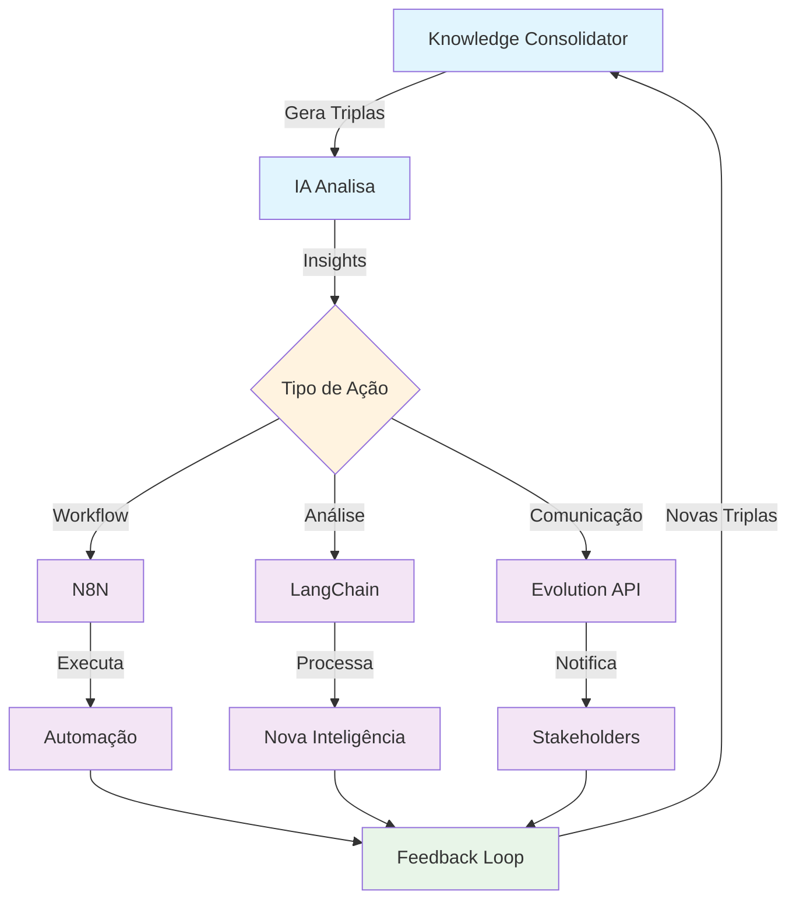

● 🏗️ Análise Arquitetural - Próximos Passos do Knowledge Consolidator

  📊 Architecture Analysis

  Estado Atual do Sistema

  O Knowledge Consolidator completou com sucesso as sprints fundamentais:
  - Sprint 1.1-1.2: Infraestrutura base e pré-análise local ✅
  - Sprint 1.3: Sistema de IA multi-provider operacional ✅
  - Sprint 1.3.2: Pipeline de consolidação RAG implementado ✅

  Análise de Maturidade

  Descoberta [████████████████████] 100% - File System Access API
  Pré-Análise [████████████████████] 100% - PreviewUtils + Filtros
  Análise IA  [████████████████████] 100% - Multi-provider + Templates
  Consolidação [████████████░░░░░░░] 70% - Pipeline RAG (falta embeddings)
  Exportação  [████████░░░░░░░░░░░░] 40% - Schema Qdrant (falta UI)
  Integração  [░░░░░░░░░░░░░░░░░░░░] 0% - RAG Stack pendente

  Gaps Identificados

  1. BUG #6 Crítico: Resposta vazia do Ollama impedindo análise real
  2. Falta de Embeddings: Pipeline preparado mas sem vetorização
  3. UI de Exportação: Etapa 4 sem interface implementada
  4. Integração RAG: Qdrant, N8N, busca semântica pendentes

  🎯 Design Recommendations

  Arquitetura Proposta para Sprint 2.0

  graph TB
      subgraph "Sprint 2.0 - Embeddings & Export"
          A[EmbeddingManager] --> B[Multi-Provider Embeddings]
          B --> C[Ollama Embeddings]
          B --> D[OpenAI Embeddings]
          B --> E[Cache Local]

          F[ExportUI] --> G[Modal Exportação]
          G --> H[Preview Dados]
          G --> I[Configuração Export]
          G --> J[Progress Tracking]
      end

      subgraph "Sprint 2.1 - Integração Qdrant"
          K[QdrantClient] --> L[Upload Batch]
          L --> M[Collection Manager]
          L --> N[Index Optimizer]

          O[SearchInterface] --> P[Query Builder]
          P --> Q[Semantic Search]
          P --> R[Hybrid Search]
      end

  Priorização Estratégica

  🔴 Fase 1: Correções Críticas (1-2 dias)

  1. Resolver BUG #6 - Ollama resposta vazia
    - Investigar parâmetros do modelo
    - Implementar fallback robusto
    - Validar com múltiplos modelos
  2. UI de Exportação - Completar Etapa 4
    - Botão "Exportar para RAG"
    - Modal com preview e opções
    - Feedback visual do processo

  🟡 Fase 2: Embeddings (3-5 dias)

  3. EmbeddingManager - Novo componente
  KC.EmbeddingManager = {
      providers: ['ollama', 'openai', 'transformers.js'],
      generateEmbeddings(chunks, provider),
      batchProcess(chunks, batchSize),
      cacheEmbeddings(embeddings)
  }
  4. Integração Local-First
    - Ollama embeddings prioritário
    - Cache local para performance
    - Fallback para cloud se necessário

  🟢 Fase 3: RAG Stack (5-7 dias)

  5. Qdrant Integration
    - Cliente JavaScript
    - Upload em batches
    - Gestão de collections
  6. Interface de Busca
    - UI de busca semântica
    - Filtros avançados
    - Visualização de resultados

  💡 Technology Guidance

  Stack Recomendado para Sprint 2.0

  | Componente        | Tecnologia                    | Rationale                                |
  |-------------------|-------------------------------|------------------------------------------|
  | Embeddings Locais | Ollama + nomic-embed-text     | Privacidade, sem custos, 384D compatível |
  | Embeddings Cloud  | OpenAI text-embedding-3-small | Backup, qualidade superior, 1536D        |
  | Cache             | IndexedDB                     | Maior capacidade que localStorage        |
  | Vector DB         | Qdrant Cloud/Local            | Open source, REST API, filtros híbridos  |
  | Orquestração      | N8N                           | Visual workflows, integração fácil       |
  | Frontend Search   | Vanilla JS + Web Components   | Consistência com arquitetura atual       |

  Decisões Arquiteturais

  ADR-001: Embeddings Local-First
  - Contexto: Privacidade e custos são críticos
  - Decisão: Ollama como provider primário
  - Alternativas: OpenAI apenas como fallback
  - Consequências: Menor qualidade mas maior controle

  ADR-002: Progressive Enhancement
  - Contexto: Sistema deve funcionar incrementalmente
  - Decisão: Cada fase adiciona valor independente
  - Alternativas: Big bang deployment
  - Consequências: Valor entregue continuamente

  📈 Implementation Strategy

  Sprint 2.0: Foundation (2 semanas)

  Semana 1:
  ├── Seg-Ter: Resolver BUG #6 + Testes
  ├── Qua-Qui: UI Exportação (Etapa 4)
  └── Sex: EmbeddingManager base

  Semana 2:
  ├── Seg-Ter: Ollama embeddings
  ├── Qua-Qui: Cache + optimizações
  └── Sex: Testes integrados

  Sprint 2.1: Integration (2 semanas)

  Semana 3:
  ├── QdrantClient.js
  ├── Upload pipeline
  └── Collection management

  Semana 4:
  ├── Search UI
  ├── Query builder
  └── Result visualization

  Métricas de Sucesso

  - ✅ 100% arquivos com embeddings gerados
  - ✅ < 2s para busca semântica
  - ✅ Zero falhas de exportação
  - ✅ UI responsiva e intuitiva

  🚀 Next Actions

  Imediato (Próximos 3 dias)

  1. Criar Issue Tracker
  ## Sprint 2.0 - Embeddings & Export
  - [ ] #001: Fix Ollama empty response (BUG #6)
  - [ ] #002: Export UI component
  - [ ] #003: EmbeddingManager architecture
  2. Proof of Concept - Embeddings
  // Testar viabilidade com Ollama
  const test = await fetch('http://localhost:11434/api/embeddings', {
      method: 'POST',
      body: JSON.stringify({
          model: 'nomic-embed-text',
          prompt: 'test content'
      })
  });
  3. Design Mockup - Export UI
    - Wireframe do modal
    - Fluxo de exportação
    - Estados de loading/erro

  Validação Arquitetural

  - Code Review: Pipeline RAG atual
  - Performance Test: Chunking com 1000+ arquivos
  - Security Audit: API keys e dados sensíveis
  - UX Review: Fluxo de exportação

  Dependências Críticas

  1. Ollama instalado e funcional
  2. Qdrant instance (cloud ou local)
  3. Storage para embeddings cache
  4. Documentação de APIs atualizada

  📋 Resumo Executivo

  O Knowledge Consolidator está arquiteturalmente sólido e pronto para evolução. A prioridade é:

  1. Corrigir bloqueadores (BUG #6)
  2. Completar UI (Exportação)
  3. Adicionar embeddings (Local-first)
  4. Integrar RAG stack (Qdrant + Search)

  A abordagem incremental garante valor contínuo e reduz riscos. O foco em soluções locais (Ollama) mantém privacidade e controle, com cloud como backup.

  Tempo estimado: 4-6 semanas para RAG completo e funcional.

🎯 Fluxo Completo: Do Insight à Ação

