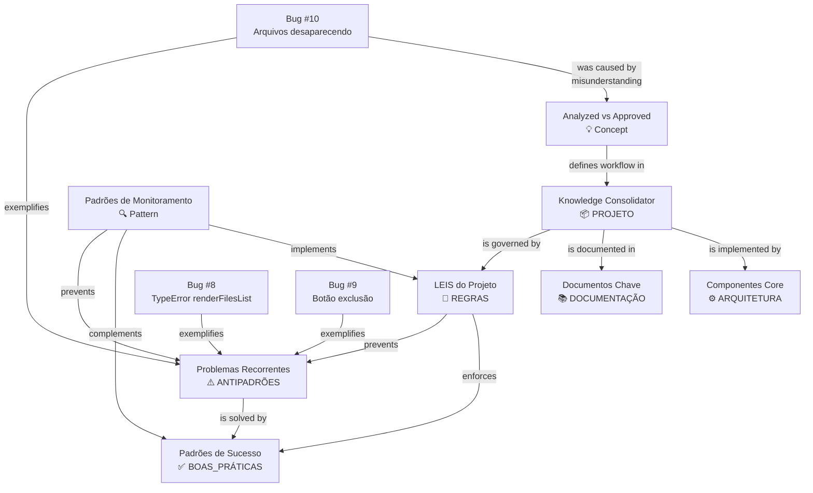
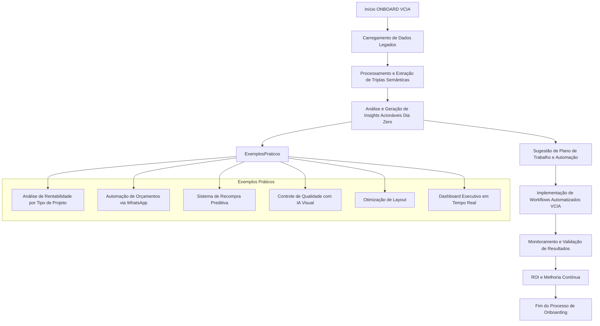

```mermaid
 graph TD
      KC[Knowledge Consolidator<br/>📦 PROJETO]

      %% Nível 1 - Governança
      KC -->|is governed by| LEIS[LEIS do Projeto<br/>📜 REGRAS]
      KC -->|is documented in| DOCS[Documentos Chave<br/>📚 DOCUMENTAÇÃO]
      KC -->|is implemented by| COMP[Componentes Core<br/>⚙️ ARQUITETURA]

      %% Nível 2 - Relações das LEIS
      LEIS -->|prevents| PROB[Problemas Recorrentes<br/>⚠️ ANTIPADRÕES]
      LEIS -->|enforces| PADR[Padrões de Sucesso<br/>✅ BOAS_PRÁTICAS]

      %% Nível 3 - Soluções
      PROB -->|is solved by| PADR

      %% Bugs específicos
      BUG8[Bug #8<br/>TypeError renderFilesList]
      BUG9[Bug #9<br/>Botão exclusão]
      BUG10[Bug #10<br/>Arquivos desaparecendo]

      BUG8 -->|exemplifies| PROB
      BUG9 -->|exemplifies| PROB
      BUG10 -->|exemplifies| PROB

      %% Conceito importante
      CONCEPT[Analyzed vs Approved<br/>💡 Concept]
      BUG10 -->|was caused by<br/>misunderstanding| CONCEPT
      CONCEPT -->|defines workflow in| KC

      %% Monitoramento
      MON[Padrões de Monitoramento<br/>🔍 Pattern]
      MON -->|prevents| PROB
      MON -->|complements| PADR
      MON -->|implements| LEIS
```

```mermaid
flowchart TD
    A[Início ONBOARD VCIA] --> B[Carregamento de Dados Legados]
    B --> C[Processamento e Extração de Triplas Semânticas]
    C --> D[Análise e Geração de Insights Acionáveis Dia Zero]
    D --> E[Sugestão de Plano de Trabalho e Automação]
    E --> F[Implementação de Workflows Automatizados VCIA]
    F --> G[Monitoramento e Validação de Resultados]
    G --> H[ROI e Melhoria Contínua]
    H --> I[Fim do Processo de Onboarding]
    
    subgraph Exemplos Práticos
    E1[Análise de Rentabilidade por Tipo de Projeto]
    E2[Automação de Orçamentos via WhatsApp]
    E3[Sistema de Recompra Preditiva]
    E4[Controle de Qualidade com IA Visual]
    E5[Otimização de Layout]
    E6[Dashboard Executivo em Tempo Real]
    end
    
    D --> ExemplosPraticos
    ExemplosPraticos --> E1
    ExemplosPraticos --> E2
    ExemplosPraticos --> E3
    ExemplosPraticos --> E4
    ExemplosPraticos --> E5
    ExemplosPraticos --> E6

```
