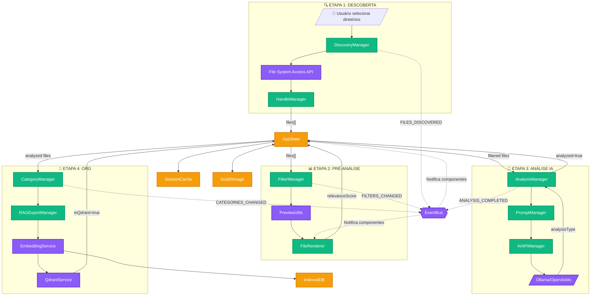
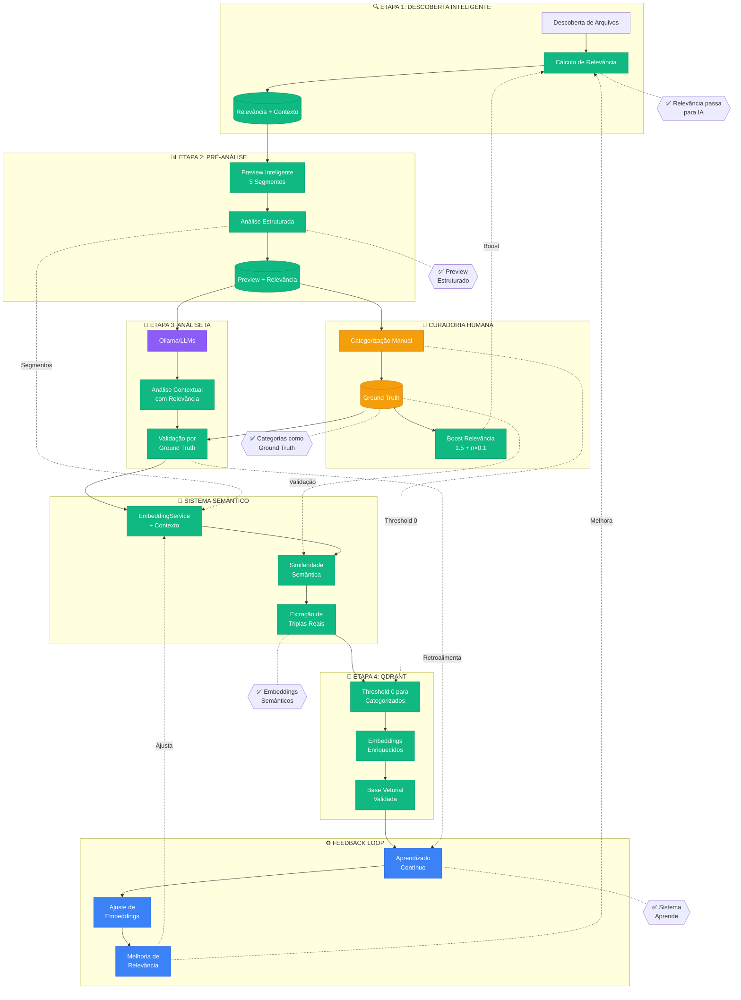
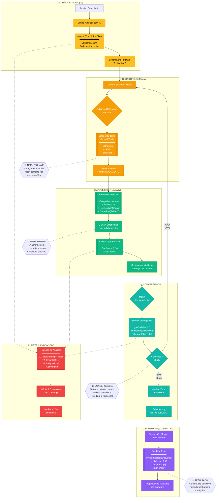

---
## 🔄 PIPELINE DE INTEGRAÇÃO IA CORRIGIDO
### REGEX

## 🔄 PIPELINE SEMÂNTICO COM SCHEMA.ORG
### Semantico com Schema.org

```mermaid

  graph TB
      %% Estilos
      classDef human fill:#f59e0b,stroke:#d97706,color:#fff
      classDef schema fill:#8b5cf6,stroke:#7c3aed,color:#fff
      classDef semantic fill:#10b981,stroke:#059669,color:#fff
      classDef cache fill:#3b82f6,stroke:#2563eb,color:#fff
      classDef hybrid fill:#ef4444,stroke:#dc2626,color:#fff
      classDef knowledge fill:#14b8a6,stroke:#0d9488,color:#fff

      %% ETAPA 1: DESCOBERTA E CURADORIA
      subgraph E1["🔍 DESCOBERTA + CURADORIA HUMANA"]
          D1[Arquivos Descobertos]
          D2[Usuário clica<br/>'Analisar com IA']:::human
          D3[Sistema detecta<br/>analysisType]:::human
          D4{{"5 Tipos de Análise<br/>• Breakthrough Técnico<br/>• Evolução Conceitual<br/>• Momento Decisivo<br/>• Insight Estratégico<br/>• Aprendizado Geral"}}:::human      
      end

      %% ETAPA 2: MAPEAMENTO SCHEMA.ORG
      subgraph E2["🔮 TRANSFORMAÇÃO SCHEMA.ORG"]
          S1[SchemaOrgMapper]:::schema
          S2[["Mapeamento Semântico<br/>━━━━━━━━━━━━━━━━<br/>Breakthrough → TechArticle<br/>Evolução → ScholarlyArticle<br/>Momento → Event<br/>Insight →
  Report<br/>Aprendizado → Article"]]:::schema
          S3[Propriedades Ricas<br/>author, mentions,<br/>potentialAction,<br/>dependencies]:::schema
      end

      %% ETAPA 3: EXTRAÇÃO SEMÂNTICA
      subgraph E3["🧠 EXTRAÇÃO DE ENTIDADES"]
          EX1[SchemaOrgExtractor]:::semantic
          EX2[Entidades Tipadas<br/>Person, Organization,<br/>Technology, Concept]:::semantic
          EX3[Relações Contextualizadas<br/>isBasedOn, mentions,<br/>teaches, requires]:::semantic
          EX4[Embeddings Enriquecidos<br/>com Contexto Schema.org]:::semantic
      end

      %% SISTEMA HÍBRIDO
      subgraph SH["⚡ SISTEMA HÍBRIDO"]
          H1{Query Router}:::hybrid
          H2["Regex Engine<br/>15-50ms<br/>65% precisão"]:::hybrid
          H3["Schema.org Engine<br/>8-15ms (cached)<br/>89% precisão"]:::hybrid
          H4[["Cache 3 Camadas<br/>━━━━━━━━━━━<br/>L1: Memória<br/>L2: IndexedDB<br/>L3: Redis"]]:::cache
      end

      %% ETAPA 4: INDEXAÇÃO E BUSCA
      subgraph E4["📊 QDRANT + QUERIES SEMÂNTICAS"]
          Q1[Índices Schema.org<br/>@type, author.name,<br/>mentions.technology]:::semantic
          Q2[["Queries Impossíveis Antes<br/>━━━━━━━━━━━━━━━━━<br/>'TechArticles sobre Redis<br/>com potentialAction'<br/><br/>'Events de 2024 com<br/>result
  positivo'"]]:::semantic
          Q3[Resultados Rankeados<br/>por Relevância Semântica]:::semantic
      end

      %% ETAPA 5: GRAFO DE CONHECIMENTO
      subgraph E5["🌐 GRAFO DE CONHECIMENTO REAL"]
          G1[Clusters por @type]:::knowledge
          G2[Entidades Interconectadas]:::knowledge
          G3[Navegação Semântica<br/>não apenas visual]:::knowledge
          G4[Export JSON-LD<br/>Interoperável]:::knowledge
      end

      %% FLUXO PRINCIPAL
      D1 --> D2 --> D3 --> D4
      D4 --> S1
      S1 --> S2 --> S3
      S3 --> EX1
      EX1 --> EX2
      EX2 --> EX3
      EX3 --> EX4

      %% ROTEAMENTO HÍBRIDO
      EX4 --> H1
      H1 -->|"Simples"| H2
      H1 -->|"Complexa"| H3
      H2 --> H4
      H3 --> H4
      H4 --> Q1

      %% INDEXAÇÃO E VISUALIZAÇÃO
      Q1 --> Q2 --> Q3
      Q3 --> G1 --> G2 --> G3 --> G4

      %% FEEDBACK LOOPS
      G4 -.->|"Aprendizado"| S1
      Q3 -.->|"Métricas"| H1
      EX4 -.->|"Ground Truth"| S2

      %% DESTAQUES DE TRANSFORMAÇÃO
      D4 -.- T1{{"🔄 TRANSFORMAÇÃO 1<br/>Curadoria humana<br/>vira marca de<br/>qualidade semântica"}}
      S2 -.- T2{{"🔄 TRANSFORMAÇÃO 2<br/>Types genéricos viram<br/>ontologia Schema.org<br/>padronizada"}}
      EX3 -.- T3{{"🔄 TRANSFORMAÇÃO 3<br/>Regex patterns viram<br/>entidades e relações<br/>estruturadas"}}
      Q2 -.- T4{{"🔄 TRANSFORMAÇÃO 4<br/>Busca por palavras<br/>vira queries<br/>semânticas ricas"}}
      G3 -.- T5{{"🔄 TRANSFORMAÇÃO 5<br/>Visualização estática<br/>vira grafo navegável<br/>de conhecimento"}}
```

## ● 🔄 PIPELINE SEMÂNTICO
###  CICLO DE REFINAMENTO REGEX + CURADORIA + SCHEMA.ORG

