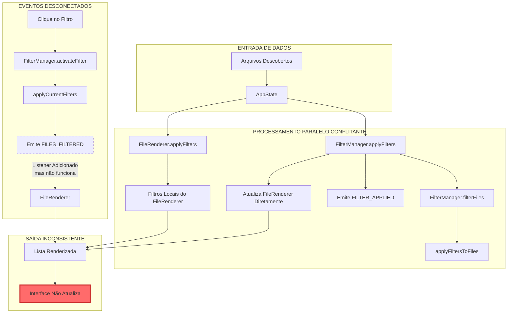
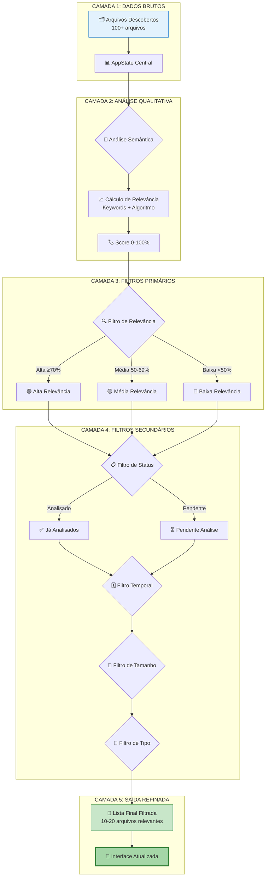
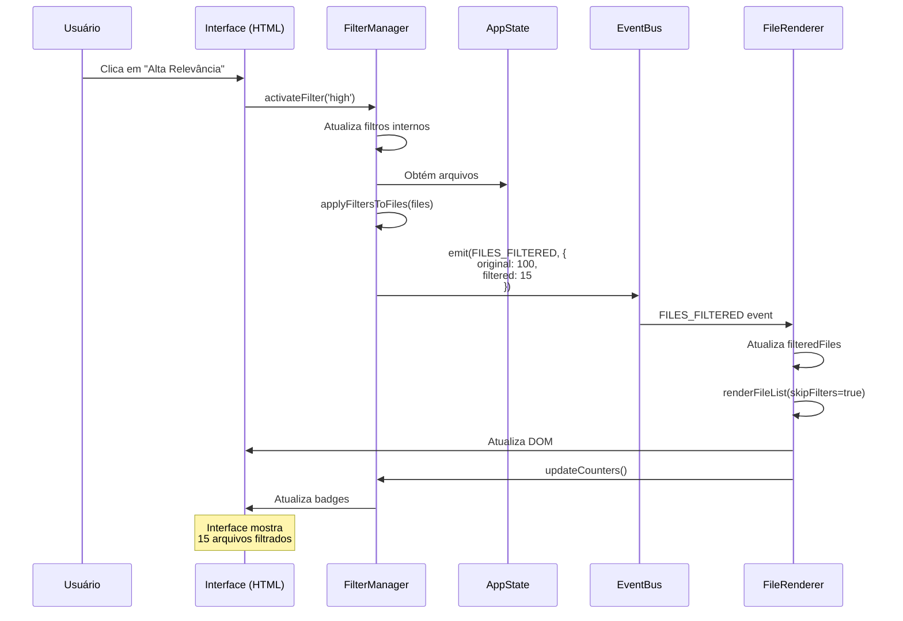
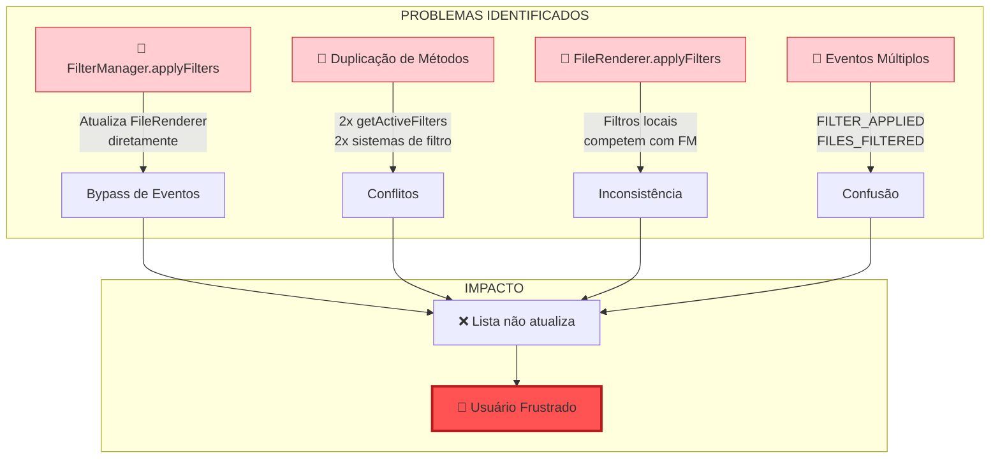
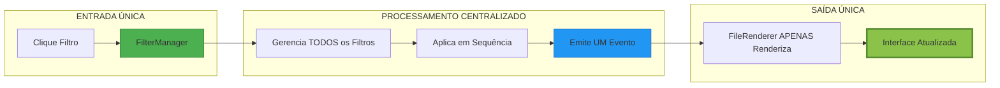

# 📋 ARQUIVOS CRIADOS E DIAGRAMAS DE FLUXO DE FILTROS
**Data:** 10/07/2025
**Versão:** 1.0
**Status:** Documentação de Arquivos e Análise de Fluxo
---
## 📂 ARQUIVOS CRIADOS CONFORME REQUISIÇÃO
### 1. **Documentação Principal**
- ✅ `/docs/sprint/1.2/blueprint-etapa2-preanalise.md`
  - Análise FACTUAL completa dos componentes da Etapa 2
  - Mapeamento de componentes Qualitativos e Quantitativos
  - Estado atual de implementação
  - Correlação entre componentes
### 2. **Documentação de Correções**
- ✅ `/docs/sprint/1.2/diagnostico-inicial.md`
  - Investigação das causas raiz dos problemas
  - Identificação de componentes afetados
- ✅ `/docs/sprint/1.2/correcao-relevancia.md`
  - Documentação da correção do cálculo de relevância
  - Status: CONCLUÍDO ✅
- ❌ `/docs/sprint/1.2/correcao-filtros-fase3.md`
  - Tentativa de correção dos filtros
  - Status: FALHOU ❌
  - Documenta problemas encontrados e lições aprendidas
### 3. **Arquivos de Teste**
- ✅ `/test-filters.html`
  - Interface básica para teste de filtros
  - Simula eventos e monitora resultados
- ✅ `/test-filter-debug.html`
  - Ferramenta completa de diagnóstico
  - Verificação de componentes
  - Monitoramento de eventos em tempo real
  - Teste isolado de filtros
### 4. **Planos e Estratégias**
- ✅ `/docs/sprint/1.2/1.2-plano-mitigacao.md`
  - Plano detalhado de correção em 8 fases
  - Cronograma e métricas de sucesso
---
## 🔄 DIAGRAMA 1: FLUXO ATUAL (PROBLEMÁTICO)

**Problemas Identificados:**
1. Múltiplos caminhos paralelos tentando atualizar a mesma lista
2. Eventos sendo emitidos mas não processados corretamente
3. Conflito entre filtros locais e filtros do FilterManager
4. Atualização direta do FileRenderer competindo com eventos
---
## 🎯 DIAGRAMA 2: FLUXO IDEAL (FUNIL DE REFINAMENTO)

**Conceito do Funil:**
- **Entrada**: Centenas de arquivos brutos
- **Refinamento Progressivo**: Cada camada reduz o volume
- **Saída**: Apenas arquivos altamente relevantes
---
## 🔧 DIAGRAMA 3: ARQUITETURA DE EVENTOS CORRETA

**Fluxo Correto:**
1. Um único ponto de entrada (FilterManager)
2. Eventos bem definidos e únicos
3. FileRenderer apenas renderiza, não filtra
4. Feedback visual imediato
---
## 🚨 DIAGRAMA 4: PONTOS DE FALHA ATUAIS

---
## 💡 DIAGRAMA 5: SOLUÇÃO PROPOSTA

**Princípios:**
1. **Single Source of Truth**: FilterManager gerencia TODOS os filtros
2. **Separação de Responsabilidades**: FileRenderer só renderiza
3. **Evento Único**: FILES_FILTERED é o único evento de filtros
4. **Fluxo Unidirecional**: Dados fluem em uma direção apenas
---
## 📊 RESUMO DA ANÁLISE
### Problemas Principais:
1. **Múltiplos sistemas de filtros** competindo
2. **Eventos não conectados** corretamente
3. **Atualização direta** bypassa o sistema de eventos
4. **Duplicação de código** causa conflitos
### Solução Recomendada:
1. **Centralizar** toda lógica de filtros no FilterManager
2. **Remover** filtros locais do FileRenderer
3. **Usar apenas** evento FILES_FILTERED
4. **FileRenderer** deve apenas escutar e renderizar
### Próximos Passos:
1. Refatorar para implementar o Diagrama 5
2. Remover duplicações e conflitos
3. Testar com a ferramenta de debug criada
4. Validar o fluxo do funil (Diagrama 2)
---
**Este documento apresenta a visão completa do problema e a direção para a solução.**