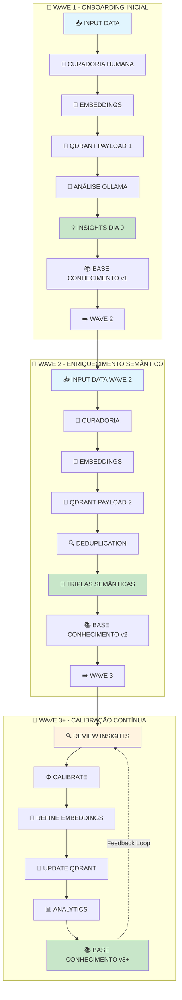
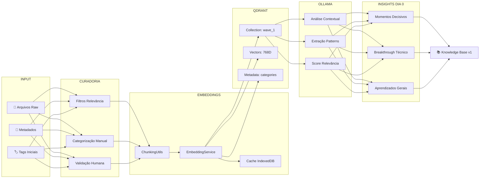
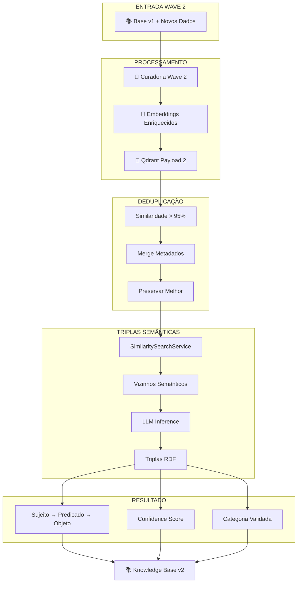
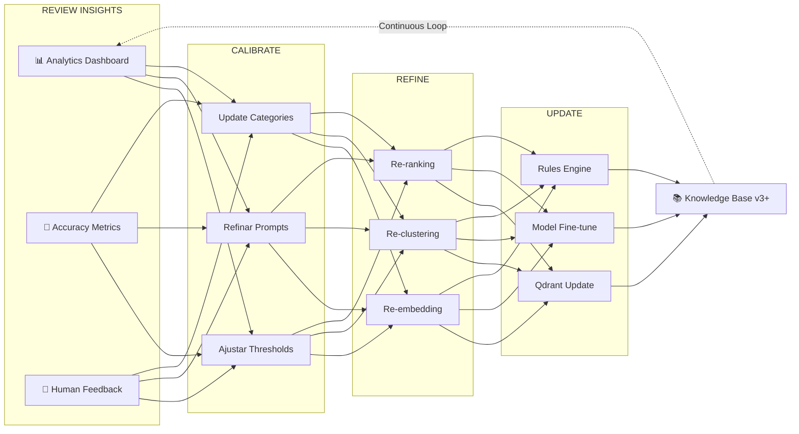
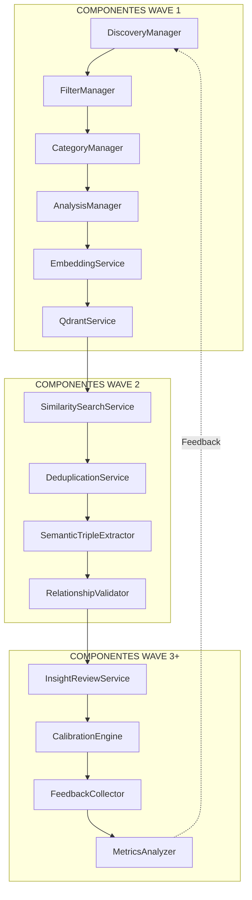

● 🎯 VISUALIZAÇÃO DOS FLUXOS DE TRABALHO

  Entendi perfeitamente! Vou criar os diagramas Mermaid para visualizar os fluxos de trabalho em ondas (waves) do sistema:

  📊 FLUXO COMPLETO - VISÃO GERAL

  
  🌊 WAVE 1 - ONBOARDING DETALHADO

  🌊 WAVE 2 - ENRIQUECIMENTO SEMÂNTICO

  🔄 REVIEW & CALIBRATION - LOOP CONTÍNUO

  
  🏗️ ARQUITETURA TÉCNICA - COMPONENTES POR WAVE

  
  💡 INSIGHTS DO FLUXO

  1. WAVE 1: Foco em captura e categorização inicial
  2. WAVE 2: Enriquecimento semântico e deduplicação
  3. WAVE 3+: Refinamento contínuo baseado em feedback

  Este fluxo permite evolução incremental da base de conhecimento, com cada wave construindo sobre a anterior, criando um sistema cada vez mais inteligente e preciso.
  