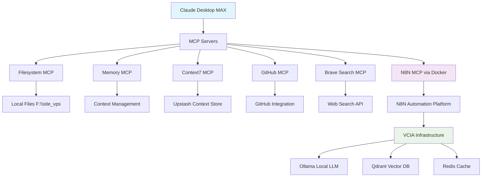
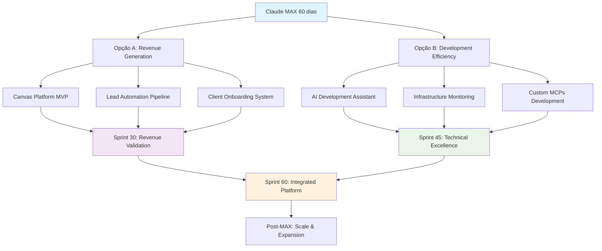

```mermaid
graph TD
    A[Claude Desktop MAX] --> B[MCP Servers]
    B --> C[Filesystem MCP]
    B --> D[Memory MCP]
    B --> E[Context7 MCP]
    B --> F[GitHub MCP]
    B --> G[Brave Search MCP]
    B --> H[N8N MCP via Docker]
    
    C --> I[Local Files F:\\site_vps]
    D --> J[Context Management]
    E --> K[Upstash Context Store]
    F --> L[GitHub Integration]
    G --> M[Web Search API]
    H --> N[N8N Automation Platform]
    
    N --> O[VCIA Infrastructure]
    O --> P[Ollama Local LLM]
    O --> Q[Qdrant Vector DB]
    O --> R[Redis Cache]
    
    style A fill:#e1f5fe
    style H fill:#f3e5f5
    style O fill:#e8f5e8

```

```mermaid
graph TD
    A[Claude MAX 60 dias] --> B[Opção A: Revenue Generation]
    A --> C[Opção B: Development Efficiency]
    
    B --> D[Canvas Platform MVP]
    B --> E[Lead Automation Pipeline]
    B --> F[Client Onboarding System]
    
    C --> G[AI Development Assistant]
    C --> H[Infrastructure Monitoring]
    C --> I[Custom MCPs Development]
    
    D --> J[Sprint 30: Revenue Validation]
    E --> J
    F --> J
    G --> K[Sprint 45: Technical Excellence]
    H --> K
    I --> K
    
    J --> L[Sprint 60: Integrated Platform]
    K --> L
    L --> M[Post-MAX: Scale & Expansion]
    
    style A fill:#e1f5fe
    style J fill:#f3e5f5
    style K fill:#e8f5e8
    style L fill:#fff3e0

```
