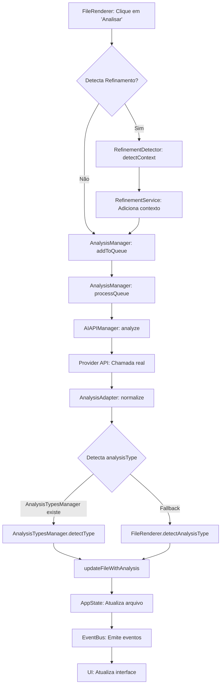

```mermaid
graph TD
    A[FileRenderer: Clique em 'Analisar'] --> B{Detecta Refinamento?}
    B -->|Sim| C[RefinementDetector: detectContext]
    B -->|Não| D[AnalysisManager: addToQueue]
    
    C --> E[RefinementService: Adiciona contexto]
    E --> D
    
    D --> F[AnalysisManager: processQueue]
    F --> G[AIAPIManager: analyze]
    G --> H[Provider API: Chamada real]
    H --> I[AnalysisAdapter: normalize]
    
    I --> J{Detecta analysisType}
    J -->|AnalysisTypesManager existe| K[AnalysisTypesManager.detectType]
    J -->|Fallback| L[FileRenderer.detectAnalysisType]
    
    K --> M[updateFileWithAnalysis]
    L --> M
    
    M --> N[AppState: Atualiza arquivo]
    N --> O[EventBus: Emite eventos]
    O --> P[UI: Atualiza interface]
```
