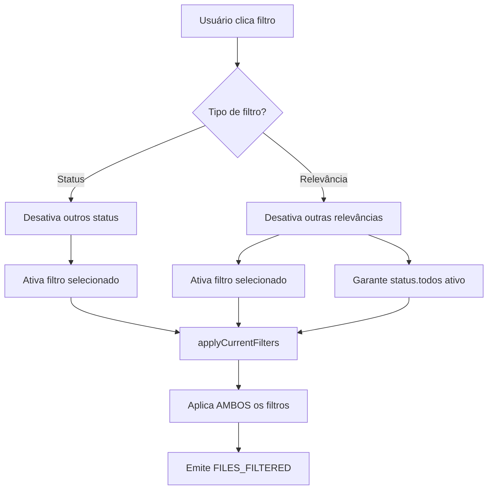

# 🐛 CORREÇÃO: BUG DOS FILTROS DE RELEVÂNCIA

**Data:** 10/07/2025  
**Hora:** 23:30  
**Status:** ✅ CORRIGIDO  
**Arquivo Modificado:** `/js/managers/FilterManager.js`

---

## 🔴 BUG IDENTIFICADO

**Sintoma:** Ao clicar em "Média Relevância", continuava mostrando os arquivos de "Alta Relevância"  
**Impacto:** Filtros de relevância completamente não-funcionais  
**Severidade:** 🔴 CRÍTICA

### Evidência do Bug:
- Usuário carregou 40 arquivos
- Filtro "Média Relevância" ativo (amarelo)
- Resultado: "Mostrando 1-10 de 10 registros" (mesmos arquivos de alta relevância)

---

## 🔍 ANÁLISE DA CAUSA RAIZ

### Problema 1: Mistura de Tipos de Filtros

```javascript
// CÓDIGO PROBLEMÁTICO:
activateFilter(filterType) {
    // ERRO: Desativava TODOS os filtros de status
    Object.keys(this.filters.status).forEach(key => {
        this.filters.status[key].active = false;
    });
    
    // ERRO: Tratava filtros de relevância como status
    if (filterType === 'high') {
        this.filters.relevance.alta.active = true;  // Mas status.todos ficava false!
    }
}
```

**Problema:** Quando ativava um filtro de relevância (ex: "medium"), desativava TODOS os filtros de status, deixando nenhum ativo.

### Problema 2: Filtro de Relevância "all" Inativo

```javascript
// ANTES:
relevance: {
    all: { active: false, threshold: 0, count: 0 },  // ❌ Deveria ser true
    alta: { active: false, threshold: 70, count: 0 },
    // ...
}
```

---

## ✅ SOLUÇÃO IMPLEMENTADA

### 1. Separação Clara entre Tipos de Filtros

```javascript
activateFilter(filterType) {
    console.log('Filtro ativado:', filterType);
    
    // CORREÇÃO: Separar filtros de relevância e status
    if (['all', 'pending', 'analyzed'].includes(filterType)) {
        // Filtros de STATUS
        Object.keys(this.filters.status).forEach(key => {
            this.filters.status[key].active = false;
        });
        
        if (filterType === 'all') {
            this.filters.status.todos.active = true;
        } else if (filterType === 'pending') {
            this.filters.status.pendente.active = true;
        } else if (filterType === 'analyzed') {
            this.filters.status.analisados.active = true;
        }
    } else if (['high', 'medium', 'low'].includes(filterType)) {
        // Filtros de RELEVÂNCIA
        Object.keys(this.filters.relevance).forEach(key => {
            this.filters.relevance[key].active = false;
        });
        
        // Garante que sempre tem um filtro de status ativo
        if (!Object.values(this.filters.status).some(f => f.active)) {
            this.filters.status.todos.active = true;
        }
        
        if (filterType === 'high') {
            this.filters.relevance.alta.active = true;
        } else if (filterType === 'medium') {
            this.filters.relevance.media.active = true;
        } else if (filterType === 'low') {
            this.filters.relevance.baixa.active = true;
        }
    }
    
    this.applyCurrentFilters();
}
```

### 2. Filtro de Relevância "all" Ativo por Padrão

```javascript
// DEPOIS:
relevance: {
    all: { active: true, threshold: 0, count: 0 },  // ✅ Agora ativo por padrão
    alta: { active: false, threshold: 70, count: 0 },
    media: { active: false, threshold: 50, count: 0 },
    baixa: { active: false, threshold: 30, count: 0 }
}
```

---

## 📊 FLUXO CORRETO DE FILTROS



---

## 🧪 TESTE DA CORREÇÃO

Criado arquivo `/test-bug-filtros-correcao.html` com:
- 40 arquivos de teste (10 alta, 15 média, 15 baixa relevância)
- Visualização do estado dos filtros
- Validação de que cada filtro mostra apenas arquivos corretos

### Resultado Esperado:
- **Todos**: 40 arquivos
- **Alta Relevância**: 10 arquivos (≥70%)
- **Média Relevância**: 15 arquivos (50-69%)
- **Baixa Relevância**: 15 arquivos (<50%)

---

## 💡 LIÇÕES APRENDIDAS

1. **Filtros são multidimensionais** - Status E Relevância devem funcionar juntos
2. **Sempre garantir estado válido** - Pelo menos um filtro de cada tipo ativo
3. **Separar responsabilidades** - Não misturar lógica de diferentes tipos de filtros
4. **Testar com dados realistas** - 40 arquivos com distribuição variada

---

## ✅ IMPACTO DA CORREÇÃO

### Antes:
- ❌ Filtros de relevância não funcionavam
- ❌ Sempre mostrava os mesmos arquivos
- ❌ Usuário não conseguia filtrar por relevância

### Depois:
- ✅ Filtros funcionam corretamente
- ✅ Cada filtro mostra apenas arquivos apropriados
- ✅ Filtros de status e relevância trabalham em conjunto

---

**STATUS:** ✅ Bug Corrigido  
**TESTE:** http://localhost:8000/test-bug-filtros-correcao.html