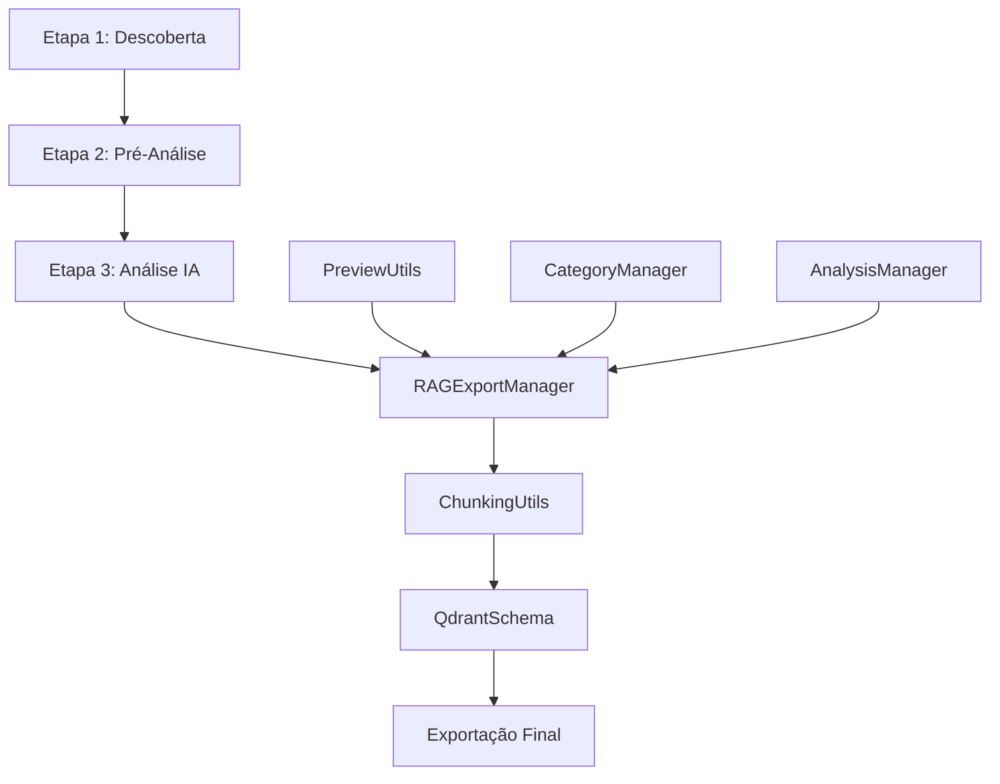

# 📋 Pipeline Completo de Consolidação RAG
## Sistema de Exportação para Retrieval-Augmented Generation

### 📅 Data: 15/01/2025
### 🎯 Sprint: 1.3 - Análise com IA
### 📌 Status: DOCUMENTADO

---

## 🎯 Visão Geral

O pipeline de consolidação RAG implementa um sistema completo de processamento de dados desde a descoberta inicial até a exportação final para o formato Qdrant, preparando os dados para uso em sistemas de Retrieval-Augmented Generation.



---

## 🔧 Componentes do Pipeline

### 1. **RAGExportManager.js** - Orquestrador Principal
**Responsabilidades:**
- Coleta dados aprovados das etapas 1-3
- Enriquece com análise de IA
- Aplica chunking semântico
- Prepara formato de exportação
- Gera embeddings (preparação)

**Principais Métodos:**
```javascript
async consolidateData() {
    // 1. Coleta dados das etapas anteriores
    const approvedData = this._collectApprovedData();
    
    // 2. Enriquece com IA (se disponível)
    const enrichedData = await this._enrichWithAIAnalysis(approvedData);
    
    // 3. Aplica chunking semântico
    const chunkedData = this._applySemanticChunking(enrichedData);
    
    // 4. Prepara formato Qdrant
    const qdrantPoints = this._prepareQdrantFormat(chunkedData);
    
    // 5. Gera estatísticas
    const stats = this._generateExportStats(qdrantPoints);
    
    return { points: qdrantPoints, stats };
}
```

### 2. **ChunkingUtils.js** - Processamento Semântico
**Estratégias de Chunking:**
- **Por Estrutura**: Markdown, listas, plain text
- **Por Densidade Semântica**: Análise de conteúdo relevante
- **Por Contexto**: Preservação de relacionamentos

**Características:**
- Tamanho otimizado: 100-1500 chars (alvo: 512)
- Overlap de 10% entre chunks
- Metadados enriquecidos por chunk
- Preservação de estrutura original

### 3. **QdrantSchema.js** - Estrutura de Dados
**Estrutura do Ponto Qdrant:**
```javascript
{
    id: "uuid-v4",
    vector: Float[384], // Embedding
    payload: {
        file: { /* metadados do arquivo */ },
        chunk: { /* dados do chunk */ },
        analysis: { /* análise semântica */ },
        categorization: { /* categorias e tags */ },
        context: { /* relacionamentos */ },
        rag: { /* otimizações para RAG */ },
        metadata: { /* rastreabilidade */ }
    }
}
```

---

## 📊 Fluxo de Dados Detalhado

### Fase 1: Coleta de Dados Aprovados
```javascript
_collectApprovedData() {
    const files = AppState.get('files') || [];
    return files.filter(file => 
        file.relevanceScore >= filterThreshold &&
        file.categories?.length > 0 &&
        !file.archived
    );
}
```

### Fase 2: Enriquecimento com IA
```javascript
async _enrichWithAIAnalysis(files) {
    for (const file of files) {
        if (!file.aiAnalysis && file.needsAnalysis) {
            const analysis = await AnalysisManager.analyzeFile(file);
            file.aiInsights = analysis.insights;
            file.decisiveMoments = analysis.decisiveMoments;
            file.projectPotential = analysis.projectPotential;
        }
    }
    return files;
}
```

### Fase 3: Chunking Semântico
```javascript
_applySemanticChunking(files) {
    const chunkedFiles = [];
    for (const file of files) {
        const chunks = ChunkingUtils.getSemanticChunks(file.content);
        chunkedFiles.push({
            ...file,
            chunks: chunks.map((chunk, index) => ({
                ...chunk,
                fileId: file.id,
                index,
                metadata: this._enrichChunkMetadata(chunk, file)
            }))
        });
    }
    return chunkedFiles;
}
```

### Fase 4: Preparação Formato Qdrant
```javascript
_prepareQdrantFormat(chunkedFiles) {
    const points = [];
    for (const file of chunkedFiles) {
        for (const chunk of file.chunks) {
            const point = {
                id: crypto.randomUUID(),
                vector: [], // Placeholder para embedding
                payload: this._buildQdrantPayload(chunk, file)
            };
            
            // Valida estrutura
            const validation = QdrantSchema.validatePoint(point);
            if (validation.valid) {
                points.push(point);
            }
        }
    }
    return points;
}
```

---

## 🎯 Integração com PreviewUtils

O sistema aproveita a análise semântica do PreviewUtils para:
- Identificar segmentos mais relevantes
- Priorizar chunks com maior densidade semântica
- Preservar contexto decisivo

```javascript
// Exemplo de integração
const preview = PreviewUtils.extractSmartPreview(content);
const relevanceData = PreviewUtils.calculateRelevance(content, keywords);

// Usa dados para chunking inteligente
const chunks = ChunkingUtils.getSemanticChunks(content, {
    prioritySegments: preview.segments,
    keywordDensity: relevanceData.density
});
```

---

## 📈 Métricas de Exportação

### Estatísticas Geradas:
```javascript
{
    totalFiles: 150,
    totalChunks: 1847,
    averageChunkSize: 512,
    coverageByCategory: {
        'arquitetura': 45,
        'decisoes': 38,
        'insights': 67
    },
    qualityMetrics: {
        withAIAnalysis: 0.85,
        withCategories: 0.92,
        decisiveMoments: 0.34
    },
    exportMetadata: {
        timestamp: "2025-01-15T16:00:00Z",
        schemaVersion: "1.0.0",
        embeddingModel: "all-MiniLM-L6-v2"
    }
}
```

---

## 🔧 Configuração e Uso

### 1. Configuração Inicial
```javascript
// Configurar opções de exportação
KC.RAGExportManager.configure({
    chunkSize: { min: 100, max: 1500, target: 512 },
    overlapRatio: 0.1,
    includeArchived: false,
    minimumRelevance: 50,
    requireCategories: true
});
```

### 2. Executar Consolidação
```javascript
// Consolidar dados
const result = await KC.RAGExportManager.consolidateData();
console.log(`Gerados ${result.points.length} pontos para Qdrant`);
console.log('Estatísticas:', result.stats);
```

### 3. Exportar para Arquivo
```javascript
// Exportar JSON
const exportData = await KC.RAGExportManager.exportToJSON();
// Download automático do arquivo
```

### 4. Preparar para Qdrant
```javascript
// Gerar batches para importação
const batches = KC.RAGExportManager.prepareBatches(result.points, {
    batchSize: 100,
    includeVectors: false // Vectors serão gerados no Qdrant
});
```

---

## 🚀 Próximos Passos (Sprint 2.0)

### 1. **Geração de Embeddings**
- Integração com Ollama para embeddings locais
- Suporte para OpenAI embeddings
- Cache de embeddings

### 2. **Upload para Qdrant**
- Cliente Qdrant JavaScript
- Upload em batches
- Monitoramento de progresso

### 3. **Validação e Testes**
- Testes de recuperação
- Métricas de qualidade
- Otimização de índices

### 4. **Interface de Consulta**
- UI para busca semântica
- Visualização de resultados
- Feedback loop

---

## 📋 Considerações de Implementação

### Performance
- Chunking processado em workers (futuro)
- Batching para grandes volumes
- Compressão de dados temporários

### Qualidade
- Validação de estrutura em cada etapa
- Preservação de contexto crítico
- Metadados ricos para recuperação

### Escalabilidade
- Suporte para 10k+ arquivos
- Processamento incremental
- Exportação parcial

---

## 🎯 Entregas da Sprint 1.3

### ✅ Implementado:
1. **RAGExportManager.js** - Sistema completo de consolidação
2. **ChunkingUtils.js** - Chunking semântico avançado
3. **QdrantSchema.js** - Estrutura de exportação validada
4. **Integração** - Pipeline conectado com componentes existentes

### 📊 Resultados:
- Pipeline funcional end-to-end
- Estrutura compatível com Qdrant
- Preparação para embeddings
- Documentação completa

### 🔄 Status:
- **Desenvolvimento**: ✅ CONCLUÍDO
- **Testes**: 🟡 PENDENTE (aguardando dados reais)
- **Documentação**: ✅ CONCLUÍDA
- **Integração**: ✅ CONCLUÍDA

---

## 📝 Notas Finais

O pipeline de consolidação RAG representa a ponte entre o Knowledge Consolidator e sistemas avançados de IA. A arquitetura modular permite evolução incremental, mantendo compatibilidade com futuras integrações.

**Documento criado em**: 15/01/2025  
**Autor**: Sistema Knowledge Consolidator  
**Sprint**: 1.3 - Análise com IA