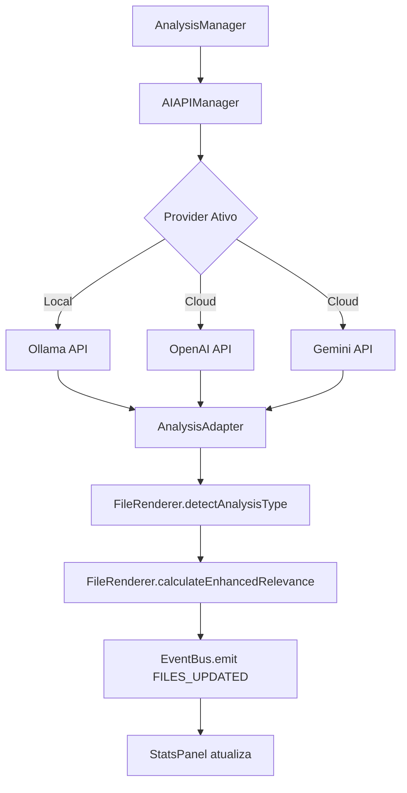

# 🏗️ Arquitetura da Fase 3 - Integração com LLMs Externos

## 📋 Sumário Executivo

Este documento detalha a arquitetura planejada para integrar o Knowledge Consolidator com modelos de linguagem externos (LLMs), respeitando os componentes existentes e mantendo a filosofia de **Single Source of Truth** (Lei 0 e Lei 11).

## 🎯 Objetivos da Fase 3

1. **Substituir simulação por análise real** usando LLMs externos
2. **Preservar e expandir** o sistema de tipos de análise existente
3. **Integrar com StatsPanel** para métricas em tempo real
4. **Manter compatibilidade** com FileRenderer e seus métodos

## 🏛️ Arquitetura Proposta

### 1. Componentes Principais

```javascript
window.KnowledgeConsolidator = {
  // Componentes Existentes (NÃO MODIFICAR)
  AnalysisManager: {},     // Orquestrador principal
  FileRenderer: {},        // detectAnalysisType() e calculateEnhancedRelevance()
  StatsPanel: {},         // Estatísticas em tempo real
  CategoryManager: {},    // Fonte única de categorias
  
  // NOVOS Componentes para Fase 3
  AIAPIManager: {},       // Gerenciador de APIs de LLMs
  PromptManager: {},      // Gerenciador de templates/prompts
  AnalysisAdapter: {},    // Adaptador para diferentes respostas de APIs
  CostManager: {}         // Controle de custos e tokens
};
```

### 2. Fluxo de Integração



### 3. AIAPIManager - Estrutura Central

```javascript
class AIAPIManager {
    providers = {
        ollama: {
            baseUrl: 'http://127.0.0.1:11434',
            isLocal: true,
            requiresApiKey: false,
            priority: 1  // Prioridade para uso local
        },
        openai: {
            baseUrl: 'https://api.openai.com/v1',
            requiresApiKey: true,
            models: ['gpt-4', 'gpt-3.5-turbo']
        },
        gemini: {
            baseUrl: 'https://generativelanguage.googleapis.com/v1',
            requiresApiKey: true,
            models: ['gemini-pro']
        }
    };
    
    async analyze(file, options) {
        // 1. Prepara prompt usando PromptManager
        const prompt = KC.PromptManager.prepare(file, options.template);
        
        // 2. Chama API apropriada
        const rawResponse = await this.callProvider(prompt);
        
        // 3. Adapta resposta para formato padrão
        const analysis = KC.AnalysisAdapter.normalize(rawResponse);
        
        // 4. Enriquece com tipo de análise existente
        analysis.type = KC.FileRenderer.detectAnalysisType(file);
        analysis.relevance = KC.FileRenderer.calculateEnhancedRelevance({
            ...file,
            analysisType: analysis.type
        });
        
        return analysis;
    }
}
```

### 4. Integração com AnalysisManager

**Modificação Mínima** no método `processBatch()`:

```javascript
// ANTES (linha 166-213 do AnalysisManager.js)
// Simula processamento
await this.delay(2000);
const result = { /* simulação */ };

// DEPOIS - APENAS substituir simulação
const result = await KC.AIAPIManager.analyze(item.file, {
    template: item.config.template,
    model: item.config.model,
    temperature: item.config.temperature
});
```

### 5. Templates de Análise (PromptManager)

```javascript
class PromptManager {
    templates = {
        decisiveMoments: {
            systemPrompt: `Analise o conteúdo identificando:
                1. Tipo de análise: Breakthrough Técnico, Evolução Conceitual, 
                   Momento Decisivo, Insight Estratégico, ou Aprendizado Geral
                2. Momentos decisivos e insights
                3. Potencial para projetos`,
            
            responseFormat: {
                analysisType: "string (usar tipos existentes)",
                momentos: [],
                relevanceBoost: "number (0-0.25)",
                categories: []
            }
        }
    };
}
```

### 6. Sincronização com StatsPanel

O fluxo de eventos já está implementado:

1. `AnalysisManager` atualiza arquivo com resultado
2. Emite `FILES_UPDATED` e `STATE_CHANGED`
3. `StatsPanel` escuta e atualiza automaticamente:
   - Arquivos Analisados
   - Momentos Descobertos
   - Relevância Média

### 7. Interface de Configuração

```javascript
// Nova seção no WorkflowPanel - Etapa 3
const aiConfigPanel = {
    render() {
        return `
            <div class="ai-config-panel">
                <h3>Configuração de APIs de IA</h3>
                
                <!-- Provider Selection -->
                <div class="provider-select">
                    <label>Provider Ativo:</label>
                    <select id="ai-provider">
                        <option value="ollama">Ollama (Local)</option>
                        <option value="openai">OpenAI GPT</option>
                        <option value="gemini">Google Gemini</option>
                    </select>
                </div>
                
                <!-- API Keys (apenas para providers que precisam) -->
                <div class="api-keys" id="api-keys-section">
                    <!-- Renderizado dinamicamente -->
                </div>
                
                <!-- Template Selection -->
                <div class="template-select">
                    <label>Template de Análise:</label>
                    <select id="analysis-template">
                        <option value="decisiveMoments">Momentos Decisivos</option>
                        <option value="technicalInsights">Insights Técnicos</option>
                        <option value="projectAnalysis">Análise de Projetos</option>
                    </select>
                </div>
                
                <!-- Cost Estimation -->
                <div class="cost-estimation">
                    <span>Custo estimado: </span>
                    <span id="cost-estimate">$0.00</span>
                </div>
            </div>
        `;
    }
};
```

## 📊 Fonte Única dos Tipos de Análise

### Single Source of Truth - AnalysisTypes.js

Criado arquivo `/js/config/AnalysisTypes.js` como fonte única (Lei 0 e Lei 11):

```javascript
KC.AnalysisTypes = {
    BREAKTHROUGH_TECNICO: { name: 'Breakthrough Técnico', relevanceBoost: 0.25 },
    EVOLUCAO_CONCEITUAL: { name: 'Evolução Conceitual', relevanceBoost: 0.25 },
    MOMENTO_DECISIVO: { name: 'Momento Decisivo', relevanceBoost: 0.20 },
    INSIGHT_ESTRATEGICO: { name: 'Insight Estratégico', relevanceBoost: 0.15 },
    APRENDIZADO_GERAL: { name: 'Aprendizado Geral', relevanceBoost: 0.05 }
};
```

### Integração com Componentes:

1. **FileRenderer** - Atualizar para usar `KC.AnalysisTypesManager.detectType()`
2. **AnalysisManager** - Usar tipos da fonte única
3. **AIAPIManager** - Instruir LLMs com `KC.AnalysisTypesManager.getPromptDescription()`
4. **CategoryManager** - Relacionar tipos com categorias padrão

As LLMs serão instruídas a classificar dentro destes tipos através dos prompts.

## 🔄 Fluxo de Dados Completo

1. **Usuário solicita análise** → AnalysisManager adiciona à fila
2. **AnalysisManager processa** → Chama AIAPIManager
3. **AIAPIManager analisa** → Retorna resultado estruturado
4. **AnalysisAdapter normaliza** → Formato padrão
5. **FileRenderer enriquece** → Adiciona tipo e relevância
6. **EventBus notifica** → FILES_UPDATED + STATE_CHANGED
7. **UI atualiza** → FileRenderer re-renderiza + StatsPanel atualiza

## 🛡️ Considerações de Segurança

1. **API Keys** armazenadas no localStorage com prefixo
2. **Validação** de respostas das APIs
3. **Timeout** configurável (padrão 30s)
4. **Rate limiting** automático
5. **Fallback** para próximo provider se falhar

## 📈 Métricas e Monitoramento

O CostManager rastreará:
- Tokens consumidos por análise
- Custo acumulado por sessão
- Tempo médio de resposta
- Taxa de sucesso/erro por provider

## 🚀 Implementação Incremental

### Fase 3.1 - Ollama Local (PRIORIDADE)
1. Implementar AIAPIManager básico
2. Integrar apenas com Ollama
3. Testar com dados reais
4. Validar tipos de análise

### Fase 3.2 - Providers Cloud
1. Adicionar OpenAI e Gemini
2. Interface de API keys
3. Sistema de fallback

### Fase 3.3 - Otimizações
1. Processamento em batch
2. Cache de resultados
3. Histórico de análises

## ✅ Checklist de Validação

- [ ] Tipos de análise preservados (5 tipos)
- [ ] Boost de relevância funcionando
- [ ] StatsPanel atualizando em tempo real
- [ ] Eventos FILES_UPDATED emitidos
- [ ] CategoryManager sincronizado
- [ ] Sem quebrar funcionalidades existentes

## 🎯 Resultado Esperado

Ao final da Fase 3, o sistema terá:
1. **Análise real** via LLMs (não mais simulação)
2. **Classificação automática** nos 5 tipos existentes
3. **Relevância calculada** com boost por tipo
4. **Interface atualizada** automaticamente
5. **Métricas precisas** no StatsPanel

---

**Próximo Passo**: Implementar AIAPIManager seguindo esta arquitetura, começando pela integração com Ollama (Lei 1.54 - dados reais).