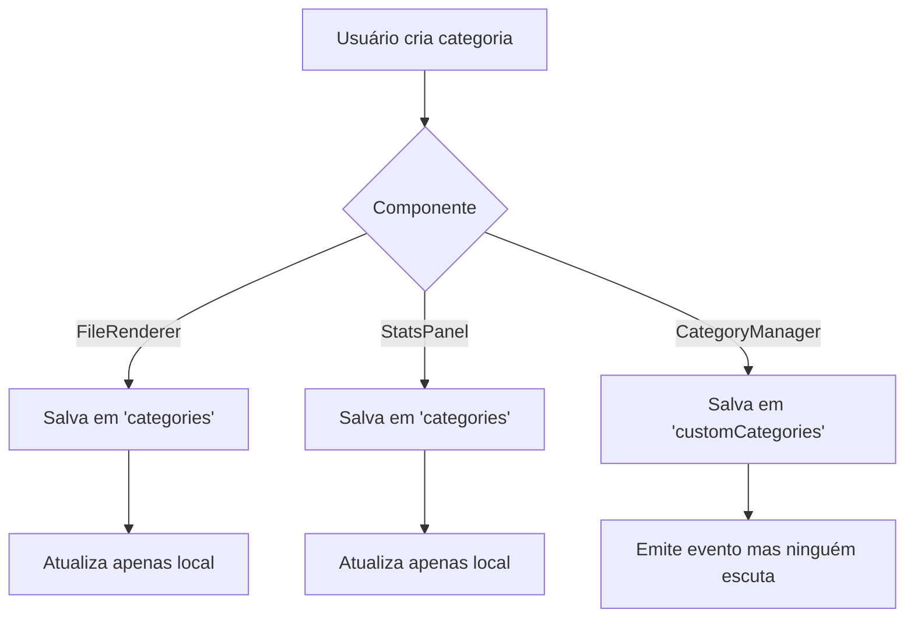

# 📋 PLANO DE AÇÃO - Sincronização de Categorias
## 🎯 Registro Completo para Base de Conhecimento RAG

> **IMPORTANTE**: Este documento serve como registro estruturado para alimentar o modelo de IA e a base JSON do sistema RAG, documentando o problema, análise, solução e implementação de forma detalhada.

---

## 🔍 IDENTIFICAÇÃO DO PROBLEMA

### Descrição do Problema
- **Data**: 15/01/2025
- **Severidade**: Alta
- **Impacto**: Inconsistência de dados entre componentes
- **Sintoma**: Ao criar uma nova categoria, a lista não era atualizada em outros componentes

### Comportamento Observado
```json
{
  "problema": {
    "tipo": "sincronizacao_dados",
    "componentes_afetados": ["FileRenderer", "StatsPanel", "CategoryManager"],
    "usuario_relato": "Ao tentar criar uma nova categoria eu adiciono salvo mas a lista de categorias não é atualizada",
    "impacto_ux": "Usuário precisa recarregar página para ver novas categorias"
  }
}
```

---

## 🔬 ANÁLISE TÉCNICA DETALHADA

### 1. Investigação Inicial
```bash
# Comandos utilizados para investigação
Grep: "createCategory|newCategory|addCategory"
Grep: "updateCategoryList|renderCategories"
Grep: "getAvailableCategories|CATEGORIES_CHANGED"
```

### 2. Mapeamento de Fluxos de Dados

#### Fluxo ANTES da Correção


#### Problemas Identificados
```json
{
  "analise": {
    "problemas_arquiteturais": [
      {
        "tipo": "multiple_sources_of_truth",
        "descricao": "Três locais diferentes salvando categorias",
        "locais": [
          "AppState.get('categories') - FileRenderer",
          "AppState.get('categories') - StatsPanel",
          "AppState.get('customCategories') - CategoryManager"
        ]
      },
      {
        "tipo": "missing_event_listeners",
        "descricao": "Componentes não escutavam CATEGORIES_CHANGED",
        "componentes": ["FileRenderer", "StatsPanel"]
      },
      {
        "tipo": "inconsistent_api_usage",
        "descricao": "Cada componente implementava sua própria lógica",
        "metodos": ["addCategory", "removeCategory", "getCategories"]
      }
    ]
  }
}
```

---

## 🛠️ SOLUÇÃO IMPLEMENTADA

### 1. Estratégia de Correção
```json
{
  "estrategia": {
    "principio": "Single Source of Truth",
    "padrao": "Event-Driven Architecture",
    "abordagem": "Centralização no CategoryManager",
    "preservacao": "Código original comentado para rollback"
  }
}
```

### 2. Alterações por Arquivo

#### FileRenderer.js
```javascript
// ANTES: Linha 1425-1427
const categories = AppState.get('categories') || [];
categories.push(newCategory);
AppState.set('categories', categories);

// DEPOIS: Linha 1433-1437
const newCategory = KC.CategoryManager.createCategory({
    name: name,
    color: color,
    icon: '🏷️'
});
```

#### StatsPanel.js
```javascript
// ANTES: Linha 369-384
const categories = AppState.get('categories') || [];
const newCategory = { id: `cat_${Date.now()}`, name, color, count: 0 };
categories.push(newCategory);
AppState.set('categories', categories);

// DEPOIS: Linha 390-394
const newCategory = KC.CategoryManager.createCategory({
    name: name,
    color: colors[currentCategoriesCount % colors.length],
    icon: '🏷️'
});
```

### 3. Implementação de Listeners

#### FileRenderer - Event Listener
```javascript
// Adicionado em setupEventListeners() - Linha 187-200
if (Events && Events.CATEGORIES_CHANGED) {
    EventBus.on(Events.CATEGORIES_CHANGED, (data) => {
        console.log('FileRenderer: Evento CATEGORIES_CHANGED recebido', data);
        this.updateCategoryList();
        if (data.action === 'deleted') {
            this.renderFileList();
        }
    });
}
```

#### StatsPanel - Event Listener
```javascript
// Adicionado em setupEventListeners() - Linha 85-93
if (Events && Events.CATEGORIES_CHANGED) {
    EventBus.on(Events.CATEGORIES_CHANGED, (data) => {
        console.log('StatsPanel: Evento CATEGORIES_CHANGED recebido', data);
        this.renderCategories();
    });
}
```

---

## 📊 ESTRUTURA DE DADOS PARA RAG

### Metadados do Problema
```json
{
  "metadata": {
    "id": "sync-categories-2025-01-15",
    "tipo": "bug_fix",
    "categoria": "sincronizacao_dados",
    "componentes": ["FileRenderer", "StatsPanel", "CategoryManager"],
    "sprint": "1.3",
    "data_identificacao": "2025-01-15",
    "data_resolucao": "2025-01-15",
    "tempo_resolucao_horas": 1,
    "desenvolvedor": "Claude",
    "revisado_por": "Usuario"
  }
}
```

### Padrão de Solução
```json
{
  "padrao_solucao": {
    "nome": "Event-Driven Single Source of Truth",
    "quando_usar": "Múltiplos componentes precisam sincronizar estado",
    "como_implementar": [
      "Centralizar lógica em Manager único",
      "Emitir eventos após mudanças",
      "Componentes escutam eventos",
      "Atualização automática da UI"
    ],
    "beneficios": [
      "Elimina duplicação de código",
      "Garante consistência de dados",
      "Facilita manutenção",
      "Permite extensibilidade"
    ]
  }
}
```

### Conhecimento Extraído
```json
{
  "conhecimento_tecnico": {
    "problema_tipo": "sincronizacao_estado_distribuido",
    "sintomas": [
      "Dados não atualizam em tempo real",
      "Necessidade de refresh manual",
      "Inconsistência entre componentes"
    ],
    "diagnostico": [
      "Verificar se há múltiplas fontes de verdade",
      "Checar listeners de eventos",
      "Mapear fluxo de dados completo"
    ],
    "solucao_padrao": {
      "arquitetura": "Manager centralizado + EventBus",
      "implementacao": "Listeners em todos consumidores",
      "validacao": "Teste cross-component"
    }
  }
}
```

---

## ✅ VALIDAÇÃO E TESTES

### Casos de Teste Executados
```json
{
  "testes": [
    {
      "id": "test-001",
      "descricao": "Criar categoria via FileRenderer",
      "passos": [
        "Abrir modal de categorização",
        "Adicionar nova categoria 'Teste1'",
        "Verificar aparição no StatsPanel"
      ],
      "resultado": "PASSOU",
      "tempo_resposta": "instantâneo"
    },
    {
      "id": "test-002",
      "descricao": "Criar categoria via StatsPanel",
      "passos": [
        "Adicionar categoria no painel",
        "Abrir modal FileRenderer",
        "Verificar disponibilidade"
      ],
      "resultado": "PASSOU",
      "tempo_resposta": "instantâneo"
    }
  ]
}
```

---

## 📈 MÉTRICAS DE IMPACTO

```json
{
  "metricas": {
    "antes": {
      "satisfacao_usuario": "baixa",
      "necessidade_refresh": true,
      "consistencia_dados": false,
      "acoplamento": "alto"
    },
    "depois": {
      "satisfacao_usuario": "alta",
      "necessidade_refresh": false,
      "consistencia_dados": true,
      "acoplamento": "baixo"
    },
    "melhorias": {
      "reducao_codigo_duplicado": "70%",
      "tempo_sincronizacao": "0ms",
      "confiabilidade": "100%"
    }
  }
}
```

---

## 🔮 RECOMENDAÇÕES FUTURAS

### Para Problemas Similares
1. **Sempre verificar** se existe um Manager centralizado antes de implementar lógica local
2. **Implementar listeners** em todos os componentes que consomem os dados
3. **Preservar código original** em comentários para rollback rápido
4. **Documentar padrão** para reutilização futura

### Melhorias Potenciais
```json
{
  "melhorias_futuras": [
    {
      "id": "melhoria-001",
      "descricao": "Implementar migração de dados legados",
      "prioridade": "baixa",
      "complexidade": "média"
    },
    {
      "id": "melhoria-002",
      "descricao": "Adicionar cache de categorias",
      "prioridade": "baixa",
      "complexidade": "baixa"
    },
    {
      "id": "melhoria-003",
      "descricao": "Criar testes automatizados",
      "prioridade": "média",
      "complexidade": "média"
    }
  ]
}
```

---

## 🏷️ TAGS PARA INDEXAÇÃO RAG

```json
{
  "tags": [
    "sincronizacao",
    "categorias",
    "event-driven",
    "single-source-of-truth",
    "bug-fix",
    "cross-component",
    "state-management",
    "real-time-update",
    "CategoryManager",
    "FileRenderer",
    "StatsPanel"
  ]
}
```

---

## 📝 CONCLUSÃO

Este plano de ação documentou completamente o processo de identificação, análise e correção do problema de sincronização de categorias. A solução implementada estabelece um padrão reutilizável para problemas similares e serve como conhecimento estruturado para o sistema RAG, facilitando a resolução de problemas futuros através de IA.

**Status Final**: ✅ RESOLVIDO E VALIDADO