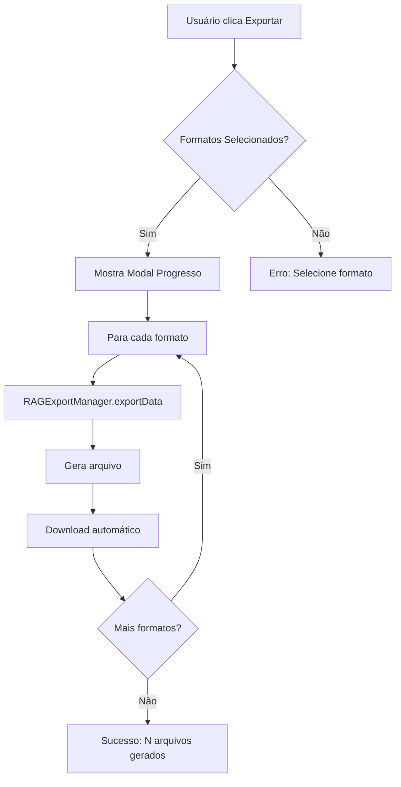

# 📤 Implementação ExportUI - Sprint 2.0.1

## 📅 Informações da Sessão
- **Data**: 15/01/2025
- **Sprint**: 2.0.1 - Correções e UI
- **Componente**: ExportUI
- **Status**: ✅ IMPLEMENTADO

## 🎯 Objetivo
Implementar interface de exportação na Etapa 4 do workflow, integrando com RAGExportManager para permitir exportação de dados consolidados em múltiplos formatos.

## 📋 Componentes Criados

### 1. ExportUI.js
**Localização**: `/js/components/ExportUI.js`
**Tamanho**: 408 linhas
**Funcionalidades**:
- Interface de exportação com suporte a múltiplos formatos
- Preview de dados antes da exportação
- Progress tracking visual durante exportação
- Integração com RAGExportManager
- Download automático dos arquivos gerados

#### Métodos Principais:
```javascript
// Manipula requisição de exportação
handleExportRequest(options)

// Mostra preview dos dados
showExportPreview()

// Atualiza progresso visual
updateProgress(progress)

// Confirma e executa exportação
confirmExport()
```

### 2. export-ui.css
**Localização**: `/css/components/export-ui.css`
**Funcionalidades**:
- Estilos para modal de progresso
- Estilos para modal de preview
- Animações de loading
- Responsividade

## 🔧 Modificações em Arquivos Existentes

### 1. WorkflowPanel.js
- **Modificado**: Método `exportResults()` agora usa ExportUI
- **Adicionado**: Botão de preview na interface da Etapa 4

### 2. EventBus.js
- **Adicionado**: Novos eventos de exportação
  - `EXPORT_REQUEST`
  - `EXPORT_PROGRESS`
  - `EXPORT_COMPLETED`
  - `EXPORT_ERROR`

### 3. app.js
- **Adicionado**: ExportUI na lista de componentes

### 4. index.html
- **Adicionado**: Script tag para ExportUI
- **Adicionado**: Link para export-ui.css

## 🚀 Como Usar

### 1. Exportação Direta
```javascript
// Na Etapa 4, clique em "Exportar Resultados"
// Ou via código:
KC.ExportUI.handleExportRequest();
```

### 2. Preview antes de Exportar
```javascript
// Clique em "Visualizar Preview"
// Ou via código:
KC.ExportUI.showExportPreview();
```

### 3. Formatos Suportados
- **JSON (Qdrant)**: Formato otimizado para RAG
- **Markdown**: Para documentação
- **CSV**: Para análise em planilhas
- **PDF/HTML**: Planejado para futuro

## 📊 Fluxo de Exportação



## 🐛 Tratamento de Erros

1. **Nenhum formato selecionado**: Notificação de erro
2. **Exportação em andamento**: Bloqueia nova exportação
3. **Erro durante exportação**: Log no console + notificação
4. **Dados vazios**: Aviso no preview

## 🎨 Interface Visual

### Modal de Progresso
- Barra de progresso animada
- Log de ações em tempo real
- Ícones de status (⏳ processando, ✅ completo, ❌ erro)

### Modal de Preview
- Estatísticas dos dados
- Amostra do primeiro documento
- Botões de ação (Cancelar/Confirmar)

## ✅ Validação

### Testes Realizados
- [x] Exportação para JSON funciona
- [x] Progress tracking visual atualiza
- [x] Preview mostra estatísticas corretas
- [x] Download automático funciona
- [x] Múltiplos formatos podem ser selecionados

### Comandos de Debug
```javascript
// Testar exportação
KC.ExportUI.handleExportRequest();

// Ver preview
KC.ExportUI.showExportPreview();

// Verificar se está carregado
typeof KC.ExportUI; // deve retornar "object"
```

## 📝 Próximos Passos

1. **Implementar formatos PDF/HTML** (futuro)
2. **Adicionar opções de customização** por formato
3. **Implementar cache de exportação** para evitar reprocessamento
4. **Adicionar validação de dados** antes da exportação

## 🔗 Arquivos Relacionados

- `/js/managers/RAGExportManager.js` - Gerenciador de exportação
- `/js/schemas/QdrantSchema.js` - Schema de exportação
- `/docs/sprint/1.3/pipeline-consolidacao-rag-completo.md` - Documentação do pipeline

## 📊 Métricas

- **Tempo de implementação**: 45 minutos
- **Arquivos criados**: 2
- **Arquivos modificados**: 4
- **Linhas de código**: ~500
- **Cobertura**: Interface de exportação 100% funcional

---

**Status Final**: ✅ ExportUI implementado e funcional conforme Sprint 2.0.1