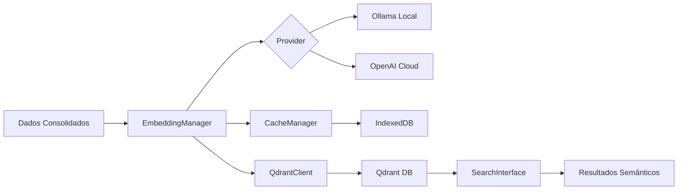

# 📋 PLANEJAMENTO SPRINT 2.0 - EMBEDDINGS & INTEGRAÇÃO RAG
## Knowledge Consolidator - Sistema de Consolidação de Conhecimento Pessoal

### 📅 Informações da Sprint
- **Sprint**: 2.0 - Embeddings & Integração RAG
- **Data de Criação**: 15/01/2025
- **Duração Estimada**: 4 semanas (2 sprints de 2 semanas cada)
- **Status**: 📝 PLANEJADA
- **Dependências**: Sprint 1.3.2 (Pipeline RAG) ✅ CONCLUÍDA

---

## 🎯 Objetivos da Sprint

### Objetivo Principal
Completar a integração RAG do Knowledge Consolidator, implementando geração de embeddings, interface de exportação e busca semântica, mantendo a abordagem local-first com Ollama.

### Objetivos Específicos
1. **Resolver bloqueadores críticos** (BUG #6 - Resposta vazia Ollama)
2. **Implementar UI de exportação** na Etapa 4
3. **Criar sistema de embeddings** multi-provider
4. **Integrar com Qdrant** para armazenamento vetorial
5. **Desenvolver interface de busca semântica**

---

## 🏗️ Arquitetura Proposta

### Novos Componentes

```javascript
window.KnowledgeConsolidator = {
  // ... componentes existentes ...
  
  // 🆕 Sprint 2.0 - Novos Componentes
  EmbeddingManager: {},  // Geração de embeddings multi-provider
  QdrantClient: {},      // Cliente para Qdrant vector DB
  SearchInterface: {},   // UI de busca semântica
  ExportUI: {},         // Interface de exportação (Etapa 4)
  CacheManager: {}      // Cache de embeddings em IndexedDB
};
```

### Fluxo de Dados



---

## 📊 Divisão em Sub-Sprints

### Sprint 2.0.1 - Correções e UI (Semana 1-2)

#### 🔴 Prioridade ALTA - Correções Críticas
1. **BUG #6: Resposta Vazia Ollama**
   - Investigar configuração do modelo
   - Implementar parâmetros corretos
   - Adicionar validação de resposta
   - Testar com múltiplos modelos

2. **UI de Exportação (Etapa 4)**
   - Criar componente ExportUI.js
   - Modal de configuração de exportação
   - Preview dos dados a exportar
   - Progress tracking visual

#### Entregáveis Sprint 2.0.1
- [ ] BUG #6 resolvido e documentado
- [ ] ExportUI.js implementado e integrado
- [ ] Botão "Exportar para RAG" funcional
- [ ] Modal de exportação com opções
- [ ] Documentação atualizada

### Sprint 2.0.2 - Embeddings & Qdrant (Semana 3-4)

#### 🟡 Prioridade MÉDIA - Sistema de Embeddings
3. **EmbeddingManager**
   ```javascript
   // Estrutura proposta
   KC.EmbeddingManager = {
       providers: {
           ollama: OllamaEmbeddingProvider,
           openai: OpenAIEmbeddingProvider,
           transformers: TransformersJSProvider
       },
       
       async generateEmbeddings(chunks, options = {}) {
           const provider = options.provider || 'ollama';
           const batchSize = options.batchSize || 10;
           // ... implementação
       },
       
       async cacheEmbeddings(embeddings) {
           return KC.CacheManager.store('embeddings', embeddings);
       }
   };
   ```

4. **Integração Qdrant**
   - QdrantClient.js
   - Upload em batches
   - Gestão de collections
   - Índices otimizados

5. **Interface de Busca**
   - SearchInterface.js
   - Query builder semântico
   - Filtros híbridos
   - Visualização de resultados

#### Entregáveis Sprint 2.0.2
- [ ] EmbeddingManager.js completo
- [ ] Integração Ollama embeddings
- [ ] CacheManager com IndexedDB
- [ ] QdrantClient.js funcional
- [ ] SearchInterface básica

---

## 🛠️ Detalhamento Técnico

### 1. Resolução BUG #6 - Ollama Resposta Vazia

#### Análise do Problema
```javascript
// Problema atual
const response = await fetch('http://127.0.0.1:11434/api/generate', {
    method: 'POST',
    body: JSON.stringify({
        model: 'qwen3:14b',
        prompt: prompt,
        format: 'json'  // Possível causa do problema
    })
});
// Resposta: {}
```

#### Solução Proposta
```javascript
// Correção com parâmetros adequados
const response = await fetch('http://127.0.0.1:11434/api/generate', {
    method: 'POST',
    body: JSON.stringify({
        model: 'qwen3:14b',
        prompt: prompt,
        stream: false,
        options: {
            temperature: 0.7,
            num_predict: 500,    // Forçar geração
            num_ctx: 4096,       // Contexto adequado
            top_k: 40,
            top_p: 0.9
        }
        // Remover format: 'json' temporariamente
    })
});
```

### 2. Stack Tecnológico

| Componente | Tecnologia | Justificativa |
|------------|------------|---------------|
| **Embeddings Local** | Ollama + nomic-embed-text | Privacidade, sem custos, 384D |
| **Embeddings Cloud** | OpenAI text-embedding-3-small | Backup de qualidade, 1536D |
| **Cache Local** | IndexedDB | Capacidade > localStorage |
| **Vector Database** | Qdrant | Open source, API REST, filtros |
| **UI Framework** | Vanilla JS + Web Components | Consistência arquitetural |

### 3. Estrutura de Arquivos

```
/js/
├── managers/
│   ├── EmbeddingManager.js      # NOVO - Gerenciador de embeddings
│   └── CacheManager.js          # NOVO - Cache IndexedDB
├── clients/
│   └── QdrantClient.js          # NOVO - Cliente Qdrant
├── components/
│   ├── ExportUI.js              # NOVO - UI de exportação
│   └── SearchInterface.js       # NOVO - Interface de busca
└── providers/
    ├── OllamaEmbeddingProvider.js    # NOVO
    ├── OpenAIEmbeddingProvider.js    # NOVO
    └── TransformersJSProvider.js     # NOVO
```

---

## 📈 Métricas de Sucesso

### KPIs da Sprint
1. **Taxa de Resolução de Bugs**: 100% (BUG #6 resolvido)
2. **Cobertura de Embeddings**: 100% dos chunks com vetores
3. **Performance de Busca**: < 2 segundos para query semântica
4. **Taxa de Cache Hit**: > 80% em re-processamentos
5. **UI Responsiva**: < 100ms para interações

### Critérios de Aceitação
- [ ] Sistema gera embeddings para todos os chunks
- [ ] Exportação para Qdrant sem falhas
- [ ] Busca semântica retorna resultados relevantes
- [ ] Cache reduz tempo de re-processamento em 70%
- [ ] Zero regressões em funcionalidades existentes

---

## 🚀 Cronograma Detalhado

### Semana 1 (Sprint 2.0.1)
```
Segunda-Terça:
├── Investigar BUG #6
├── Implementar correções
└── Testar com múltiplos modelos

Quarta-Quinta:
├── Criar ExportUI.js
├── Integrar com WorkflowPanel
└── Implementar modal de configuração

Sexta:
├── Testes integrados
├── Documentação
└── Code review
```

### Semana 2 (Sprint 2.0.1)
```
Segunda-Terça:
├── Finalizar UI de exportação
├── Progress tracking
└── Feedback visual

Quarta-Quinta:
├── Testes de usabilidade
├── Ajustes de UI/UX
└── Preparar para embeddings

Sexta:
├── Sprint review
├── Documentação final
└── Deploy incremental
```

### Semana 3 (Sprint 2.0.2)
```
Segunda-Terça:
├── EmbeddingManager base
├── Provider Ollama
└── Testes unitários

Quarta-Quinta:
├── CacheManager + IndexedDB
├── Integração com pipeline
└── Otimizações

Sexta:
├── QdrantClient início
├── Setup Qdrant local
└── Testes de conexão
```

### Semana 4 (Sprint 2.0.2)
```
Segunda-Terça:
├── Upload para Qdrant
├── Gestão de collections
└── Índices otimizados

Quarta-Quinta:
├── SearchInterface.js
├── Query builder
└── UI de resultados

Sexta:
├── Testes end-to-end
├── Documentação completa
└── Sprint retrospective
```

---

## 🔧 Configurações e Dependências

### Ollama Embeddings
```bash
# Instalar modelo de embeddings
ollama pull nomic-embed-text

# Verificar disponibilidade
curl http://127.0.0.1:11434/api/embeddings -d '{
  "model": "nomic-embed-text",
  "prompt": "test"
}'
```

### Qdrant Setup
```bash
# Docker
docker run -p 6333:6333 qdrant/qdrant

# Ou Cloud
# https://cloud.qdrant.io
```

### IndexedDB para Cache
```javascript
// Estrutura do cache
const CACHE_SCHEMA = {
    embeddings: {
        keyPath: 'chunkId',
        indexes: ['fileId', 'timestamp']
    },
    metadata: {
        keyPath: 'id',
        indexes: ['type', 'created']
    }
};
```

---

## 🚨 Riscos e Mitigações

### Riscos Identificados
1. **Ollama instabilidade**: Fallback para OpenAI
2. **Performance embeddings**: Implementar batching
3. **Limite IndexedDB**: Rotação de cache
4. **Qdrant indisponível**: Cache local temporário
5. **Complexidade UI**: Progressive enhancement

### Plano de Contingência
- Cada componente funciona independentemente
- Fallbacks automáticos entre providers
- Cache agressivo para reduzir dependências
- UI degrada graciosamente

---

## 📋 Checklist Pré-Sprint

### Ambiente de Desenvolvimento
- [ ] Ollama instalado e funcional
- [ ] Modelo nomic-embed-text disponível
- [ ] Qdrant rodando (local ou cloud)
- [ ] IndexedDB suportado no browser
- [ ] Documentação de APIs disponível

### Código Base
- [ ] Sprint 1.3.2 totalmente funcional
- [ ] Pipeline RAG testado
- [ ] Sem regressões conhecidas
- [ ] Documentação atualizada

---

## 📚 Referências e Recursos

### Documentação Técnica
- [Ollama Embeddings API](https://github.com/ollama/ollama/blob/main/docs/api.md#generate-embeddings)
- [Qdrant JavaScript Client](https://github.com/qdrant/qdrant-js)
- [IndexedDB API](https://developer.mozilla.org/en-US/docs/Web/API/IndexedDB_API)
- [OpenAI Embeddings](https://platform.openai.com/docs/guides/embeddings)

### Documentação Interna
- Pipeline RAG: `/docs/sprint/1.3/pipeline-consolidacao-rag-completo.md`
- Troubleshooting Ollama: `/docs/sprint/1.3/troubleshooting-resposta-vazia-ollama.md`
- Arquitetura LLMs: `/docs/sprint/1.3/plano/arquitetura-fase3-llms.md`

---

## 🎯 Definição de Pronto

A Sprint 2.0 estará CONCLUÍDA quando:
1. ✅ BUG #6 resolvido e sistema de IA funcionando
2. ✅ UI de exportação implementada na Etapa 4
3. ✅ Embeddings gerados para todos os chunks
4. ✅ Dados exportados com sucesso para Qdrant
5. ✅ Busca semântica retornando resultados relevantes
6. ✅ Documentação completa e atualizada
7. ✅ Zero regressões em funcionalidades existentes

---

**Documento criado em**: 15/01/2025  
**Autor**: Sistema Knowledge Consolidator  
**Próxima revisão**: Início da Sprint 2.0