# 🏗️ ARQUITETURA TÉCNICA - SPRINT 2.0
## Sistema de Embeddings e Integração RAG

### 📅 Data: 15/01/2025
### 🎯 Sprint: 2.0 - Embeddings & Integração RAG
### 📌 Status: ARQUITETURA DEFINIDA

---

## 🎯 Visão Geral

A Sprint 2.0 completa o pipeline RAG implementando a geração de embeddings e integração com Qdrant, mantendo a filosofia local-first com Ollama como provider principal.

```mermaid
graph TB
    subgraph "Etapa 4 - Exportação"
        A[ExportUI] --> B[Preview Dados]
        B --> C[Configurações Export]
        C --> D[Trigger Pipeline]
    end
    
    subgraph "Pipeline de Embeddings"
        D --> E[RAGExportManager]
        E --> F[Chunks Consolidados]
        F --> G[EmbeddingManager]
        G --> H{Provider Selection}
        H --> I[Ollama Local]
        H --> J[OpenAI Fallback]
        G --> K[CacheManager]
        K --> L[IndexedDB]
    end
    
    subgraph "Armazenamento Vetorial"
        G --> M[QdrantClient]
        M --> N[Batch Upload]
        N --> O[Qdrant Collection]
    end
    
    subgraph "Interface de Busca"
        O --> P[SearchInterface]
        P --> Q[Query Builder]
        Q --> R[Semantic Search]
        R --> S[Results Display]
    end
```



---

## 🔧 Componentes Detalhados

### 1. ExportUI.js - Interface de Exportação

```javascript
/**
 * ExportUI.js
 * Interface visual para exportação na Etapa 4
 */
class ExportUI {
    constructor() {
        this.modal = null;
        this.exportOptions = {
            format: 'qdrant',      // qdrant, json, csv
            includeEmbeddings: true,
            batchSize: 100,
            provider: 'ollama'     // ollama, openai
        };
    }
    
    async render() {
        return `
            <div class="export-container">
                <h3>🚀 Exportar para RAG</h3>
                
                <div class="export-stats">
                    <div class="stat-item">
                        <span class="stat-label">Arquivos:</span>
                        <span class="stat-value">${this.getFileCount()}</span>
                    </div>
                    <div class="stat-item">
                        <span class="stat-label">Chunks:</span>
                        <span class="stat-value">${this.getChunkCount()}</span>
                    </div>
                    <div class="stat-item">
                        <span class="stat-label">Tamanho estimado:</span>
                        <span class="stat-value">${this.getEstimatedSize()}</span>
                    </div>
                </div>
                
                <div class="export-options">
                    <label>
                        <span>Formato de exportação:</span>
                        <select id="export-format">
                            <option value="qdrant">Qdrant (Recomendado)</option>
                            <option value="json">JSON</option>
                            <option value="csv">CSV</option>
                        </select>
                    </label>
                    
                    <label>
                        <input type="checkbox" id="include-embeddings" checked>
                        Gerar embeddings
                    </label>
                    
                    <div id="embedding-options" class="embedding-options">
                        <label>
                            <span>Provider de embeddings:</span>
                            <select id="embedding-provider">
                                <option value="ollama">Ollama (Local)</option>
                                <option value="openai">OpenAI</option>
                            </select>
                        </label>
                        
                        <label>
                            <span>Tamanho do batch:</span>
                            <input type="number" id="batch-size" value="100" min="10" max="500">
                        </label>
                    </div>
                </div>
                
                <div class="export-preview">
                    <h4>Preview dos dados:</h4>
                    <pre>${this.getDataPreview()}</pre>
                </div>
                
                <div class="export-actions">
                    <button class="btn btn-primary" onclick="KC.ExportUI.startExport()">
                        🚀 Iniciar Exportação
                    </button>
                    <button class="btn btn-secondary" onclick="KC.ModalManager.closeModal('export')">
                        Cancelar
                    </button>
                </div>
            </div>
        `;
    }
    
    async startExport() {
        const options = this.collectOptions();
        
        // Mostrar progress
        this.showProgress();
        
        try {
            // Consolidar dados
            const data = await KC.RAGExportManager.consolidateData();
            
            // Gerar embeddings se solicitado
            if (options.includeEmbeddings) {
                await this.generateEmbeddings(data.points, options);
            }
            
            // Exportar conforme formato
            await this.exportData(data, options);
            
            // Sucesso
            this.showSuccess();
            
        } catch (error) {
            this.showError(error);
        }
    }
}
```

### 2. EmbeddingManager.js - Gerenciador de Embeddings

```javascript
/**
 * EmbeddingManager.js
 * Gerencia geração de embeddings multi-provider
 */
class EmbeddingManager {
    constructor() {
        this.providers = {
            ollama: new OllamaEmbeddingProvider(),
            openai: new OpenAIEmbeddingProvider(),
            transformers: new TransformersJSProvider()
        };
        
        this.config = {
            defaultProvider: 'ollama',
            cacheEnabled: true,
            batchSize: 10,
            maxRetries: 3
        };
        
        this.cache = KC.CacheManager;
    }
    
    /**
     * Gera embeddings para um array de chunks
     */
    async generateEmbeddings(chunks, options = {}) {
        const provider = options.provider || this.config.defaultProvider;
        const batchSize = options.batchSize || this.config.batchSize;
        
        KC.Logger.info('EmbeddingManager', `Gerando embeddings com ${provider}`, {
            totalChunks: chunks.length,
            batchSize
        });
        
        const embeddings = [];
        const errors = [];
        
        // Processar em batches
        for (let i = 0; i < chunks.length; i += batchSize) {
            const batch = chunks.slice(i, i + batchSize);
            
            try {
                // Verificar cache primeiro
                const cachedResults = await this.checkCache(batch);
                const uncachedBatch = batch.filter((chunk, idx) => !cachedResults[idx]);
                
                if (uncachedBatch.length > 0) {
                    // Gerar embeddings para chunks não cacheados
                    const newEmbeddings = await this.providers[provider]
                        .generateBatch(uncachedBatch);
                    
                    // Cachear novos resultados
                    if (this.config.cacheEnabled) {
                        await this.cacheEmbeddings(uncachedBatch, newEmbeddings);
                    }
                    
                    // Mesclar com cache
                    embeddings.push(...this.mergeResults(batch, cachedResults, newEmbeddings));
                } else {
                    // Todos do cache
                    embeddings.push(...cachedResults);
                }
                
                // Emitir progresso
                KC.EventBus.emit(KC.Events.EMBEDDING_PROGRESS, {
                    current: Math.min(i + batchSize, chunks.length),
                    total: chunks.length,
                    percentage: Math.round((i + batchSize) / chunks.length * 100)
                });
                
            } catch (error) {
                KC.Logger.error('EmbeddingManager', 'Erro no batch', { error, batch });
                
                // Tentar fallback
                if (provider !== 'openai' && this.providers.openai.isAvailable()) {
                    try {
                        const fallbackEmbeddings = await this.providers.openai
                            .generateBatch(batch);
                        embeddings.push(...fallbackEmbeddings);
                    } catch (fallbackError) {
                        errors.push({ batch, error: fallbackError });
                    }
                } else {
                    errors.push({ batch, error });
                }
            }
        }
        
        return {
            embeddings,
            errors,
            stats: {
                total: chunks.length,
                successful: embeddings.length,
                failed: errors.length,
                cached: embeddings.filter(e => e.fromCache).length
            }
        };
    }
    
    /**
     * Verifica cache para chunks
     */
    async checkCache(chunks) {
        if (!this.config.cacheEnabled) return new Array(chunks.length).fill(null);
        
        const results = await Promise.all(
            chunks.map(chunk => this.cache.get('embeddings', chunk.id))
        );
        
        return results;
    }
}
```

### 3. OllamaEmbeddingProvider.js

```javascript
/**
 * OllamaEmbeddingProvider.js
 * Provider de embeddings usando Ollama local
 */
class OllamaEmbeddingProvider {
    constructor() {
        this.baseUrl = 'http://127.0.0.1:11434';
        this.model = 'nomic-embed-text';
        this.dimension = 384;
    }
    
    async isAvailable() {
        try {
            const response = await fetch(`${this.baseUrl}/api/tags`);
            const data = await response.json();
            return data.models?.some(m => m.name.includes(this.model));
        } catch {
            return false;
        }
    }
    
    async generateBatch(chunks) {
        const embeddings = [];
        
        for (const chunk of chunks) {
            try {
                const response = await fetch(`${this.baseUrl}/api/embeddings`, {
                    method: 'POST',
                    headers: { 'Content-Type': 'application/json' },
                    body: JSON.stringify({
                        model: this.model,
                        prompt: chunk.content
                    })
                });
                
                const data = await response.json();
                
                if (data.embedding && Array.isArray(data.embedding)) {
                    embeddings.push({
                        chunkId: chunk.id,
                        vector: data.embedding,
                        dimension: this.dimension,
                        model: this.model,
                        provider: 'ollama',
                        timestamp: new Date().toISOString()
                    });
                } else {
                    throw new Error('Resposta inválida do Ollama');
                }
                
            } catch (error) {
                KC.Logger.error('OllamaProvider', 'Erro ao gerar embedding', {
                    chunk: chunk.id,
                    error: error.message
                });
                throw error;
            }
        }
        
        return embeddings;
    }
}
```

### 4. CacheManager.js - Gerenciador de Cache

```javascript
/**
 * CacheManager.js
 * Gerencia cache em IndexedDB
 */
class CacheManager {
    constructor() {
        this.dbName = 'KnowledgeConsolidatorCache';
        this.version = 1;
        this.db = null;
        
        this.stores = {
            embeddings: {
                name: 'embeddings',
                keyPath: 'chunkId',
                indexes: [
                    { name: 'timestamp', keyPath: 'timestamp' },
                    { name: 'provider', keyPath: 'provider' }
                ]
            },
            metadata: {
                name: 'metadata',
                keyPath: 'id',
                indexes: [
                    { name: 'type', keyPath: 'type' },
                    { name: 'created', keyPath: 'created' }
                ]
            }
        };
    }
    
    async initialize() {
        return new Promise((resolve, reject) => {
            const request = indexedDB.open(this.dbName, this.version);
            
            request.onerror = () => reject(request.error);
            request.onsuccess = () => {
                this.db = request.result;
                resolve();
            };
            
            request.onupgradeneeded = (event) => {
                const db = event.target.result;
                
                // Criar stores
                for (const [key, config] of Object.entries(this.stores)) {
                    if (!db.objectStoreNames.contains(config.name)) {
                        const store = db.createObjectStore(config.name, {
                            keyPath: config.keyPath
                        });
                        
                        // Criar índices
                        config.indexes.forEach(index => {
                            store.createIndex(index.name, index.keyPath);
                        });
                    }
                }
            };
        });
    }
    
    async store(storeName, data) {
        const transaction = this.db.transaction([storeName], 'readwrite');
        const store = transaction.objectStore(storeName);
        
        if (Array.isArray(data)) {
            for (const item of data) {
                await store.put(item);
            }
        } else {
            await store.put(data);
        }
        
        return new Promise((resolve, reject) => {
            transaction.oncomplete = resolve;
            transaction.onerror = () => reject(transaction.error);
        });
    }
    
    async get(storeName, key) {
        const transaction = this.db.transaction([storeName], 'readonly');
        const store = transaction.objectStore(storeName);
        const request = store.get(key);
        
        return new Promise((resolve, reject) => {
            request.onsuccess = () => resolve(request.result);
            request.onerror = () => reject(request.error);
        });
    }
    
    async getStats() {
        const stats = {};
        
        for (const [key, config] of Object.entries(this.stores)) {
            const transaction = this.db.transaction([config.name], 'readonly');
            const store = transaction.objectStore(config.name);
            const countRequest = store.count();
            
            await new Promise((resolve) => {
                countRequest.onsuccess = () => {
                    stats[key] = countRequest.result;
                    resolve();
                };
            });
        }
        
        // Calcular tamanho estimado
        const usage = await navigator.storage.estimate();
        stats.estimatedSize = usage.usage || 0;
        stats.quota = usage.quota || 0;
        
        return stats;
    }
}
```

### 5. QdrantClient.js - Cliente Qdrant

```javascript
/**
 * QdrantClient.js
 * Cliente para integração com Qdrant vector database
 */
class QdrantClient {
    constructor() {
        this.baseUrl = 'http://localhost:6333'; // Ou cloud URL
        this.apiKey = null; // Para Qdrant Cloud
        this.collectionName = 'knowledge_consolidator';
        this.dimension = 384; // nomic-embed-text
    }
    
    async createCollection() {
        const response = await fetch(`${this.baseUrl}/collections/${this.collectionName}`, {
            method: 'PUT',
            headers: this.getHeaders(),
            body: JSON.stringify({
                vectors: {
                    size: this.dimension,
                    distance: "Cosine"
                },
                optimizers_config: {
                    default_segment_number: 2
                },
                hnsw_config: {
                    m: 16,
                    ef_construct: 200
                }
            })
        });
        
        if (!response.ok) {
            throw new Error(`Erro ao criar collection: ${response.statusText}`);
        }
        
        return response.json();
    }
    
    async uploadBatch(points) {
        const response = await fetch(
            `${this.baseUrl}/collections/${this.collectionName}/points`,
            {
                method: 'PUT',
                headers: this.getHeaders(),
                body: JSON.stringify({
                    points: points.map(point => ({
                        id: point.id,
                        vector: point.vector,
                        payload: point.payload
                    }))
                })
            }
        );
        
        if (!response.ok) {
            throw new Error(`Erro no upload: ${response.statusText}`);
        }
        
        return response.json();
    }
    
    async search(vector, options = {}) {
        const response = await fetch(
            `${this.baseUrl}/collections/${this.collectionName}/points/search`,
            {
                method: 'POST',
                headers: this.getHeaders(),
                body: JSON.stringify({
                    vector,
                    limit: options.limit || 10,
                    filter: options.filter || null,
                    with_payload: true,
                    with_vector: false
                })
            }
        );
        
        if (!response.ok) {
            throw new Error(`Erro na busca: ${response.statusText}`);
        }
        
        return response.json();
    }
    
    getHeaders() {
        const headers = { 'Content-Type': 'application/json' };
        if (this.apiKey) {
            headers['api-key'] = this.apiKey;
        }
        return headers;
    }
}
```

### 6. SearchInterface.js - Interface de Busca

```javascript
/**
 * SearchInterface.js
 * Interface de busca semântica
 */
class SearchInterface {
    constructor() {
        this.container = null;
        this.results = [];
        this.filters = {
            categories: [],
            dateRange: null,
            relevanceThreshold: 0.7
        };
    }
    
    render() {
        return `
            <div class="search-interface">
                <div class="search-header">
                    <h2>🔍 Busca Semântica</h2>
                    <p>Encontre conhecimento usando linguagem natural</p>
                </div>
                
                <div class="search-box">
                    <input 
                        type="text" 
                        id="semantic-search-input"
                        placeholder="Ex: decisões sobre arquitetura de microserviços..."
                        class="search-input"
                    >
                    <button onclick="KC.SearchInterface.performSearch()" class="search-button">
                        Buscar
                    </button>
                </div>
                
                <div class="search-filters">
                    <div class="filter-group">
                        <label>Categorias:</label>
                        <select id="search-categories" multiple>
                            ${this.renderCategoryOptions()}
                        </select>
                    </div>
                    
                    <div class="filter-group">
                        <label>Relevância mínima:</label>
                        <input 
                            type="range" 
                            id="relevance-threshold"
                            min="0" max="1" step="0.1" 
                            value="${this.filters.relevanceThreshold}"
                        >
                        <span id="relevance-value">${this.filters.relevanceThreshold}</span>
                    </div>
                </div>
                
                <div class="search-results" id="search-results">
                    ${this.renderResults()}
                </div>
            </div>
        `;
    }
    
    async performSearch() {
        const query = document.getElementById('semantic-search-input').value;
        if (!query.trim()) return;
        
        this.showLoading();
        
        try {
            // Gerar embedding da query
            const queryEmbedding = await KC.EmbeddingManager.generateEmbeddings(
                [{ id: 'query', content: query }],
                { provider: 'ollama' }
            );
            
            // Buscar no Qdrant
            const searchResults = await KC.QdrantClient.search(
                queryEmbedding.embeddings[0].vector,
                {
                    limit: 20,
                    filter: this.buildFilter()
                }
            );
            
            // Processar e exibir resultados
            this.results = this.processResults(searchResults.result);
            this.updateResults();
            
        } catch (error) {
            KC.Logger.error('SearchInterface', 'Erro na busca', error);
            this.showError(error.message);
        }
    }
    
    processResults(qdrantResults) {
        return qdrantResults.map(result => ({
            score: result.score,
            chunk: result.payload.chunk,
            file: result.payload.file,
            analysis: result.payload.analysis,
            context: result.payload.context
        })).filter(r => r.score >= this.filters.relevanceThreshold);
    }
}
```

---

## 🔄 Fluxo de Integração

### 1. Fluxo de Exportação

```mermaid
sequenceDiagram
    participant U as Usuário
    participant E as ExportUI
    participant R as RAGExportManager
    participant EM as EmbeddingManager
    participant C as CacheManager
    participant Q as QdrantClient
    
    U->>E: Clica "Exportar para RAG"
    E->>E: Mostra modal com opções
    U->>E: Configura e confirma
    E->>R: consolidateData()
    R->>R: Coleta dados aprovados
    R->>EM: generateEmbeddings(chunks)
    EM->>C: checkCache(chunks)
    C-->>EM: Retorna cached/uncached
    EM->>EM: Gera embeddings novos
    EM->>C: store(embeddings)
    EM-->>R: Retorna embeddings
    R->>Q: uploadBatch(points)
    Q-->>R: Confirma upload
    R-->>E: Exportação completa
    E-->>U: Mostra sucesso
```


### 2. Fluxo de Busca


---

## 🔐 Segurança e Performance

### Segurança
1. **API Keys**: Armazenadas no localStorage criptografadas
2. **Validação**: Todos inputs sanitizados
3. **CORS**: Configurado para permitir apenas origens confiáveis
4. **Rate Limiting**: Implementado no cliente

### Performance
1. **Batching**: Processamento em lotes configuráveis
2. **Cache Agressivo**: IndexedDB para embeddings
3. **Lazy Loading**: Resultados carregados sob demanda
4. **Web Workers**: Para processamento pesado (futuro)

### Otimizações
```javascript
// Cache com TTL
const CACHE_CONFIG = {
    embeddings: {
        ttl: 7 * 24 * 60 * 60 * 1000, // 7 dias
        maxSize: 10000, // máximo de embeddings
        evictionPolicy: 'LRU' // Least Recently Used
    }
};

// Compressão de payloads
const compressPayload = (payload) => {
    // Remove campos não essenciais para busca
    const compressed = {
        ...payload,
        chunk: {
            id: payload.chunk.id,
            preview: payload.chunk.content.substring(0, 200)
        }
    };
    delete compressed.file.handle;
    return compressed;
};
```

---

## 📋 Migração e Compatibilidade

### Migração de Dados Existentes
```javascript
// Script de migração para dados já analisados
async function migrateExistingData() {
    const files = KC.AppState.get('files') || [];
    const filesWithAnalysis = files.filter(f => f.analyzed);
    
    if (filesWithAnalysis.length > 0) {
        console.log(`Migrando ${filesWithAnalysis.length} arquivos analisados...`);
        
        // Gerar chunks para arquivos existentes
        const allChunks = [];
        for (const file of filesWithAnalysis) {
            const chunks = KC.ChunkingUtils.getSemanticChunks(file.content || '');
            allChunks.push(...chunks.map(chunk => ({
                ...chunk,
                fileId: file.id,
                analysis: file.analysis
            })));
        }
        
        // Processar embeddings
        await KC.EmbeddingManager.generateEmbeddings(allChunks);
    }
}
```

### Compatibilidade Backward
- Sistema funciona sem embeddings (modo degradado)
- Export JSON continua disponível
- Busca textual como fallback

---

## 🎯 Métricas e Monitoramento

### KPIs Técnicos
```javascript
const METRICS = {
    embeddings: {
        totalGenerated: 0,
        cacheHits: 0,
        avgGenerationTime: 0,
        errors: 0
    },
    search: {
        totalQueries: 0,
        avgResponseTime: 0,
        avgResultsReturned: 0,
        clickThroughRate: 0
    },
    storage: {
        indexedDBUsage: 0,
        qdrantDocuments: 0,
        cacheEfficiency: 0
    }
};
```

### Eventos de Monitoramento
- `EMBEDDING_STARTED`: Início da geração
- `EMBEDDING_PROGRESS`: Progresso (%)
- `EMBEDDING_COMPLETED`: Conclusão com stats
- `SEARCH_PERFORMED`: Query executada
- `RESULT_CLICKED`: Resultado selecionado

---

**Documento criado em**: 15/01/2025  
**Autor**: Sistema Knowledge Consolidator  
**Versão**: 1.0.0