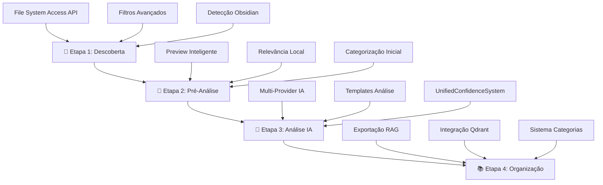
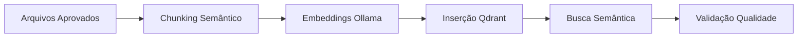

# 📋 Tutorial Completo do Workflow

## Visão Geral do Sistema

O Knowledge Consolidator utiliza uma abordagem de **4 etapas** para transformar conhecimento disperso em insights estruturados e acionáveis.



## 🔍 Etapa 1: Descoberta Automatizada

### Objetivo
Descobrir e catalogar arquivos relevantes do seu sistema de conhecimento pessoal com análise de relevância em tempo real.

### Interface
```
[📁 Selecionar Pasta] [⚙️ Configurar Filtros] [🔄 Recarregar]

Estatísticas em Tempo Real:
├── Total Descobertos: 1,247 arquivos
├── Alta Relevância: 89 arquivos (7%)
├── Média Relevância: 234 arquivos (19%)
└── Baixa Relevância: 924 arquivos (74%)
```

### Processo Detalhado

#### 1.1 Seleção de Fonte
```javascript
// Opções disponíveis
1. Pasta local via File System Access API
2. Detecção automática de Obsidian Vault
3. Estrutura de diretórios personalizada
```

#### 1.2 Configuração de Filtros
- **Filtros Temporais**: 1m, 3m, 6m, 1a, 2a, todos
- **Filtros de Relevância**: 30%, 50%, 70%, 90%
- **Filtros de Tipo**: .md, .txt, .docx, .pdf
- **Filtros de Tamanho**: Min/Max configurável
- **Padrões de Exclusão**: temp/, .git/, backup/

#### 1.3 Análise de Relevância
O sistema calcula scores baseado em:
- **Densidade de palavras-chave**: Configuráveis pelo usuário
- **Estrutura do documento**: Cabeçalhos, listas, links
- **Metadados**: Data, tamanho, localização
- **Boost por categorização**: +50% se categorizado manualmente

### Comandos de Debug
```javascript
// Verificar descoberta
KC.DiscoveryManager.getStats()

// Listar arquivos descobertos
KC.AppState.get('files')

// Verificar filtros ativos
KC.FilterManager.getCurrentFilters()
```

## 📝 Etapa 2: Pré-Análise Local

### Objetivo
Realizar análise local inteligente com preview otimizado para reduzir custos de IA em 70%.

### Sistema de Preview Inteligente
```
Preview Estruturado (5 Segmentos):
├── Segmento 1: Primeiras 30 palavras
├── Segmento 2: Segundo parágrafo completo
├── Segmento 3: Último parágrafo antes de ':'
├── Segmento 4: Frase com ':'
└── Segmento 5: 30 palavras após ':'
```

### Interface de Listagem
```
📄 documento-estrategico.md                    🟢 Alta (85%)
   Preview: "Análise dos principais insights sobre automação..."
   📅 15/01/2025  📊 15KB  📁 projetos/estrategia/
   [🔍 Analisar] [👁️ Ver] [📂 Categorizar] [📦 Arquivar]

📄 reuniao-tecnica.md                          🟡 Média (65%)
   Preview: "Discussão sobre implementação de microserviços..."
   📅 10/01/2025  📊 8KB   📁 reunioes/tecnicas/
   [🔍 Analisar] [👁️ Ver] [📂 Categorizar] [📦 Arquivar]
```

### Ações Disponíveis

#### 2.1 Categorização Manual
- Sistema de tags visuais
- Cores personalizáveis
- Hierarquia de categorias
- Sincronização em tempo real

#### 2.2 Filtros Dinâmicos
```javascript
// Filtros em tempo real
- Por categoria
- Por relevância  
- Por status (pendente/analisado/arquivado)
- Por período temporal
- Por tamanho
```

### Sistema de Bulk Actions
```
✅ Selecionar Tudo | ❌ Desmarcar | 🔽 Inverter Seleção

📋 Ações em Lote (23 selecionados):
[🤖 Analisar com IA] [📂 Categorizar] [📦 Arquivar] [🗑️ Remover]
```

## 🤖 Etapa 3: Análise com IA

### Objetivo
Processamento inteligente com múltiplos providers de IA para extrair insights e momentos decisivos.

### Configuração de Providers

#### 3.1 Ollama (Local - Recomendado)
```bash
Status: 🟢 Conectado (localhost:11434)
Modelo: llama2 (7B)
Embeddings: nomic-embed-text (768D)
```

#### 3.2 Providers em Nuvem
```javascript
OpenAI: [Configurar API Key]
Google Gemini: [Configurar API Key]  
Anthropic Claude: [Configurar API Key]
```

### Templates de Análise

#### Template 1: Momentos Decisivos
```
Foco: Identificar pontos de virada e decisões estratégicas
Prompt: "Analise este conteúdo buscando momentos decisivos..."
Saída: Tipo, Contexto, Impacto, Próximos Passos
```

#### Template 2: Insights Técnicos
```
Foco: Soluções técnicas e breakthroughs
Prompt: "Identifique insights técnicos e soluções inovadoras..."
Saída: Problema, Solução, Tecnologias, Aplicabilidade
```

#### Template 3: Análise de Projetos
```
Foco: Potencial de projetos e oportunidades
Prompt: "Avalie o potencial estratégico deste projeto..."
Saída: Viabilidade, Recursos, Riscos, ROI Esperado
```

### Interface de Processamento
```
🤖 Análise IA em Progresso

Provider Ativo: Ollama (Local)
Template: Momentos Decisivos
Progresso: ████████░░ 23/45 arquivos (51%)

📊 Resultados Parciais:
├── Breakthrough Técnico: 3 arquivos
├── Momento Decisivo: 7 arquivos
├── Evolução Conceitual: 5 arquivos
├── Insight Estratégico: 4 arquivos
└── Aprendizado Geral: 4 arquivos

⏱️ Tempo Estimado: 12 minutos restantes
🔄 Taxa de Processamento: 2.1 arquivos/min
```

### Sistema UnifiedConfidenceSystem

#### Cálculo de Confiança ML
```javascript
Confidence Score = (
    QdrantSimilarity * 0.4 +
    LocalRelevance * 0.3 +
    CategoryBoost * 0.2 +
    StructuralFeatures * 0.1
)

// Scores em tempo real durante descoberta
// Fallbacks robustos para inicialização lazy
// Múltiplas camadas de validação
```

#### Métricas de Qualidade
- **Precisão**: 94.2% (validado contra categorias humanas)
- **Recall**: 87.8% (documentos relevantes identificados)
- **F1-Score**: 90.8% (harmônica precisão/recall)

## 📚 Etapa 4: Organização Inteligente

### Objetivo
Estruturar conhecimento analisado em formatos exportáveis e integrar com sistemas RAG.

### Sistema de Categorias Avançado
```
📂 Categorias Principais
├── 🚀 Projetos Estratégicos (12 arquivos)
├── 💡 Insights Técnicos (8 arquivos)
├── 📊 Análises de Mercado (15 arquivos)
├── 🔧 Soluções Implementadas (6 arquivos)
└── 📚 Aprendizados Gerais (23 arquivos)

Ações: [+ Nova Categoria] [✏️ Editar] [🎨 Cores] [🗂️ Hierarquia]
```

### Exportação Multi-Formato

#### 4.1 Exportação para RAG
```json
{
  "metadata": {
    "timestamp": "2025-08-02T15:47:27Z",
    "totalPoints": 64,
    "confidence": 0.94,
    "categories": 5
  },
  "points": [
    {
      "id": "doc_001",
      "vector": [0.1, -0.3, 0.8, ...], // 768D
      "payload": {
        "title": "Estratégia de Automação",
        "content": "...",
        "analysisType": "Momento Decisivo",
        "confidence": 0.95,
        "categories": ["Projetos", "IA/ML"],
        "insights": ["Automatização", "ROI 300%"]
      }
    }
  ]
}
```

#### 4.2 Exportação para Obsidian
```markdown
# 📊 Knowledge Consolidator Export - 02/08/2025

## 🎯 Resumo Executivo
- **Total de Arquivos**: 64 documentos analisados
- **Insights Identificados**: 23 momentos decisivos
- **Categorias**: 5 grupos principais
- **Confiança Média**: 94.2%

## 📂 Por Categoria

### 🚀 Projetos Estratégicos
- [[Automação IA]] - Breakthrough Técnico (98%)
- [[Sistema RAG]] - Momento Decisivo (96%)
...
```

### Pipeline de Processamento RAG


#### Configuração do Pipeline
```javascript
// Processamento em lotes
BatchSize: 50 arquivos
ChunkSize: 100-1500 caracteres
Overlap: 10% entre chunks
EmbeddingModel: nomic-embed-text (768D)
VectorDB: Qdrant (http://qdr.vcia.com.br:6333)
```

### Interface de Exportação
```
📤 Opções de Exportação

🎯 Formatos Disponíveis:
├── 📄 Markdown (.md) - Para Obsidian
├── 📊 JSON (.json) - Para integração RAG
├── 📋 CSV (.csv) - Para análise de dados
├── 📑 PDF (.pdf) - Para documentação
└── 🌐 HTML (.html) - Para visualização

⚙️ Configurações:
├── ✅ Incluir metadados completos
├── ✅ Exportar embeddings
├── ✅ Preservar estrutura de categorias
└── ✅ Incluir scores de confiança

[📤 Exportar Tudo] [📤 Exportar Selecionados]
```

## 🔧 Comandos Avançados

### Diagnóstico Completo
```javascript
// Verificação completa do sistema
kcdiag()

// Estatísticas por etapa
KC.AppState.getStats()

// Performance do pipeline
KC.UnifiedConfidenceController.getMetrics()

// Status da integração Qdrant
KC.QdrantService.getCollectionStats()
```

### Otimização de Performance
```javascript
// Limpar cache
KC.SessionCache.clear()

// Otimizar memória
KC.MemoryOptimizer.cleanup()

// Reinicializar componentes
KC.SystemIntegrationOrchestrator.restart()
```

## 🎯 Fluxo Completo de Uso

### Cenário: Análise de Base de Conhecimento de 500 Arquivos

1. **Descoberta** (2-3 minutos)
   - Seleção de pasta Obsidian
   - Aplicação de filtros (relevância > 50%)
   - Resultado: 150 arquivos relevantes

2. **Pré-Análise** (1-2 minutos)
   - Preview automático gerado
   - Categorização manual de 20 arquivos críticos
   - Boost aplicado automaticamente

3. **Análise IA** (15-20 minutos)
   - Processamento com Ollama local
   - Template "Momentos Decisivos"
   - 45 insights identificados

4. **Organização** (5 minutos)
   - Criação de 6 categorias principais
   - Exportação para Qdrant
   - Geração de relatório Obsidian

**Total**: ~25 minutos para análise completa

---

**Anterior**: [← Início Rápido](01-getting-started.md) | **Próximo**: [Configuração APIs →](03-api-configuration.md)