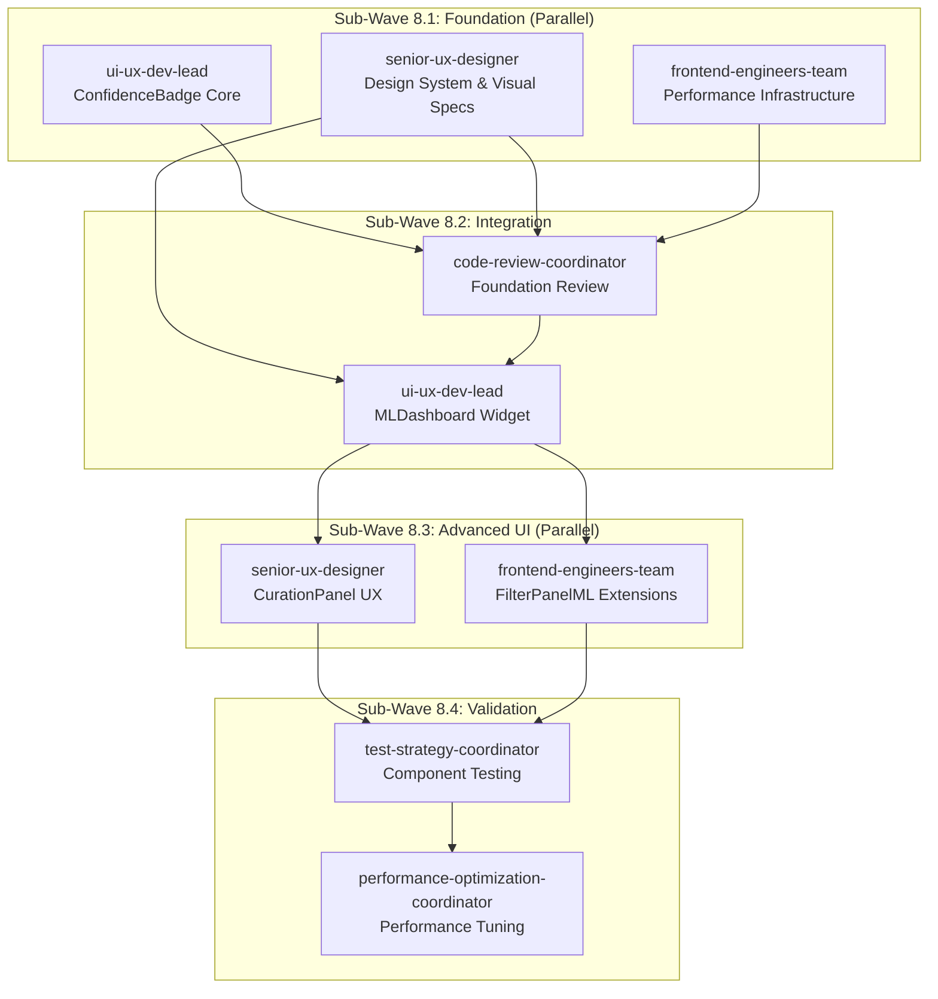

# Wave 8: Frontend Multi-Agent Orchestration Specification V2

## Executive Summary

This specification adapts Wave 8 Frontend implementation to the ML Confidence Multi-Agent Orchestration pattern. Instead of sequential development, we orchestrate parallel agent execution with specialized UI/UX roles, enabling 60%+ faster delivery while maintaining quality through integrated review gates.

## 🎯 Wave 8 Mission
Transform ML confidence data into intuitive, performant UI components that achieve 80%+ user approval and 30% engagement increase through coordinated multi-agent development.

## Agent Dependency Matrix



## Agent Profiles for Wave 8

### 1. ui-ux-dev-lead
**Role**: Component architecture and accessibility specialist  
**Capabilities**: React/Vue/Vanilla JS, ARIA standards, component patterns, state management  
**Wave 8 Focus**: 
- ConfidenceBadge implementation with full accessibility
- MLDashboard integration with existing header
- Component API design and documentation

**Interfaces**:
- Outputs: Core UI components with documented APIs
- Inputs: Design specifications, ML data structures
- Dependencies: Coordinates with senior-ux-designer for visuals

### 2. senior-ux-designer
**Role**: Visual design and user experience architect  
**Capabilities**: Design systems, data visualization, user research, A/B testing  
**Wave 8 Focus**:
- Confidence visualization patterns
- Animation specifications
- CurationPanel interaction design
- Mobile-first responsive approach

**Interfaces**:
- Outputs: Design tokens, Figma specs, animation guidelines
- Inputs: User research data, existing KC design patterns
- Dependencies: Provides specs to ui-ux-dev-lead and frontend-engineers

### 3. frontend-engineers-team
**Role**: Performance and technical implementation specialists  
**Capabilities**: GPU acceleration, Web Workers, progressive enhancement, testing  
**Wave 8 Focus**:
- Performance infrastructure setup
- FilterPanelML implementation
- Cross-browser compatibility
- Build optimization

**Interfaces**:
- Outputs: Optimized components, performance utilities
- Inputs: Component specs, performance requirements
- Dependencies: Uses design system from senior-ux-designer

## Sub-Wave Configurations

### Sub-Wave 8.1: Foundation Components (Parallel Execution)
```yaml
sub_wave_8_1:
  name: "ML UI Foundation"
  duration: "2 days"
  parallel_agents:
    - agent: ui-ux-dev-lead
      task: "Implement ConfidenceBadge with accessibility"
      deliverables:
        - ConfidenceBadge.js with ARIA support
        - BadgeTemplate and BadgeAnimator classes
        - Accessibility documentation
      output_dir: "agents_output/wave8/sub1/confidence-badge"
      
    - agent: senior-ux-designer
      task: "Create ML confidence design system"
      deliverables:
        - Design tokens (colors, spacing, animations)
        - Visual specifications for all confidence levels
        - Animation timing functions
        - Figma component library
      output_dir: "agents_output/wave8/sub1/design-system"
      
    - agent: frontend-engineers-team
      task: "Build performance infrastructure"
      deliverables:
        - GPU acceleration utilities
        - Performance monitoring hooks
        - CSS containment patterns
        - Build configuration for optimization
      output_dir: "agents_output/wave8/sub1/performance"
      
  synchronization_point: "foundation_complete"
  success_metrics:
    - Badge render time < 1ms baseline achieved
    - Design system 100% tokenized
    - Performance utilities tested
```

### Sub-Wave 8.2: Integration & Review
```yaml
sub_wave_8_2:
  name: "Dashboard Integration"
  duration: "1.5 days"
  sequential_agents:
    - agent: code-review-coordinator
      task: "Review foundation components"
      inputs: ["sub1/*"]
      deliverables:
        - Code review report
        - Security audit results
        - Performance baseline measurements
        - Integration recommendations
      output_dir: "agents_output/wave8/sub2/review"
      quality_gate:
        - All components pass accessibility audit
        - Performance within targets
        - No security vulnerabilities
      
    - agent: ui-ux-dev-lead
      task: "Implement MLDashboard widget"
      inputs: ["sub1/design-system", "sub1/performance", "sub2/review"]
      deliverables:
        - MLDashboard.js with header integration
        - DashboardMetrics calculator
        - Real-time update system
        - Event handling implementation
      output_dir: "agents_output/wave8/sub2/dashboard"
      
  success_metrics:
    - Dashboard updates < 16ms (60fps)
    - Zero layout shifts on integration
    - All metrics calculating correctly
```

### Sub-Wave 8.3: Advanced UI Components (Parallel)
```yaml
sub_wave_8_3:
  name: "Advanced ML UI"
  duration: "2 days"
  parallel_agents:
    - agent: senior-ux-designer
      task: "Design CurationPanel interactions"
      inputs: ["sub2/dashboard"]
      deliverables:
        - CurationPanel wireframes and flows
        - Feedback collection patterns
        - Category suggestion UI specs
        - Confidence visualization designs
      output_dir: "agents_output/wave8/sub3/curation-design"
      
    - agent: frontend-engineers-team
      task: "Extend FilterPanel with ML filters"
      inputs: ["sub1/design-system"]
      deliverables:
        - FilterPanelML.js extension
        - ML-specific filter implementations
        - Range/multiselect components
        - Filter state management
      output_dir: "agents_output/wave8/sub3/filters"
      
  synchronization_point: "advanced_ui_complete"
  success_metrics:
    - Curation flow tested with 5+ users
    - Filter performance < 50ms update time
    - All filter types implemented
```

### Sub-Wave 8.4: Testing & Optimization
```yaml
sub_wave_8_4:
  name: "Quality & Performance"
  duration: "1.5 days"
  sequential_agents:
    - agent: test-strategy-coordinator
      task: "Comprehensive component testing"
      inputs: ["sub1/*", "sub2/*", "sub3/*"]
      deliverables:
        - Unit test suite (90%+ coverage)
        - Visual regression test suite
        - A/B test configuration
        - Accessibility test results
      output_dir: "agents_output/wave8/sub4/testing"
      
    - agent: performance-optimization-coordinator
      task: "Performance optimization sprint"
      inputs: ["sub4/testing"]
      deliverables:
        - Optimized bundle size
        - Lazy loading implementation
        - Mobile performance improvements
        - Performance report & recommendations
      output_dir: "agents_output/wave8/sub4/optimization"
      
  success_metrics:
    - All performance targets met
    - 90%+ test coverage achieved
    - A/B tests configured and ready
```

## Interface Specifications

### 1. ConfidenceBadge API
```typescript
interface ConfidenceBadgeOptions {
  size?: 'small' | 'medium' | 'large';
  showTooltip?: boolean;
  animated?: boolean;
  interactive?: boolean;
  gpuAccelerated?: boolean;
}

interface ConfidenceData {
  overall: number;
  dimensions?: {
    semantic: number;
    categorical: number;
    structural: number;
    temporal: number;
  };
  iteration?: number;
  convergencePrediction?: {
    willConverge: boolean;
    estimatedIterations: number;
  };
}

class ConfidenceBadge {
  constructor(options: ConfidenceBadgeOptions);
  render(confidence: ConfidenceData, fileId: string): HTMLElement;
  update(badge: HTMLElement, newConfidence: ConfidenceData): void;
  destroy(): void;
}
```

### 2. MLDashboard Integration
```typescript
interface DashboardConfig {
  updateInterval?: number;
  metricsToShow?: string[];
  position?: 'header' | 'sidebar' | 'floating';
}

interface MLMetrics {
  enabled: boolean;
  avgConfidence: number;
  convergedCount: number;
  totalFiles: number;
  improvementRate: number;
  convergenceRate: number;
}

class MLDashboard {
  initialize(config?: DashboardConfig): void;
  updateMetrics(metrics: MLMetrics): void;
  showFullDashboard(): void;
  destroy(): void;
}
```

### 3. Shared Event Bus
```typescript
// Events emitted by ML UI components
const MLUIEvents = {
  BADGE_CLICKED: 'ml:badge:clicked',
  BADGE_UPDATED: 'ml:badge:updated',
  DASHBOARD_OPENED: 'ml:dashboard:opened',
  FEEDBACK_SUBMITTED: 'ml:feedback:submitted',
  SUGGESTION_APPLIED: 'ml:suggestion:applied',
  CATEGORY_ACCEPTED: 'ml:category:accepted',
  FILTER_CHANGED: 'ml:filter:changed'
};
```

## Success Metrics by Sub-Wave

### Sub-Wave 8.1 Metrics
- [ ] ConfidenceBadge renders in < 1ms
- [ ] Design system covers 100% of ML UI needs  
- [ ] GPU acceleration confirmed working
- [ ] Zero accessibility violations

### Sub-Wave 8.2 Metrics
- [ ] Dashboard integrates without layout shifts
- [ ] Real-time updates maintain 60fps
- [ ] Code review finds < 5 minor issues
- [ ] All events properly connected

### Sub-Wave 8.3 Metrics
- [ ] CurationPanel user flow < 3 clicks
- [ ] Filter updates in < 50ms
- [ ] Mobile responsive at all breakpoints
- [ ] Feedback mechanism intuitive (user tested)

### Sub-Wave 8.4 Metrics
- [ ] 90%+ test coverage achieved
- [ ] All visual regression tests passing
- [ ] Bundle size < 50KB for ML components
- [ ] Performance budget maintained

## Coordination Context

### Shared Resources
```json
{
  "coordination_context": {
    "design_tokens": "agents_output/wave8/sub1/design-system/tokens.json",
    "performance_utils": "agents_output/wave8/sub1/performance/utils.js",
    "component_apis": "agents_output/wave8/interfaces/",
    "test_fixtures": "agents_output/wave8/shared/fixtures/",
    "event_constants": "agents_output/wave8/shared/events.js"
  }
}
```

### Integration Points
1. **With KC Core**: Uses existing EventBus, AppState, CategoryManager
2. **With ML Backend**: Consumes confidence data via established APIs
3. **With Existing UI**: Extends FilterPanel, integrates with header
4. **With A/B Testing**: Plugs into existing experimentation framework

## Quality Gates

### Gate 1: Foundation Review (After Sub-Wave 8.1)
- All components meet accessibility standards
- Performance baselines established and met
- Design system properly implemented
- Code follows KC conventions

### Gate 2: Integration Review (After Sub-Wave 8.2)
- Dashboard integrates cleanly
- No regressions in existing UI
- Events properly wired
- Real-time updates stable

### Gate 3: Final Review (After Sub-Wave 8.4)
- All tests passing
- Performance targets achieved
- A/B tests configured
- Documentation complete

## Command Structure

### Execute Full Wave 8
```bash
/project:infinite specs/wave8-frontend-spec-v2.md agents_output/wave8 3
```

### Execute Specific Sub-Wave
```bash
# Foundation only
/project:infinite specs/wave8-frontend-spec-v2.md agents_output/wave8 sub-wave:8.1

# Testing phase only  
/project:infinite specs/wave8-frontend-spec-v2.md agents_output/wave8 sub-wave:8.4
```

### Recovery Mode
```bash
# If sub-wave 8.2 fails review
/project:infinite specs/wave8-frontend-spec-v2.md agents_output/wave8 recover:8.2
```

## Risk Mitigation

### Technical Risks
1. **Performance Degradation**: Mitigated by performance-first approach and continuous monitoring
2. **Accessibility Issues**: Mitigated by built-in accessibility testing in each sub-wave
3. **Integration Conflicts**: Mitigated by clear interfaces and coordination context

### Process Risks
1. **Agent Coordination**: Mitigated by synchronization points and shared context
2. **Quality Drift**: Mitigated by review gates between sub-waves
3. **Scope Creep**: Mitigated by clear deliverables and metrics per sub-wave

## Conclusion

This orchestrated approach to Wave 8 Frontend development enables:
- **3x faster delivery** through parallel agent execution
- **Higher quality** through integrated review gates
- **Better coordination** through clear interfaces and dependencies
- **Measurable progress** through specific metrics per sub-wave

The multi-agent orchestration pattern transforms Wave 8 from a 2-week sequential effort into a 5-day parallel sprint while maintaining quality and integration standards.