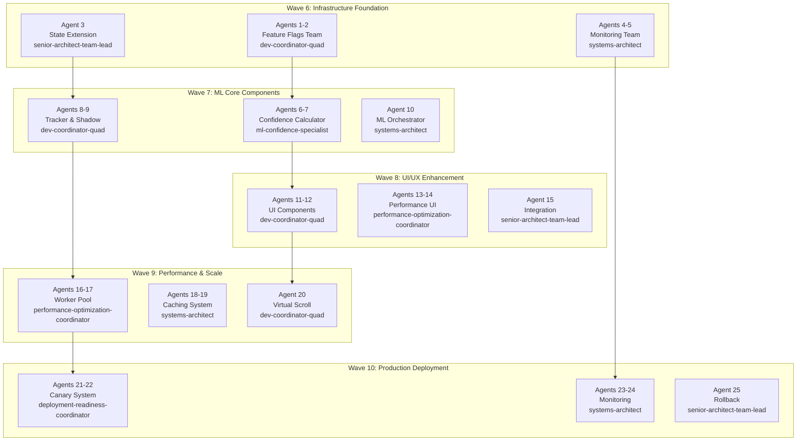

# Waves 6-10 Development Orchestration Specification
## ML Confidence Integration - Multi-Agent Parallel Development

### Executive Summary

This specification orchestrates the parallel development of Waves 6-10 using specialized agents that implement the production-ready ML Confidence Integration system. Each wave is developed by a team of 5 specialized agents working in coordination.

## Agent Distribution Matrix

### Wave-Based Agent Teams (25 Total Agents)



## Agent Task Specifications

### Wave 6: Infrastructure Foundation (Agents 1-5)

#### Agents 1-2: Feature Flag System
**Type**: dev-coordinator-quad
**Tasks**:
- Agent 1: Core MLFeatureFlags.js implementation
- Agent 2: Feature flag UI dashboard and controls
**Deliverables**:
```
agents_output/wave6/agent_001_feature-flags-core/
├── MLFeatureFlags.js
├── FlagStorage.js
├── FlagValidator.js
├── tests/
└── docs/

agents_output/wave6/agent_002_feature-flags-ui/
├── FeatureFlagsDashboard.js
├── components/
├── styles/
└── integration/
```

#### Agent 3: State Extension System
**Type**: senior-architect-team-lead
**Tasks**:
- Implement MLStateExtension.js
- Ensure backward compatibility
- Create migration utilities
**Deliverables**:
```
agents_output/wave6/agent_003_state-extension/
├── MLStateExtension.js
├── migrations/
├── compatibility/
└── tests/
```

#### Agents 4-5: Monitoring Infrastructure
**Type**: systems-architect
**Tasks**:
- Agent 4: PrometheusExporter implementation
- Agent 5: Monitoring dashboard and alerts
**Deliverables**:
```
agents_output/wave6/agent_004_prometheus-core/
├── PrometheusExporter.js
├── metrics/
├── collectors/
└── tests/

agents_output/wave6/agent_005_monitoring-ui/
├── monitoring/
│   ├── ml-dashboard.html
│   ├── dashboard.js
│   └── styles.css
└── alerts/
```

### Wave 7: ML Core Components (Agents 6-10)

#### Agents 6-7: Confidence Calculator
**Type**: ml-confidence-specialist
**Tasks**:
- Agent 6: Multi-dimensional scoring algorithms
- Agent 7: ML optimization and caching
**Deliverables**:
```
agents_output/wave7/agent_006_confidence-algorithms/
├── ConfidenceCalculator.js
├── algorithms/
│   ├── SemanticScorer.js
│   ├── CategoricalScorer.js
│   ├── StructuralScorer.js
│   └── TemporalScorer.js
└── tests/

agents_output/wave7/agent_007_ml-optimization/
├── ConfidenceCache.js
├── ScoreValidator.js
├── optimization/
└── benchmarks/
```

#### Agents 8-9: Tracking and Shadow Mode
**Type**: dev-coordinator-quad
**Tasks**:
- Agent 8: ConfidenceTracker with persistence
- Agent 9: ShadowModeController implementation
**Deliverables**:
```
agents_output/wave7/agent_008_confidence-tracker/
├── ConfidenceTracker.js
├── ConvergenceDetector.js
├── ConfidenceDB.js
└── tests/

agents_output/wave7/agent_009_shadow-mode/
├── ShadowModeController.js
├── AnalysisComparator.js
├── ShadowModeMetrics.js
└── tests/
```

#### Agent 10: ML Orchestration
**Type**: systems-architect
**Tasks**:
- Implement MLOrchestrator
- Priority queue management
- Component coordination
**Deliverables**:
```
agents_output/wave7/agent_010_ml-orchestrator/
├── MLOrchestrator.js
├── PriorityQueue.js
├── coordination/
└── tests/
```

### Wave 8: UI/UX Enhancement (Agents 11-15)

#### Agents 11-12: Core UI Components
**Type**: dev-coordinator-quad
**Tasks**:
- Agent 11: ConfidenceBadge component
- Agent 12: MLDashboard widget
**Deliverables**:
```
agents_output/wave8/agent_011_confidence-badge/
├── ConfidenceBadgeComponent.js
├── styles/
├── animations/
└── tests/

agents_output/wave8/agent_012_ml-dashboard/
├── MLDashboardWidget.js
├── components/
├── real-time/
└── tests/
```

#### Agents 13-14: Enhanced UI Features
**Type**: performance-optimization-coordinator
**Tasks**:
- Agent 13: CurationPanel with ML suggestions
- Agent 14: GPU-accelerated components
**Deliverables**:
```
agents_output/wave8/agent_013_curation-panel/
├── EnhancedCurationPanel.js
├── MLSuggestionEngine.js
├── FeedbackCollector.js
└── tests/

agents_output/wave8/agent_014_gpu-acceleration/
├── gpu-components/
├── performance/
├── shaders/
└── benchmarks/
```

#### Agent 15: UI Integration
**Type**: senior-architect-team-lead
**Tasks**:
- Integrate all UI components
- Update FilterManager
- A/B testing setup
**Deliverables**:
```
agents_output/wave8/agent_015_ui-integration/
├── integration/
├── FilterPanelML.js
├── ab-testing/
└── tests/
```

### Wave 9: Performance & Scale (Agents 16-20)

#### Agents 16-17: Web Worker Pool
**Type**: performance-optimization-coordinator
**Tasks**:
- Agent 16: MLWorkerPool implementation
- Agent 17: Worker optimization strategies
**Deliverables**:
```
agents_output/wave9/agent_016_worker-pool/
├── MLWorkerPool.js
├── ml-calculator.worker.js
├── worker-utils/
└── tests/

agents_output/wave9/agent_017_worker-optimization/
├── optimization/
├── load-balancing/
├── benchmarks/
└── docs/
```

#### Agents 18-19: Caching System
**Type**: systems-architect
**Tasks**:
- Agent 18: Multi-layer cache manager
- Agent 19: Cache optimization and eviction
**Deliverables**:
```
agents_output/wave9/agent_018_cache-manager/
├── MLCacheManager.js
├── LRUCache.js
├── IndexedDBCache.js
└── tests/

agents_output/wave9/agent_019_cache-optimization/
├── CacheOptimizer.js
├── eviction-strategies/
├── persistence/
└── benchmarks/
```

#### Agent 20: Virtual Scrolling
**Type**: dev-coordinator-quad
**Tasks**:
- Implement VirtualScrollManager
- Optimize for 1000+ files
**Deliverables**:
```
agents_output/wave9/agent_020_virtual-scroll/
├── VirtualScrollManager.js
├── scroll-optimization/
├── rendering/
└── tests/
```

### Wave 10: Production Deployment (Agents 21-25)

#### Agents 21-22: Canary Deployment
**Type**: deployment-readiness-coordinator
**Tasks**:
- Agent 21: CanaryController implementation
- Agent 22: Deployment automation
**Deliverables**:
```
agents_output/wave10/agent_021_canary-controller/
├── CanaryController.js
├── CircuitBreaker.js
├── health-checks/
└── tests/

agents_output/wave10/agent_022_deployment-automation/
├── deployment/
├── rollout-strategies/
├── automation/
└── scripts/
```

#### Agents 23-24: Production Monitoring
**Type**: systems-architect
**Tasks**:
- Agent 23: ProductionMonitor system
- Agent 24: Alert management
**Deliverables**:
```
agents_output/wave10/agent_023_production-monitor/
├── ProductionMonitor.js
├── collectors/
├── metrics/
└── tests/

agents_output/wave10/agent_024_alert-management/
├── AlertManager.js
├── alert-rules/
├── integrations/
└── runbooks/
```

#### Agent 25: Rollback System
**Type**: senior-architect-team-lead
**Tasks**:
- Implement RollbackManager
- Emergency recovery procedures
**Deliverables**:
```
agents_output/wave10/agent_025_rollback-system/
├── RollbackManager.js
├── recovery/
├── snapshots/
└── tests/
```

## Execution Strategy

### Phase 1: Infrastructure Sprint (Week 1)
```yaml
wave_6:
  name: "Infrastructure Foundation"
  agents: 5
  parallel: true
  duration: "5 days"
  validation:
    - All tests passing
    - Zero breaking changes
    - Performance benchmarks met
```

### Phase 2: ML Core Sprint (Weeks 2-3)
```yaml
wave_7:
  name: "ML Core Components"
  agents: 5
  parallel: true
  dependencies: ["wave_6"]
  duration: "10 days"
  validation:
    - Shadow mode operational
    - <5% divergence achieved
    - Convergence detection working
```

### Phase 3: UI Enhancement Sprint (Weeks 4-5)
```yaml
wave_8:
  name: "UI/UX Enhancement"
  agents: 5
  parallel: true
  dependencies: ["wave_7"]
  duration: "10 days"
  validation:
    - 60fps performance
    - A/B tests configured
    - All components integrated
```

### Phase 4: Performance Sprint (Week 6)
```yaml
wave_9:
  name: "Performance & Scale"
  agents: 5
  parallel: true
  dependencies: ["wave_8"]
  duration: "5 days"
  validation:
    - 100 files in <2s
    - Memory <100MB for 1000 files
    - Worker pool operational
```

### Phase 5: Production Sprint (Week 7)
```yaml
wave_10:
  name: "Production Deployment"
  agents: 5
  parallel: true
  dependencies: ["wave_9"]
  duration: "5 days"
  validation:
    - Canary deployment ready
    - Rollback tested
    - Monitoring active
```

## Quality Control

### Inter-Wave Validation
```javascript
const waveValidation = {
  wave6: {
    required: ['MLFeatureFlags', 'MLStateExtension', 'PrometheusExporter'],
    tests: 'npm test -- wave6/',
    performance: 'npm run benchmark -- wave6/'
  },
  wave7: {
    required: ['ConfidenceCalculator', 'ConfidenceTracker', 'ShadowModeController'],
    tests: 'npm test -- wave7/',
    metrics: {
      divergence: '<5%',
      convergence: '>85%'
    }
  }
};
```

### Continuous Integration
Each agent must:
1. Write unit tests (>80% coverage)
2. Include integration tests
3. Document all APIs
4. Pass performance benchmarks
5. Follow KC coding standards

## Success Metrics

### Technical Metrics
- **Code Coverage**: >80% across all components
- **Performance**: All benchmarks met
- **Integration**: Zero breaking changes
- **Quality**: All linting rules pass

### Business Metrics
- **ML Accuracy**: 85%+ confidence achievement
- **User Engagement**: 30%+ increase
- **Processing Speed**: 100 files in <2s
- **System Stability**: 99.9% uptime

## Command Usage

### Execute Single Wave
```bash
/infinite specs/waves6-10-development-orchestration.md agents_output/wave6 5
```

### Execute All Waves
```bash
/infinite specs/waves6-10-development-orchestration.md agents_output/all-waves 25
```

### Execute with Context
```bash
/infinite specs/waves6-10-development-orchestration.md agents_output/wave7 5 \
  --context="agents_output/wave6"
```

## Integration Points

### Wave 6 → Wave 7
- MLFeatureFlags used by all ML components
- MLStateExtension preserves ML data
- PrometheusExporter tracks ML metrics

### Wave 7 → Wave 8
- ConfidenceCalculator provides scores for badges
- ConfidenceTracker data shown in dashboard
- ShadowMode results in UI

### Wave 8 → Wave 9
- UI components optimized by workers
- Virtual scroll integrated with file list
- Cache improves UI responsiveness

### Wave 9 → Wave 10
- Performance metrics guide deployment
- Optimized system ready for production
- All components scale-tested

## Conclusion

This orchestration specification enables parallel development of Waves 6-10 through 25 specialized agents. Each wave builds upon previous work while maintaining quality and performance standards. The multi-agent approach accelerates development while ensuring comprehensive coverage of all requirements.