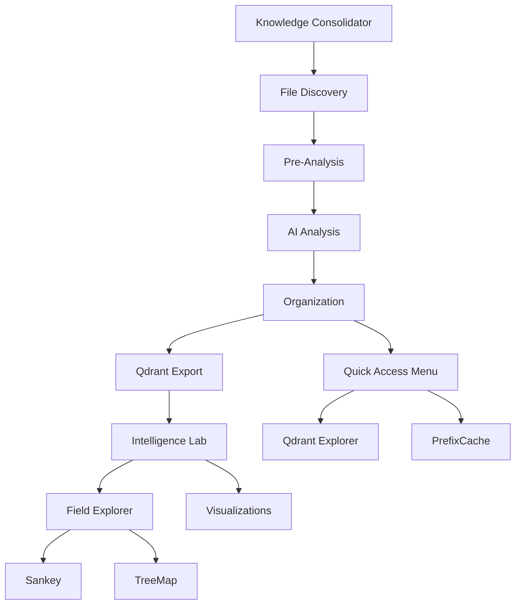

# 🗺️ MAPA COMPLETO DE VISUALIZAÇÕES - KNOWLEDGE CONSOLIDATOR
## Documentação de Referência para Reinicialização do Projeto
### Data: 31/07/2025 | Status: 🟢 DOCUMENTADO

---

## 📊 VISÃO GERAL DO ECOSSISTEMA

O projeto possui **3 camadas principais** de visualização:

1. **Sistema Base (Knowledge Consolidator)**: Interface principal de 4 etapas
2. **Intelligence Lab**: Sistema avançado de análise e visualização
3. **UI Library**: 35+ componentes visuais inovadores

---

## 🎯 1. SISTEMA BASE - KNOWLEDGE CONSOLIDATOR

### URL Principal
```
http://127.0.0.1:5500/index.html
```

### Componentes Principais

#### 📍 **WorkflowPanel** (Interface Principal)
- **Localização**: `js/components/WorkflowPanel.js`
- **Função**: Navegação entre as 4 etapas do processo
- **Conecta com**: Todos os managers do sistema

#### 📍 **4 Etapas do Workflow**

1. **Etapa 1 - Descoberta Automática**
   - **Componente**: DiscoveryManager
   - **UI**: Configuração de busca de arquivos
   - **Conecta com**: File System Access API

2. **Etapa 2 - Pré-Análise Local**
   - **Componente**: FilterPanel + FileRenderer
   - **UI**: Filtros avançados e lista de arquivos
   - **Conecta com**: PreviewUtils, FilterManager

3. **Etapa 3 - Análise IA Seletiva**
   - **Componente**: AnalysisManager
   - **UI**: Seleção de modelos e análise
   - **Conecta com**: AIAPIManager, Ollama

4. **Etapa 4 - Organização Inteligente**
   - **Componente**: OrganizationPanel
   - **UI**: Categorização e exportação
   - **Conecta com**: RAGExportManager, QdrantService

#### 📍 **Menu Quick Access** (Lateral Direito)
- **Atalho**: Ctrl+Shift+M
- **Opções**:
  1. 🔍 Qdrant Explorer
  2. 📊 PrefixCache Manager
  3. 🩺 System Diagnostics
  4. 🗑️ Reset Database
  5. ⚙️ API Configuration

---

## 🧠 2. INTELLIGENCE LAB - SISTEMA AVANÇADO

### 📁 Estrutura de Visualizações

#### A. **Field Explorer V4** (Análise Data-Driven)
```
http://127.0.0.1:5500/intelligence-lab/tests/field-explorer-v4.html
```

**Componentes**:
- `FieldExplorer.js`: Análise de campos disponíveis
- `FieldExplorerBusiness.js`: Lógica de negócio
- `VisualizationRecommender.js`: Recomendação automática

**Fluxo**:
1. Conecta ao Qdrant → 2. Lista campos → 3. Analisa compatibilidade → 4. Recomenda visualização

#### B. **Validate Qdrant V4** (Multi-Visualização)
```
http://127.0.0.1:5500/intelligence-lab/tests/validate-qdrant-v4.html
```

**Visualizações Disponíveis**:
1. **📊 Sankey** (`SankeyVisualizer.js`)
   - Mostra fluxos entre categorias
   - Ideal para: Conexões e relacionamentos

2. **🔲 TreeMap** (`TreeMapVisualizer.js`)
   - Hierarquia com drill-down
   - Ideal para: Proporções e estrutura

3. **☀️ Sunburst** (Em breve)
   - Hierarquia radial
   - Ideal para: Navegação circular

4. **🔗 Force Graph** (Em breve)
   - Rede de conexões
   - Ideal para: Relacionamentos complexos

#### C. **Outras Interfaces de Teste**

1. **Convergência Inteligente**
   ```
   http://127.0.0.1:5500/intelligence-lab/tests/convergencia-inteligente.html
   ```
   - Análise de convergência semântica

2. **Jornada do Conhecimento**
   ```
   http://127.0.0.1:5500/intelligence-lab/tests/jornada-conhecimento.html
   ```
   - Visualização temporal de evolução

3. **Obsidian Canvas Qdrant**
   ```
   http://127.0.0.1:5500/intelligence-lab/tests/obsidian-canvas-qdrant.html
   ```
   - Interface estilo Obsidian

4. **Zettelkasten Canvas**
   ```
   http://127.0.0.1:5500/intelligence-lab/tests/zettelkasten-canvas.html
   ```
   - Sistema de notas interconectadas

---

## 🎨 3. UI LIBRARY - COMPONENTES INOVADORES

### 📂 Localização: `intelligence-lab/ai_model/src/`

### Categorias de Componentes

#### A. **Interfaces Legacy** (10 componentes)
`ai_model/legacy/src/`
- `ui_innovation_1.html` até `ui_innovation_10.html`
- **Destaques**:
  - #3: GRAFO - Visualização de grafos
  - #4: VOLUME - Representação 3D
  - #7: PROGRESS_BAR - Barras animadas

#### B. **Interfaces Enhanced** (10 componentes)
`ai_model/legacy/src_enhanced/`
- `ui_enhanced_1.html` até `ui_enhanced_10.html`
- **Destaques**:
  - #2: DROPDOWN - Menus contextuais
  - #4: CARDS - Cards informativos
  - #7: TABS - Navegação por abas

#### C. **Interfaces Hybrid** (35+ componentes)
`ai_model/src/`
- `ui_hybrid_1.html` até `ui_hybrid_35.html`
- **Mais avançadas e completas**
- **Combinam múltiplas técnicas**

#### D. **Interfaces Grouped** (5 componentes modulares)
`ai_model/src_group/`
- Estrutura modular com HTML/CSS/JS separados
- `ui_hybrid_1/` até `ui_hybrid_5/`

#### E. **Interfaces Infinite** (25 componentes)
`ai_model/src_infinite/`
- Geradas por processo "infinite"
- Variações criativas dos temas base

---

## 🔗 MAPA DE CONEXÕES

### Fluxo Principal de Dados



### Dependências de Serviços

1. **Ollama** (Embeddings)
   - Usado por: EmbeddingService
   - Modelo: nomic-embed-text
   - Dimensões: 768

2. **Qdrant** (Vector DB)
   - URL: http://qdr.vcia.com.br:6333
   - Collections: knowledge_consolidator, PrefixCache
   - Usado por: QdrantService, Intelligence Lab

3. **IndexedDB** (Cache Local)
   - Usado por: CacheService, EmbeddingService
   - Armazena: Embeddings, metadata

---

## 🚀 COMO ACESSAR CADA VISUALIZAÇÃO

### 1. Sistema Principal
```bash
# Iniciar servidor (se não estiver rodando)
# Acessar: http://127.0.0.1:5500

# No console do navegador:
kcdiag()  # Verificar saúde do sistema
KC.AppState.get('files')  # Ver arquivos carregados
```

### 2. Intelligence Lab - Field Explorer
```bash
# Acessar diretamente:
http://127.0.0.1:5500/intelligence-lab/tests/field-explorer-v4.html

# Passos:
1. Clicar em "🔄 Conectar ao Qdrant"
2. Selecionar campos (mínimo 3)
3. Clicar em "Analisar Campos Selecionados"
4. Escolher visualização recomendada
```

### 3. Intelligence Lab - Multi-Visualização
```bash
# Acessar diretamente:
http://127.0.0.1:5500/intelligence-lab/tests/validate-qdrant-v4.html

# Passos:
1. Clicar no botão "🔄" (canto inferior direito)
2. Alternar entre Sankey/TreeMap no header
3. Explorar dados no painel lateral
```

### 4. UI Library - Componentes
```bash
# Exemplo de acesso direto:
http://127.0.0.1:5500/intelligence-lab/ai_model/src/ui_hybrid_1.html

# Navegação:
- Cada componente é independente
- Alguns têm dados mockados
- Outros conectam com Qdrant real
```

---

## 📊 ESTATÍSTICAS DO SISTEMA

### Componentes Criados
- **Sistema Base**: 15+ componentes principais
- **Intelligence Lab**: 10+ interfaces especializadas
- **UI Library**: 35+ componentes visuais
- **Total**: ~60 visualizações diferentes

### Tecnologias Utilizadas
- **Frontend**: Vanilla JS, CSS3, HTML5
- **Visualização**: D3.js, Vis.js, Chart.js
- **Backend**: Qdrant, Ollama, IndexedDB
- **Padrões**: ES6 Modules, Web Components

---

## 🔧 PRÓXIMOS PASSOS PARA RETOMADA

1. **Verificar Serviços**:
   - Ollama rodando em localhost:11434
   - Qdrant acessível em qdr.vcia.com.br:6333
   - Five Server na porta 5500

2. **Carregar Dados**:
   - Usar Etapa 1 para descobrir arquivos
   - Processar com filtros na Etapa 2
   - Analisar com IA na Etapa 3
   - Exportar para Qdrant na Etapa 4

3. **Explorar Visualizações**:
   - Começar com Field Explorer
   - Testar Sankey e TreeMap
   - Experimentar UI Library

---

## 📝 NOTAS IMPORTANTES

1. **Dados Carregados**: 4.075 entidades, 374.362 relacionamentos
2. **PrefixCache**: 163.075 prefixos pré-computados disponíveis
3. **Performance**: Sistema otimizado para grandes volumes
4. **Modularidade**: Cada componente pode funcionar independentemente

---

*Este documento serve como referência completa para navegação e retomada do projeto*
*Última atualização: 31/07/2025*