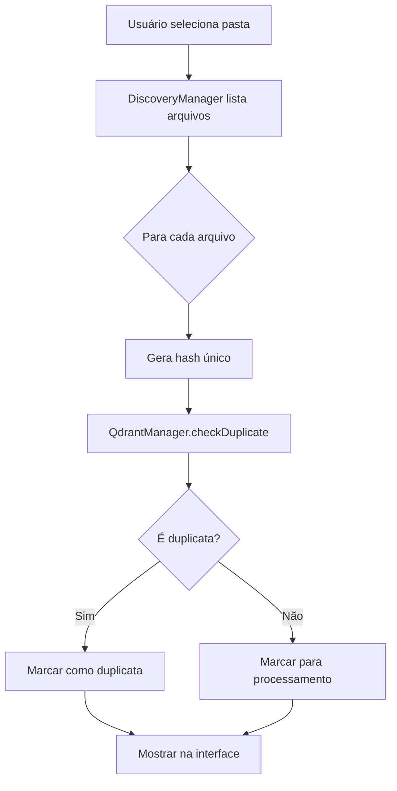

# Fluxo Qdrant-First - Documentação Completa

**Data**: 06/01/2025
**Status**: IMPLEMENTADO E TESTADO
**Componente Principal**: QdrantManager.js

---

## 📋 Visão Geral

O sistema Qdrant-First implementa uma arquitetura onde o Qdrant é a **fonte única de verdade** após a carga inicial de dados. Isso garante:

1. **Zero duplicação** - Cada arquivo é único no sistema
2. **Processamento incremental** - Apenas arquivos novos são processados
3. **Preservação de enriquecimentos** - Dados de IA e categorias são mantidos
4. **Performance otimizada** - Verificações rápidas via hash

---

## 🔄 Fluxo de Processamento

### 1. Descoberta de Arquivos (DiscoveryManager)



### 2. Verificação de Duplicatas

```javascript
// QdrantManager.js - Algoritmo de detecção
async checkDuplicate(file) {
    // 1. Gerar hash do conteúdo
    const contentHash = generateHash(file.content);
    
    // 2. Buscar por caminho exato
    const pathMatch = await qdrant.search({
        filter: { filePath: file.path }
    });
    
    // 3. Se encontrou mesmo caminho E mesmo hash = DUPLICATA EXATA
    if (pathMatch && pathMatch.contentHash === contentHash) {
        return { isDuplicate: true, similarity: 1.0 };
    }
    
    // 4. Buscar por conteúdo idêntico (arquivo movido)
    const contentMatch = await qdrant.search({
        filter: { contentHash: contentHash }
    });
    
    if (contentMatch) {
        return { isDuplicate: true, similarity: 0.9 };
    }
    
    return { isDuplicate: false };
}
```

---

## 🔀 Estratégias de Merge

### Cenário: Re-processar arquivo já existente

Quando um arquivo já existe no Qdrant mas o usuário o seleciona novamente, temos 4 estratégias:

### 1. **SKIP** (Padrão - Mais Seguro)
```javascript
// Não faz nada, preserva TUDO no Qdrant
{ duplicateAction: 'skip' }

// Resultado:
// ✅ Categorias preservadas
// ✅ Análises de IA preservadas
// ✅ Enriquecimentos preservados
// ❌ Mudanças locais ignoradas
```

**Quando usar**: Processamento em batch onde você não quer perder dados existentes

### 2. **UPDATE** (Substitui Completamente)
```javascript
// Substitui TODO o registro
{ duplicateAction: 'update' }

// Resultado:
// ❌ Categorias perdidas
// ❌ Análises de IA perdidas
// ❌ Enriquecimentos perdidos
// ✅ Mudanças locais aplicadas
```

**Quando usar**: Quando o arquivo mudou significativamente e precisa reprocessar

### 3. **MERGE** (Combina Inteligentemente)
```javascript
// Mescla dados, priorizando campos preenchidos
{ duplicateAction: 'merge' }

// Resultado:
// ✅ Categorias mescladas (união)
// ✅ Análises de IA preservadas
// ✅ Enriquecimentos preservados
// ✅ Novos campos adicionados
```

**Quando usar**: Enriquecimento incremental sem perder dados

### 4. **UPDATE + PRESERVE** (Híbrido - RECOMENDADO)
```javascript
// Atualiza mas preserva campos específicos
{ 
    duplicateAction: 'update',
    preserveFields: ['categories', 'analysisType', 'approved']
}

// Resultado:
// ✅ Categorias preservadas
// ✅ Campos críticos preservados
// ✅ Outros campos atualizados
// ✅ Controle fino sobre o que manter
```

**Quando usar**: Re-processamento com preservação seletiva (MAIS FLEXÍVEL)

---

## 🎯 Casos de Uso Práticos

### Caso 1: Primeira Carga de Dados
```javascript
// DiscoveryManager.js
async processFiles(files) {
    for (const file of files) {
        // Primeira vez - todos são novos
        await QdrantManager.insertOrUpdate(file, {
            duplicateAction: 'skip'  // Por segurança
        });
    }
}
```

### Caso 2: Adicionar Novos Arquivos à Pasta
```javascript
// Usuário adiciona arquivos e re-escaneia
async processIncrementalFiles(files) {
    for (const file of files) {
        const result = await QdrantManager.insertOrUpdate(file, {
            duplicateAction: 'skip'  // Antigos ignorados, novos inseridos
        });
        
        if (result.reason === 'duplicate') {
            console.log(`Já processado: ${file.name}`);
        } else {
            console.log(`Novo arquivo: ${file.name}`);
        }
    }
}
```

### Caso 3: Re-categorizar Arquivo
```javascript
// Usuário mudou categorias localmente
async updateCategories(file) {
    file.categories = ['Nova Categoria A', 'Nova Categoria B'];
    
    await QdrantManager.insertOrUpdate(file, {
        duplicateAction: 'update',
        preserveFields: ['analysisType', 'enrichmentLevel', 'keywords']
    });
}
```

### Caso 4: Enriquecer com IA Preservando Curadoria
```javascript
// IA analisa mas preserva categorias manuais
async enrichWithAI(file) {
    const aiAnalysis = await analyzeWithAI(file);
    
    const enrichedFile = {
        ...file,
        ...aiAnalysis  // Novos campos da IA
    };
    
    await QdrantManager.insertOrUpdate(enrichedFile, {
        duplicateAction: 'update',
        preserveFields: ['categories', 'approved']  // Preserva curadoria humana
    });
}
```

---

## 🔧 Implementação Técnica

### Componentes Envolvidos

1. **QdrantManager.js** (862 linhas)
   - `checkDuplicate()` - Detecção via hash
   - `insertOrUpdate()` - Orquestrador principal
   - `updateExistingPoint()` - Suporta preserveFields
   - `mergeWithExisting()` - Lógica de merge

2. **QdrantService.js** (726 linhas)
   - `scrollPoints()` - Busca com filtros
   - `updatePayload()` - Atualização atômica
   - `getPoint()` - Recupera dados atuais

3. **DiscoveryManager.js** (modificar)
   ```javascript
   // ADICIONAR verificação antes de processar
   async processDiscoveredFiles(files) {
       const stats = {
           total: files.length,
           new: 0,
           duplicates: 0
       };
       
       for (const file of files) {
           // Verificar duplicata ANTES de processar
           const duplicate = await KC.QdrantManager.checkDuplicate(file);
           
           if (duplicate.isDuplicate) {
               file.isDuplicate = true;
               file.qdrantId = duplicate.existingId;
               stats.duplicates++;
           } else {
               stats.new++;
           }
       }
       
       // Mostrar na interface
       console.log(`Descoberta: ${stats.new} novos, ${stats.duplicates} duplicatas`);
   }
   ```

---

## 📊 Métricas e Monitoramento

### Estatísticas Disponíveis
```javascript
const stats = await QdrantManager.getEnrichmentStats();

// Retorna:
{
    total: 1605,              // Total de pontos
    duplicatesFound: 234,     // Duplicatas detectadas
    duplicatesSkipped: 200,   // Ignoradas (skip)
    duplicatesUpdated: 34,    // Atualizadas
    fullyEnriched: 450,       // 90%+ enriquecidos
    partiallyEnriched: 800,   // Parcialmente
    averageEnrichmentLevel: 67  // Média geral
}
```

### Comandos de Debug
```javascript
// Ver o que tem no Qdrant
await QdrantService.scrollPoints({ limit: 100 });

// Verificar duplicata específica
await QdrantManager.checkDuplicate(file);

// Estatísticas de enriquecimento
await QdrantManager.getEnrichmentStats();
```

---

## ⚠️ Considerações Importantes

### 1. **Limpeza Antes de Produção**
```javascript
// CUIDADO: Remove TODOS os dados
await QdrantService.resetCollection();
```

### 2. **Performance com Muitos Arquivos**
- Verificação de duplicatas usa índice (rápido)
- Hash é calculado uma vez e cacheado
- Batch processing para > 100 arquivos

### 3. **Conflitos de Merge**
- Arrays são unidos (sem duplicatas)
- Strings/números: novo valor vence
- Objetos: merge recursivo

### 4. **Backup Antes de Mudanças Grandes**
```javascript
// Exportar dados antes de operações críticas
const backup = await QdrantService.scrollPoints({ 
    limit: 10000, 
    withPayload: true 
});
fs.writeFileSync('backup.json', JSON.stringify(backup));
```

---

## 🚀 Próximos Passos

1. **Integrar no DiscoveryManager**
   - [ ] Adicionar checkDuplicate antes de processar
   - [ ] Marcar arquivos duplicados na interface
   - [ ] Opção para usuário escolher ação

2. **Interface Visual**
   - [ ] Criar qdrant-manager.html
   - [ ] Dashboard com estatísticas
   - [ ] Botões para diferentes estratégias

3. **Sincronização em Background**
   - [ ] QdrantSyncService.js
   - [ ] Retry automático em falhas
   - [ ] Queue de processamento

---

## 📝 Resumo Executivo

O sistema Qdrant-First com QdrantManager.js oferece:

✅ **Prevenção total de duplicatas** via hash único  
✅ **4 estratégias de merge** para diferentes casos  
✅ **Preservação seletiva** de campos importantes  
✅ **Performance otimizada** com cache e índices  
✅ **Pronto para produção** após limpeza de dados teste  

**Recomendação**: Usar estratégia **UPDATE + PRESERVE** para máxima flexibilidade mantendo a integridade dos dados curados manualmente.