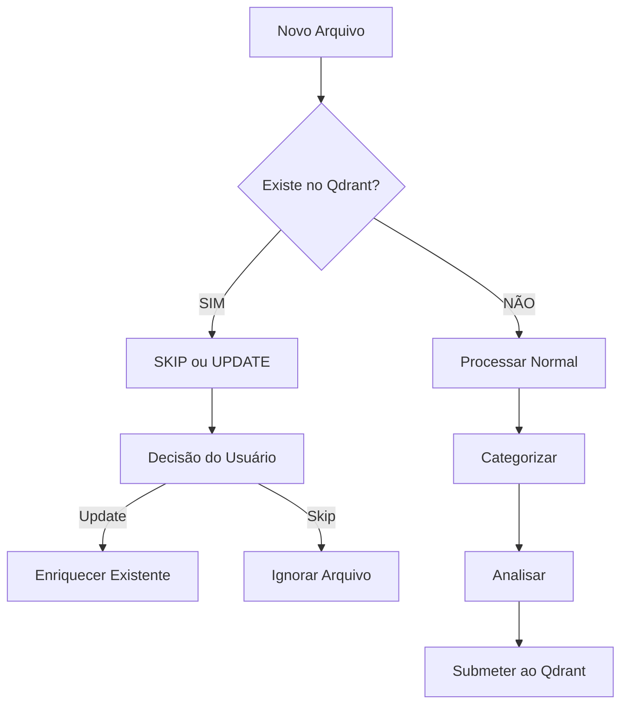

# 📊 FLUXO QDRANT-FIRST - Versão 2.0

**Princípio Fundamental**: Qdrant é a ÚNICA fonte de verdade após primeira carga

---

## 🔄 NOVO FLUXO DE TRABALHO

### 1️⃣ **CONSULTA SEMPRE PRIMEIRO**

Antes de QUALQUER operação com arquivos:

```javascript
// SEMPRE verificar se arquivo já existe no Qdrant
async function checkFileInQdrant(filePath) {
    const results = await KC.QdrantService.search({
        filter: {
            must: [
                { key: "filePath", match: { value: filePath } }
            ]
        }
    });
    return results.length > 0;
}
```

### 2️⃣ **FLUXO PARA NOVOS ARQUIVOS**



### 3️⃣ **FLUXO DE ENRIQUECIMENTO (Dados EXISTENTES)**

```javascript
class QdrantEnrichmentService {
    async enrichExistingData() {
        // 1. Buscar TODOS os pontos do Qdrant
        const points = await this.getAllPoints();
        
        // 2. Para CADA ponto existente
        for (const point of points) {
            // 3. Verificar campos vazios
            const missingFields = this.identifyMissingFields(point);
            
            // 4. Enriquecer APENAS campos vazios
            const enrichedData = await this.enrichOnlyMissing(point, missingFields);
            
            // 5. UPDATE no Qdrant (não INSERT)
            await KC.QdrantService.updatePoint(point.id, enrichedData);
        }
    }
}
```

---

## 🚫 PREVENÇÃO DE DUPLICAÇÃO

### Estratégia de Identificação Única:

```javascript
// Gerar ID único baseado em conteúdo + caminho
function generateUniqueId(file) {
    const contentHash = MD5(file.content);
    const pathHash = MD5(file.path);
    return `${pathHash}-${contentHash}`;
}

// Verificar duplicação antes de inserir
async function preventDuplication(file) {
    const uniqueId = generateUniqueId(file);
    
    // Buscar por ID ou caminho
    const existing = await KC.QdrantService.search({
        filter: {
            should: [
                { key: "id", match: { value: uniqueId } },
                { key: "filePath", match: { value: file.path } },
                { key: "contentHash", match: { value: MD5(file.content) } }
            ]
        }
    });
    
    if (existing.length > 0) {
        return {
            isDuplicate: true,
            existingId: existing[0].id,
            action: await promptUser() // "skip", "update", "merge"
        };
    }
    
    return { isDuplicate: false };
}
```

---

## 🔄 OPERAÇÕES QDRANT-FIRST

### 1. **LISTAR** - Sempre do Qdrant
```javascript
async function listAllFiles() {
    const points = await KC.QdrantService.scroll({
        limit: 1000,
        with_payload: true,
        with_vector: false
    });
    
    return points.map(p => ({
        id: p.id,
        fileName: p.payload.fileName,
        filePath: p.payload.filePath,
        categories: p.payload.categories,
        enrichmentLevel: calculateEnrichmentLevel(p.payload)
    }));
}
```

### 2. **ENRIQUECER** - Update, não Insert
```javascript
async function enrichExistingPoint(pointId) {
    // Buscar ponto atual
    const point = await KC.QdrantService.getPoint(pointId);
    
    // Identificar campos vazios
    const emptyFields = getEmptyFields(point.payload);
    
    // Enriquecer APENAS vazios
    const enrichment = await generateEnrichment(point, emptyFields);
    
    // UPDATE (não INSERT!)
    await KC.QdrantService.updatePayload(pointId, enrichment);
}
```

### 3. **SINCRONIZAR** - Interface ↔ Qdrant
```javascript
async function syncWithQdrant() {
    // Interface SEMPRE pega dados do Qdrant
    const qdrantData = await KC.QdrantService.getAllPoints();
    
    // Atualizar interface (read-only)
    updateUIWithQdrantData(qdrantData);
    
    // NÃO salvar no localStorage!
    // Qdrant é a fonte de verdade
}
```

---

## 🎯 CENÁRIOS DE USO

### Cenário 1: Primeira Sessão
1. Upload arquivos → Interface temporária
2. Categorizar → Interface temporária
3. Submeter → Qdrant (fonte de verdade)
4. Interface limpa → Dados só no Qdrant

### Cenário 2: Segunda Sessão (Novos Arquivos)
1. Upload novos arquivos
2. **VERIFICAR duplicação no Qdrant**
3. Se duplicado → Opções: Skip/Update/Merge
4. Se novo → Processar normal
5. Submeter apenas novos/atualizados

### Cenário 3: Enriquecimento
1. **NÃO precisa de arquivos na interface**
2. Buscar dados DIRETO do Qdrant
3. Enriquecer campos vazios
4. UPDATE no Qdrant
5. Mostrar progresso na interface

---

## 🛡️ REGRAS DE OURO

1. **NUNCA** duplicar dados no Qdrant
2. **SEMPRE** verificar existência antes de inserir
3. **INTERFACE** é apenas visualização temporária
4. **QDRANT** é a única fonte de verdade persistente
5. **ENRIQUECIMENTO** trabalha com dados do Qdrant, não da interface

---

## 📊 NOVO COMPONENTE: QdrantManager

```javascript
class QdrantManager {
    // Centraliza TODAS operações com Qdrant
    
    async checkDuplicate(file) { }
    async insertOrUpdate(file) { }
    async enrichExisting(pointId) { }
    async listAll() { }
    async syncInterface() { }
    async preventDuplication(file) { }
    
    // Estatísticas
    async getEnrichmentStats() {
        const points = await this.getAllPoints();
        return {
            total: points.length,
            fullyEnriched: points.filter(p => this.isFullyEnriched(p)).length,
            partiallyEnriched: points.filter(p => this.isPartiallyEnriched(p)).length,
            notEnriched: points.filter(p => this.isNotEnriched(p)).length
        };
    }
}
```

---

## ⚠️ MUDANÇAS CRÍTICAS NO PIPELINE

### ANTES (Problemático):
1. Upload → Categorizar → Analisar → Qdrant → FIM
2. Nova sessão → Upload MESMOS arquivos → DUPLICAÇÃO!

### DEPOIS (Correto):
1. Upload → **VERIFICAR QDRANT** → Categorizar → Analisar → Qdrant
2. Nova sessão → Upload → **DETECTAR DUPLICADOS** → Skip/Update
3. Enriquecimento → **DIRETO NO QDRANT** → Sem re-upload

---

**Este é o fluxo correto que evita duplicação e trabalha com Qdrant como fonte única de verdade!**