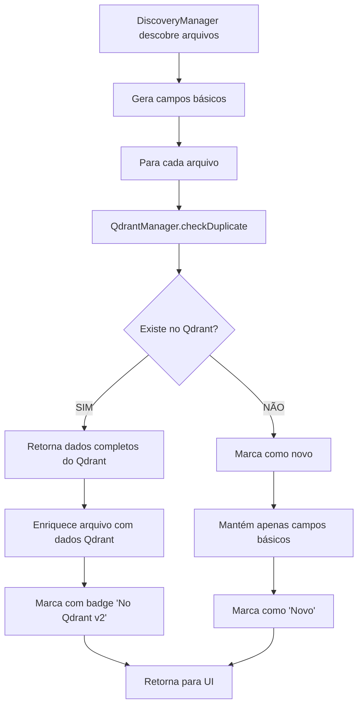

# Plano de Integração Discovery + Qdrant - V2
## Arquitetura Qdrant-First com Fonte Única de Verdade

**Data**: 06/01/2025  
**Status**: PLANO APROVADO - PRONTO PARA IMPLEMENTAÇÃO  
**Versão**: 2.0 (Revisada com consistência de campos)

---

## 🎯 CONCEITO FUNDAMENTAL

### Qdrant como Fonte de Verdade
- **Discovery**: Gera apenas campos básicos (fileName, path, size, content)
- **Qdrant**: Autoridade sobre campos de controle (version, enrichmentLevel, contentHash)
- **Merge**: Sempre preserva campos Qdrant-only durante atualizações

---

## 📊 SEPARAÇÃO DE RESPONSABILIDADES

### Campos do DiscoveryManager (Origem)
```javascript
// Campos que o Discovery conhece e fornece
{
    fileName: string,        // Nome do arquivo
    filePath: string,        // Caminho completo
    path: string,           // Caminho alternativo
    size: number,           // Tamanho em bytes
    content: string,        // Conteúdo do arquivo
    preview: string,        // Preview gerado
    lastModified: Date,     // Data de modificação
    type: string,           // MIME type
    extension: string,      // Extensão do arquivo
    relativePath: string,   // Caminho relativo
    categories: [],         // Categorias do usuário (se houver)
    relevanceScore: number  // Score calculado localmente
}
```

### Campos do QdrantManager (Controle)
```javascript
// Campos que APENAS o Qdrant gerencia
{
    // Identificação única
    id: number,             // ID numérico único
    contentHash: string,    // Hash para detecção de duplicatas
    
    // Versionamento
    version: number,        // Versão do registro (incrementa a cada update)
    insertedAt: string,     // Timestamp de primeira inserção
    lastModified: string,   // Timestamp de última modificação
    
    // Enriquecimento
    enrichmentLevel: number,    // Percentual de enriquecimento (0-100)
    lastEnriched: string,       // Timestamp do último enriquecimento
    keywords: [],               // Keywords extraídas
    sentiment: string,          // Análise de sentimento
    
    // Controle de merge
    lastMerged: string,         // Timestamp do último merge
    mergeCount: number,         // Contador de merges realizados
    preservedFields: [],        // Campos preservados no último update
    
    // Análise IA (após enriquecimento)
    analysisType: string,       // Tipo de análise detectado
    decisiveMoment: boolean,    // É momento decisivo?
    breakthrough: boolean,      // É breakthrough?
    confidenceScore: number,    // Score de confiança
    expertiseLevel: string      // Nível de expertise detectado
}
```

---

## 🔄 FLUXO DE PROCESSAMENTO COMPLETO

### Fase 1: Discovery → Verificação no Qdrant



### Fase 2: Processamento com Estratégia Escolhida

```javascript
// DiscoveryManager.js - NOVO MÉTODO
async processDiscoveredFiles(files) {
    const processedFiles = [];
    const stats = {
        total: files.length,
        new: 0,
        duplicates: 0,
        enrichedFromQdrant: 0
    };
    
    for (const file of files) {
        // 1. VERIFICAR NO QDRANT
        const qdrantCheck = await KC.QdrantManager.checkDuplicate(file);
        
        if (qdrantCheck.isDuplicate) {
            // 2. ARQUIVO JÁ EXISTE - ENRIQUECER COM DADOS DO QDRANT
            const qdrantData = qdrantCheck.existingPoint.payload;
            
            // Preservar campos importantes do Qdrant
            file.qdrantId = qdrantCheck.existingId;
            file.version = qdrantData.version;
            file.enrichmentLevel = qdrantData.enrichmentLevel;
            file.contentHash = qdrantData.contentHash;
            
            // Preservar curadoria humana
            file.categories = qdrantData.categories || file.categories;
            file.analysisType = qdrantData.analysisType;
            file.approved = qdrantData.approved;
            
            // Metadados para UI
            file.isDuplicate = true;
            file.badgeText = `Qdrant v${qdrantData.version}`;
            file.badgeColor = qdrantData.enrichmentLevel > 50 ? 'green' : 'yellow';
            
            stats.duplicates++;
            stats.enrichedFromQdrant++;
            
        } else {
            // 3. ARQUIVO NOVO
            file.isNew = true;
            file.badgeText = 'Novo';
            file.badgeColor = 'blue';
            stats.new++;
        }
        
        processedFiles.push(file);
    }
    
    // 4. EMITIR EVENTO PARA UI
    KC.EventBus.emit('DISCOVERY_COMPLETE', {
        files: processedFiles,
        stats: stats
    });
    
    // 5. LOG PARA USUÁRIO
    console.log(`Discovery completo: ${stats.new} novos, ${stats.duplicates} já no Qdrant`);
    
    return processedFiles;
}
```

---

## 🔧 IMPLEMENTAÇÕES NECESSÁRIAS

### 1. QdrantManager - Ajustes para Retornar Dados Completos

```javascript
// QdrantManager.js - checkDuplicate()
async checkDuplicate(file) {
    try {
        // ... lógica de busca ...
        
        if (results && results.points && results.points.length > 0) {
            const existingPoint = results.points[0];
            
            return {
                isDuplicate: true,
                existingPoint: existingPoint,  // RETORNA PONTO COMPLETO
                existingId: existingPoint.id,
                similarity: 1.0,
                // Adicionar resumo para log
                summary: {
                    version: existingPoint.payload.version,
                    enrichmentLevel: existingPoint.payload.enrichmentLevel,
                    categories: existingPoint.payload.categories
                }
            };
        }
        
        return { isDuplicate: false };
    } catch (error) {
        console.error('Erro ao verificar duplicata:', error);
        return { isDuplicate: false, error: error.message };
    }
}
```

### 2. QdrantManager - Merge Respeitando Campos Qdrant-Only

```javascript
// QdrantManager.js - mergeWithExisting()
async mergeWithExisting(existingPoint, newData, options = {}) {
    // CAMPOS QUE NUNCA DEVEM VIR DO DISCOVERY
    const qdrantOnlyFields = [
        'id', 'version', 'contentHash', 'insertedAt',
        'enrichmentLevel', 'lastEnriched', 'mergeCount',
        'lastMerged', 'keywords', 'sentiment',
        'decisiveMoment', 'breakthrough', 'confidenceScore'
    ];
    
    const mergedPayload = {};
    
    // 1. COMEÇAR COM TODOS OS DADOS DO QDRANT
    Object.assign(mergedPayload, existingPoint.payload);
    
    // 2. ATUALIZAR APENAS CAMPOS PERMITIDOS
    for (const [key, value] of Object.entries(newData)) {
        if (!qdrantOnlyFields.includes(key)) {
            if (Array.isArray(mergedPayload[key]) && Array.isArray(value)) {
                // Mesclar arrays (ex: categories)
                mergedPayload[key] = [...new Set([...mergedPayload[key], ...value])];
            } else if (value !== undefined && value !== null && value !== '') {
                // Atualizar valor se não vazio
                mergedPayload[key] = value;
            }
        }
    }
    
    // 3. ATUALIZAR METADADOS DE CONTROLE
    mergedPayload.version = (mergedPayload.version || 0) + 1;
    mergedPayload.lastModified = new Date().toISOString();
    mergedPayload.lastMerged = new Date().toISOString();
    mergedPayload.mergeCount = (mergedPayload.mergeCount || 0) + 1;
    
    // 4. EXECUTAR UPDATE
    return await this.updateExistingPoint(
        existingPoint.id,
        mergedPayload,
        options
    );
}
```

### 3. DiscoveryManager - Novo Método de Enriquecimento

```javascript
// DiscoveryManager.js - ADICIONAR
async enrichFilesWithQdrantData(files) {
    console.log(`Verificando ${files.length} arquivos no Qdrant...`);
    
    const enrichmentStats = {
        enriched: 0,
        new: 0,
        errors: 0
    };
    
    for (const file of files) {
        try {
            const qdrantCheck = await KC.QdrantManager.checkDuplicate(file);
            
            if (qdrantCheck.isDuplicate && qdrantCheck.existingPoint) {
                // Enriquecer com dados do Qdrant
                const payload = qdrantCheck.existingPoint.payload;
                
                // Adicionar campos de controle
                file.qdrantMetadata = {
                    id: qdrantCheck.existingId,
                    version: payload.version,
                    enrichmentLevel: payload.enrichmentLevel,
                    insertedAt: payload.insertedAt,
                    lastModified: payload.lastModified
                };
                
                // Preservar curadoria
                if (payload.categories && payload.categories.length > 0) {
                    file.categories = payload.categories;
                }
                if (payload.approved !== undefined) {
                    file.approved = payload.approved;
                }
                
                enrichmentStats.enriched++;
            } else {
                enrichmentStats.new++;
            }
        } catch (error) {
            console.error(`Erro ao enriquecer ${file.fileName}:`, error);
            enrichmentStats.errors++;
        }
    }
    
    console.log('Enriquecimento completo:', enrichmentStats);
    return enrichmentStats;
}
```

### 4. Interface Visual - Mostrar Status Qdrant

```javascript
// FileRenderer.js - Adicionar badges visuais
renderFileItem(file) {
    const badges = [];
    
    if (file.isDuplicate) {
        badges.push({
            text: file.badgeText || 'No Qdrant',
            color: file.badgeColor || 'yellow',
            tooltip: `Versão ${file.version}, ${file.enrichmentLevel}% enriquecido`
        });
    }
    
    if (file.isNew) {
        badges.push({
            text: 'Novo',
            color: 'blue',
            tooltip: 'Arquivo ainda não processado'
        });
    }
    
    // Renderizar badges na UI
}
```

---

## 🎯 BENEFÍCIOS DA ARQUITETURA

1. **Separação Clara de Responsabilidades**
   - Discovery: Apenas descoberta e campos básicos
   - Qdrant: Controle, versionamento e enriquecimento

2. **Preservação de Dados**
   - Categorias nunca se perdem
   - Análises de IA preservadas
   - Versionamento automático

3. **Performance**
   - Detecção rápida de duplicatas via hash
   - Processamento incremental
   - Cache de verificações

4. **Flexibilidade**
   - Fácil adicionar novos campos no Qdrant
   - Discovery não precisa ser alterado
   - Estratégias de merge configuráveis

---

## 📋 CHECKLIST DE IMPLEMENTAÇÃO

- [ ] Ajustar QdrantManager.checkDuplicate() para retornar ponto completo
- [ ] Implementar lista de campos qdrantOnlyFields no merge
- [ ] Adicionar enrichFilesWithQdrantData() no DiscoveryManager
- [ ] Criar processDiscoveredFiles() com verificação Qdrant
- [ ] Adicionar badges visuais no FileRenderer
- [ ] Testar fluxo completo com arquivos reais
- [ ] Validar preservação de categorias
- [ ] Confirmar incremento de version

---

## 🔒 PONTO DE RECUPERAÇÃO

**Checkpoint criado em**: 06/01/2025  
**Branch**: qdrant-try1  
**Commit atual**: Implementação de teste MERGE funcionando  
**Próximo passo**: Integrar com DiscoveryManager seguindo este plano  

Se precisar voltar: 
```bash
git stash
git checkout qdrant-try1
```

---

**NOTA**: Este é o plano de IMPLEMENTAÇÃO, não correção. O sistema atual funciona, este plano adiciona a integração completa Discovery + Qdrant com consistência total.