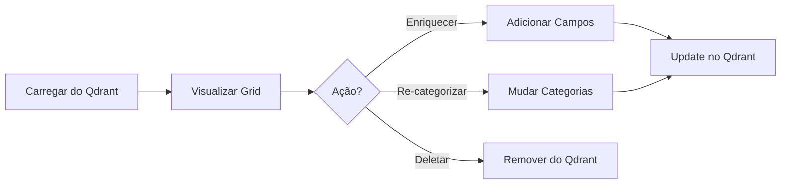
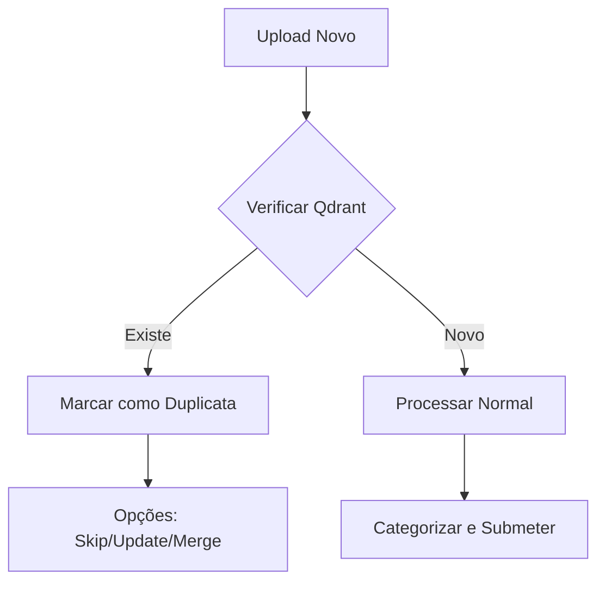

# 🏗️ ARQUITETURA V3: Interfaces Separadas por Contexto

**Princípio**: Separar completamente fluxos de NOVO CONTEÚDO vs GESTÃO DO EXISTENTE

---

## 📱 ESTRUTURA DE INTERFACES PROPOSTA

### Interface 1: **index.html** (ATUAL - Upload/Categorização)
**Propósito**: Processar NOVOS arquivos
- Upload de arquivos
- Categorização manual
- Análise com IA
- Submissão inicial ao Qdrant
- **NÃO** mostra dados já no Qdrant

### Interface 2: **qdrant-manager.html** (NOVA)
**Propósito**: Gerenciar dados EXISTENTES no Qdrant
- Visualizar todos os documentos no Qdrant
- Enriquecer campos vazios
- Detectar e resolver duplicatas
- Monitorar qualidade dos dados
- Re-categorizar se necessário
- **NÃO** faz upload de novos arquivos

### Interface 3: **qdrant-search.html** (NOVA)
**Propósito**: Busca e exploração
- Busca semântica
- Filtros avançados
- Visualização de relacionamentos
- Export de resultados
- **Read-only** - apenas consulta

---

## 🗂️ ESTRUTURA DE ARQUIVOS ATUALIZADA

```
vcia_dhl/
├── index.html                    # Interface de upload (existente)
├── qdrant-manager.html           # NOVA - Gestão Qdrant
├── qdrant-search.html            # NOVA - Busca/Exploração
├── js/
│   ├── managers/
│   │   ├── DiscoveryManager.js  # Upload novos
│   │   ├── QdrantManager.js     # NOVO - Gestão existentes
│   │   └── RAGExportManager.js  # Export
│   ├── services/
│   │   ├── QdrantService.js     # Conexão base
│   │   ├── QdrantSyncService.js # NOVO - Sincronização
│   │   └── QdrantEnrichmentService.js # NOVO - Enriquecimento
│   ├── components/
│   │   ├── FileRenderer.js      # Para index.html
│   │   ├── QdrantGrid.js        # NOVO - Para qdrant-manager.html
│   │   └── SearchInterface.js   # NOVO - Para qdrant-search.html
│   └── pages/
│       ├── upload-page.js       # Lógica index.html
│       ├── manager-page.js      # NOVO - Lógica qdrant-manager
│       └── search-page.js       # NOVO - Lógica qdrant-search
└── qdrant-fase/
    ├── v1-quad-plan.md
    ├── v2-fluxo-qdrant-first.md
    └── v3-arquitetura-interfaces-separadas.md # Este arquivo
```

---

## 🔄 FLUXO DE TRABALHO REVISADO

### Fluxo A: Primeira Carga (index.html)


### Fluxo B: Gestão Existente (qdrant-manager.html)


### Fluxo C: Upload com Verificação (index.html melhorado)


---

## 📋 IMPLEMENTAÇÃO POR FASES

### FASE 1: Atualizar Documentação Existente ✅
- [x] v1-quad-plan.md
- [x] v2-fluxo-qdrant-first.md  
- [x] v3-arquitetura-interfaces-separadas.md
- [ ] CONTROLE-FASE-QDRANT.md (atualizar)

### FASE 2: Backend Qdrant-First
- [ ] QdrantManager.js - Gestão centralizada
- [ ] QdrantSyncService.js - Sincronização
- [ ] QdrantEnrichmentService.js - Enriquecimento
- [ ] Anti-duplicação no DiscoveryManager.js

### FASE 3: Interface de Gestão (qdrant-manager.html)
- [ ] HTML base com Bootstrap/Tailwind
- [ ] QdrantGrid.js - Grid de documentos
- [ ] Botões de ação por documento
- [ ] Bulk operations
- [ ] Filtros e ordenação

### FASE 4: Interface de Busca (qdrant-search.html)
- [ ] Campo de busca semântica
- [ ] Filtros avançados
- [ ] Resultados com highlights
- [ ] Export de resultados

### FASE 5: Melhorias no Upload (index.html)
- [ ] Verificação de duplicatas
- [ ] Indicador visual de status
- [ ] Opções de merge/update

---

## 🎯 BENEFÍCIOS DA SEPARAÇÃO

1. **Clareza Mental**: Cada interface tem um propósito claro
2. **Performance**: Páginas menores e mais rápidas
3. **Manutenção**: Código organizado por contexto
4. **UX**: Usuário sabe exatamente onde está e o que pode fazer
5. **Escalabilidade**: Fácil adicionar novas funcionalidades

---

## 🚀 NAVEGAÇÃO ENTRE INTERFACES

### Menu de Navegação Global
```html
<nav class="qdrant-nav">
    <a href="index.html">📤 Upload Novos</a>
    <a href="qdrant-manager.html">📊 Gerenciar Qdrant</a>
    <a href="qdrant-search.html">🔍 Buscar</a>
</nav>
```

---

## 📊 PÁGINA QDRANT-MANAGER.HTML (Conceito)

```html
<!DOCTYPE html>
<html>
<head>
    <title>Qdrant Manager - Knowledge Consolidator</title>
</head>
<body>
    <!-- Estatísticas -->
    <div class="stats-bar">
        <div>Total: <span id="total-docs">0</span></div>
        <div>Enriquecidos: <span id="enriched">0</span></div>
        <div>Pendentes: <span id="pending">0</span></div>
    </div>
    
    <!-- Grid de Documentos -->
    <div class="documents-grid">
        <!-- Carregado dinamicamente do Qdrant -->
    </div>
    
    <!-- Ações em Massa -->
    <div class="bulk-actions">
        <button onclick="enrichSelected()">Enriquecer Selecionados</button>
        <button onclick="exportSelected()">Exportar</button>
    </div>
</body>
</html>
```

---

## ⚠️ PONTOS CRÍTICOS

1. **NUNCA** misturar dados locais (upload) com dados Qdrant na mesma view
2. **SEMPRE** deixar claro qual é a fonte de dados
3. **SEPARAR** claramente operações de INSERT vs UPDATE
4. **INDICAR** visualmente o status de cada documento

---

**Esta arquitetura segue as melhores práticas de separação de responsabilidades e clareza de interface!**