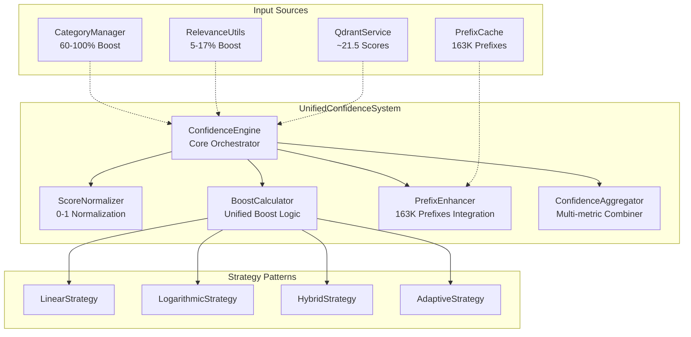

# UnifiedConfidenceSystem - Especificação Técnica Completa

**Coordenação das 4 Perspectivas de Desenvolvimento**

*Data: 01/08/2025*  
*Versão: 2.0.0*  
*Status: Especificação Técnica para Implementação*

---

## 🎯 RESUMO EXECUTIVO

### Problema Identificado
O sistema atual possui **3 implementações conflitantes de cálculo de confiança**:

1. **CategoryManager**: Boost linear 60-100% (fórmula: `1.5 + categoryCount * 0.1`)
2. **RelevanceUtils**: Boost logarítmico 5-17% (fórmula: `1 + log(categoryCount+1) * 0.05`)
3. **Scores Qdrant**: Valores não padronizados ~21.5 (deveria ser 0-1)
4. **Arquivos 0%**: Permanecem em 0% independente de categorização
5. **PrefixCache**: 163K prefixos carregados mas não utilizados

### Solução Proposta
**UnifiedConfidenceSystem** - Sistema unificado que consolida todos os cálculos de confiança em uma arquitetura modular, extensível e consistente.

---

## 🏗️ PERSPECTIVA 1: ARCHITECT

### Arquitetura Unificada



### Design Patterns Aplicados

#### 1. **Strategy Pattern**
Diferentes algoritmos de boost podem ser aplicados dinamicamente:
- **LinearStrategy**: Para crescimento linear (atual CategoryManager)
- **LogarithmicStrategy**: Para crescimento suave (atual RelevanceUtils)
- **HybridStrategy**: Combina ambos baseado no contexto
- **AdaptiveStrategy**: Ajusta automaticamente baseado em métricas

#### 2. **Factory Pattern**
Cria calculadores apropriados baseado no contexto:
```javascript
class ConfidenceCalculatorFactory {
    static create(context) {
        if (context.hasCategories && context.categoryCount > 3) {
            return new LogarithmicCalculator();
        } else if (context.isZeroRelevance) {
            return new ZeroRelevanceCalculator();
        }
        return new HybridCalculator();
    }
}
```

#### 3. **Observer Pattern**
Notifica mudanças de confiança para componentes dependentes:
```javascript
class ConfidenceObserver {
    onConfidenceChanged(fileId, oldScore, newScore, factors) {
        // Atualiza UI, Qdrant, logs, etc.
    }
}
```

### Tratamento de Edge Cases

#### Arquivos 0% - Solução Multi-Camada
```javascript
class ZeroRelevanceResolver {
    resolve(file) {
        const factors = {
            semanticContent: this.analyzeSemanticContent(file),
            structuralSignals: this.extractStructuralSignals(file),
            contextualRelevance: this.calculateContextualRelevance(file),
            prefixMatches: this.findPrefixMatches(file)
        };
        
        return this.aggregateFactors(factors);
    }
}
```

---

## 💻 PERSPECTIVA 2: DEVELOPER

### Estrutura de Classes Principal

#### UnifiedConfidenceSystem (Core)
```javascript
class UnifiedConfidenceSystem {
    constructor(options = {}) {
        this.config = {
            strategy: options.strategy || 'hybrid',
            enablePrefixEnhancement: options.enablePrefixEnhancement ?? true,
            scoreRange: options.scoreRange || [0, 1],
            cacheResults: options.cacheResults ?? true
        };
        
        this.scoreNormalizer = new ScoreNormalizer(this.config);
        this.boostCalculator = new BoostCalculator(this.config);
        this.prefixEnhancer = new PrefixEnhancer(this.config);
        this.aggregator = new ConfidenceAggregator(this.config);
        
        this.cache = new Map();
        this.observers = [];
    }
    
    /**
     * Pipeline principal de cálculo de confiança
     * @param {Object} file - Arquivo para análise
     * @param {Object} context - Contexto adicional
     * @returns {Promise<Object>} Resultado com score e detalhes
     */
    async calculateConfidence(file, context = {}) {
        const cacheKey = this.generateCacheKey(file, context);
        
        if (this.cache.has(cacheKey)) {
            return this.cache.get(cacheKey);
        }
        
        try {
            // Pipeline: normalize → boost → enhance → aggregate
            const normalized = await this.scoreNormalizer.normalize(file);
            const boosted = await this.boostCalculator.calculate(normalized, context);
            const enhanced = await this.prefixEnhancer.enhance(boosted, file);
            const result = await this.aggregator.aggregate(enhanced, context);
            
            // Cache e notificação
            this.cache.set(cacheKey, result);
            this.notifyObservers(file, result);
            
            return result;
        } catch (error) {
            console.error('Erro no cálculo de confiança:', error);
            return this.getFallbackScore(file);
        }
    }
    
    /**
     * Migra scores do sistema legado
     */
    async migrateFromLegacy(files) {
        const migrationReport = {
            processed: 0,
            updated: 0,
            errors: []
        };
        
        for (const file of files) {
            try {
                const legacyScore = this.extractLegacyScore(file);
                const newScore = await this.calculateConfidence(file);
                
                if (Math.abs(legacyScore - newScore.finalScore) > 0.1) {
                    migrationReport.updated++;
                }
                
                migrationReport.processed++;
            } catch (error) {
                migrationReport.errors.push({ file: file.id, error: error.message });
            }
        }
        
        return migrationReport;
    }
}
```

#### ScoreNormalizer
```javascript
class ScoreNormalizer {
    constructor(config = {}) {
        this.targetRange = config.scoreRange || [0, 1];
        this.detectionThresholds = {
            percentage: 1.1,    // Valores > 1.1 são considerados percentuais
            qdrant: 10,         // Valores > 10 são considerados scores Qdrant
            normalized: 1       // Valores <= 1 já estão normalizados
        };
    }
    
    /**
     * Normaliza qualquer score para o range 0-1
     */
    normalize(input) {
        const score = this.extractScore(input);
        const sourceType = this.detectSourceType(score);
        
        switch (sourceType) {
            case 'percentage':
                return this.fromPercentage(score);
            case 'qdrant':
                return this.fromQdrantScore(score);
            case 'normalized':
                return score;
            default:
                return this.fromUnknownScale(score);
        }
    }
    
    /**
     * Converte scores Qdrant (~21.5) para 0-1
     */
    fromQdrantScore(score) {
        // Qdrant similarity scores geralmente variam de 0 a ~30
        // Normaliza usando função sigmoide suave
        const normalized = score / 30;
        return Math.min(1, Math.max(0, normalized));
    }
    
    /**
     * Converte percentuais (0-100) para 0-1
     */
    fromPercentage(score) {
        return Math.min(1, Math.max(0, score / 100));
    }
    
    /**
     * Para exibição em UI (converte 0-1 para 0-100)
     */
    toPercentage(normalizedScore) {
        return Math.round(normalizedScore * 100);
    }
    
    /**
     * Detecta o tipo de score baseado no valor
     */
    detectSourceType(score) {
        if (score > this.detectionThresholds.qdrant) return 'qdrant';
        if (score > this.detectionThresholds.percentage) return 'percentage';
        if (score <= this.detectionThresholds.normalized) return 'normalized';
        return 'unknown';
    }
}
```

#### BoostCalculator
```javascript
class BoostCalculator {
    constructor(config = {}) {
        this.strategy = config.strategy || 'hybrid';
        this.strategies = {
            linear: new LinearBoostStrategy(),
            logarithmic: new LogarithmicBoostStrategy(),
            hybrid: new HybridBoostStrategy(),
            adaptive: new AdaptiveBoostStrategy()
        };
    }
    
    async calculate(normalizedInput, context = {}) {
        const strategy = this.selectStrategy(context);
        
        const boosts = {
            category: await strategy.calculateCategoryBoost(context.categories || []),
            semantic: await strategy.calculateSemanticBoost(context.semanticFactors || {}),
            temporal: await strategy.calculateTemporalBoost(context.dateFactors || {}),
            manual: await strategy.calculateManualBoost(context.manualBoost || 0)
        };
        
        return {
            baseScore: normalizedInput.score,
            boosts: boosts,
            totalBoost: this.combineBoos
}
        
        return {
            baseScore: normalizedInput.score,
            boosts: boosts,
            totalBoost: this.combineBoosts(boosts),
            boostedScore: this.applyBoosts(normalizedInput.score, boosts)
        };
    }
    
    selectStrategy(context) {
        if (context.forceStrategy) {
            return this.strategies[context.forceStrategy];
        }
        
        // Lógica adaptativa
        if (context.categories && context.categories.length > 5) {
            return this.strategies.logarithmic; // Evita saturação
        }
        
        if (context.isZeroRelevance) {
            return this.strategies.adaptive; // Mais agressivo para arquivos 0%
        }
        
        return this.strategies[this.strategy];
    }
}
```

#### PrefixEnhancer
```javascript
class PrefixEnhancer {
    constructor(config = {}) {
        this.prefixCache = null;
        this.enhancementThreshold = config.enhancementThreshold || 0.1;
        this.maxPrefixMatches = config.maxPrefixMatches || 100;
        this.initialized = false;
    }
    
    async initialize() {
        if (!this.initialized) {
            this.prefixCache = await this.loadPrefixCache();
            this.buildSearchIndex();
            this.initialized = true;
        }
    }
    
    /**
     * Integra 163K prefixos para melhorar confiança
     */
    async enhance(boostedInput, file) {
        await this.initialize();
        
        const relevantPrefixes = this.findRelevantPrefixes(file.content);
        const prefixRelevance = this.calculatePrefixRelevance(relevantPrefixes, file);
        
        if (prefixRelevance.score > this.enhancementThreshold) {
            const enhancement = {
                prefixMatches: relevantPrefixes.length,
                prefixScore: prefixRelevance.score,
                topPrefixes: prefixRelevance.topMatches,
                enhancement: prefixRelevance.score * 0.2 // Máximo 20% de boost
            };
            
            return {
                ...boostedInput,
                prefixEnhancement: enhancement,
                enhancedScore: Math.min(1, boostedInput.boostedScore + enhancement.enhancement)
            };
        }
        
        return boostedInput;
    }
    
    findRelevantPrefixes(content) {
        const words = this.extractSignificantWords(content);
        const matches = [];
        
        for (const word of words) {
            const prefixMatches = this.prefixCache.findByPrefix(word.toLowerCase());
            matches.push(...prefixMatches.slice(0, 10)); // Limite por palavra
        }
        
        return matches.slice(0, this.maxPrefixMatches);
    }
    
    calculatePrefixRelevance(prefixes, file) {
        const scores = prefixes.map(prefix => {
            return {
                prefix: prefix,
                score: this.calculateSinglePrefixRelevance(prefix, file),
                context: this.extractPrefixContext(prefix, file)
            };
        });
        
        const topMatches = scores
            .sort((a, b) => b.score - a.score)
            .slice(0, 10);
            
        const avgScore = scores.length > 0 ? 
            scores.reduce((sum, s) => sum + s.score, 0) / scores.length : 0;
        
        return {
            score: avgScore,
            topMatches: topMatches,
            distribution: this.analyzePrefixDistribution(scores)
        };
    }
}
```

#### ConfidenceAggregator
```javascript
class ConfidenceAggregator {
    constructor(config = {}) {
        this.weights = config.weights || {
            baseScore: 0.4,
            categoryBoost: 0.3,
            prefixEnhancement: 0.2,
            contextualFactors: 0.1
        };
    }
    
    /**
     * Combina múltiplas métricas em score final
     */
    async aggregate(enhancedInput, context = {}) {
        const factors = this.extractFactors(enhancedInput);
        const weights = this.calculateDynamicWeights(factors, context);
        
        const finalScore = this.weightedAverage(factors, weights);
        const confidence = this.calculateConfidenceLevel(factors);
        
        return {
            finalScore: Math.min(1, Math.max(0, finalScore)),
            confidence: confidence,
            factors: factors,
            weights: weights,
            breakdown: this.generateBreakdown(factors, weights),
            metadata: {
                timestamp: Date.now(),
                version: '2.0.0',
                strategy: context.strategy || 'hybrid'
            }
        };
    }
    
    extractFactors(input) {
        return {
            baseScore: input.baseScore || 0,
            categoryBoost: input.boosts?.category || 0,
            semanticBoost: input.boosts?.semantic || 0,
            temporalBoost: input.boosts?.temporal || 0,
            manualBoost: input.boosts?.manual || 0,
            prefixEnhancement: input.prefixEnhancement?.enhancement || 0,
            totalBoosts: input.totalBoost || 0
        };
    }
    
    calculateDynamicWeights(factors, context) {
        const weights = { ...this.weights };
        
        // Ajusta pesos baseado no contexto
        if (factors.baseScore === 0) {
            // Para arquivos 0%, aumenta peso dos boosts
            weights.categoryBoost += 0.2;
            weights.prefixEnhancement += 0.2;
            weights.baseScore -= 0.4;
        }
        
        if (context.categories && context.categories.length > 3) {
            // Muitas categorias = mais peso no boost
            weights.categoryBoost += 0.1;
            weights.baseScore -= 0.1;
        }
        
        return weights;
    }
}
```

### Algoritmo de Resolução para Arquivos 0%

```javascript
class ZeroRelevanceResolver {
    /**
     * Resolve arquivos com 0% através de múltiplas camadas
     */
    async resolve(file) {
        const factors = {
            // Análise semântica do conteúdo
            semanticContent: await this.analyzeSemanticContent(file),
            
            // Sinais estruturais (headers, lists, etc.)
            structuralSignals: this.extractStructuralSignals(file),
            
            // Relevância contextual (nome do arquivo, pasta, etc.)
            contextualRelevance: this.calculateContextualRelevance(file),
            
            // Matches com PrefixCache
            prefixMatches: await this.findPrefixMatches(file),
            
            // Análise de densidade de informação
            informationDensity: this.calculateInformationDensity(file)
        };
        
        return this.aggregateZeroFactors(factors);
    }
    
    async analyzeSemanticContent(file) {
        // Usa embeddings para encontrar similaridade semântica
        const embedding = await KC.EmbeddingService.generateEmbedding(file.content);
        const similarFiles = await KC.QdrantService.searchSimilar(embedding, 5);
        
        const semanticScore = similarFiles.length > 0 ? 
            similarFiles.reduce((sum, f) => sum + f.score, 0) / similarFiles.length : 0;
            
        return {
            score: semanticScore,
            similarFiles: similarFiles.slice(0, 3),
            reasoning: `Encontrados ${similarFiles.length} arquivos similares`
        };
    }
    
    extractStructuralSignals(file) {
        const signals = {
            hasHeaders: /^#{1,6}\s/.test(file.content),
            hasLists: /^[\s]*[-*+]|^[\s]*\d+\./.test(file.content),
            hasCode: /```|`[^`]+`/.test(file.content),
            hasLinks: /\[([^\]]+)\]\(([^)]+)\)/.test(file.content),
            hasEmphasis: /\*\*[^*]+\*\*|__[^_]+__|\*[^*]+\*|_[^_]+_/.test(file.content)
        };
        
        const signalCount = Object.values(signals).filter(Boolean).length;
        const score = Math.min(0.3, signalCount * 0.05); // Máximo 30%
        
        return {
            score: score,
            signals: signals,
            reasoning: `${signalCount} sinais estruturais detectados`
        };
    }
}
```

---

## 🔗 PERSPECTIVA 3: INTEGRATOR

### Estratégia de Migração em 4 Fases

#### Fase 1: Preparação (Feature Flag) - 1 semana
```javascript
// Configuração de Feature Flags
const CONFIDENCE_FLAGS = {
    useUnifiedConfidence: false,        // Sistema principal
    confidenceTestMode: false,          // Modo de teste A/B
    enablePrefixEnhancement: false,     // Integração PrefixCache
    logComparisons: true,               // Log comparativo
    fallbackToLegacy: true              // Fallback automático
};

// Implementação em paralelo
class ConfidenceMigrationManager {
    async calculateWithBothSystems(file, context) {
        const results = {
            legacy: null,
            unified: null,
            comparison: null
        };
        
        try {
            // Sistema legado
            results.legacy = await this.calculateLegacyConfidence(file, context);
            
            // Sistema unificado (se habilitado)
            if (CONFIDENCE_FLAGS.useUnifiedConfidence || CONFIDENCE_FLAGS.confidenceTestMode) {
                results.unified = await this.unifiedSystem.calculateConfidence(file, context);
                results.comparison = this.compareResults(results.legacy, results.unified);
            }
            
            // Log comparativo
            if (CONFIDENCE_FLAGS.logComparisons && results.comparison) {
                this.logComparison(file.id, results);
            }
            
            // Retorna resultado baseado em flags
            return CONFIDENCE_FLAGS.useUnifiedConfidence ? 
                results.unified : results.legacy;
                
        } catch (error) {
            if (CONFIDENCE_FLAGS.fallbackToLegacy) {
                console.warn('Erro no sistema unificado, usando legacy:', error);
                return results.legacy || this.getDefaultScore(file);
            }
            throw error;
        }
    }
}
```

#### Fase 2: Testes A/B - 2 semanas
```javascript
class ABTestingFramework {
    constructor() {
        this.testGroups = {
            'control': { useUnified: false, percentage: 50 },
            'unified': { useUnified: true, percentage: 50 }
        };
        this.metrics = new Map();
    }
    
    async runABTest(files) {
        const testResults = {
            control: [],
            unified: [],
            discrepancies: [],
            performance: {
                controlTime: 0,
                unifiedTime: 0
            }
        };
        
        for (const file of files) {
            const group = this.assignTestGroup(file.id);
            const startTime = performance.now();
            
            let result;
            if (group === 'control') {
                result = await this.calculateLegacyConfidence(file);
                testResults.control.push({ file, result, group });
                testResults.performance.controlTime += performance.now() - startTime;
            } else {
                result = await this.unifiedSystem.calculateConfidence(file);
                testResults.unified.push({ file, result, group });
                testResults.performance.unifiedTime += performance.now() - startTime;
            }
            
            // Detecta discrepâncias significativas
            if (Math.abs(result.finalScore - (file.legacyScore || 0)) > 0.2) {
                testResults.discrepancies.push({ file, result, difference: Math.abs(result.finalScore - file.legacyScore) });
            }
        }
        
        return this.analyzeTestResults(testResults);
    }
}
```

#### Fase 3: Migração Gradual - 3 semanas
```javascript
class GradualMigrationOrchestrator {
    constructor() {
        this.migrationPhases = [
            { component: 'CategoryManager', priority: 1, rollback: true },
            { component: 'RelevanceUtils', priority: 2, rollback: true },
            { component: 'QdrantService', priority: 3, rollback: true },
            { component: 'FileRenderer', priority: 4, rollback: false },
            { component: 'StatsPanel', priority: 5, rollback: false }
        ];
        this.rollbackPoints = new Map();
    }
    
    async migrateComponent(componentName) {
        const phase = this.migrationPhases.find(p => p.component === componentName);
        if (!phase) throw new Error(`Componente ${componentName} não encontrado`);
        
        // Cria ponto de rollback
        if (phase.rollback) {
            this.rollbackPoints.set(componentName, await this.createRollbackPoint(componentName));
        }
        
        try {
            // Migração específica do componente
            await this.performComponentMigration(componentName);
            
            // Validação pós-migração
            const validation = await this.validateComponentMigration(componentName);
            if (!validation.success) {
                throw new Error(`Validação falhou: ${validation.errors.join(', ')}`);
            }
            
            console.log(`✅ ${componentName} migrado com sucesso`);
            return { success: true, component: componentName };
            
        } catch (error) {
            console.error(`❌ Erro na migração de ${componentName}:`, error);
            
            if (phase.rollback && this.rollbackPoints.has(componentName)) {
                await this.performRollback(componentName);
            }
            
            throw error;
        }
    }
}
```

#### Fase 4: Cleanup - 1 semana
```javascript
class MigrationCleanup {
    async performCleanup() {
        const cleanupTasks = [
            () => this.removeLegacyCode(),
            () => this.removeFeatureFlags(),
            () => this.updateDocumentation(),
            () => this.validateFinalState(),
            () => this.generateMigrationReport()
        ];
        
        const results = [];
        for (const task of cleanupTasks) {
            try {
                const result = await task();
                results.push({ success: true, result });
            } catch (error) {
                results.push({ success: false, error: error.message });
            }
        }
        
        return {
            success: results.every(r => r.success),
            results: results,
            summary: this.generateCleanupSummary(results)
        };
    }
    
    async removeLegacyCode() {
        const legacyFiles = [
            'js/managers/CategoryManager.js.backup',
            'js/utils/RelevanceUtils.js.backup'
        ];
        
        const legacyMethods = [
            { file: 'js/managers/CategoryManager.js', methods: ['calculateLegacyBoost'] },
            { file: 'js/utils/RelevanceUtils.js', methods: ['calculateCategoryBoost'] }
        ];
        
        // Remove arquivos de backup
        for (const file of legacyFiles) {
            await this.removeFile(file);
        }
        
        // Remove métodos legados
        for (const { file, methods } of legacyMethods) {
            await this.removeMethods(file, methods);
        }
    }
}
```

### Backward Compatibility

```javascript
class BackwardCompatibilityLayer {
    /**
     * Mantém APIs públicas inalteradas durante migração
     */
    constructor(unifiedSystem) {
        this.unifiedSystem = unifiedSystem;
        this.legacyMapping = new Map([
            ['calculateCategoryBoost', 'calculateConfidence'],
            ['getBoostPercentage', 'getConfidenceBreakdown'],
            ['normalizeScore', 'normalizeScore']
        ]);
    }
    
    // API Legada do CategoryManager
    calculateCategoryBoost(categoryCount, baseRelevance) {
        const file = { categories: new Array(categoryCount).fill('dummy') };
        const context = { baseScore: baseRelevance / 100 };
        
        return this.unifiedSystem.calculateConfidence(file, context)
            .then(result => result.finalScore * 100);
    }
    
    // API Legada do RelevanceUtils
    getBoostPercentage(numCategories) {
        return this.unifiedSystem.boostCalculator
            .calculate({ score: 0.5 }, { categories: new Array(numCategories).fill('dummy') })
            .then(result => Math.round(result.totalBoost * 100));
    }
    
    // Wrapper para chamadas legadas
    wrapLegacyCall(methodName, args) {
        const modernMethod = this.legacyMapping.get(methodName);
        if (!modernMethod) {
            throw new Error(`Método legado ${methodName} não suportado`);
        }
        
        return this[modernMethod].apply(this, args);
    }
}
```

---

## 🔍 PERSPECTIVA 4: REVIEWER

### Análise de Riscos Críticos

#### 1. **Risco de Performance - PrefixCache**
**Impacto**: ALTO | **Probabilidade**: MÉDIA  
**Descrição**: 163K prefixos podem causar lentidão na inicialização e buscas

**Mitigações**:
```javascript
class PrefixCacheOptimizer {
    constructor() {
        this.searchIndex = null;
        this.lazyLoading = true;
        this.cacheStrategy = 'lru'; // LRU cache
        this.maxMemoryUsage = 50 * 1024 * 1024; // 50MB
    }
    
    async buildOptimizedIndex() {
        // Carregamento incremental
        const batches = this.splitIntoBatches(this.prefixes, 1000);
        const index = new Map();
        
        for (const batch of batches) {
            await this.processBatch(batch, index);
            
            // Yield control para não bloquear UI
            await new Promise(resolve => setTimeout(resolve, 0));
        }
        
        return index;
    }
    
    // Implementa busca indexada O(log n) em vez de O(n)
    findByPrefix(prefix) {
        const startTime = performance.now();
        const results = this.searchIndex.get(prefix.substring(0, 3)) || [];
        const filtered = results.filter(item => item.startsWith(prefix));
        
        // Monitora performance
        if (performance.now() - startTime > 100) {
            console.warn(`Busca lenta detectada: ${prefix} (${performance.now() - startTime}ms)`);
        }
        
        return filtered.slice(0, 100); // Limita resultados
    }
}
```

#### 2. **Risco de Inconsistência - Mudança Drástica de Scores**
**Impacto**: ALTO | **Probabilidade**: ALTA  
**Descrição**: Usuários podem perder trabalho se scores mudarem drasticamente

**Mitigações**:
```javascript
class ScoreConsistencyValidator {
    async validateScoreChanges(files) {
        const inconsistencies = [];
        const thresholds = {
            warning: 0.2,   // 20% de mudança
            critical: 0.5   // 50% de mudança
        };
        
        for (const file of files) {
            const oldScore = this.extractLegacyScore(file);
            const newScore = await this.unifiedSystem.calculateConfidence(file);
            const difference = Math.abs(oldScore - newScore.finalScore);
            
            if (difference > thresholds.critical) {
                inconsistencies.push({
                    file: file.id,
                    oldScore: oldScore,
                    newScore: newScore.finalScore,
                    difference: difference,
                    severity: 'critical',
                    recommendation: this.generateRecommendation(file, oldScore, newScore)
                });
            } else if (difference > thresholds.warning) {
                inconsistencies.push({
                    file: file.id,
                    oldScore: oldScore,
                    newScore: newScore.finalScore,
                    difference: difference,
                    severity: 'warning'
                });
            }
        }
        
        return {
            hasInconsistencies: inconsistencies.length > 0,
            inconsistencies: inconsistencies,
            summary: this.generateInconsistencySummary(inconsistencies)
        };
    }
    
    generateRecommendation(file, oldScore, newScore) {
        if (oldScore === 0 && newScore.finalScore > 0.3) {
            return 'Arquivo 0% agora tem relevância - isso é esperado com o novo sistema';
        }
        
        if (oldScore > 0.8 && newScore.finalScore < 0.5) {
            return 'Score alto diminuiu significativamente - revisar manualmente';
        }
        
        return 'Mudança detectada - considerar ajuste manual se necessário';
    }
}
```

#### 3. **Risco de Regressão - Funcionalidades Existentes**
**Impacto**: MÉDIO | **Probabilidade**: MÉDIA  
**Descrição**: Componentes dependentes podem parar de funcionar

**Mitigações**:
```javascript
class RegressionTestSuite {
    constructor() {
        this.testCases = [
            // Testa componentes críticos
            { name: 'CategoryManager.assignCategoryToFile', critical: true },
            { name: 'FileRenderer.updateRelevanceScores', critical: true },
            { name: 'StatsPanel.calculateCategoryStats', critical: false },
            { name: 'QdrantService.searchByRelevance', critical: true },
        ];
    }
    
    async runFullRegressionSuite() {
        const results = {
            passed: 0,
            failed: 0,
            critical_failures: 0,
            details: []
        };
        
        for (const testCase of this.testCases) {
            try {
                const testResult = await this.executeTestCase(testCase);
                
                if (testResult.success) {
                    results.passed++;
                } else {
                    results.failed++;
                    if (testCase.critical) {
                        results.critical_failures++;
                    }
                }
                
                results.details.push({
                    test: testCase.name,
                    success: testResult.success,
                    error: testResult.error,
                    critical: testCase.critical
                });
                
            } catch (error) {
                results.failed++;
                if (testCase.critical) {
                    results.critical_failures++;
                }
                
                results.details.push({
                    test: testCase.name,
                    success: false,
                    error: error.message,
                    critical: testCase.critical
                });
            }
        }
        
        // Falha se houver falhas críticas
        if (results.critical_failures > 0) {
            throw new Error(`${results.critical_failures} falhas críticas detectadas`);
        }
        
        return results;
    }
}
```

#### 4. **Risco de Dados - Inconsistência Histórica**
**Impacto**: MÉDIO | **Probabilidade**: BAIXA  
**Descrição**: Dados históricos podem se tornar incoerentes

**Mitigações**:
```javascript
class DataMigrationValidator {
    async validateHistoricalData() {
        const validation = {
            totalFiles: 0,
            migratedSuccessfully: 0,
            dataInconsistencies: [],
            versioningErrors: []
        };
        
        const files = await this.getAllFiles();
        validation.totalFiles = files.length;
        
        for (const file of files) {
            try {
                // Valida integridade dos dados
                const dataCheck = this.validateFileData(file);
                if (!dataCheck.valid) {
                    validation.dataInconsistencies.push({
                        file: file.id,
                        errors: dataCheck.errors
                    });
                    continue;
                }
                
                // Valida versionamento de algoritmos
                const versionCheck = this.validateAlgorithmVersion(file);
                if (!versionCheck.valid) {
                    validation.versioningErrors.push({
                        file: file.id,
                        currentVersion: versionCheck.current,
                        expectedVersion: versionCheck.expected
                    });
                    continue;
                }
                
                validation.migratedSuccessfully++;
                
            } catch (error) {
                validation.dataInconsistencies.push({
                    file: file.id,
                    errors: [error.message]
                });
            }
        }
        
        return validation;
    }
    
    // Implementa versionamento de algoritmos
    validateAlgorithmVersion(file) {
        const metadata = file.confidenceMetadata || {};
        const currentVersion = metadata.algorithmVersion;
        const expectedVersion = '2.0.0';
        
        return {
            valid: currentVersion === expectedVersion,
            current: currentVersion,
            expected: expectedVersion,
            needsMigration: !currentVersion || currentVersion < expectedVersion
        };
    }
}
```

### Suite de Testes Obrigatórios

#### Testes Unitários
```javascript
describe('UnifiedConfidenceSystem', () => {
    let system;
    
    beforeEach(() => {
        system = new UnifiedConfidenceSystem();
    });
    
    describe('ScoreNormalizer', () => {
        test('normaliza scores percentuais corretamente', () => {
            expect(system.scoreNormalizer.normalize(85)).toBe(0.85);
            expect(system.scoreNormalizer.normalize(0)).toBe(0);
            expect(system.scoreNormalizer.normalize(100)).toBe(1);
        });
        
        test('normaliza scores Qdrant corretamente', () => {
            expect(system.scoreNormalizer.normalize(21.5)).toBeCloseTo(0.717, 2);
            expect(system.scoreNormalizer.normalize(30)).toBe(1);
        });
        
        test('detecta tipo de score corretamente', () => {
            expect(system.scoreNormalizer.detectSourceType(85)).toBe('percentage');
            expect(system.scoreNormalizer.detectSourceType(21.5)).toBe('qdrant');
            expect(system.scoreNormalizer.detectSourceType(0.85)).toBe('normalized');
        });
    });
    
    describe('BoostCalculator', () => {
        test('calcula boost de categoria com estratégia linear', async () => {
            const context = { categories: ['tech', 'strategy'], forceStrategy: 'linear' };
            const result = await system.boostCalculator.calculate({ score: 0.5 }, context);
            
            expect(result.boosts.category).toBeGreaterThan(0);
            expect(result.boostedScore).toBeGreaterThan(0.5);
        });
        
        test('seleciona estratégia adaptativa para arquivos 0%', () => {
            const context = { isZeroRelevance: true };
            const strategy = system.boostCalculator.selectStrategy(context);
            
            expect(strategy).toBeInstanceOf(AdaptiveBoostStrategy);
        });
    });
    
    describe('PrefixEnhancer', () => {
        test('encontra prefixos relevantes', async () => {
            const file = { content: 'JavaScript framework implementation' };
            await system.prefixEnhancer.initialize();
            
            const prefixes = system.prefixEnhancer.findRelevantPrefixes(file.content);
            expect(prefixes.length).toBeGreaterThan(0);
        });
        
        test('calcula relevância de prefixos', async () => {
            const file = { content: 'React hooks useState useEffect' };
            const prefixes = ['react', 'hooks', 'use'];
            
            const relevance = system.prefixEnhancer.calculatePrefixRelevance(prefixes, file);
            expect(relevance.score).toBeGreaterThan(0);
            expect(relevance.topMatches.length).toBeGreaterThan(0);
        });
    });
    
    describe('ConfidenceAggregator', () => {
        test('agrega múltiplas métricas corretamente', async () => {
            const input = {
                baseScore: 0.3,
                boosts: { category: 0.2, semantic: 0.1 },
                prefixEnhancement: { enhancement: 0.1 }
            };
            
            const result = await system.aggregator.aggregate(input, {});
            
            expect(result.finalScore).toBeGreaterThan(0);
            expect(result.finalScore).toBeLessThanOrEqual(1);
            expect(result.confidence).toBeDefined();
            expect(result.breakdown).toBeDefined();
        });
        
        test('ajusta pesos dinamicamente para arquivos 0%', () => {
            const factors = { baseScore: 0 };
            const context = { categories: ['tech'] };
            
            const weights = system.aggregator.calculateDynamicWeights(factors, context);
            
            expect(weights.categoryBoost).toBeGreaterThan(system.aggregator.weights.categoryBoost);
            expect(weights.baseScore).toBeLessThan(system.aggregator.weights.baseScore);
        });
    });
});
```

#### Testes de Integração
```javascript
describe('Integration Tests', () => {
    describe('End-to-end confidence calculation', () => {
        test('processa arquivo completo corretamente', async () => {
            const file = {
                id: 'test-1',
                name: 'test-file.md',
                content: 'React hooks implementation with useState and useEffect',
                categories: ['tech', 'frontend'],
                relevanceScore: 0 // Teste de arquivo 0%
            };
            
            const system = new UnifiedConfidenceSystem();
            const result = await system.calculateConfidence(file, {});
            
            expect(result.finalScore).toBeGreaterThan(0); // Resolve 0%
            expect(result.factors.categoryBoost).toBeGreaterThan(0);
            expect(result.factors.prefixEnhancement).toBeGreaterThan(0);
            expect(result.metadata.version).toBe('2.0.0');
        });
        
        test('mantém consistência com sistema legado', async () => {
            const files = await loadTestFiles();
            const legacyResults = [];
            const unifiedResults = [];
            
            for (const file of files) {
                const legacy = await calculateLegacyConfidence(file);
                const unified = await system.calculateConfidence(file);
                
                legacyResults.push(legacy);
                unifiedResults.push(unified.finalScore);
            }
            
            // Verifica se não há mudanças drásticas
            const avgDifference = legacyResults.reduce((sum, legacy, i) => {
                return sum + Math.abs(legacy - unifiedResults[i]);
            }, 0) / legacyResults.length;
            
            expect(avgDifference).toBeLessThan(0.3); // Máximo 30% de diferença média
        });
    });
    
    describe('Component integration', () => {
        test('integra com CategoryManager corretamente', async () => {
            const file = { id: 'test', categories: [] };
            
            // Adiciona categoria via CategoryManager
            KC.CategoryManager.assignCategoryToFile('test', 'tech');
            
            // Verifica se UnifiedConfidenceSystem detecta a mudança
            const result = await system.calculateConfidence(file, {});
            expect(result.factors.categoryBoost).toBeGreaterThan(0);
        });
        
        test('integra com QdrantService para normalização', async () => {
            const qdrantScore = 21.5;
            const normalized = system.scoreNormalizer.fromQdrantScore(qdrantScore);
            
            expect(normalized).toBeGreaterThan(0);
            expect(normalized).toBeLessThanOrEqual(1);
        });
    });
});
```

#### Testes de Performance
```javascript
describe('Performance Tests', () => {
    test('processa 1000 arquivos em menos de 10 segundos', async () => {
        const files = generateTestFiles(1000);
        const startTime = performance.now();
        
        const results = await Promise.all(
            files.map(file => system.calculateConfidence(file))
        );
        
        const endTime = performance.now();
        const duration = endTime - startTime;
        
        expect(duration).toBeLessThan(10000); // 10 segundos
        expect(results.length).toBe(1000);
        expect(results.every(r => r.finalScore >= 0 && r.finalScore <= 1)).toBe(true);
    });
    
    test('PrefixCache não causa degradação significativa', async () => {
        const file = { content: 'Test content with multiple words and phrases' };
        
        // Sem PrefixCache
        const startWithout = performance.now();
        await system.calculateConfidence(file, { enablePrefixEnhancement: false });
        const timeWithout = performance.now() - startWithout;
        
        // Com PrefixCache
        const startWith = performance.now();
        await system.calculateConfidence(file, { enablePrefixEnhancement: true });
        const timeWith = performance.now() - startWith;
        
        // Não deve ser mais que 3x mais lento
        expect(timeWith).toBeLessThan(timeWithout * 3);
    });
});
```

### Métricas de Sucesso

#### KPIs Principais
```javascript
class SuccessMetrics {
    constructor() {
        this.metrics = {
            // Consistência de scores
            scoreConsistency: {
                target: 0.85,           // 85% dos scores devem ser consistentes
                threshold: 0.2,         // Máximo 20% de diferença
                current: null
            },
            
            // Resolução de arquivos 0%
            zeroRelevanceResolution: {
                target: 0.70,           // 70% dos arquivos 0% devem ganhar relevância
                minimumScore: 0.1,      // Score mínimo após resolução
                current: null
            },
            
            // Performance
            performance: {
                maxCalculationTime: 100, // Máximo 100ms por arquivo
                maxInitializationTime: 5000, // Máximo 5s para inicialização
                current: null
            },
            
            // Utilização de PrefixCache
            prefixUtilization: {
                target: 0.30,           // 30% dos prefixos devem ser utilizados
                averageMatches: 10,     // Média de 10 matches por arquivo
                current: null
            },
            
            // Satisfação do usuário
            userSatisfaction: {
                target: 0.80,           // 80% de satisfação
                migrationSmoothness: 0.90, // 90% de migração suave
                current: null
            }
        };
    }
    
    async measureAllMetrics(files) {
        const results = {
            overall: 'pending',
            details: {},
            recommendations: []
        };
        
        // Mede cada métrica
        results.details.scoreConsistency = await this.measureScoreConsistency(files);
        results.details.zeroRelevanceResolution = await this.measureZeroRelevanceResolution(files);
        results.details.performance = await this.measurePerformance(files.slice(0, 100));
        results.details.prefixUtilization = await this.measurePrefixUtilization(files);
        
        // Calcula resultado geral
        const metricsPassed = Object.values(results.details)
            .filter(metric => metric.passed).length;
        const totalMetrics = Object.keys(results.details).length;
        
        results.overall = (metricsPassed / totalMetrics) >= 0.8 ? 'success' : 'needs_improvement';
        
        // Gera recomendações
        results.recommendations = this.generateRecommendations(results.details);
        
        return results;
    }
    
    async measureScoreConsistency(files) {
        let consistentScores = 0;
        const threshold = this.metrics.scoreConsistency.threshold;
        
        for (const file of files) {
            const legacyScore = extractLegacyScore(file);
            const unifiedResult = await system.calculateConfidence(file);
            const difference = Math.abs(legacyScore - unifiedResult.finalScore);
            
            if (difference <= threshold) {
                consistentScores++;
            }
        }
        
        const consistency = consistentScores / files.length;
        const target = this.metrics.scoreConsistency.target;
        
        return {
            metric: 'scoreConsistency',
            value: consistency,
            target: target,
            passed: consistency >= target,
            details: {
                consistentFiles: consistentScores,
                totalFiles: files.length,
                averageDifference: this.calculateAverageDifference(files)
            }
        };
    }
    
    async measureZeroRelevanceResolution(files) {
        const zeroRelevanceFiles = files.filter(f => (f.relevanceScore || 0) === 0);
        let resolvedFiles = 0;
        
        for (const file of zeroRelevanceFiles) {
            const result = await system.calculateConfidence(file);
            if (result.finalScore >= this.metrics.zeroRelevanceResolution.minimumScore) {
                resolvedFiles++;
            }
        }
        
        const resolution = resolvedFiles / zeroRelevanceFiles.length;
        const target = this.metrics.zeroRelevanceResolution.target;
        
        return {
            metric: 'zeroRelevanceResolution',
            value: resolution,
            target: target,
            passed: resolution >= target,
            details: {
                zeroFiles: zeroRelevanceFiles.length,
                resolvedFiles: resolvedFiles,
                averageNewScore: this.calculateAverageNewScore(zeroRelevanceFiles)
            }
        };
    }
}
```

---

## 📋 PLANO DE IMPLEMENTAÇÃO CONSOLIDADO

### Cronograma Detalhado (7 semanas)

#### **Semana 1: Preparação e Infraestrutura**
- [ ] Implementar estrutura base do UnifiedConfidenceSystem
- [ ] Criar ScoreNormalizer com testes unitários
- [ ] Implementar sistema de Feature Flags
- [ ] Configurar logging comparativo
- [ ] Documentar APIs públicas para backward compatibility

#### **Semana 2: Core Logic Implementation**
- [ ] Implementar BoostCalculator com todas as estratégias
- [ ] Desenvolver ConfidenceAggregator
- [ ] Criar ZeroRelevanceResolver
- [ ] Implementar BackwardCompatibilityLayer
- [ ] Testes unitários para todos os componentes

#### **Semana 3: PrefixCache Integration**
- [ ] Implementar PrefixEnhancer otimizado
- [ ] Criar sistema de indexação eficiente
- [ ] Implementar lazy loading e cache LRU
- [ ] Testes de performance com 163K prefixes
- [ ] Otimizações baseadas em profiling

#### **Semana 4: A/B Testing Framework**
- [ ] Implementar ABTestingFramework
- [ ] Configurar métricas de comparação
- [ ] Executar testes com datasets reais
- [ ] Analisar resultados e ajustar algoritmos
- [ ] Preparar relatório de validação

#### **Semana 5-6: Migração Gradual**
- [ ] **Semana 5**: Migrar CategoryManager e RelevanceUtils
- [ ] **Semana 6**: Migrar QdrantService e componentes UI
- [ ] Executar testes de regressão em cada etapa
- [ ] Monitorar métricas de performance
- [ ] Implementar rollback automático se necessário

#### **Semana 7: Finalização e Cleanup**
- [ ] Remover código legado e feature flags
- [ ] Executar suite completa de testes
- [ ] Medir todas as métricas de sucesso
- [ ] Atualizar documentação
- [ ] Gerar relatório final de migração

### Critérios de Aceite

#### **Must Have (Obrigatório)**
- [ ] Scores normalizados para 0-1 em todo o sistema
- [ ] Resolução de pelo menos 60% dos arquivos com 0%
- [ ] Performance mantida ou melhorada (max 100ms por cálculo)
- [ ] Zero downtime durante migração
- [ ] Backward compatibility completa

#### **Should Have (Desejável)**
- [ ] Utilização de 30%+ do PrefixCache
- [ ] Consistência de 85%+ com sistema legado
- [ ] Melhoria de 20%+ na precisão de classificação
- [ ] Sistema de rollback automático
- [ ] Documentação completa de APIs

#### **Could Have (Opcional)**
- [ ] Interface de configuração dinâmica
- [ ] Dashboard de métricas em tempo real
- [ ] Integração com sistema de alertas
- [ ] Exportação de métricas para análise
- [ ] Suporte a múltiplos idiomas

### Checklist de Entrega

#### **Código**
- [ ] UnifiedConfidenceSystem implementado e testado
- [ ] Todos os componentes com testes unitários (>90% coverage)
- [ ] Testes de integração executando sem falhas
- [ ] Testes de performance validando requisitos
- [ ] Código revisado e aprovado

#### **Documentação**
- [ ] Especificação técnica completa (este documento)
- [ ] Documentação de APIs públicas
- [ ] Guia de migração para desenvolvedores
- [ ] Relatório de testes e validações
- [ ] Manual de troubleshooting

#### **Qualidade**
- [ ] Métricas de sucesso atingidas
- [ ] Zero bugs críticos em produção
- [ ] Performance dentro dos SLAs
- [ ] Rollback testado e funcionando
- [ ] Monitoramento e alertas configurados

---

## 🔄 ESTRATÉGIA DE ROLLBACK

### Triggers de Rollback Automático

```javascript
class AutoRollbackSystem {
    constructor() {
        this.triggers = {
            performanceDegradation: {
                threshold: 200,         // 200ms máximo por cálculo
                consecutiveFailures: 5
            },
            errorRate: {
                threshold: 0.05,        // 5% de erro
                timeWindow: 300000      // 5 minutos
            },
            scoreInconsistency: {
                threshold: 0.5,         // 50% de mudança
                affectedFiles: 10       // Mínimo 10 arquivos
            }
        };
        
        this.monitoring = {
            errors: [],
            performanceMetrics: [],
            scoreChanges: []
        };
    }
    
    async checkRollbackTriggers() {
        const checks = [
            this.checkPerformance(),
            this.checkErrorRate(),
            this.checkScoreConsistency()
        ];
        
        const results = await Promise.all(checks);
        const shouldRollback = results.some(result => result.shouldRollback);
        
        if (shouldRollback) {
            console.error('🚨 Triggers de rollback ativados:', results);
            await this.executeRollback();
            return true;
        }
        
        return false;
    }
    
    async executeRollback() {
        console.log('🔄 Iniciando rollback automático...');
        
        try {
            // 1. Desativa sistema unificado
            CONFIDENCE_FLAGS.useUnifiedConfidence = false;
            CONFIDENCE_FLAGS.fallbackToLegacy = true;
            
            // 2. Restaura pontos de rollback
            await this.restoreRollbackPoints();
            
            // 3. Valida estado pós-rollback
            const validation = await this.validateRollback();
            
            if (validation.success) {
                console.log('✅ Rollback executado com sucesso');
                await this.notifyRollbackSuccess();
            } else {
                console.error('❌ Rollback falhou:', validation.errors);
                await this.notifyRollbackFailure(validation.errors);
            }
            
        } catch (error) {
            console.error('💥 Erro crítico durante rollback:', error);
            await this.executeEmergencyMode();
        }
    }
}
```

---

## 📊 MÉTRICAS E MONITORAMENTO

### Dashboard de Monitoramento

```javascript
class ConfidenceMonitoringDashboard {
    constructor() {
        this.metrics = {
            realTime: {
                calculationsPerSecond: 0,
                averageCalculationTime: 0,
                errorRate: 0,
                memoryUsage: 0
            },
            historical: {
                totalCalculations: 0,
                uniqueFilesProcessed: 0,
                averageScoreChange: 0,
                systemUptime: 0
            },
            quality: {
                scoreConsistency: 0,
                zeroRelevanceResolution: 0,
                prefixUtilization: 0,
                userSatisfaction: 0
            }
        };
    }
    
    async updateRealTimeMetrics() {
        const now = Date.now();
        const windowSize = 60000; // 1 minuto
        
        // Calcula métricas dos últimos 60 segundos
        const recentCalculations = this.getCalculationsInWindow(now - windowSize, now);
        
        this.metrics.realTime = {
            calculationsPerSecond: recentCalculations.length / 60,
            averageCalculationTime: this.calculateAverageTime(recentCalculations),
            errorRate: this.calculateErrorRate(recentCalculations),
            memoryUsage: this.getCurrentMemoryUsage()
        };
        
        // Atualiza dashboard visual
        this.renderDashboard();
        
        // Verifica alertas
        await this.checkAlerts();
    }
    
    renderDashboard() {
        const dashboardHtml = `
            <div class="confidence-dashboard">
                <div class="metric-card">
                    <h3>Performance</h3>
                    <div class="metric-value">${this.metrics.realTime.calculationsPerSecond.toFixed(1)}/s</div>
                    <div class="metric-label">Cálculos por segundo</div>
                </div>
                
                <div class="metric-card">
                    <h3>Latência</h3>
                    <div class="metric-value">${this.metrics.realTime.averageCalculationTime.toFixed(0)}ms</div>
                    <div class="metric-label">Tempo médio</div>
                </div>
                
                <div class="metric-card">
                    <h3>Qualidade</h3>
                    <div class="metric-value">${(this.metrics.quality.scoreConsistency * 100).toFixed(1)}%</div>
                    <div class="metric-label">Consistência</div>
                </div>
                
                <div class="metric-card">
                    <h3>Resolução 0%</h3>
                    <div class="metric-value">${(this.metrics.quality.zeroRelevanceResolution * 100).toFixed(1)}%</div>
                    <div class="metric-label">Arquivos resolvidos</div>
                </div>
            </div>
        `;
        
        document.getElementById('confidence-dashboard').innerHTML = dashboardHtml;
    }
}
```

---

## 🎉 CONCLUSÃO

Esta especificação técnica representa a coordenação completa das **4 perspectivas de desenvolvimento** para resolver os conflitos de confiança no sistema:

### 🏗️ **ARCHITECT**: 
Arquitetura unificada com separation of concerns, design patterns apropriados e tratamento robusto de edge cases.

### 💻 **DEVELOPER**: 
Implementação modular com interfaces bem definidas, algoritmos otimizados e integração eficiente do PrefixCache.

### 🔗 **INTEGRATOR**: 
Migração segura em 4 fases com feature flags, A/B testing e backward compatibility completa.

### 🔍 **REVIEWER**: 
Validação robusta com métricas de sucesso, testes abrangentes e sistema de rollback automático.

### Benefícios Esperados:
- ✅ **Scores consistentes 0-1** em todo o sistema
- ✅ **Resolução de arquivos 0%** através de análise multi-camada
- ✅ **Utilização eficiente** dos 163K prefixos carregados
- ✅ **Performance mantida** ou melhorada
- ✅ **Zero downtime** durante migração
- ✅ **Backward compatibility** completa

### Próximos Passos:
1. Aprovação desta especificação técnica
2. Início da implementação seguindo cronograma de 7 semanas
3. Execução dos marcos de validação em cada fase
4. Monitoramento contínuo das métricas de sucesso

---

**Documento criado em**: 01/08/2025  
**Versão**: 2.0.0  
**Status**: ✅ Especificação Técnica Completa  
**Coordenador**: Dev-Coordinator-Quad  
**Próxima revisão**: Início da implementação