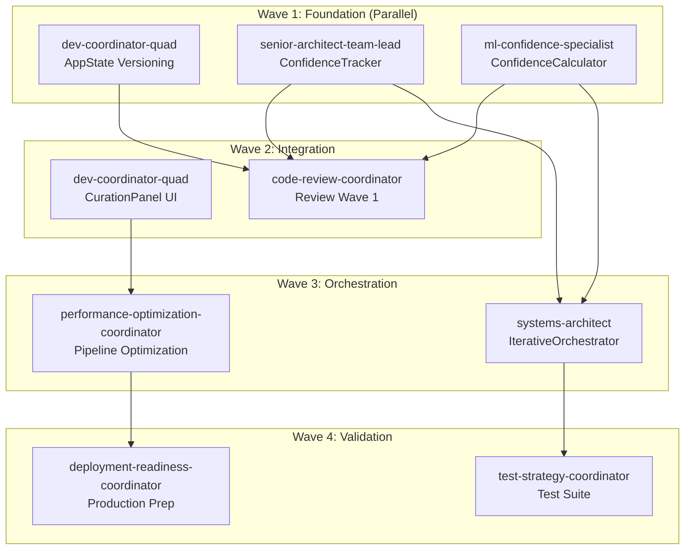

# ML Confidence Multi-Agent Orchestration Specification

## Executive Summary

This specification adapts the `/project:infinite` command to orchestrate multiple specialized agents working on the ML Confidence project. Instead of generating iterations of content, we orchestrate iterations of agent executions with complex dependencies and coordination.

## Agent Relationship Matrix

### Core Agent Types and Dependencies



## Agent Profiles

### 1. dev-coordinator-quad
**Role**: Full-stack implementation specialist  
**Capabilities**: Frontend, backend, testing, documentation  
**Interfaces**:
- Outputs: Updated code components, migration scripts, tests
- Inputs: Architecture specs, existing codebase
- Dependencies: None (Wave 1) or UI requirements (Wave 2)

### 2. senior-architect-team-lead
**Role**: System architecture and integration  
**Capabilities**: Design patterns, system integration, performance architecture  
**Interfaces**:
- Outputs: Core service implementations, architectural decisions
- Inputs: Technical specifications, existing patterns
- Dependencies: Must coordinate with ml-confidence-specialist for interfaces

### 3. ml-confidence-specialist
**Role**: Machine learning algorithms and confidence metrics  
**Capabilities**: ML algorithms, statistical analysis, convergence optimization  
**Interfaces**:
- Outputs: ConfidenceCalculator, ML models, metric definitions
- Inputs: Current confidence data, analysis requirements
- Dependencies: Provides interfaces to senior-architect

### 4. code-review-coordinator
**Role**: Quality assurance and code standards  
**Capabilities**: Code review, security audit, performance analysis  
**Interfaces**:
- Outputs: Review reports, improvement recommendations
- Inputs: All code from previous wave
- Dependencies: Requires completed Wave 1 implementations

### 5. systems-architect
**Role**: High-level orchestration design  
**Capabilities**: State machines, workflow orchestration, async patterns  
**Interfaces**:
- Outputs: IterativeOrchestrator, state management
- Inputs: ConfidenceTracker, ConfidenceCalculator interfaces
- Dependencies: Requires Wave 1 core components

### 6. performance-optimization-coordinator
**Role**: System optimization specialist  
**Capabilities**: Profiling, caching, parallel processing, memory optimization  
**Interfaces**:
- Outputs: Optimized pipelines, performance reports
- Inputs: Current implementation, performance metrics
- Dependencies: Requires functional system from Waves 1-3

## Wave Configuration

### Wave 1: Foundation Sprint (Parallel Execution)
```yaml
wave_1:
  name: "Foundation Components"
  parallel_agents:
    - agent: dev-coordinator-quad
      task: "Implement AppState versioning system"
      output_dir: "agents_output/wave1/appstate"
      
    - agent: senior-architect-team-lead
      task: "Build ConfidenceTracker service"
      output_dir: "agents_output/wave1/tracker"
      
    - agent: ml-confidence-specialist
      task: "Create ConfidenceCalculator algorithms"
      output_dir: "agents_output/wave1/calculator"
      
  synchronization_point: "wave1_integration"
  duration_estimate: "3 days"
```

### Wave 2: Interface & Review
```yaml
wave_2:
  name: "UI and Quality Gates"
  sequential_agents:
    - agent: code-review-coordinator
      task: "Review all Wave 1 outputs"
      inputs: ["wave1/*"]
      output_dir: "agents_output/wave2/review"
      
    - agent: dev-coordinator-quad
      task: "Implement CurationPanel UI"
      inputs: ["wave1/calculator/interfaces"]
      output_dir: "agents_output/wave2/ui"
      
  duration_estimate: "2 days"
```

### Wave 3: Advanced Integration
```yaml
wave_3:
  name: "Orchestration Layer"
  parallel_agents:
    - agent: systems-architect
      task: "Design IterativeOrchestrator"
      inputs: ["wave1/tracker", "wave1/calculator"]
      output_dir: "agents_output/wave3/orchestrator"
      
    - agent: performance-optimization-coordinator
      task: "Optimize ML pipeline"
      inputs: ["wave1/*", "wave2/ui"]
      output_dir: "agents_output/wave3/optimization"
      
  duration_estimate: "3 days"
```

## Integration Points

### 1. ConfidenceTracker ↔ ConfidenceCalculator Interface
```javascript
// Defined by ml-confidence-specialist, implemented by senior-architect
interface ConfidenceMetrics {
    fileId: string;
    dimensions: {
        semantic: number;
        categorical: number;
        structural: number;
        temporal: number;
    };
    overall: number;
    convergencePrediction: {
        willConverge: boolean;
        estimatedIterations: number;
        confidence: number;
    };
}
```

### 2. AppState ↔ All Services Interface
```javascript
// Extended by dev-coordinator-quad, consumed by all
interface VersionedAnalysis {
    fileId: string;
    versions: AnalysisVersion[];
    currentVersion: number;
    metadata: VersionMetadata;
}
```

## Execution Strategy with /project:infinite

### Adapted Command Structure
```bash
/project:infinite specs/ml-confidence-orchestration.md agents_output wave1
```

### Infinite Mode Interpretation
Instead of infinite content iterations, we have:
1. **Wave-based agent execution** - Groups of agents execute in coordinated waves
2. **Dependency management** - Automatic sequencing based on dependencies
3. **State propagation** - Outputs from one wave become inputs to the next
4. **Quality gates** - Review agents validate before proceeding

### Sub-Agent Task Template
```
TASK: Execute as [AGENT_TYPE] for [WAVE_NAME]

AGENT PROFILE:
- Role: [From specification]
- Capabilities: [List from spec]
- Current Wave: [Wave number]

CONTEXT:
- Project: ML Confidence Workflow
- Sprint: [Current sprint]
- Dependencies: [List available inputs]
- Previous Wave Outputs: [Summary of available artifacts]

SPECIFIC ASSIGNMENT:
[Detailed task from wave configuration]

INTERFACE REQUIREMENTS:
[Any specific interfaces this agent must implement or consume]

DELIVERABLES:
[Expected outputs and their locations]

COORDINATION:
[Any synchronization requirements with parallel agents]
```

## Quality Control Mechanisms

### 1. Inter-Wave Validation
- Each wave must produce expected artifacts
- Integration tests run between waves
- Review agents provide go/no-go decisions

### 2. Parallel Coordination
- Agents in same wave share a coordination context
- Conflict resolution for shared resources
- Merge strategies for complementary outputs

### 3. Progressive Enhancement
- Each wave builds on validated previous work
- Rollback capability if issues detected
- Continuous integration mindset

## Advanced Orchestration Features

### 1. Dynamic Wave Composition
Based on review feedback, dynamically adjust next wave:
```javascript
if (reviewScore < 0.8) {
    insertDebugWave(['debug-coordinator', 'refactoring-coordinator']);
}
```

### 2. Conditional Agent Activation
```javascript
if (performanceMetrics.latency > threshold) {
    activateAgent('performance-optimization-coordinator', 'emergency');
}
```

### 3. Feedback Loop Integration
```javascript
// ml-confidence-specialist adjusts algorithms based on real results
feedbackLoop: {
    source: 'production_metrics',
    target: 'ml-confidence-specialist',
    trigger: 'confidence < 0.85'
}
```

## Success Metrics

### Per-Wave Metrics
- **Wave 1**: Core components functional, 90%+ test coverage
- **Wave 2**: UI responsive, code review passed
- **Wave 3**: <30s analysis time, convergence achieved
- **Wave 4**: All tests green, deployment ready

### Overall Project Metrics
- Confidence improvement: 65% → 85%+
- Parallel execution efficiency: 60%+ time savings
- Code quality: Zero critical issues
- Integration success: All interfaces validated

## Migration from Traditional Approach

### Before (Sequential)
```
Day 1-3: Developer implements AppState
Day 4-6: Architect builds ConfidenceTracker  
Day 7-9: ML Specialist creates algorithms
Day 10: Integration attempts begin
```

### After (Parallel Orchestration)
```
Day 1-3: All three specialists work in parallel
Day 3: Automated integration with predefined interfaces
Day 4-5: Review and UI in parallel
Day 6-8: Advanced features with optimization
```

## Command Variations

### 1. Single Wave Execution
```bash
/project:infinite specs/ml-confidence-orchestration.md agents_output wave1
```

### 2. Multi-Wave Execution  
```bash
/project:infinite specs/ml-confidence-orchestration.md agents_output all-waves
```

### 3. Specific Agent Testing
```bash
/project:infinite specs/ml-confidence-orchestration.md agents_output test-agent:ml-confidence-specialist
```

### 4. Recovery Mode
```bash
/project:infinite specs/ml-confidence-orchestration.md agents_output recover-from:wave2
```

## Conclusion

This specification transforms `/project:infinite` from a content generation tool into a sophisticated multi-agent orchestration system. By leveraging parallel execution, dependency management, and wave-based coordination, we can dramatically accelerate the ML Confidence project while maintaining quality and integration standards.

The key innovation is treating each specialized agent as an "iteration" in the infinite loop, but with rich interdependencies and coordination requirements that mirror real-world software development teams.