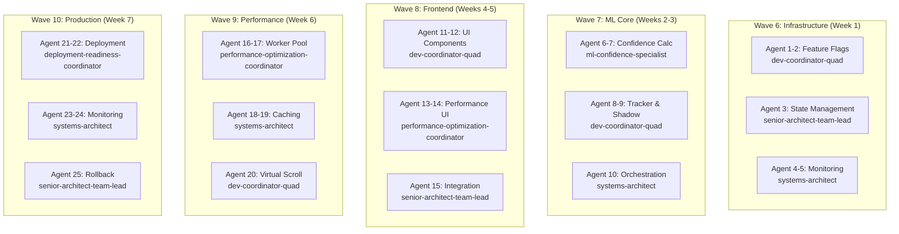

# 🚀 Waves 6-10 Development Runbook
## Multi-Agent Parallel Execution Guide

### 📋 Quick Start

#### Execute All Waves (Full Development)
```bash
# This will launch parallel agents for complete Waves 6-10 development
/infinite specs/waves6-10-development-orchestration.md agents_output/waves6-10 25
```

## 🎯 Overview

This runbook orchestrates the parallel development of Waves 6-10 for ML Confidence Integration using the `/infinite` multi-agent framework. Each wave is developed by specialized agent teams working in coordinated sprints.

## 🏗️ Agent Architecture

### Wave Distribution Model
```
25 Total Agents Distributed:
├── Wave 6: 5 agents (Infrastructure)
├── Wave 7: 5 agents (ML Core)
├── Wave 8: 5 agents (Frontend/UX)
├── Wave 9: 5 agents (Performance)
└── Wave 10: 5 agents (Production)
```

### Agent Specialization Matrix


## 📚 Detailed Usage Examples

### Example 1: Running Wave 6 Infrastructure Sprint
```bash
# Launch 5 parallel agents for Wave 6
/infinite specs/waves6-10-development-orchestration.md agents_output/wave6 5

# Agents 1-5 will create:
# - MLFeatureFlags.js (Agents 1-2)
# - MLStateExtension.js (Agent 3)
# - PrometheusExporter.js (Agents 4-5)
```

Expected output structure:
```
agents_output/wave6/
├── agent_001_feature-flags/
│   ├── MLFeatureFlags.js
│   ├── tests/
│   │   └── feature-flags.test.js
│   └── docs/
│       └── feature-flags-guide.md
│
├── agent_002_feature-flags-ui/
│   ├── FeatureFlagsDashboard.js
│   ├── components/
│   └── styles/
│
├── agent_003_state-extension/
│   ├── MLStateExtension.js
│   ├── migrations/
│   └── tests/
│
├── agent_004_monitoring/
│   ├── PrometheusExporter.js
│   ├── metrics/
│   └── dashboards/
│
└── agent_005_monitoring-ui/
    ├── MonitoringDashboard.html
    ├── scripts/
    └── styles/
```

### Example 2: Sequential Wave Development with Dependencies
```bash
# Wave 6 - Infrastructure Foundation
/infinite specs/waves6-10-development-orchestration.md agents_output/wave6 5

# After Wave 6 completes, Wave 7 - ML Core
/infinite specs/waves6-10-development-orchestration.md agents_output/wave7 5

# Wave 7 agents automatically receive Wave 6 outputs as context
```

### Example 3: Full Sprint Execution (All Waves)
```bash
# Execute all waves with proper sequencing
/infinite specs/waves6-10-development-orchestration.md agents_output/full-development infinite
```

The system will:
1. Execute Wave 6 (5 agents) - Infrastructure
2. Validate and integrate outputs
3. Execute Wave 7 (5 agents) - ML Core with Wave 6 context
4. Continue through all waves sequentially
5. Final integration and validation

### Example 4: Targeted Component Development
```bash
# Develop only the ML Confidence Calculator
/infinite specs/waves6-10-development-orchestration.md agents_output/ml-calc 2

# Agents focus specifically on:
# - ConfidenceCalculator.js
# - Multi-dimensional scoring algorithms
```

## 🤖 Sub-Agent Task Templates

### Wave 6 Infrastructure Agent Template
```
TASK: Execute as [AGENT_TYPE] for Wave 6 Infrastructure Development

You are Sub Agent [NUMBER] implementing [COMPONENT] for the ML Infrastructure Foundation.

AGENT PROFILE:
- Role: Infrastructure Developer
- Specialization: [Feature Flags/State Management/Monitoring]
- Wave: 6 - Infrastructure Foundation
- Timeline: Week 1

CONTEXT:
- Project: ML Confidence Integration
- Dependencies: Existing KC system
- Success Metrics: Zero breaking changes, <10ms response time
- Previous Work: Access to Wave 1-5 implementations

YOUR SPECIFIC ASSIGNMENT:
Implement [SPECIFIC_COMPONENT] following the Wave 6 specification:
- Review wave6-infrastructure-spec.md
- Follow existing code patterns in KC
- Ensure backward compatibility
- Write comprehensive tests

DELIVERABLES:
1. Production-ready code in agents_output/wave6/agent_[NUMBER]/
2. Unit tests with >80% coverage
3. Integration tests
4. Documentation
5. Performance benchmarks

INTERFACE COMMITMENTS:
- Must integrate with existing EventBus
- Preserve AppState compatibility
- Expose metrics for Prometheus
- Follow KC naming conventions

COORDINATION:
- Agents 1-2: Collaborate on feature flags
- Agent 3: Provide state interface
- Agents 4-5: Share monitoring patterns
```

### Wave 7 ML Core Agent Template
```
TASK: Execute as ml-confidence-specialist for Wave 7 ML Core Development

You are Sub Agent [NUMBER] implementing ML confidence algorithms.

CONTEXT:
- Specification: wave7-ml-core-spec.md
- Dependencies: Wave 6 infrastructure
- Key Algorithms: Multi-dimensional scoring
- Performance Target: <5% divergence, 85% convergence

YOUR ASSIGNMENT:
Build [ConfidenceCalculator/ConfidenceTracker/ShadowMode] with:
1. Multi-dimensional confidence scoring
2. Convergence detection
3. Shadow mode execution
4. Performance optimization

TECHNICAL REQUIREMENTS:
- Use existing EmbeddingService
- Integrate with QdrantService
- Cache results in IndexedDB
- Emit proper events

COORDINATION POINTS:
- Use MLFeatureFlags from Wave 6
- Integrate with PrometheusExporter
- Preserve state via MLStateExtension
```

## 🔄 Advanced Orchestration Patterns

### Pattern 1: Parallel Development with Sync Points
```javascript
// Wave configuration with synchronization
const waveConfig = {
  wave6: {
    agents: 5,
    parallel: true,
    syncPoint: "infrastructure_complete",
    validation: "all_tests_pass"
  },
  wave7: {
    agents: 5,
    parallel: true,
    dependencies: ["wave6.syncPoint"],
    syncPoint: "ml_core_complete"
  }
};
```

### Pattern 2: Dynamic Agent Allocation
```javascript
// Allocate more agents to complex components
const dynamicAllocation = {
  detectComplexity: (component) => {
    if (component.includes("ML") || component.includes("Worker")) {
      return { agents: 3, timeMultiplier: 1.5 };
    }
    return { agents: 2, timeMultiplier: 1.0 };
  }
};
```

### Pattern 3: Quality Gate Integration
```javascript
// Automatic quality checks between waves
const qualityGates = {
  afterWave: async (waveNumber) => {
    const tests = await runTests(`wave${waveNumber}`);
    const coverage = await checkCoverage(`wave${waveNumber}`);
    const performance = await runBenchmarks(`wave${waveNumber}`);
    
    return tests.pass && coverage > 80 && performance.meetsTargets;
  }
};
```

## 📊 Monitoring and Validation

### Check Wave Progress
```bash
# List all agent outputs
ls -la agents_output/wave*/

# Verify component completion
find agents_output -name "*.js" -type f | grep -E "(FeatureFlag|Confidence|Worker)"

# Run integration tests
npm test -- --testPathPattern="integration/wave"

# Check code coverage
npm run coverage -- agents_output/
```

### Validate Inter-Wave Dependencies
```javascript
// Run after each wave
validateWaveIntegration({
  wave: 7,
  requiredImports: [
    'MLFeatureFlags',
    'MLStateExtension',
    'PrometheusExporter'
  ],
  requiredEvents: [
    'ml:confidence:calculated',
    'ml:convergence:detected'
  ],
  performanceTargets: {
    calculationTime: '<100ms',
    memoryUsage: '<50MB'
  }
});
```

## 🚨 Troubleshooting

### Issue: Agents Not Finding Dependencies
```bash
# Ensure previous wave outputs are available
cp -r agents_output/wave6/* agents_output/wave7/.context/

# Or specify context explicitly
/infinite specs/waves6-10-development-orchestration.md agents_output/wave7 5 \
  --context="agents_output/wave6"
```

### Issue: Performance Targets Not Met
```bash
# Run performance-focused iteration
/infinite specs/waves6-10-development-orchestration.md agents_output/optimize 3

# Agents focus on:
# - Profiling existing code
# - Identifying bottlenecks
# - Implementing optimizations
```

### Issue: Integration Failures
```bash
# Run integration specialist agents
/infinite specs/waves6-10-development-orchestration.md agents_output/integrate 2

# Focus on:
# - Interface compatibility
# - Event flow validation
# - State management consistency
```

## 🏆 Best Practices

### 1. Wave Sequencing
- **Always complete infrastructure (Wave 6) first**
- **ML Core (Wave 7) depends on feature flags**
- **UI (Wave 8) needs ML components ready**
- **Performance (Wave 9) optimizes existing code**
- **Production (Wave 10) requires all components**

### 2. Agent Coordination
- **Use shared context folders**
- **Document interfaces clearly**
- **Emit standardized events**
- **Follow KC patterns**

### 3. Quality Assurance
- **Each agent writes tests**
- **Integration tests between waves**
- **Performance benchmarks included**
- **Documentation as code**

## 📈 Success Metrics

### Per-Wave Metrics
| Wave | Success Criteria | Validation Method |
|------|-----------------|-------------------|
| Wave 6 | Zero breaking changes | Regression tests |
| Wave 7 | <5% ML divergence | Shadow mode comparison |
| Wave 8 | 60fps UI performance | Chrome DevTools |
| Wave 9 | 100 files in 2s | Load tests |
| Wave 10 | <5min rollback | Deployment test |

### Overall Project Metrics
- **Code Coverage**: >80% across all waves
- **Performance**: All targets met
- **Integration**: Zero breaking changes
- **Documentation**: Complete for all components

## 🔧 Integration with Existing System

### Pre-Development Setup
```bash
# Backup current system
cp -r js/ js_backup_pre_waves/

# Ensure clean state
git checkout -b feature/ml-confidence-integration
git pull origin main

# Verify system health
kcdiag()
```

### Post-Development Integration
```bash
# Integrate wave outputs
./scripts/integrate-waves.sh agents_output/

# Run full test suite
npm test

# Performance validation
npm run benchmark

# Final system check
kcdiag()
```

## 📅 Execution Timeline

### Week-by-Week Schedule
```
Week 1: Wave 6 - Infrastructure (5 agents)
Week 2-3: Wave 7 - ML Core (5 agents)
Week 4-5: Wave 8 - Frontend (5 agents)
Week 6: Wave 9 - Performance (5 agents)
Week 7: Wave 10 - Production (5 agents)
Week 8: Integration & Polish
```

### Daily Execution Pattern
```
Monday: Launch wave agents
Tuesday-Thursday: Development sprint
Friday: Integration & validation
```

## 🎯 Command Reference

### Basic Commands
```bash
# Single wave
/infinite specs/waves6-10-development-orchestration.md agents_output/wave[N] 5

# All waves sequential
/infinite specs/waves6-10-development-orchestration.md agents_output/all-waves 25

# Specific component
/infinite specs/waves6-10-development-orchestration.md agents_output/component 2

# Recovery mode
/infinite specs/waves6-10-development-orchestration.md agents_output/recover 3
```

### Advanced Options
```bash
# With context
--context="path/to/previous/outputs"

# With validation
--validate="tests,coverage,performance"

# With specific agent types
--agents="ml-confidence-specialist,dev-coordinator-quad"
```

## ✅ Checklist for Success

### Before Starting
- [ ] All specifications reviewed
- [ ] Development environment ready
- [ ] Previous wave outputs available
- [ ] Success metrics defined

### During Development
- [ ] Agents following specifications
- [ ] Tests being written
- [ ] Documentation updated
- [ ] Performance monitored

### After Each Wave
- [ ] All tests passing
- [ ] Coverage >80%
- [ ] Performance targets met
- [ ] Integration validated

## 🚀 Next Steps

1. **Review all wave specifications** in `specs/feature-ml-confidence-integration/`
2. **Prepare the orchestration spec** based on this runbook
3. **Execute Wave 6** as the foundation
4. **Monitor progress** using provided commands
5. **Iterate through waves** maintaining quality gates

---

**Ready to start?** Execute:
```bash
/infinite specs/waves6-10-development-orchestration.md agents_output/wave6 5
```