```mermaid

graph TD
    A[Necessidade: Coordenação Multiagêntica] --> B{Escolha de Abordagem}
    B --> C[Opção 1: Agent Project Manager]
    B --> D[Opção 2: Prompt Manual]
    
    C --> C1[Vantagens]
    C --> C2[Desvantagens]
    
    D --> D1[Vantagens]
    D --> D2[Desvantagens]
    
    C1 --> C11[Automação Total]
    C1 --> C12[Padrão Consistente]
    C1 --> C13[Delegação Claude Code]
    
    C2 --> C21[Tempo de Setup]
    C2 --> C22[Menos Flexível]
    
    D1 --> D11[Controle Direto]
    D1 --> D12[Flexibilidade Total]
    D1 --> D13[Implementação Rápida]
    
    D2 --> D21[Esforço Manual]
    D2 --> D22[Possível Inconsistência]
    
    style A fill:#f9f,stroke:#333,stroke-width:2px
    style C fill:#9f9,stroke:#333,stroke-width:2px
    style D fill:#99f,stroke:#333,stroke-width:2px
```

# Multi-Agent Orchestration Template for KC V2 Migration

  📋 Template de Orquestração

## Multi-Agent Orchestration for KC V2 Migration**

```javascript
### Quick Start Variables
  $PROJECT = "knowledge-consolidator-v2"
  $SPRINT = "integration-phase-1"
  $FOCUS = "v1-v2-bridge-implementation"
  $PRIORITY = "unblock-ui-development"

### Current State
  $COMPLETED = ["LegacyBridge.js", "AppState.js", "APIService.js"]
  $BLOCKED = ["UI components waiting for data"]
  $CRITICAL_PATH = "NavigationController → StatusBar → Terminal → Views"

### Agent Assignments
#### @frontend-engineers-team (#AGENT-1)
  **Priority**: HIGH
  **Dependencies**: LegacyBridge (✅ READY)
  **Tasks**:
  // 1. Create NavigationController.js✅
  // 2. Implement StatusBar.js with real-time indicators✅
  // 3. Build Terminal.js with command processing✅
  
  4. Create CommandPalette.js with fuzzy search
  Output: #FE-001 to #FE-004

  @ui-ux-dev-lead (#AGENT-2)

  Priority: HIGH
  Dependencies: None (can start immediately)
  Tasks:
  // 1. Create DiscoveryView.js with file grid ✅
  
  5. Build AnalysisView.js with progress tracking
  6. Implement OrganizationView.js with drag-drop
  7. Design SettingsView.js with unified config
  Output: #UI-001 to #UI-004

  @performance-optimization-coordinator (#AGENT-3)

  Priority: MEDIUM
  Dependencies: None (independent)
  Tasks:
  -- 1. Optimize V2 API endpoints for batch operations
  -- 2. Implement caching layer for V1→V2 bridge
  -- 3. Add WebSocket support for real-time sync
  -- 4. Create performance monitoring dashboard
  Output: #PERF-001 to #PERF-004

  @test-strategy-coordinator (#AGENT-4)

  Priority: MEDIUM
  Dependencies: Components from AGENT-1/2
  Tasks:
  // 1. Test suite for LegacyBridge data sync
  // 2. Integration tests for V1→V2 flow
  // 3. UI component unit tests
  // 4. E2E tests for complete workflow
  Output: #TEST-001 to #TEST-004

  @refactoring-coordinator (#AGENT-5)

  Priority: LOW
  Dependencies: AGENT-1/2 complete
  Tasks:
  // 1. Refactor V1 code for better V2 compatibility
  // 2. Clean up deprecated V1 patterns
  // 3. Optimize bundle size
  // 4. Implement code splitting
  Output: #REF-001 to #REF-004

  Execution Commands

  Option 1: I Manage All Agents

  Use: "Execute multi-agent orchestration for $PROJECT"

  Option 2: You Name Specific Agents

  Use: "Deploy @agent-name for $FOCUS with tasks #ID"

  Option 3: Sequential Execution

  Use: "Run @frontend-engineers-team first, then @ui-ux-dev-lead"

  Tracking Pattern

  #[AGENT-PREFIX]-[TASK-NUMBER]-[SUBTASK]
  Example: #FE-001-A (Frontend Agent, Task 1, Subtask A)

  Critical Success Metrics

  - V1 data visible in V2 interface
  - All keyboard shortcuts functional
  - Real-time sync operational
  - Performance ≤ 100ms response time

  ### 🎯 Como Usar Este Template

  **Opção 1 - Eu Gerencio Tudo:**
  "Execute o template de orquestração multi-agent para KC V2"

  **Opção 2 - Você Nomeia Agentes Específicos:**
  "Deploy @frontend-engineers-team para criar componentes UI com tasks #FE-001 a #FE-004"

  **Opção 3 - Execução Customizada:**
  "Run this template replacing:
  - $SPRINT = 'integration-phase-2'
  - $FOCUS = 'advanced-features'
  - Execute only @ui-ux-dev-lead and @test-strategy-coordinator"

  ### 📊 Estado Atual para Distribuição

  ```yaml
  Ready_to_Start:
    - Agent_1_Frontend: NavigationController.js → Terminal.js
    - Agent_2_UI: All views (Discovery, Analysis, Organization)
    - Agent_3_Performance: API optimizations, caching
    - Agent_4_Testing: Bridge tests, integration tests

  Blocked_Waiting:
    - Agent_5_Refactoring: Needs UI components first

  Critical_Path:
    - LegacyBridge ✅ → UI Components 🚧 → Views 📋 → Testing 📋

  🔄 Comandos de Sincronização

  # Para verificar progresso de todos os agentes:
  "Status report from all agents with #ID outputs"

  # Para sincronizar trabalho entre agentes:
  "Sync #FE-001 output with #UI-002 requirements"

  # Para checkpoint geral:
  "Create checkpoint with all #ID deliverables"

  Posso gerenciar todos os agentes para você ou você prefere nomear agentes específicos para cada conjunto de tarefas?
  
  ```
## NEXT

```mermaid
graph TD
    A[Template Base] --> B[Variáveis Definidas]
    B --> C[5 Agentes Especializados]
    
    C --> D[@frontend-engineers-team]
    C --> E[@ui-ux-dev-lead]
    C --> F[@performance-optimization-coordinator]
    C --> G[@test-strategy-coordinator]
    C --> H[@refactoring-coordinator]
    
    D --> I[#FE-001 a #FE-004]
    E --> J[#UI-001 a #UI-004]
    F --> K[#PERF-001 a #PERF-004]
    G --> L[#TEST-001 a #TEST-004]
    H --> M[#REF-001 a #REF-004]
    
    I --> N[Tracking Unificado]
    J --> N
    K --> N
    L --> N
    M --> N
    
    style A fill:#f9f,stroke:#333,stroke-width:2px
    style C fill:#9cf,stroke:#333,stroke-width:2px
    style N fill:#9f9,stroke:#333,stroke-width:2px
```
