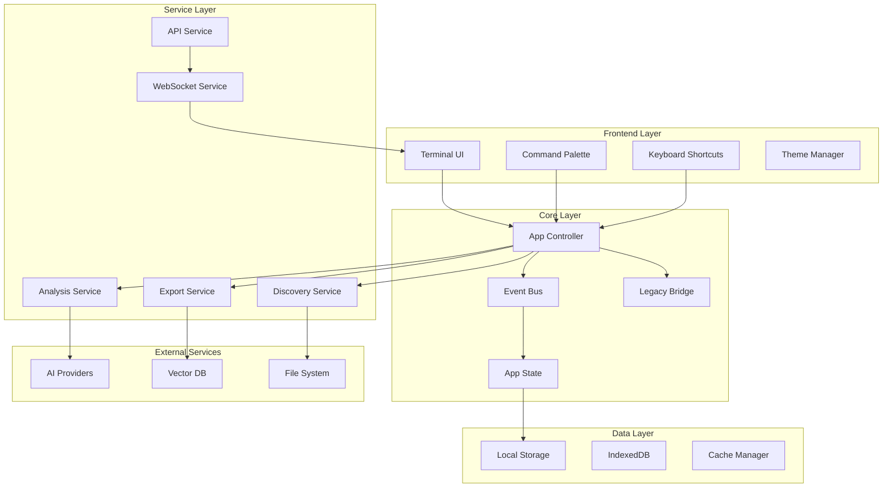

# Knowledge Consolidator V2 Developer Documentation

## Table of Contents

1. [Architecture Overview](#architecture-overview)
2. [Project Structure](#project-structure)
3. [Core Components](#core-components)
4. [API Reference](#api-reference)
5. [Integration Guide](#integration-guide)
6. [Plugin Development](#plugin-development)
7. [Testing Strategy](#testing-strategy)
8. [Performance Optimization](#performance-optimization)
9. [Security Considerations](#security-considerations)
10. [Deployment Guide](#deployment-guide)
11. [Contributing](#contributing)
12. [API Examples](#api-examples)

## Architecture Overview

### System Architecture



### Design Principles

1. **Event-Driven Architecture**: All components communicate via EventBus
2. **Single Source of Truth**: AppState manages all application state
3. **Modular Design**: Each component is self-contained and replaceable
4. **Progressive Enhancement**: Core functionality works without advanced features
5. **Performance First**: Optimized for large datasets and real-time operations

## Project Structure

```
v2/
├── index.html                 # Main application entry
├── js/
│   ├── app.js                # Application bootstrap
│   ├── core/                 # Core system components
│   │   ├── EventBus.js      # Event system
│   │   ├── AppState.js      # State management
│   │   ├── AppController.js # Application controller
│   │   └── LegacyBridge.js  # V1 compatibility
│   ├── components/           # UI components
│   │   ├── CommandPalette.js
│   │   ├── KeyboardShortcuts.js
│   │   ├── Logger.js
│   │   ├── ExportView.js
│   │   ├── LogsView.js
│   │   └── StatsView.js
│   ├── services/            # Business logic services
│   │   ├── DiscoveryService.js
│   │   ├── AnalysisService.js
│   │   ├── APIService.js
│   │   ├── WebSocketService.js
│   │   └── BatchOperations.js
│   ├── utils/               # Utility functions
│   │   ├── FileUtils.js
│   │   ├── ValidationUtils.js
│   │   └── PerformanceUtils.js
│   └── workers/             # Web Workers
│       ├── AnalysisWorker.js
│       └── IndexingWorker.js
├── css/                     # Stylesheets
│   ├── main.css
│   ├── themes/
│   └── components/
├── assets/                  # Static assets
├── tests/                   # Test suites
└── docs/                    # Documentation
```

## Core Components

### EventBus

Central event system for component communication:

```javascript
import { EventBus } from './core/EventBus.js';

// Subscribe to events
EventBus.on('file:discovered', (data) => {
  console.log('File discovered:', data);
});

// Emit events
EventBus.emit('file:discovered', {
  id: 'file-123',
  name: 'document.md',
  path: '/docs/document.md'
});

// One-time listener
EventBus.once('app:ready', () => {
  console.log('App initialized');
});

// Remove listener
const handler = (data) => console.log(data);
EventBus.on('test', handler);
EventBus.off('test', handler);
```

### AppState

Centralized state management with persistence:

```javascript
import { AppState } from './core/AppState.js';

// Set state
AppState.set('user.preferences.theme', 'dark');

// Get state
const theme = AppState.get('user.preferences.theme');

// Subscribe to changes
AppState.subscribe('user.preferences', (newValue, oldValue) => {
  console.log('Preferences changed:', newValue);
});

// Batch updates
AppState.batch(() => {
  AppState.set('files', fileList);
  AppState.set('stats.total', fileList.length);
});

// Persist to localStorage
AppState.persist();

// Load from localStorage
AppState.load();
```

### AppController

Main application controller:

```javascript
import { AppController } from './core/AppController.js';

// Initialize application
await AppController.initialize();

// Navigate between views
AppController.navigateTo('discovery');

// Execute commands
AppController.executeCommand('discover:start', {
  path: '/documents',
  recursive: true
});

// Register custom commands
AppController.registerCommand('custom:action', async (params) => {
  // Implementation
  return { success: true };
});
```

### LegacyBridge

V1 compatibility layer:

```javascript
import { LegacyBridge } from './core/LegacyBridge.js';

// Initialize bridge
await LegacyBridge.initialize();

// Check V1 availability
if (LegacyBridge.isV1Available()) {
  // Migrate V1 data
  const v1Data = await LegacyBridge.getV1Data();
  const v2Data = await LegacyBridge.migrateData(v1Data);
}

// Use V1 component
const result = await LegacyBridge.callV1Method('FileRenderer', 'render', params);
```

## API Reference

### REST API

Base URL: `http://localhost:3000/api`

#### Files Endpoints

##### GET /files
List all files with optional filtering.

```javascript
// Request
GET /api/files?type=md&relevance=70&limit=50&offset=0

// Response
{
  "success": true,
  "data": {
    "files": [{
      "id": "file-123",
      "name": "document.md",
      "path": "/docs/document.md",
      "size": 1024,
      "relevanceScore": 85,
      "categories": ["Technical", "Architecture"]
    }],
    "total": 150,
    "limit": 50,
    "offset": 0
  }
}
```

##### GET /files/:id
Get specific file details.

##### POST /files
Create new file entry.

```javascript
// Request
POST /api/files
{
  "name": "new-doc.md",
  "content": "# New Document\n\nContent here...",
  "categories": ["Draft"]
}

// Response
{
  "success": true,
  "data": {
    "id": "file-456",
    "name": "new-doc.md",
    "created": "2024-01-15T10:30:00Z"
  }
}
```

##### PATCH /files/:id
Update file metadata.

##### DELETE /files/:id
Delete file.

#### Analysis Endpoints

##### POST /analysis/analyze
Analyze files with AI.

```javascript
// Request
POST /api/analysis/analyze
{
  "fileIds": ["file-123", "file-456"],
  "template": "technicalInsights",
  "provider": "ollama",
  "options": {
    "model": "llama2",
    "temperature": 0.7
  }
}

// Response
{
  "success": true,
  "data": {
    "jobId": "job-789",
    "status": "processing",
    "estimatedTime": 30
  }
}
```

##### GET /analysis/status/:jobId
Check analysis job status.

##### GET /analysis/results/:jobId
Get analysis results.

#### Export Endpoints

##### POST /export
Export data in various formats.

```javascript
// Request
POST /api/export
{
  "format": "json",
  "fileIds": ["file-123", "file-456"],
  "options": {
    "includeAnalysis": true,
    "includeCategories": true
  }
}

// Response
{
  "success": true,
  "data": {
    "downloadUrl": "/api/download/export-abc123.json",
    "expiresAt": "2024-01-15T11:30:00Z"
  }
}
```

### WebSocket API

Real-time communication endpoint: `ws://localhost:3000/ws`

#### Connection

```javascript
const ws = new WebSocketService('ws://localhost:3000/ws');

// Connect with authentication
await ws.connect({ token: 'auth-token' });

// Subscribe to channels
ws.subscribe('files', (event) => {
  console.log('File event:', event);
});

// Send messages
ws.send('analyze:progress', { fileId: 'file-123' });
```

#### Events

##### file:created
New file discovered or created.

##### file:updated
File metadata or content updated.

##### file:deleted
File removed.

##### analysis:started
Analysis job started.

##### analysis:progress
Analysis progress update.
```javascript
{
  "type": "analysis:progress",
  "data": {
    "jobId": "job-123",
    "progress": 75,
    "currentFile": "document.md"
  }
}
```

##### analysis:completed
Analysis job completed.

##### collaboration:update
Real-time collaboration update.

## Integration Guide

### Ollama Integration

Local AI analysis with Ollama:

```javascript
// services/OllamaService.js
export class OllamaService {
  constructor() {
    this.baseURL = 'http://localhost:11434';
  }
  
  async checkAvailability() {
    try {
      const response = await fetch(`${this.baseURL}/api/tags`);
      return response.ok;
    } catch {
      return false;
    }
  }
  
  async analyze(content, model = 'llama2') {
    const response = await fetch(`${this.baseURL}/api/generate`, {
      method: 'POST',
      headers: { 'Content-Type': 'application/json' },
      body: JSON.stringify({
        model,
        prompt: this.buildPrompt(content),
        stream: false
      })
    });
    
    const result = await response.json();
    return this.parseResponse(result.response);
  }
}
```

### Qdrant Integration

Vector database for semantic search:

```javascript
// services/QdrantService.js
export class QdrantService {
  constructor() {
    this.client = new QdrantClient({
      url: 'http://localhost:6333'
    });
  }
  
  async createCollection(name) {
    await this.client.createCollection(name, {
      vectors: {
        size: 384,
        distance: 'Cosine'
      }
    });
  }
  
  async uploadVectors(collection, points) {
    await this.client.upsert(collection, {
      wait: true,
      points
    });
  }
  
  async search(collection, vector, limit = 10) {
    return await this.client.search(collection, {
      vector,
      limit,
      with_payload: true
    });
  }
}
```

### N8N Workflow Integration

Automate knowledge processing:

```json
{
  "name": "Knowledge Processing Workflow",
  "nodes": [
    {
      "type": "webhook",
      "name": "KC Webhook",
      "parameters": {
        "path": "kc-process",
        "responseMode": "onReceived"
      }
    },
    {
      "type": "http",
      "name": "Get Files",
      "parameters": {
        "url": "http://localhost:3000/api/files",
        "authentication": "genericCredentialType",
        "genericAuthType": "httpHeaderAuth"
      }
    },
    {
      "type": "function",
      "name": "Process Files",
      "parameters": {
        "functionCode": "return items.map(item => ({\n  json: {\n    fileId: item.json.id,\n    action: 'analyze'\n  }\n}));"
      }
    },
    {
      "type": "http",
      "name": "Trigger Analysis",
      "parameters": {
        "method": "POST",
        "url": "http://localhost:3000/api/analysis/batch",
        "bodyParametersUi": {
          "parameter": [{
            "name": "files",
            "value": "={{$json}}"
          }]
        }
      }
    }
  ]
}
```

## Plugin Development

### Plugin Structure

```javascript
// plugins/example-plugin/index.js
export default class ExamplePlugin {
  constructor(api) {
    this.api = api;
    this.name = 'Example Plugin';
    this.version = '1.0.0';
  }
  
  async initialize() {
    // Register commands
    this.api.registerCommand('example:hello', this.helloCommand.bind(this));
    
    // Subscribe to events
    this.api.on('file:analyzed', this.onFileAnalyzed.bind(this));
    
    // Add UI elements
    this.api.addMenuItem({
      id: 'example-menu',
      label: 'Example Action',
      command: 'example:hello'
    });
  }
  
  async helloCommand(params) {
    this.api.showNotification('Hello from plugin!');
    return { success: true };
  }
  
  onFileAnalyzed(data) {
    console.log('File analyzed:', data);
  }
  
  async destroy() {
    // Cleanup
  }
}
```

### Plugin API

Available methods for plugins:

```javascript
// Core API
api.getState(path)           // Get app state
api.setState(path, value)    // Set app state
api.registerCommand(name, handler)
api.executeCommand(name, params)

// Events
api.on(event, handler)
api.off(event, handler)
api.emit(event, data)

// UI
api.showNotification(message, type)
api.showModal(component)
api.addMenuItem(config)
api.addToolbarButton(config)

// Data
api.getFiles(query)
api.analyzeFiles(fileIds, options)
api.exportData(format, options)

// Storage
api.storage.get(key)
api.storage.set(key, value)
api.storage.remove(key)
```

### Plugin Manifest

```json
{
  "name": "example-plugin",
  "version": "1.0.0",
  "description": "Example plugin for KC V2",
  "author": "Your Name",
  "main": "index.js",
  "permissions": [
    "files:read",
    "files:write",
    "analysis:execute",
    "ui:modify"
  ],
  "dependencies": {
    "kc-api": "^2.0.0"
  },
  "config": {
    "settingsSchema": {
      "apiKey": {
        "type": "string",
        "title": "API Key",
        "encrypted": true
      },
      "enabled": {
        "type": "boolean",
        "title": "Enable Plugin",
        "default": true
      }
    }
  }
}
```

## Testing Strategy

### Unit Testing

Test individual components:

```javascript
// tests/unit/EventBus.test.js
import { EventBus } from '../../js/core/EventBus.js';

describe('EventBus', () => {
  beforeEach(() => {
    EventBus.removeAllListeners();
  });
  
  test('should emit and receive events', () => {
    const handler = jest.fn();
    EventBus.on('test:event', handler);
    
    EventBus.emit('test:event', { data: 'test' });
    
    expect(handler).toHaveBeenCalledWith({ data: 'test' });
  });
  
  test('should handle multiple listeners', () => {
    const handler1 = jest.fn();
    const handler2 = jest.fn();
    
    EventBus.on('test:event', handler1);
    EventBus.on('test:event', handler2);
    
    EventBus.emit('test:event', {});
    
    expect(handler1).toHaveBeenCalled();
    expect(handler2).toHaveBeenCalled();
  });
});
```

### Integration Testing

Test component interactions:

```javascript
// tests/integration/Discovery.test.js
import { DiscoveryService } from '../../js/services/DiscoveryService.js';
import { AppState } from '../../js/core/AppState.js';
import { EventBus } from '../../js/core/EventBus.js';

describe('Discovery Integration', () => {
  test('should discover files and update state', async () => {
    const service = new DiscoveryService();
    const fileHandler = jest.fn();
    
    EventBus.on('file:discovered', fileHandler);
    
    await service.discover({
      path: '/test/fixtures',
      types: ['md', 'txt']
    });
    
    const files = AppState.get('files');
    expect(files).toHaveLength(5);
    expect(fileHandler).toHaveBeenCalledTimes(5);
  });
});
```

### E2E Testing

Test complete workflows:

```javascript
// tests/e2e/workflow.test.js
describe('Complete Analysis Workflow', () => {
  test('should discover, analyze, and export files', async () => {
    await page.goto('http://localhost:3000');
    
    // Start discovery
    await page.click('[data-test="start-discovery"]');
    await page.type('#path-input', '/test/documents');
    await page.click('[data-test="run-discovery"]');
    
    // Wait for discovery
    await page.waitForSelector('.discovery-complete');
    
    // Select files
    await page.click('[data-test="select-all"]');
    
    // Run analysis
    await page.click('[data-test="analyze-files"]');
    await page.waitForSelector('.analysis-complete');
    
    // Export results
    await page.click('[data-test="export-results"]');
    await page.selectOption('#export-format', 'json');
    await page.click('[data-test="download"]');
    
    // Verify download
    const download = await page.waitForEvent('download');
    expect(download.suggestedFilename()).toContain('export');
  });
});
```

### Performance Testing

Monitor and benchmark performance:

```javascript
// tests/performance/benchmark.js
import { PerformanceProfiler } from '../utils/PerformanceProfiler.js';

describe('Performance Benchmarks', () => {
  const profiler = new PerformanceProfiler();
  
  test('should discover 1000 files in under 2 seconds', async () => {
    profiler.start('discovery-1000');
    
    const files = await generateTestFiles(1000);
    const service = new DiscoveryService();
    
    await service.discover({ files });
    
    const profile = profiler.stop('discovery-1000');
    expect(profile.duration).toBeLessThan(2000);
  });
  
  test('should maintain 60fps during scroll', async () => {
    const monitor = new FrameRateMonitor();
    monitor.start();
    
    // Simulate scroll
    await simulateScroll(1000);
    
    const stats = monitor.stop();
    expect(stats.averageFPS).toBeGreaterThan(55);
    expect(stats.droppedFrames).toBeLessThan(10);
  });
});
```

## Performance Optimization

### Lazy Loading

Load components on demand:

```javascript
// Lazy load heavy components
const loadAnalysisView = () => import('./components/AnalysisView.js');

// Use when needed
button.addEventListener('click', async () => {
  const { AnalysisView } = await loadAnalysisView();
  const view = new AnalysisView();
  view.render();
});
```

### Virtual Scrolling

Handle large lists efficiently:

```javascript
// components/VirtualList.js
export class VirtualList {
  constructor(container, itemHeight) {
    this.container = container;
    this.itemHeight = itemHeight;
    this.visibleRange = { start: 0, end: 0 };
  }
  
  render(items) {
    const scrollTop = this.container.scrollTop;
    const containerHeight = this.container.clientHeight;
    
    this.visibleRange.start = Math.floor(scrollTop / this.itemHeight);
    this.visibleRange.end = Math.ceil(
      (scrollTop + containerHeight) / this.itemHeight
    );
    
    // Only render visible items
    const visibleItems = items.slice(
      this.visibleRange.start,
      this.visibleRange.end
    );
    
    this.renderItems(visibleItems);
  }
}
```

### Web Workers

Offload heavy computation:

```javascript
// workers/AnalysisWorker.js
self.addEventListener('message', async (event) => {
  const { type, data } = event.data;
  
  switch (type) {
    case 'analyze':
      const result = await performAnalysis(data);
      self.postMessage({ type: 'result', data: result });
      break;
      
    case 'index':
      const index = await buildSearchIndex(data);
      self.postMessage({ type: 'index', data: index });
      break;
  }
});

// Usage in main thread
const worker = new Worker('/js/workers/AnalysisWorker.js');

worker.postMessage({ 
  type: 'analyze', 
  data: { content: fileContent }
});

worker.addEventListener('message', (event) => {
  if (event.data.type === 'result') {
    console.log('Analysis complete:', event.data.data);
  }
});
```

### Caching Strategy

Implement intelligent caching:

```javascript
// utils/CacheManager.js
export class CacheManager {
  constructor() {
    this.memory = new Map();
    this.storage = 'kc-cache';
  }
  
  async get(key) {
    // Check memory cache
    if (this.memory.has(key)) {
      return this.memory.get(key);
    }
    
    // Check localStorage
    const stored = localStorage.getItem(`${this.storage}-${key}`);
    if (stored) {
      const data = JSON.parse(stored);
      if (data.expires > Date.now()) {
        this.memory.set(key, data.value);
        return data.value;
      }
    }
    
    return null;
  }
  
  set(key, value, ttl = 3600000) { // 1 hour default
    const data = {
      value,
      expires: Date.now() + ttl
    };
    
    this.memory.set(key, value);
    
    try {
      localStorage.setItem(
        `${this.storage}-${key}`,
        JSON.stringify(data)
      );
    } catch (e) {
      // Handle quota exceeded
      this.cleanup();
    }
  }
  
  cleanup() {
    // Remove expired entries
    const now = Date.now();
    const keys = Object.keys(localStorage);
    
    keys.forEach(key => {
      if (key.startsWith(this.storage)) {
        const data = JSON.parse(localStorage.getItem(key));
        if (data.expires < now) {
          localStorage.removeItem(key);
        }
      }
    });
  }
}
```

## Security Considerations

### API Key Management

Secure storage of API keys:

```javascript
// utils/SecurityUtils.js
export class SecurityUtils {
  static async encryptApiKey(key) {
    const encoder = new TextEncoder();
    const data = encoder.encode(key);
    
    const cryptoKey = await this.getOrCreateKey();
    const iv = crypto.getRandomValues(new Uint8Array(12));
    
    const encrypted = await crypto.subtle.encrypt(
      { name: 'AES-GCM', iv },
      cryptoKey,
      data
    );
    
    return {
      encrypted: Array.from(new Uint8Array(encrypted)),
      iv: Array.from(iv)
    };
  }
  
  static async decryptApiKey(encryptedData) {
    const cryptoKey = await this.getOrCreateKey();
    
    const decrypted = await crypto.subtle.decrypt(
      { name: 'AES-GCM', iv: new Uint8Array(encryptedData.iv) },
      cryptoKey,
      new Uint8Array(encryptedData.encrypted)
    );
    
    const decoder = new TextDecoder();
    return decoder.decode(decrypted);
  }
  
  static async getOrCreateKey() {
    // Implementation details...
  }
}
```

### Content Sanitization

Prevent XSS attacks:

```javascript
// utils/Sanitizer.js
export class Sanitizer {
  static sanitizeHTML(html) {
    const temp = document.createElement('div');
    temp.textContent = html;
    return temp.innerHTML;
  }
  
  static sanitizeMarkdown(markdown) {
    // Remove script tags
    markdown = markdown.replace(/<script\b[^<]*(?:(?!<\/script>)<[^<]*)*<\/script>/gi, '');
    
    // Remove event handlers
    markdown = markdown.replace(/on\w+\s*=\s*"[^"]*"/gi, '');
    markdown = markdown.replace(/on\w+\s*=\s*'[^']*'/gi, '');
    
    return markdown;
  }
  
  static sanitizeJSON(json) {
    try {
      // Parse and re-stringify to remove any code
      return JSON.stringify(JSON.parse(json));
    } catch {
      throw new Error('Invalid JSON');
    }
  }
}
```

### CORS Configuration

Secure cross-origin requests:

```javascript
// server/cors.js
export const corsConfig = {
  origin: (origin, callback) => {
    const allowedOrigins = [
      'http://localhost:3000',
      'https://app.knowledgeconsolidator.com'
    ];
    
    if (!origin || allowedOrigins.includes(origin)) {
      callback(null, true);
    } else {
      callback(new Error('Not allowed by CORS'));
    }
  },
  credentials: true,
  methods: ['GET', 'POST', 'PATCH', 'DELETE'],
  allowedHeaders: ['Content-Type', 'Authorization'],
  maxAge: 86400 // 24 hours
};
```

## Deployment Guide

### Development Setup

```bash
# Clone repository
git clone https://github.com/knowledge-consolidator/v2.git
cd v2

# Install dependencies
npm install

# Start development server
npm run dev

# Run tests
npm test

# Build for production
npm run build
```

### Production Deployment

#### Docker Deployment

```dockerfile
# Dockerfile
FROM node:18-alpine AS builder

WORKDIR /app
COPY package*.json ./
RUN npm ci --only=production

COPY . .
RUN npm run build

FROM nginx:alpine
COPY --from=builder /app/dist /usr/share/nginx/html
COPY nginx.conf /etc/nginx/nginx.conf

EXPOSE 80
CMD ["nginx", "-g", "daemon off;"]
```

```yaml
# docker-compose.yml
version: '3.8'

services:
  app:
    build: .
    ports:
      - "80:80"
    environment:
      - API_URL=http://api:3000
    depends_on:
      - api
  
  api:
    image: kc-api:latest
    ports:
      - "3000:3000"
    environment:
      - DATABASE_URL=postgresql://user:pass@db:5432/kc
      - REDIS_URL=redis://redis:6379
    depends_on:
      - db
      - redis
  
  db:
    image: postgres:14
    environment:
      - POSTGRES_DB=kc
      - POSTGRES_USER=user
      - POSTGRES_PASSWORD=pass
    volumes:
      - db-data:/var/lib/postgresql/data
  
  redis:
    image: redis:7-alpine
    command: redis-server --maxmemory 256mb --maxmemory-policy allkeys-lru
  
  ollama:
    image: ollama/ollama:latest
    ports:
      - "11434:11434"
    volumes:
      - ollama-data:/root/.ollama

volumes:
  db-data:
  ollama-data:
```

#### Kubernetes Deployment

```yaml
# k8s/deployment.yaml
apiVersion: apps/v1
kind: Deployment
metadata:
  name: kc-v2
spec:
  replicas: 3
  selector:
    matchLabels:
      app: kc-v2
  template:
    metadata:
      labels:
        app: kc-v2
    spec:
      containers:
      - name: app
        image: kc-v2:latest
        ports:
        - containerPort: 80
        resources:
          requests:
            memory: "128Mi"
            cpu: "100m"
          limits:
            memory: "256Mi"
            cpu: "200m"
---
apiVersion: v1
kind: Service
metadata:
  name: kc-v2-service
spec:
  selector:
    app: kc-v2
  ports:
  - protocol: TCP
    port: 80
    targetPort: 80
  type: LoadBalancer
```

### Environment Configuration

```bash
# .env.production
API_URL=https://api.knowledgeconsolidator.com
WS_URL=wss://api.knowledgeconsolidator.com/ws
OLLAMA_URL=http://ollama.internal:11434
QDRANT_URL=http://qdrant.internal:6333
SENTRY_DSN=https://xxx@sentry.io/xxx
ENABLE_ANALYTICS=true
LOG_LEVEL=info
```

### Monitoring & Logging

```javascript
// utils/Monitoring.js
export class Monitoring {
  static init() {
    // Sentry for error tracking
    Sentry.init({
      dsn: process.env.SENTRY_DSN,
      environment: process.env.NODE_ENV,
      tracesSampleRate: 0.1
    });
    
    // Custom metrics
    this.trackMetrics();
  }
  
  static trackMetrics() {
    // Page load time
    window.addEventListener('load', () => {
      const loadTime = performance.timing.loadEventEnd - 
                      performance.timing.navigationStart;
      this.sendMetric('page_load_time', loadTime);
    });
    
    // API response times
    const originalFetch = window.fetch;
    window.fetch = async (...args) => {
      const start = performance.now();
      try {
        const response = await originalFetch(...args);
        const duration = performance.now() - start;
        this.sendMetric('api_response_time', duration, {
          endpoint: args[0],
          status: response.status
        });
        return response;
      } catch (error) {
        this.sendMetric('api_error', 1, {
          endpoint: args[0],
          error: error.message
        });
        throw error;
      }
    };
  }
  
  static sendMetric(name, value, tags = {}) {
    // Send to monitoring service
    if (window.analytics) {
      window.analytics.track(name, {
        value,
        ...tags,
        timestamp: new Date().toISOString()
      });
    }
  }
}
```

## Contributing

### Development Workflow

1. Fork the repository
2. Create feature branch (`git checkout -b feature/amazing-feature`)
3. Commit changes (`git commit -m 'Add amazing feature'`)
4. Push to branch (`git push origin feature/amazing-feature`)
5. Open Pull Request

### Code Style

Follow the established code style:

```javascript
// Good
export class FileService {
  constructor(options = {}) {
    this.options = {
      timeout: 5000,
      retries: 3,
      ...options
    };
  }
  
  async getFile(id) {
    try {
      const response = await this.fetch(`/files/${id}`);
      return await response.json();
    } catch (error) {
      this.handleError(error);
      throw error;
    }
  }
}

// Bad
export class file_service {
  constructor(opts) {
    this.opts = opts || {};
    this.opts.timeout = this.opts.timeout || 5000;
  }
  
  getFile(id) {
    return fetch('/files/' + id).then(r => r.json())
      .catch(e => { console.log(e); throw e; });
  }
}
```

### Testing Requirements

All contributions must include tests:

```javascript
// Required test coverage
- Unit tests for new functions/methods
- Integration tests for new features
- E2E tests for user-facing changes
- Performance tests for critical paths

// Minimum coverage thresholds
{
  "branches": 80,
  "functions": 80,
  "lines": 80,
  "statements": 80
}
```

### Documentation

Update documentation for:
- New APIs or endpoints
- Configuration changes
- Breaking changes
- New features or workflows

## API Examples

### Complete Analysis Workflow

```javascript
// Example: Full workflow implementation
async function performCompleteAnalysis() {
  const api = new APIService();
  
  try {
    // 1. Discover files
    console.log('Starting discovery...');
    const discoveryResult = await api.post('/files/discover', {
      paths: ['/documents'],
      types: ['md', 'txt'],
      recursive: true
    });
    
    const { jobId } = discoveryResult.data;
    
    // 2. Wait for discovery completion
    let status;
    do {
      await new Promise(resolve => setTimeout(resolve, 1000));
      const statusResponse = await api.get(`/jobs/${jobId}`);
      status = statusResponse.data.status;
    } while (status === 'processing');
    
    // 3. Get discovered files
    const filesResponse = await api.get('/files?limit=100');
    const files = filesResponse.data.files;
    
    console.log(`Discovered ${files.length} files`);
    
    // 4. Filter relevant files
    const relevantFiles = files.filter(f => f.relevanceScore > 70);
    const fileIds = relevantFiles.map(f => f.id);
    
    // 5. Start analysis
    console.log(`Analyzing ${fileIds.length} files...`);
    const analysisResult = await api.post('/analysis/analyze', {
      fileIds,
      template: 'technicalInsights',
      provider: 'ollama'
    });
    
    // 6. Monitor analysis progress via WebSocket
    const ws = new WebSocketService();
    await ws.connect();
    
    ws.subscribe(`analysis:${analysisResult.data.jobId}`, (event) => {
      console.log(`Analysis progress: ${event.progress}%`);
    });
    
    // 7. Wait for completion
    await new Promise((resolve) => {
      ws.once(`analysis:${analysisResult.data.jobId}:complete`, resolve);
    });
    
    // 8. Get results
    const results = await api.get(`/analysis/results/${analysisResult.data.jobId}`);
    
    // 9. Categorize results
    const categorized = await api.post('/files/categorize/batch', {
      assignments: results.data.insights.map(insight => ({
        fileId: insight.fileId,
        categories: this.suggestCategories(insight)
      }))
    });
    
    // 10. Export final results
    const exportResult = await api.post('/export', {
      format: 'json',
      fileIds,
      options: {
        includeAnalysis: true,
        includeCategories: true,
        includeEmbeddings: true
      }
    });
    
    console.log('Analysis complete!');
    console.log(`Download: ${exportResult.data.downloadUrl}`);
    
    return exportResult.data;
    
  } catch (error) {
    console.error('Workflow failed:', error);
    throw error;
  }
}

// Helper function
function suggestCategories(insight) {
  const categories = [];
  
  if (insight.type === 'Technical Insight') {
    categories.push('Technical');
  }
  
  if (insight.confidence > 0.8) {
    categories.push('High Priority');
  }
  
  if (insight.text.includes('decision')) {
    categories.push('Decisions');
  }
  
  return categories;
}
```

### Real-time Collaboration

```javascript
// Example: Collaborative editing session
class CollaborationSession {
  constructor(sessionId) {
    this.sessionId = sessionId;
    this.ws = new WebSocketService();
    this.participants = new Map();
    this.localChanges = [];
  }
  
  async join() {
    await this.ws.connect();
    
    // Join collaboration room
    this.ws.send('collab:join', { sessionId: this.sessionId });
    
    // Listen for participants
    this.ws.on('collab:participant:joined', (data) => {
      this.participants.set(data.userId, data.user);
      this.onParticipantJoined(data.user);
    });
    
    // Listen for changes
    this.ws.on('collab:change', (data) => {
      if (data.userId !== this.userId) {
        this.applyRemoteChange(data.change);
      }
    });
    
    // Handle conflicts
    this.ws.on('collab:conflict', (data) => {
      this.resolveConflict(data);
    });
  }
  
  sendChange(change) {
    this.localChanges.push(change);
    
    this.ws.send('collab:change', {
      sessionId: this.sessionId,
      change,
      version: this.version
    });
  }
  
  applyRemoteChange(change) {
    // Transform change against local changes
    const transformed = this.transformChange(change, this.localChanges);
    
    // Apply to local state
    this.applyChange(transformed);
    
    // Update UI
    this.updateUI(transformed);
  }
  
  resolveConflict(conflict) {
    // Show conflict resolution UI
    const resolution = this.showConflictDialog(conflict);
    
    // Apply resolution
    this.ws.send('collab:resolve', {
      sessionId: this.sessionId,
      conflictId: conflict.id,
      resolution
    });
  }
  
  transformChange(change, localChanges) {
    // Operational transformation logic
    let transformed = change;
    
    for (const localChange of localChanges) {
      if (this.changesConflict(transformed, localChange)) {
        transformed = this.transform(transformed, localChange);
      }
    }
    
    return transformed;
  }
}

// Usage
const session = new CollaborationSession('session-123');
await session.join();

// Send changes
session.sendChange({
  type: 'update',
  fileId: 'file-456',
  field: 'categories',
  value: ['Technical', 'Architecture']
});
```

### Custom Plugin Example

```javascript
// Example: Sentiment Analysis Plugin
export default class SentimentAnalysisPlugin {
  constructor(api) {
    this.api = api;
    this.name = 'Sentiment Analysis';
    this.version = '1.0.0';
    this.sentimentAPI = 'https://api.sentiment.example.com';
  }
  
  async initialize() {
    // Add command
    this.api.registerCommand('sentiment:analyze', async (params) => {
      const { fileIds } = params;
      
      // Get files
      const files = await this.api.getFiles({ ids: fileIds });
      
      // Analyze sentiment
      const results = await Promise.all(
        files.map(file => this.analyzeSentiment(file))
      );
      
      // Store results
      await this.storeResults(results);
      
      // Show notification
      this.api.showNotification(
        `Analyzed sentiment for ${results.length} files`,
        'success'
      );
      
      return { success: true, results };
    });
    
    // Add UI elements
    this.api.addMenuItem({
      id: 'sentiment-analyze',
      label: 'Analyze Sentiment',
      command: 'sentiment:analyze',
      icon: '😊'
    });
    
    // Add custom view
    this.api.registerView('sentiment-results', {
      title: 'Sentiment Analysis Results',
      component: () => import('./SentimentResultsView.js')
    });
    
    // Listen for file analysis
    this.api.on('file:analyzed', async (data) => {
      if (this.getConfig('autoAnalyze')) {
        await this.analyzeSentiment(data.file);
      }
    });
  }
  
  async analyzeSentiment(file) {
    const response = await fetch(this.sentimentAPI + '/analyze', {
      method: 'POST',
      headers: {
        'Content-Type': 'application/json',
        'Authorization': `Bearer ${this.getConfig('apiKey')}`
      },
      body: JSON.stringify({
        text: file.content,
        language: 'en'
      })
    });
    
    const result = await response.json();
    
    return {
      fileId: file.id,
      sentiment: result.sentiment,
      score: result.score,
      emotions: result.emotions,
      keywords: result.keywords
    };
  }
  
  async storeResults(results) {
    // Store in plugin storage
    for (const result of results) {
      await this.api.storage.set(
        `sentiment:${result.fileId}`,
        result
      );
    }
    
    // Update file metadata
    await Promise.all(
      results.map(result =>
        this.api.updateFile(result.fileId, {
          sentiment: result.sentiment,
          sentimentScore: result.score
        })
      )
    );
  }
  
  getConfig(key) {
    return this.api.storage.get(`config:${key}`);
  }
  
  async destroy() {
    // Cleanup
    this.api.removeCommand('sentiment:analyze');
    this.api.removeMenuItem('sentiment-analyze');
  }
}
```

---

*KC V2 Developer Documentation - Last updated: January 2024*