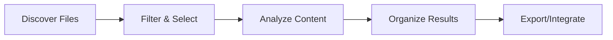

# Knowledge Consolidator V2 User Guide

## Table of Contents

1. [Introduction](#introduction)
2. [Getting Started](#getting-started)
3. [Core Features](#core-features)
4. [Workflow Guide](#workflow-guide)
5. [Command Palette](#command-palette)
6. [Keyboard Shortcuts](#keyboard-shortcuts)
7. [File Management](#file-management)
8. [Analysis Tools](#analysis-tools)
9. [Export Options](#export-options)
10. [Settings & Customization](#settings-customization)
11. [Troubleshooting](#troubleshooting)
12. [FAQ](#faq)

## Introduction

Welcome to Knowledge Consolidator V2 (KC V2), a powerful tool for discovering, analyzing, and organizing your personal knowledge base. KC V2 helps you transform scattered information into actionable insights through intelligent analysis and organization.

### What's New in V2

- **Terminal-based power user interface** - Command-line inspired UI for maximum efficiency
- **Real-time collaboration** - Work with team members simultaneously
- **Advanced analysis engine** - Multiple AI providers with intelligent fallback
- **Seamless V1 integration** - Full backwards compatibility with existing data
- **Performance optimized** - Handle thousands of files with ease

## Getting Started

### System Requirements

- **Browser**: Chrome 90+, Firefox 88+, Safari 14+, Edge 90+
- **RAM**: 4GB minimum, 8GB recommended
- **Storage**: 500MB for application, varies with data
- **Network**: Stable internet connection for AI analysis

### First Launch

1. Navigate to KC V2 in your browser
2. You'll see the terminal-style interface with status indicators
3. Press `Ctrl+K` to open the command palette
4. Type "help" to see available commands

### Quick Start Tutorial

#### Step 1: Discover Files
```
1. Click "Start Discovery" or press Ctrl+D
2. Select a folder to scan
3. Choose file types to include
4. Click "Run Discovery"
```

#### Step 2: Filter & Select
```
1. Use the filter panel to narrow results
2. Set relevance threshold (recommended: 70%)
3. Select files for analysis
4. Review preview snippets
```

#### Step 3: Analyze
```
1. Configure AI provider (Ollama recommended)
2. Select analysis template
3. Start batch analysis
4. Monitor progress in real-time
```

#### Step 4: Organize & Export
```
1. Create categories for your insights
2. Assign files to categories
3. Export in your preferred format
4. Integrate with external tools
```

## Core Features

### 1. File Discovery Engine

The discovery engine scans your local file system to find relevant documents:

- **Smart Scanning**: Intelligently skips system files and caches
- **Type Filtering**: Support for MD, TXT, DOC, PDF, and more
- **Recursive Search**: Explore subdirectories automatically
- **Real-time Preview**: See file contents as you browse

### 2. Analysis System

Powered by multiple AI providers for comprehensive analysis:

- **Multi-Provider Support**:
  - Ollama (local, recommended)
  - OpenAI GPT-3.5/4
  - Google Gemini
  - Anthropic Claude

- **Analysis Types**:
  - Technical Insights
  - Decisive Moments
  - Project Potential
  - Custom Templates

- **Intelligent Fallback**: Automatically switches providers on failure

### 3. Organization Tools

Transform discoveries into structured knowledge:

- **Dynamic Categories**: Create custom taxonomies
- **Batch Operations**: Organize multiple files at once
- **Smart Suggestions**: AI-powered categorization hints
- **Visual Indicators**: Color-coded categories for quick recognition

### 4. Export Capabilities

Share and integrate your consolidated knowledge:

- **Format Options**:
  - JSON (structured data)
  - Markdown (Obsidian compatible)
  - PDF (formatted reports)
  - CSV (spreadsheet analysis)

- **Integration Ready**:
  - Qdrant vector database
  - N8N workflow automation
  - Custom API endpoints

## Workflow Guide

### Basic Workflow



### Advanced Workflows

#### Research Project Workflow
1. Create project-specific discovery profile
2. Set custom relevance keywords
3. Use specialized analysis templates
4. Export to research management tools

#### Knowledge Base Migration
1. Import from V1 using legacy bridge
2. Re-analyze with improved AI
3. Reorganize with new categories
4. Export to modern format

#### Team Collaboration Workflow
1. Share discovery profiles
2. Collaborate on analysis
3. Merge categorizations
4. Generate team reports

## Command Palette

Access all features through the command palette (`Ctrl+K`):

### Common Commands

| Command | Shortcut | Description |
|---------|----------|-------------|
| `discover` | `Ctrl+D` | Start file discovery |
| `analyze` | `Ctrl+A` | Analyze selected files |
| `export` | `Ctrl+E` | Export results |
| `settings` | `Ctrl+,` | Open settings |
| `help` | `F1` | Show help |

### Quick Actions (prefix with `>`)

- `>theme` - Switch color theme
- `>clear` - Clear current results
- `>stats` - Show statistics
- `>logs` - View system logs

### Search Commands (prefix with `@`)

- `@category:name` - Filter by category
- `@type:md` - Filter by file type
- `@relevance:>80` - Filter by relevance score

## Keyboard Shortcuts

### Global Shortcuts

| Shortcut | Action |
|----------|--------|
| `Ctrl+K` | Command palette |
| `Ctrl+/` | Show shortcuts |
| `Ctrl+S` | Save current state |
| `Ctrl+Z` | Undo last action |
| `Ctrl+Shift+Z` | Redo |
| `Esc` | Close modal/cancel |

### Navigation

| Shortcut | Action |
|----------|--------|
| `Tab` | Next element |
| `Shift+Tab` | Previous element |
| `↑/↓` | Navigate lists |
| `Enter` | Select/confirm |
| `Space` | Toggle selection |

### File Operations

| Shortcut | Action |
|----------|--------|
| `Ctrl+A` | Select all |
| `Ctrl+Click` | Multi-select |
| `Shift+Click` | Range select |
| `Delete` | Remove selected |
| `F2` | Rename |

## File Management

### Discovery Options

Configure how files are discovered:

```javascript
{
  "paths": ["/documents", "/notes"],
  "includeSubdirs": true,
  "fileTypes": ["md", "txt", "doc"],
  "excludePatterns": ["**/node_modules/**", "**/.git/**"],
  "maxFileSize": "10MB",
  "modifiedWithin": "6months"
}
```

### Filtering System

Advanced filtering capabilities:

- **Relevance Filters**: 30%, 50%, 70%, 90% thresholds
- **Time Filters**: Last month, 3 months, 6 months, year, 2 years
- **Size Filters**: Custom min/max ranges
- **Type Filters**: By file extension
- **Content Filters**: Search within previews

### Batch Operations

Perform actions on multiple files:

1. **Select Files**: Use checkboxes or Ctrl+Click
2. **Choose Action**: Analyze, categorize, export, delete
3. **Configure Options**: Set parameters for the action
4. **Execute**: Monitor progress with real-time updates

## Analysis Tools

### AI Provider Configuration

#### Ollama (Recommended)
```bash
# Install Ollama
curl -fsSL https://ollama.ai/install.sh | sh

# Pull recommended model
ollama pull llama2

# Start Ollama service
ollama serve
```

#### OpenAI Configuration
1. Obtain API key from OpenAI
2. Open Settings (`Ctrl+,`)
3. Navigate to AI Providers
4. Enter API key
5. Select model (GPT-3.5 or GPT-4)

### Analysis Templates

Pre-configured templates for common use cases:

#### Technical Insights
```
Focus: Code patterns, architecture decisions, performance optimizations
Output: Structured technical summary with actionable items
```

#### Decisive Moments
```
Focus: Key decisions, turning points, strategic choices
Output: Timeline of critical moments with context
```

#### Project Analysis
```
Focus: Project potential, resource requirements, success factors
Output: Executive summary with recommendations
```

### Custom Templates

Create your own analysis templates:

1. Open Template Editor
2. Define analysis prompts
3. Specify output format
4. Save with descriptive name
5. Use in analysis workflow

## Export Options

### JSON Export

Structured data for programmatic use:

```json
{
  "metadata": {
    "exportDate": "2024-01-15T10:30:00Z",
    "version": "2.0",
    "fileCount": 150
  },
  "files": [
    {
      "id": "file-123",
      "name": "project-notes.md",
      "analysis": {
        "type": "Technical Insight",
        "confidence": 0.85,
        "insights": ["..."]
      },
      "categories": ["Architecture", "Decisions"]
    }
  ]
}
```

### Markdown Export

Obsidian-compatible format:

```markdown
# Knowledge Export - 2024-01-15

## Technical Insights

### Project Architecture Notes
- **File**: project-notes.md
- **Relevance**: 85%
- **Categories**: Architecture, Decisions

Key insights:
1. Microservices architecture chosen for scalability
2. Event-driven design patterns implemented
3. Performance optimization through caching

---
```

### Integration Formats

#### Qdrant Vector Database
```python
# Python example
from qdrant_client import QdrantClient

client = QdrantClient("localhost", port=6333)
points = kc_export['vectors']
client.upload_points(
    collection_name="knowledge_base",
    points=points
)
```

#### N8N Workflow
```json
{
  "nodes": [{
    "type": "knowledge-consolidator",
    "parameters": {
      "operation": "import",
      "format": "kc-v2-export"
    }
  }]
}
```

## Settings & Customization

### Appearance

Customize the visual experience:

- **Themes**: Dark, Light, Midnight, Solarized
- **Font Size**: Adjustable from 12px to 20px
- **Animations**: Enable/disable UI animations
- **Density**: Comfortable, Compact, Spacious

### Performance

Optimize for your system:

- **Batch Size**: Files processed simultaneously (5-50)
- **Cache Size**: Local storage allocation (100MB-1GB)
- **Worker Threads**: Parallel processing (2-8)
- **Auto-save**: Interval in seconds (30-300)

### Privacy & Security

Control your data:

- **Local Processing**: Use Ollama for offline analysis
- **API Key Storage**: Encrypted in browser
- **Export Sanitization**: Remove sensitive data
- **Audit Logs**: Track all operations

## Troubleshooting

### Common Issues

#### Files Not Discovered
- Check folder permissions
- Verify file types are selected
- Ensure path exists and is accessible
- Check exclude patterns

#### Analysis Fails
- Verify AI provider is configured
- Check API key validity
- Ensure Ollama is running (if selected)
- Review error logs (`Ctrl+L`)

#### Export Problems
- Check available disk space
- Verify export path permissions
- Ensure valid export format
- Try smaller batch size

### Performance Issues

#### Slow Discovery
```bash
# Optimize with specific paths
- Use targeted directories
- Limit file types
- Set size restrictions
- Enable caching
```

#### Memory Usage
```bash
# Reduce memory footprint
- Process smaller batches
- Clear completed analyses
- Disable preview caching
- Use streaming exports
```

### Error Messages

| Error | Solution |
|-------|----------|
| "API key invalid" | Check provider settings |
| "Ollama not responding" | Start Ollama service |
| "Quota exceeded" | Wait or switch providers |
| "Memory limit reached" | Reduce batch size |

## FAQ

### General Questions

**Q: How do I migrate from V1?**
A: V2 includes automatic migration. Just open V2 and your V1 data will be imported seamlessly.

**Q: Can I use KC V2 offline?**
A: Yes, with Ollama installed, all analysis can run locally without internet.

**Q: What file types are supported?**
A: MD, TXT, DOC, DOCX, PDF, RTF, and more. Custom types can be added.

**Q: Is my data secure?**
A: All processing can be done locally. API keys are encrypted. No data is stored on our servers.

### Technical Questions

**Q: How do I backup my data?**
A: Use Export function to save all data as JSON, then backup the file.

**Q: Can I integrate with my tools?**
A: Yes, via JSON export, REST API, or direct database integration.

**Q: What are the API limits?**
A: Depends on provider. Ollama has no limits. OpenAI/Gemini follow their standard limits.

**Q: How do I create custom analysis?**
A: Use Template Editor to define custom prompts and output formats.

### Advanced Usage

**Q: Can multiple users collaborate?**
A: Yes, V2 supports real-time collaboration with conflict resolution.

**Q: How do I automate workflows?**
A: Export to N8N or use our REST API for automation.

**Q: Can I extend functionality?**
A: Yes, through plugins (coming soon) or API integration.

**Q: How do I optimize for large datasets?**
A: Use batch processing, enable caching, and configure worker threads.

---

## Support

- **Documentation**: [docs.knowledgeconsolidator.com](https://docs.knowledgeconsolidator.com)
- **Community**: [forum.knowledgeconsolidator.com](https://forum.knowledgeconsolidator.com)
- **Issues**: [github.com/kc/v2/issues](https://github.com/kc/v2/issues)
- **Email**: support@knowledgeconsolidator.com

---

*Last updated: January 2024 | Version 2.0*