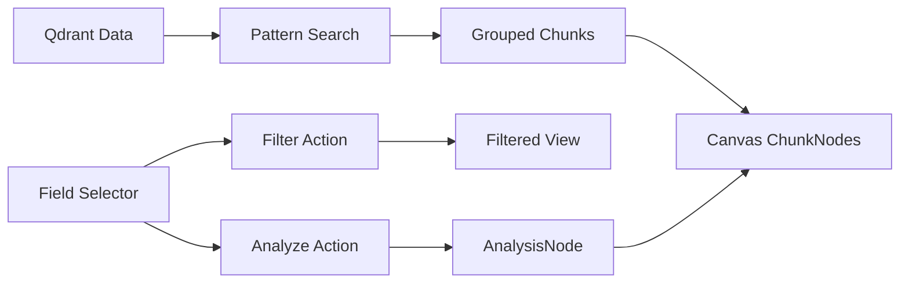

# 🏗️ CORREÇÃO ARQUITETURAL - GRAPH INTELLIGENCE EDITOR

**Data da Descoberta:** 10/08/2025  
**Autor:** Claude Code  
**Severidade:** CRÍTICA - Arquitetura fundamentalmente incorreta

---

## 🔴 PROBLEMA IDENTIFICADO

### Diagnóstico
Após análise profunda comparando com modelos bem-sucedidos (Supabase, Airtable) e princípios de design de banco de dados, identifiquei que estamos **violando a hierarquia natural dos dados**.

### Problema Central
**Estamos tratando PROPRIEDADES como ENTIDADES**

```
❌ ATUAL (INCORRETO):
- Field Selector lista "campos" (ex: payload.title, payload.keywords)
- Usuário arrasta "campo" para o canvas
- Campo vira um "nó" no grafo
- Isso é como adicionar "Nome da Coluna" como uma linha na tabela!
```

```
✅ CORRETO (PROPOSTO):
- Field Selector lista campos como FILTROS/PROPRIEDADES
- Pattern Search busca CHUNKS (entidades reais)
- Canvas mostra CHUNKS como nós
- Campos são usados para filtrar/analisar chunks
```

---

## 📊 ANÁLISE COMPARATIVA

### Modelo Supabase (Referência)
```
┌──────────────────────────────┐
│ TABELAS (Entidades)          │ → São visualizadas
├──────────────────────────────┤
│ LINHAS (Instâncias)          │ → São os dados reais
├──────────────────────────────┤
│ COLUNAS (Propriedades)       │ → São filtros/ordenação
└──────────────────────────────┘
```

### Nosso Modelo (Corrigido)
```
┌──────────────────────────────┐
│ DOCUMENTOS (Collections)      │ → Pattern Search
├──────────────────────────────┤
│ CHUNKS (Points/Vectors)       │ → Canvas Nodes
├──────────────────────────────┤
│ CAMPOS (Payload Properties)   │ → Filters/Analysis
└──────────────────────────────┘
```

---

## 🎯 NOVA ARQUITETURA

### 1. Hierarquia de Dados Clara

```javascript
// Estrutura do Qdrant
{
  collection: "knowledge-base",
  points: [
    {
      id: "chunk-123",
      vector: [0.1, 0.2, ...],  // Embedding
      payload: {                 // Metadados
        fileName: "doc.pdf",
        chunkIndex: 3,
        content: "texto...",
        keywords: ["AI", "ML"],
        categories: ["tech"]
      }
    }
  ]
}
```

### 2. Dois Tipos de Nós

#### ChunkNode (Dados Reais)
```javascript
{
  id: 'chunk-123',
  type: 'chunkNode',
  position: { x: 100, y: 100 },
  data: {
    label: 'doc.pdf - Chunk 3',
    content: 'Texto do chunk...',
    fileName: 'doc.pdf',
    chunkIndex: 3,
    keywords: ['AI', 'ML'],
    categories: ['tech'],
    nodeType: 'chunk'  // Identificador visual
  }
}
```

#### AnalysisNode (Agregações)
```javascript
{
  id: 'analysis-keywords',
  type: 'analysisNode',
  position: { x: 300, y: 100 },
  data: {
    label: 'Análise: Keywords',
    analysisType: 'keyword-cloud',
    sourceChunks: ['chunk-123', 'chunk-124'],
    aggregatedData: {
      'AI': 5,
      'ML': 3,
      'Deep Learning': 2
    },
    nodeType: 'analysis'  // Identificador visual
  }
}
```

### 3. Componentes e Suas Funções

#### Pattern Search
- **Função:** Buscar e agrupar CHUNKS por documento
- **Entrada:** Pattern (ex: `*.pdf`, `*AI*`)
- **Saída:** Lista de documentos com seus chunks
- **Ação:** Adicionar chunks ao canvas

#### Field Selector
- **Função:** Mostrar estrutura de campos para FILTRAR ou ANALISAR
- **NÃO FAZ:** Adicionar campos como nós
- **FAZ:** 
  - Filtrar chunks visíveis baseado em campos
  - Criar nós de análise/agregação

#### Graph Canvas
- **Mostra:** 
  - ChunkNodes (dados reais do Qdrant)
  - AnalysisNodes (agregações/análises)
- **Relações:** 
  - Automáticas (similaridade, keywords)
  - Manuais (criadas pelo usuário)

---

## 🔧 MUDANÇAS NECESSÁRIAS

### 1. Field Selector
```javascript
// REMOVER: Drag & Drop de campos para canvas
// ADICIONAR: Botões de ação para cada campo
// - [Filtrar] - Mostra apenas chunks com este campo
// - [Analisar] - Cria nó de análise para este campo
```

### 2. Pattern Search
```javascript
// JÁ CORRETO: Busca chunks no Qdrant
// AJUSTAR: Garantir que adiciona ChunkNodes ao canvas
```

### 3. Canvas Node Types
```javascript
// Implementar função para distinguir tipos de nós
function getNodeStyle(nodeType) {
  switch(nodeType) {
    case 'chunk':
      return { 
        background: '#4299e1',  // Azul para dados reais
        border: '2px solid #2b6cb0'
      };
    case 'analysis':
      return { 
        background: '#48bb78',  // Verde para análises
        border: '2px dashed #2f855a'
      };
    default:
      return { background: '#gray' };
  }
}
```

### 4. Fluxo de Interação



---

## 📈 BENEFÍCIOS DA NOVA ARQUITETURA

1. **Clareza Conceitual:** Distinção clara entre dados e metadados
2. **Performance:** Menos confusão = menos re-renderizações
3. **Escalabilidade:** Fácil adicionar novos tipos de análise
4. **UX Intuitiva:** Usuário entende o que está manipulando
5. **Manutenibilidade:** Código mais organizado e previsível

---

## ⚠️ BREAKING CHANGES

1. Field Selector não adiciona mais nós diretamente
2. Novos tipos de nós requerem atualização de estilos
3. Mudança no fluxo de trabalho do usuário

---

## 🎯 RESULTADO ESPERADO

### Antes (Confuso)
- Usuário arrasta "payload.keywords" para canvas
- Um nó chamado "keywords" aparece
- Não está claro o que isso representa
- Conexões não fazem sentido

### Depois (Claro)
- Usuário busca documentos com Pattern Search
- Chunks aparecem como nós azuis (dados reais)
- Usuário clica em "Analisar Keywords" no Field Selector
- Um nó verde (análise) mostra cloud de keywords
- Conexões mostram quais chunks contribuem para análise

---

## 📝 CHECKLIST DE IMPLEMENTAÇÃO

- [ ] Refatorar Field Selector - remover drag & drop
- [ ] Adicionar botões de Filtrar/Analisar nos campos
- [ ] Implementar ChunkNode e AnalysisNode
- [ ] Atualizar estilos visuais por tipo de nó
- [ ] Corrigir Pattern Search para adicionar ChunkNodes
- [ ] Implementar filtros baseados em campos
- [ ] Criar nós de análise agregada
- [ ] Atualizar PropertyPanel para mostrar tipo de nó
- [ ] Testar fluxo completo
- [ ] Documentar novo workflow

---

## 🚀 CONCLUSÃO

Esta correção alinha nossa arquitetura com princípios comprovados de design de dados, tornando a aplicação mais intuitiva, performática e manutenível.

**A confusão atual onde "campos viram nós" é fundamentalmente incorreta e deve ser corrigida.**